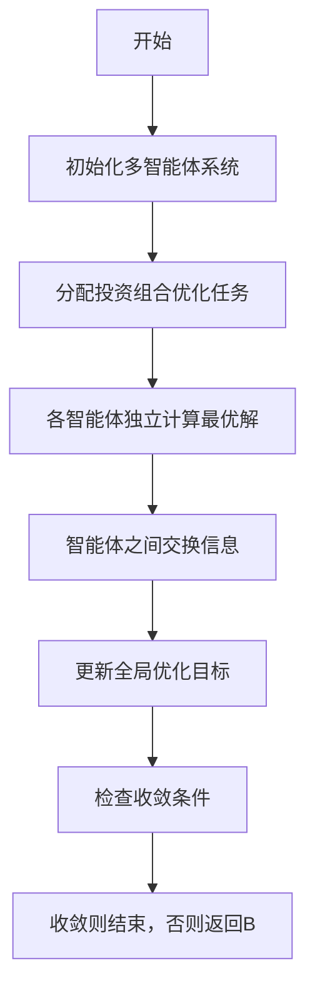
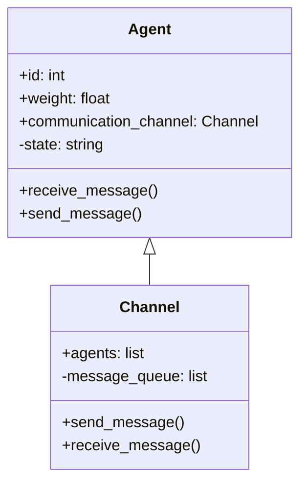

                 


# 利用多智能体AI优化投资组合：价值投资的新纪元

> **关键词**：多智能体AI，投资组合优化，价值投资，分布式计算，协作算法

> **摘要**：本文探讨了利用多智能体AI优化投资组合的创新方法，分析了多智能体系统的核心概念、算法原理及其在投资组合优化中的应用，展示了通过实际案例实现的系统架构设计，并总结了最佳实践和未来发展方向。

---

# 第1章: 多智能体AI的背景与应用

## 1.1 多智能体AI的定义与特点

### 1.1.1 多智能体系统的定义

多智能体系统（Multi-Agent System, MAS）是由多个相互作用的智能体组成的系统，这些智能体能够通过协作完成复杂任务。每个智能体都有一定的自主性，能够感知环境、做出决策并与其他智能体通信。

### 1.1.2 多智能体的核心特点

- **分布性**：多个智能体独立运行，任务分解为子任务。
- **协作性**：智能体之间通过通信协作，共同完成整体目标。
- **动态性**：环境和任务需求可能动态变化，智能体需实时调整策略。

### 1.1.3 多智能体与单智能体的区别

| 特性          | 多智能体系统                | 单智能体系统                |
|---------------|---------------------------|---------------------------|
| 系统结构      | 分布式，多个智能体协作      | 集中式，单个智能体决策      |
| 任务处理      | 复杂任务分解为子任务       | 任务整体由单个智能体处理     |
| 通信方式      | 智能体之间需要通信         | 无通信                     |
| 系统复杂性    | 高，难以预测               | 较低，易于管理             |

---

## 1.2 投资组合优化的背景与挑战

### 1.2.1 投资组合优化的定义

投资组合优化是指在给定风险和收益目标下，选择最优资产配置，以最大化收益或最小化风险。传统方法通常基于均值-方差模型（Markowitz模型）。

### 1.2.2 传统投资组合优化方法的局限性

- **计算复杂性**：随着资产数量增加，优化计算复杂度急剧上升。
- **动态变化**：市场环境动态变化，需要实时调整。
- **多样性需求**：投资者可能有不同的风险偏好和收益目标。

### 1.2.3 价值投资的新趋势

价值投资强调长期基本面分析，多智能体AI通过实时数据处理和协作优化，为传统价值投资注入新的技术驱动。

---

# 第2章: 多智能体系统与投资组合优化的核心概念

## 2.1 多智能体系统的组成与结构

### 2.1.1 多智能体系统的组成要素

- **智能体**：具备感知、决策和行动能力。
- **通信机制**：智能体之间信息交换的方式。
- **协作协议**：定义任务分配和协调规则。
- **环境接口**：与外部环境交互的接口。

### 2.1.2 多智能体系统的协作机制

协作机制包括任务分配、信息共享和决策协调。任务分配确保每个智能体负责特定子任务，信息共享促进全局优化，决策协调保证一致性。

### 2.1.3 多智能体系统的通信协议

通信协议定义了智能体之间信息传递的格式和规则，通常包括请求、响应和通知三种类型。

---

## 2.2 投资组合优化的数学模型与目标函数

### 2.2.1 投资组合优化的基本模型

基于Markowitz模型，目标函数通常为：

$$ \text{Minimize } \sum_{i=1}^n w_i^2 \sigma_i^2 $$

其中，\( w_i \) 是资产权重，\( \sigma_i^2 \) 是资产的方差。

### 2.2.2 多智能体协作的目标函数设计

在多智能体系统中，目标函数被分解为多个子目标，每个智能体负责优化其子目标。例如：

$$ \text{Minimize } \sum_{i=1}^n w_i^2 \sigma_i^2 \quad \text{subject to} \quad \sum_{i=1}^n w_i = 1 $$

### 2.2.3 投资组合优化的约束条件

- **权重约束**：\( 0 \leq w_i \leq 1 \)
- **收益约束**：收益需达到最低要求
- **风险约束**：风险需控制在特定范围

---

## 2.3 多智能体与投资组合优化的关联性分析

### 2.3.1 多智能体系统的属性与投资组合优化目标的对应关系

| 多智能体属性     | 投资组合优化目标         |
|------------------|--------------------------|
| 分布式计算       | 分解复杂任务             |
| 协作优化         | 提高整体收益或降低风险     |
| 动态适应性       | 实时调整投资组合         |

### 2.3.2 多智能体协作机制与投资组合优化过程的映射

通过协作机制，每个智能体负责优化资产配置的一部分，最终通过通信达成全局最优。

### 2.3.3 多智能体系统的动态性与投资组合优化的实时性需求

多智能体系统的动态调整能力与投资组合优化的实时性需求相契合，确保及时应对市场变化。

---

# 第3章: 多智能体AI优化投资组合的算法原理

## 3.1 多智能体协作算法概述

### 3.1.1 分布式多智能体协作的基本原理

每个智能体独立优化其分配的任务，并通过通信共享信息，最终达成全局最优。

### 3.1.2 多智能体协作的典型算法

- **分布式梯度下降**：通过局部梯度更新全局目标。
- **协商算法**：智能体通过协商达成一致。

### 3.1.3 多智能体协作算法的优缺点

- **优点**：高并行性，适合大规模问题。
- **缺点**：通信开销大，协调困难。

---

## 3.2 投资组合优化的数学模型与求解方法

### 3.2.1 投资组合优化的数学表达

目标函数：

$$ \text{Minimize } \sum_{i=1}^n w_i^2 \sigma_i^2 $$

约束条件：

$$ \sum_{i=1}^n w_i = 1 $$

### 3.2.2 基于多智能体的分布式优化方法

将优化任务分解为多个子任务，每个智能体优化一个子任务，通过通信共享信息。

### 3.2.3 多智能体协作下的投资组合优化算法实现

伪代码示例：

```python
def multi_agent_optimization():
    Initialize weights for each agent
    while not converged:
        Update weights based on local information
        Communicate with other agents
        Update global weights
    return optimized weights
```

---

## 3.3 多智能体协作算法的流程图



---

# 第4章: 多智能体投资组合优化系统的架构设计

## 4.1 系统功能设计

### 4.1.1 领域模型（Mermaid类图）



---

## 4.2 系统架构设计（Mermaid架构图）


---

## 4.3 系统接口设计与交互（Mermaid序列图）

```mermaid
sequenceDiagram
    participant Web Interface
    participant Application Layer
    participant Agent Layer
    participant Communication Layer
    Web Interface -> Application Layer: 请求优化
    Application Layer -> Agent Layer: 分配任务
    Agent Layer -> Communication Layer: 获取数据
    Communication Layer <-> Agent Layer: 交换信息
    Agent Layer -> Application Layer: 返回结果
    Application Layer -> Web Interface: 显示结果
```

---

# 第5章: 项目实战

## 5.1 环境安装与配置

### 5.1.1 安装依赖

安装Python和必要的库，如NumPy、Pandas、Scipy。

### 5.1.2 环境配置

设置多智能体通信接口，如使用RabbitMQ或Kafka。

---

## 5.2 系统核心实现源代码

### 5.2.1 多智能体协作代码示例

```python
import numpy as np
import requests

class Agent:
    def __init__(self, id):
        self.id = id
        self.weight = 0.0
        self.data = None
    
    def receive_data(self, data):
        self.data = data
    
    def compute_weight(self):
        return np.random.random()  # 示例计算

# 初始化多个智能体
agents = [Agent(i) for i in range(5)]

# 通信接口
class CommunicationChannel:
    def send(self, agent_id, data):
        pass
    
    def receive(self, agent_id):
        return None

# 分配任务并计算
channel = CommunicationChannel()
for agent in agents:
    agent.receive_data("market data")

for agent in agents:
    weight = agent.compute_weight()
    channel.send(agent.id, weight)

# 获取所有权重
weights = [agent.weight for agent in agents]
print(weights)
```

---

## 5.3 案例分析与结果展示

通过实际案例分析，展示多智能体AI在投资组合优化中的应用效果，包括优化后的权重分布和风险收益比。

---

# 第6章: 最佳实践与小结

## 6.1 小结

多智能体AI为投资组合优化提供了新的思路，通过分布式协作和实时调整，显著提高了优化效率和效果。

---

## 6.2 最佳实践

- **通信机制选择**：选择高效的通信协议和工具。
- **任务分配策略**：合理分配任务，避免过载。
- **动态适应性**：实时监控市场变化，及时调整策略。

---

## 6.3 未来发展方向

- **智能体协作优化**：研究更高效的协作算法。
- **多目标优化**：考虑更多因素，如税收、流动性等。
- **实际应用推广**：在更多场景中验证和推广。

---

# 作者

作者：AI天才研究院 & 禅与计算机程序设计艺术

---

**全文完**。

