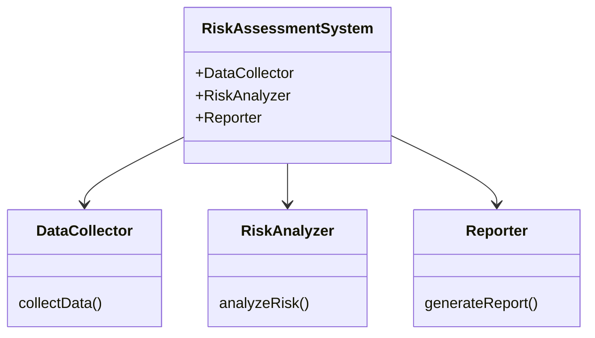
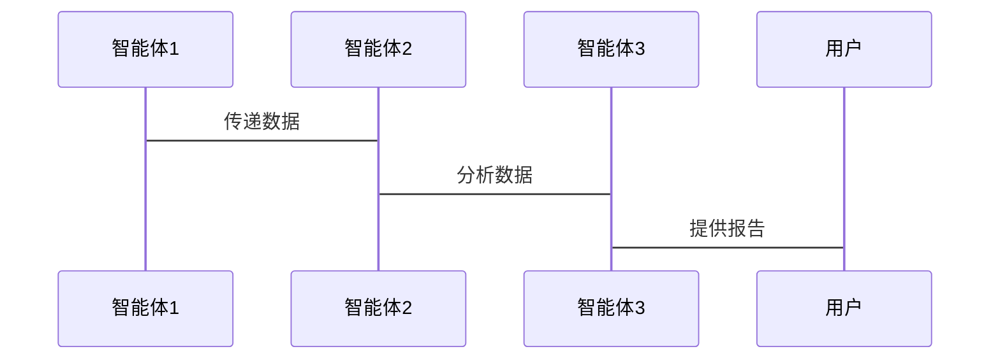

                 


# 利用多智能体AI优化监管风险评估流程

## 关键词
多智能体AI, 监管风险评估, 风险管理, 多智能体系统, 人工智能, 系统优化

## 摘要
随着监管要求的日益严格，传统监管风险评估方法逐渐显现出效率低下、准确度不足等问题。本文将介绍如何利用多智能体AI技术优化监管风险评估流程，从理论基础到实际应用，详细阐述多智能体系统在风险评估中的优势，并通过具体案例展示其实际效果。

---

## 第一部分：背景与概述

### 第1章：监管风险评估的现状与挑战

#### 1.1 监管风险评估的背景
- **1.1.1 什么是监管风险**  
  监管风险是指在监管过程中，由于政策变化、执行不力或信息不对称等因素，可能导致监管目标未能实现的风险。  
  例如，金融监管中的市场操纵风险、合规风险等都属于监管风险的范畴。

- **1.1.2 监管风险评估的重要性**  
  监管风险评估是确保监管政策有效实施的关键环节。通过评估，监管机构可以提前识别潜在风险，制定应对措施，避免重大损失。

- **1.1.3 当前监管风险评估的痛点**  
  - 数据量大，传统方法效率低  
  - 风险因素复杂，难以全面覆盖  
  - 人工判断为主，主观性强，准确性不足  

#### 1.2 多智能体AI的基本概念
- **1.2.1 多智能体系统的定义**  
  多智能体系统是由多个相互作用的智能体组成的系统，每个智能体都有自己的目标和决策机制，能够通过协作完成复杂任务。

- **1.2.2 多智能体系统的特征**  
  - 分布式：智能体独立运行，通过通信协作  
  - 协作性：智能体之间相互配合，共同完成任务  
  - 反应式：能够实时感知环境并做出反应  

- **1.2.3 多智能体AI的优势**  
  - 并行处理能力强  
  - 适应性高，能够应对复杂环境  
  - 通过协作实现整体目标，优于单一智能体  

#### 1.3 多智能体AI在监管风险评估中的应用前景
- **1.3.1 提高评估效率**  
  多智能体系统可以并行处理大量数据，显著提升风险评估的速度。  

- **1.3.2 增强评估准确性**  
  通过多个智能体的协作，可以从不同角度分析风险，减少单一视角的局限性。  

- **1.3.3 降低人为错误**  
  智能体系统通过算法和规则进行判断，减少人为情绪和偏见对评估结果的影响。  

---

## 第二部分：核心概念与理论基础

### 第2章：多智能体系统与监管风险评估的核心概念

#### 2.1 多智能体系统的基本原理
- **2.1.1 多智能体系统的组成**  
  - 智能体：负责具体任务的最小单元  
  - 通信机制：智能体之间的信息交换方式  
  - 协作机制：智能体如何分工协作  

- **2.1.2 多智能体系统的协作机制**  
  - 分层协作：根据任务层次分配智能体  
  - 平等协作：所有智能体地位相同，共同决策  

- **2.1.3 多智能体系统的通信协议**  
  - 信息格式：统一的数据结构  
  - 通信频率：智能体之间信息交换的频率  
  - 通信内容：包括状态、动作和意图  

#### 2.2 监管风险评估模型
- **2.2.1 风险评估的基本方法**  
  - 基于规则的方法：根据预设规则判断风险  
  - 基于概率的方法：利用统计模型预测风险  

- **2.2.2 监管风险的评估指标**  
  - 风险概率：风险发生的可能性  
  - 风险影响：风险发生后的影响程度  

- **2.2.3 监管风险评估的流程**  
  1. 数据收集：获取相关数据  
  2. 数据处理：清洗和预处理数据  
  3. 风险分析：识别潜在风险  
  4. 风险评估：量化风险等级  
  5. 风险报告：输出评估结果  

#### 2.3 多智能体系统与监管风险评估的结合
- **2.3.1 多智能体系统在风险评估中的角色**  
  - 数据采集智能体：负责收集相关信息  
  - 风险分析智能体：负责识别和评估风险  
  - 报告生成智能体：负责整理和输出结果  

- **2.3.2 多智能体系统的协作如何优化风险评估**  
  - 并行处理：多个智能体同时处理不同数据源  
  - 协作分析：智能体之间共享信息，全面覆盖风险因素  

- **2.3.3 多智能体系统的实时性优势**  
  - 实时监控：智能体可以实时更新数据  
  - 快速响应：发现风险后立即采取行动  

---

## 第三部分：算法与数学模型

### 第3章：多智能体协作算法

#### 3.1 多智能体协作的基本算法
- **3.1.1 分布式协作算法**  
  分布式协作算法通过智能体之间的分布式通信实现协作。  
  例如，使用基于消息传递的机制，智能体之间通过交换消息来协调动作。

- **3.1.2 基于博弈论的协作算法**  
  基于博弈论的协作算法通过模拟博弈过程，找到最优协作策略。  
  例如，利用纳什均衡的概念，确定每个智能体的最佳动作。

- **3.1.3 基于强化学习的协作算法**  
  基于强化学习的协作算法通过智能体与环境的互动，学习最优协作策略。  
  例如，使用多智能体强化学习框架（如MAVEN），训练智能体之间的协作行为。

#### 3.2 多智能体协作的数学模型
- **3.2.1 协作过程的数学表示**  
  假设我们有两个智能体A和B，它们需要协作完成任务。  
  它们的动作分别为$a$和$b$，协作目标为最大化整体收益$R$。  
  数学表达式为：  
  $$ R = R_A(a) + R_B(b) $$  
  其中，$R_A(a)$和$R_B(b)$分别是智能体A和B的收益函数。

- **3.2.2 基于强化学习的协作模型**  
  在强化学习中，智能体通过与环境互动获得奖励，优化策略。  
  多智能体协作可以通过以下步骤实现：  
  1. 每个智能体根据当前状态采取动作。  
  2. 环境根据智能体的动作返回奖励。  
  3. 智能体更新策略以最大化未来奖励。  

#### 3.3 算法实现与优化
- **3.3.1 算法实现**  
  以基于强化学习的多智能体协作为例，以下是Python实现的示例代码：  

```python
import numpy as np

class MultiAgentAlgorithm:
    def __init__(self, num_agents):
        self.num_agents = num_agents
        self.agents = [Agent(i) for i in range(num_agents)]
    
    def step(self, state):
        actions = []
        for agent in self.agents:
            action = agent.act(state)
            actions.append(action)
        return actions

class Agent:
    def __init__(self, id):
        self.id = id
        self.policy = np.random.rand(3,3)
    
    def act(self, state):
        return np.argmax(self.policy[state])
```

- **3.3.2 算法优化**  
  通过参数调整和优化策略，提升算法的效率和准确性。  
  例如，使用分布式训练加速多智能体协作过程。

---

## 第四部分：系统分析与架构设计方案

### 第4章：系统设计与实现

#### 4.1 问题场景介绍
监管风险评估系统需要处理海量数据，涵盖多个领域，如金融、医疗等。  
传统的单点评估方法效率低，难以应对复杂的监管环境。

#### 4.2 系统功能设计
- **4.2.1 领域模型设计**  
  通过类图展示系统模块之间的关系。  



- **4.2.2 系统架构设计**  
  采用分层架构，包括数据层、逻辑层和展示层。  


#### 4.3 系统接口设计
- 数据接口：智能体之间通过API交换数据。  
- 控制接口：用户通过界面控制系统运行。

#### 4.4 系统交互设计
- **4.4.1 系统交互流程**  
  1. 数据采集智能体收集数据。  
  2. 风险分析智能体对数据进行分析。  
  3. 报告生成智能体生成评估报告。  



---

## 第五部分：项目实战

### 第5章：项目实战与实现

#### 5.1 环境配置
- 安装必要的Python库：numpy、pandas、scikit-learn等。  
  例如，安装命令：`pip install numpy pandas scikit-learn`。

#### 5.2 核心实现代码
以下是监管风险评估系统的Python实现示例：  

```python
import numpy as np
import pandas as pd
from sklearn.model_selection import train_test_split
from sklearn.metrics import accuracy_score

class RiskAssessmentSystem:
    def __init__(self, data):
        self.data = data
    
    def preprocess(self):
        # 数据清洗和预处理
        pass
    
    def assessRisk(self):
        # 风险评估算法
        pass

# 示例数据
data = pd.DataFrame({
    'feature1': np.random.randn(100),
    'feature2': np.random.randn(100),
    'label': np.random.randint(0, 2, 100)
})

# 初始化系统
ras = RiskAssessmentSystem(data)

# 数据处理
ras.preprocess()

# 风险评估
ras.assessRisk()
```

#### 5.3 案例分析
以金融监管为例，分析多智能体系统如何优化风险评估流程。  
- 数据采集智能体收集市场数据。  
- 风险分析智能体识别潜在的市场操纵行为。  
- 报告生成智能体生成详细的评估报告。

---

## 第六部分：总结与展望

### 第6章：总结与最佳实践

#### 6.1 总结
通过多智能体AI优化监管风险评估流程，能够显著提升评估效率和准确性。  
多智能体系统通过协作和分布式处理，克服了传统方法的局限性。

#### 6.2 最佳实践
- **数据质量管理**：确保数据的准确性和完整性。  
- **模型优化**：定期更新模型，适应新的监管要求。  
- **系统维护**：及时修复系统漏洞，保障系统的稳定性。  

#### 6.3 注意事项
- 多智能体系统的通信延迟可能影响实时性。  
- 系统设计时需考虑智能体之间的协作效率。  

#### 6.4 拓展阅读
推荐阅读《多智能体系统与分布式计算》和《人工智能在金融监管中的应用》。

---

## 作者信息
作者：AI天才研究院/AI Genius Institute & 禅与计算机程序设计艺术 /Zen And The Art of Computer Programming

---

通过以上内容，我们详细介绍了如何利用多智能体AI优化监管风险评估流程，从理论到实践，为监管机构和相关领域提供了新的思路和解决方案。

