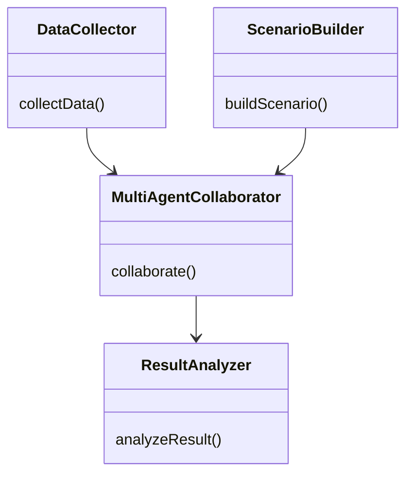
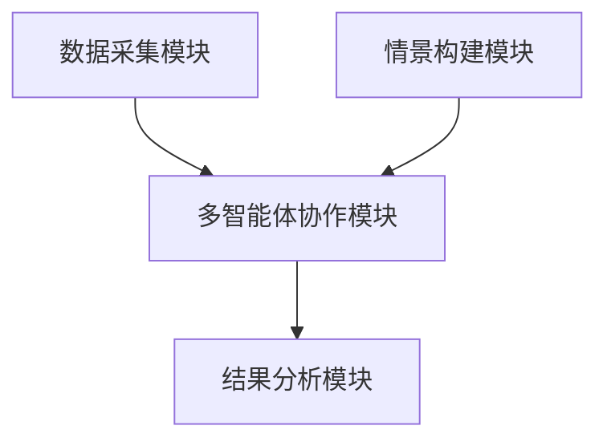
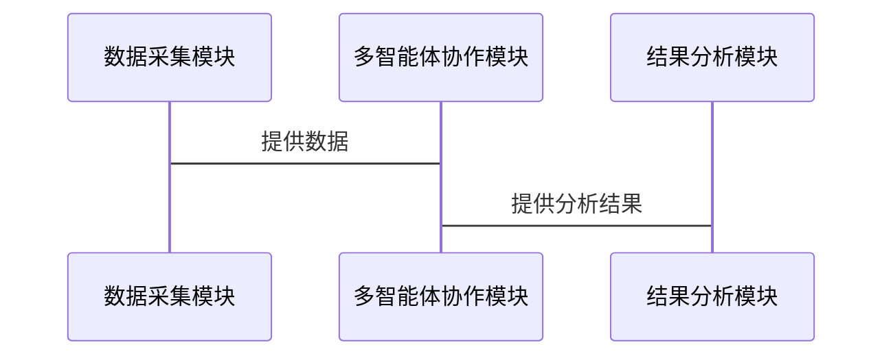

                 


# 利用多智能体AI增强价值投资的情景分析能力

> 关键词：多智能体AI，价值投资，情景分析，分布式计算，协作算法

> 摘要：本文探讨了多智能体AI在价值投资情景分析中的应用。通过详细分析多智能体AI的核心概念、算法原理及其在情景分析中的应用，展示了如何利用多智能体AI提升价值投资的情景分析能力。文章结合实际案例，深入讲解了多智能体AI在情景模拟、决策优化和风险评估中的优势，为读者提供了全面的技术视角和实践指导。

---

## 第一章 多智能体AI与价值投资概述

### 1.1 多智能体AI的基本概念

#### 1.1.1 多智能体系统的基本定义
多智能体系统（Multi-Agent System, MAS）是由多个智能体（Agent）组成的分布式系统，这些智能体能够通过协作完成复杂的任务。每个智能体都有自己的目标、知识和行为规则，能够独立决策并与其他智能体通信协作。

#### 1.1.2 多智能体系统的特征与优势
- **分布式性**：智能体独立运行，不依赖中央控制。
- **协作性**：智能体之间通过通信协作完成共同目标。
- **反应性**：智能体能够实时感知环境并做出反应。
- **智能性**：智能体具备学习和推理能力。

#### 1.1.3 多智能体AI在金融领域的应用潜力
- **量化交易**：通过多智能体协作优化交易策略。
- **风险评估**：利用多智能体系统进行风险预测和管理。
- **市场模拟**：构建虚拟市场环境进行情景模拟。

### 1.2 价值投资的基本理论

#### 1.2.1 价值投资的核心理念
价值投资强调从基本面分析入手，寻找被市场低估的优质资产进行长期投资。核心在于识别公司内在价值与市场价格的差异。

#### 1.2.2 价值投资的关键因素分析
- **财务指标**：如市盈率、市净率、ROE等。
- **行业地位**：公司在行业中的竞争优势。
- **管理团队**：公司管理层的能力和稳定性。
- **发展前景**：公司未来增长潜力。

#### 1.2.3 价值投资与传统投资方法的对比
价值投资与传统技术分析的区别在于，前者注重基本面分析，后者注重价格波动和图表分析。多智能体AI能够同时结合两者的优势，提供更全面的投资分析。

### 1.3 多智能体AI与价值投资的结合意义

#### 1.3.1 多智能体AI在价值投资中的应用场景
- **多维度数据处理**：整合财务数据、行业信息、市场情绪等多源数据。
- **情景模拟**：模拟不同市场条件下的投资组合表现。
- **决策优化**：通过多智能体协作优化投资决策。

#### 1.3.2 多智能体AI如何提升价值投资的情景分析能力
通过分布式计算和协作学习，多智能体AI能够高效处理海量数据，构建复杂的情景模型，提供更精准的投资建议。

#### 1.3.3 多智能体AI在价值投资中的创新价值
- **提升分析效率**：通过并行计算加速数据处理。
- **增强决策准确性**：通过多角度分析提高决策质量。
- **降低投资风险**：通过情景模拟提前识别潜在风险。

---

## 第二章 多智能体AI的核心概念与价值投资的情景分析

### 2.1 多智能体系统的核心概念

#### 2.1.1 多智能体系统的组成要素
- **智能体**：具有感知、决策和行动能力的个体。
- **环境**：智能体所处的外部世界，包括数据源和市场环境。
- **通信机制**：智能体之间交换信息的方式。
- **协作协议**：定义智能体之间的合作规则。

#### 2.1.2 多智能体系统的特征与优势
- **分布式计算**：通过分解任务提高计算效率。
- **协作学习**：多个智能体共同学习优化决策。
- **动态适应**：智能体能够根据环境变化调整行为。

#### 2.1.3 多智能体系统的通信机制
- **直接通信**：智能体之间直接交换信息。
- **间接通信**：通过共享数据库或消息队列进行信息传递。

### 2.2 多智能体AI的算法原理

#### 2.2.1 分布式计算与协作算法
多智能体AI的协作算法包括分布式计算、联合推理和协同学习。这些算法通过并行计算和信息共享提高系统的整体性能。

#### 2.2.2 多智能体决策树模型
多智能体决策树模型是一种基于树状结构的决策方法，通过每个智能体负责一部分决策树节点，实现分布式决策。

#### 2.2.3 联合推理与学习算法
联合推理算法通过多个智能体共同推理问题，学习算法则通过协作优化决策模型。

### 2.3 多智能体AI在情景分析中的应用

#### 2.3.1 情景分析的基本概念与方法
情景分析是通过构建不同假设场景，评估其对投资组合的影响。多智能体AI能够模拟多种市场情景，提供全面的分析结果。

#### 2.3.2 多智能体AI在情景分析中的优势
- **高效性**：通过分布式计算快速生成情景模型。
- **准确性**：多个智能体协作提高分析结果的准确性。
- **适应性**：能够动态调整情景模型应对环境变化。

#### 2.3.3 多智能体AI情景分析的实现流程
1. 数据收集：获取市场数据、财务指标等信息。
2. 情景构建：定义不同的市场情景。
3. 分布式计算：通过多智能体协作处理数据。
4. 结果分析：生成情景分析报告。

---

## 第三章 价值投资的情景分析与多智能体AI的结合

### 3.1 价值投资中的情景分析

#### 3.1.1 价值投资中的情景分析方法
- **基本面分析**：评估公司的内在价值。
- **市场分析**：分析市场趋势和波动。
- **风险评估**：评估投资组合的风险。

#### 3.1.2 价值投资情景分析的关键因素
- **公司基本面**：财务状况、盈利能力。
- **市场环境**：宏观经济、行业趋势。
- **投资者情绪**：市场参与者的心理预期。

#### 3.1.3 情景分析在价值投资中的作用
情景分析帮助投资者在不同市场条件下制定投资策略，优化投资组合。

### 3.2 多智能体AI在价值投资情景分析中的应用

#### 3.2.1 多智能体AI如何构建情景模型
通过多智能体协作，分别负责不同维度的数据分析和模型构建，最终形成综合的情景模型。

#### 3.2.2 多智能体AI如何模拟情景变化
智能体能够根据市场变化动态调整情景模型，模拟不同情景下的市场反应。

#### 3.2.3 多智能体AI如何优化情景分析结果
通过联合学习和协作优化，多智能体AI能够提升情景分析的准确性和全面性。

### 3.3 多智能体AI情景分析的案例研究

#### 3.3.1 案例背景与目标
某资产管理公司希望通过多智能体AI进行价值投资的情景分析，优化投资策略。

#### 3.3.2 多智能体AI情景分析的实现过程
1. 数据收集：收集市场数据、财务指标等。
2. 系统设计：设计多智能体协作算法。
3. 情景模拟：模拟不同市场情景。
4. 结果分析：生成情景分析报告。

#### 3.3.3 案例分析结果与启示
通过多智能体AI情景分析，该公司成功识别了潜在的投资机会，并优化了投资组合的风险管理。

---

## 第四章 多智能体AI情景分析的算法与数学模型

### 4.1 多智能体AI情景分析的算法原理

#### 4.1.1 分布式计算与协作算法
多智能体AI通过分布式计算和协作算法，实现数据的并行处理和模型优化。

#### 4.1.2 联合推理与学习算法
联合推理算法通过智能体之间的协作，共同推理问题。学习算法则通过经验不断优化模型。

### 4.2 多智能体AI情景分析的数学模型

#### 4.2.1 分布式计算模型
多智能体AI的分布式计算模型包括任务分配、数据通信和结果汇总三个部分。

#### 4.2.2 协作学习模型
协作学习模型通过智能体之间的信息共享，共同优化决策模型。

#### 4.2.3 情景模拟模型
情景模拟模型通过构建不同的市场情景，模拟投资组合的表现。

### 4.3 多智能体AI情景分析的数学公式

#### 4.3.1 分布式计算公式
$$ \text{总计算时间} = \sum_{i=1}^{n} \text{计算时间}_i $$

#### 4.3.2 协作学习公式
$$ \text{模型参数更新} = \sum_{i=1}^{n} \text{智能体}_i.参数 $$

#### 4.3.3 情景模拟公式
$$ \text{情景结果} = f(\text{市场情景}, \text{投资组合}) $$

---

## 第五章 系统分析与架构设计

### 5.1 问题场景介绍
某资产管理公司希望通过多智能体AI进行价值投资的情景分析，优化投资策略。

### 5.2 系统功能设计

#### 5.2.1 系统功能模块
- **数据采集模块**：收集市场数据、财务指标等。
- **情景构建模块**：定义不同的市场情景。
- **多智能体协作模块**：实现智能体之间的协作计算。
- **结果分析模块**：生成情景分析报告。

#### 5.2.2 系统类图设计


### 5.3 系统架构设计

#### 5.3.1 系统架构图


#### 5.3.2 系统交互图


---

## 第六章 项目实战

### 6.1 环境安装

#### 6.1.1 系统需求
- 操作系统：Windows/Mac/Linux
- Python版本：3.6+
- 依赖库：numpy, pandas, scikit-learn, mermaid

#### 6.1.2 安装步骤
1. 安装Python和pip。
2. 安装所需依赖库：`pip install numpy pandas scikit-learn mermaid`

### 6.2 核心代码实现

#### 6.2.1 多智能体协作算法实现
```python
import numpy as np
import pandas as pd
from sklearn import linear_model

class Agent:
    def __init__(self, data):
        self.data = data
        self.model = linear_model.LinearRegression()
    
    def train(self):
        self.model.fit(self.data.X, self.data.Y)
    
    def predict(self, X):
        return self.model.predict(X)

class MultiAgentCollaborator:
    def __init__(self, agents):
        self.agents = agents
    
    def collaborate(self, X):
        results = []
        for agent in self.agents:
            results.append(agent.predict(X))
        return np.mean(results, axis=0)
```

#### 6.2.2 情景分析实现
```python
class ScenarioAnalyzer:
    def __init__(self, collaborator):
        self.collaborator = collaborator
    
    def analyze(self, scenarios):
        results = []
        for scenario in scenarios:
            result = self.collaborator.collaborate(scenario)
            results.append(result)
        return results
```

### 6.3 实际案例分析

#### 6.3.1 案例背景
某资产管理公司希望通过多智能体AI进行价值投资的情景分析。

#### 6.3.2 数据准备
收集相关数据，包括市场数据、财务指标等。

#### 6.3.3 算法实现
使用上述代码实现多智能体协作算法，进行情景分析。

#### 6.3.4 结果分析
生成情景分析报告，优化投资策略。

---

## 第七章 总结与展望

### 7.1 总结
多智能体AI在价值投资情景分析中的应用，能够显著提升分析效率和准确性，为投资者提供更有力的决策支持。

### 7.2 展望
未来，随着AI技术的不断发展，多智能体AI在金融领域的应用将更加广泛，情景分析能力也将进一步提升。

---

## 小结

通过本文的详细讲解，读者可以全面了解多智能体AI在价值投资情景分析中的应用，掌握其实现原理和实际案例。希望本文能够为读者提供有价值的参考，帮助他们在实际投资中更好地利用多智能体AI技术。

---

## 注意事项

1. **数据隐私**：在实际应用中，需注意数据隐私和合规性。
2. **系统稳定性**：确保系统的稳定性和可靠性。
3. **持续优化**：定期优化模型和算法，提升分析效果。

---

## 最佳实践 Tips

- **数据清洗**：在数据处理阶段，进行充分的数据清洗和特征工程。
- **模型调优**：通过参数调优和模型优化，提升算法性能。
- **持续学习**：结合实时数据，持续优化模型。

---

## 作者

作者：AI天才研究院/AI Genius Institute & 禅与计算机程序设计艺术 /Zen And The Art of Computer Programming

