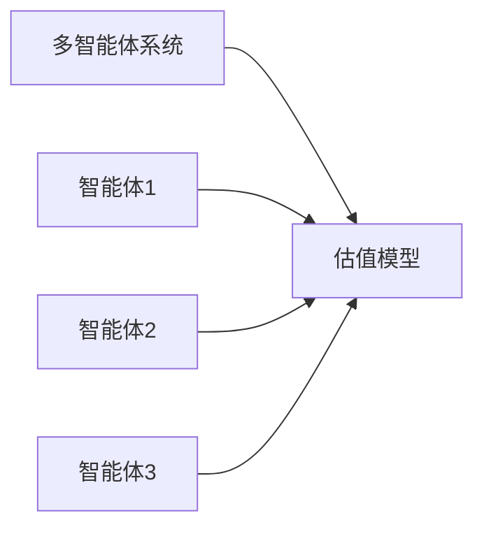
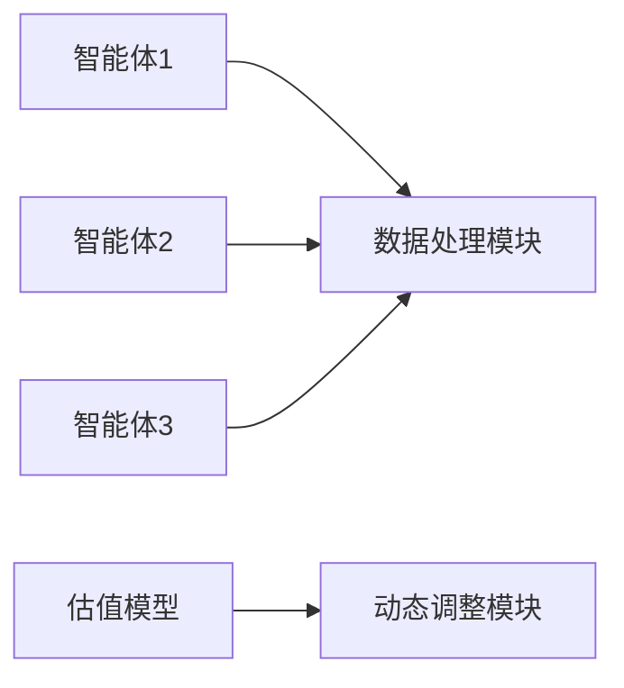
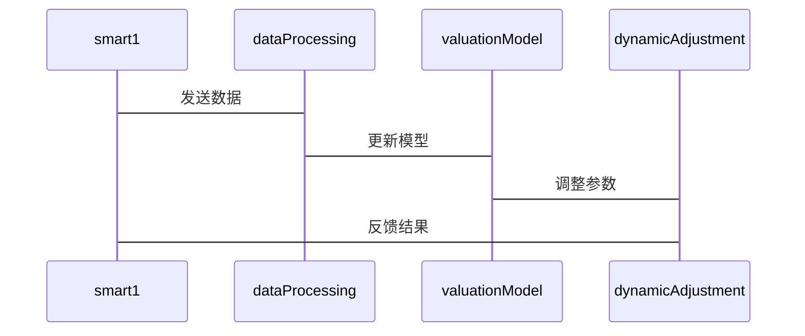

                 


# 利用多智能体AI实现动态估值模型调整

> 关键词：动态估值模型，多智能体AI，动态调整，分布式协作，智能体系统

> 摘要：本文深入探讨了如何利用多智能体人工智能技术实现动态估值模型的实时调整。通过分析多智能体AI的基本原理、动态估值模型的核心要素，以及两者的结合方式，本文详细阐述了多智能体AI在动态环境下的协作机制、算法实现和系统设计。通过实际案例分析和代码实现，本文为读者提供了一套完整的解决方案，展示了多智能体AI在动态估值模型调整中的巨大潜力和实际应用价值。

---

# 第1章: 动态估值模型与多智能体AI概述

## 1.1 动态估值模型的背景与问题背景

### 1.1.1 传统估值模型的局限性
传统估值模型（如CAPM、APT等）通常基于静态假设，无法有效应对动态变化的市场环境。例如，在金融领域，市场波动、政策变化等因素会导致传统估值模型的预测结果严重偏离实际值。

### 1.1.2 动态环境下的估值挑战
在动态环境中，数据的变化速度和不确定性显著增加。例如，在实时股票交易中，市场情绪、突发事件等因素会导致资产价格快速波动，传统模型难以实时调整以反映这些变化。

### 1.1.3 多智能体AI的引入意义
多智能体AI通过分布式协作和实时信息共享，能够快速响应环境变化，实现动态调整。与传统模型相比，多智能体AI能够更好地处理复杂动态环境下的估值问题。

## 1.2 多智能体AI的基本概念

### 1.2.1 多智能体系统的定义
多智能体系统是指由多个相互作用的智能体组成的分布式系统，每个智能体都有自己的目标和决策机制，能够通过通信和协作完成复杂任务。

### 1.2.2 多智能体系统的特征
- **分布式性**：智能体之间通过局部通信协作。
- **自主性**：每个智能体都能独立决策。
- **反应性**：能够实时感知环境变化并做出反应。
- **协作性**：通过协作实现全局目标。

### 1.2.3 多智能体与单智能体的区别
| 特性          | 单智能体             | 多智能体             |
|---------------|----------------------|----------------------|
| 决策中心化    | 是                  | 否                  |
| 系统复杂性    | 低                  | 高                  |
| 协作能力      | 无                  | 强                  |
| 容错性        | 低                  | 高                  |

## 1.3 动态估值模型的核心要素

### 1.3.1 估值模型的基本结构
动态估值模型通常包括以下几个部分：
1. 输入数据：如资产价格、市场情绪、交易量等。
2. 模型参数：如权重、系数等。
3. 输出结果：如资产估值、风险评估等。

### 1.3.2 动态环境的特征分析
- **实时性**：数据更新快，需要快速响应。
- **不确定性**：环境变化难以预测。
- **复杂性**：涉及多个变量和因素。

### 1.3.3 多智能体在估值中的作用
- **数据采集**：智能体实时收集市场数据。
- **信息处理**：智能体协作分析数据。
- **模型调整**：智能体共同优化估值模型。

## 1.4 本章小结
本章介绍了动态估值模型的背景、多智能体AI的基本概念，以及两者结合的必要性。通过对比分析，展示了多智能体AI在动态环境下的独特优势。

---

# 第2章: 多智能体AI与动态估值模型的核心概念与联系

## 2.1 多智能体AI的核心原理

### 2.1.1 分布式智能的基本原理
分布式智能通过多个智能体的协作实现全局目标。每个智能体负责一部分任务，通过通信和协作完成整体目标。

### 2.1.2 多智能体之间的协作机制
- **任务分配**：智能体根据自身能力和任务需求分配任务。
- **信息共享**：智能体通过通信共享数据和信息。
- **协同决策**：智能体基于共享信息做出集体决策。

### 2.1.3 多智能体系统的通信协议
通信协议是多智能体协作的基础，常见的通信协议包括：
- **GSM（Grid ServiceManagerInterface）**
- **JMS（Java Message Service）**
- **XMPP（Extensible Messaging and Presence Protocol）**

## 2.2 动态估值模型的数学基础

### 2.2.1 估值模型的基本数学公式
动态估值模型通常采用以下公式表示：
$$V(t) = f(x(t), y(t))$$
其中，$V(t)$ 表示在时间$t$的估值，$x(t)$ 和 $y(t)$ 是输入变量。

### 2.2.2 动态调整的数学表达
动态调整的核心是通过多智能体协作实时更新模型参数。公式表示为：
$$V(t+1) = V(t) + \alpha \cdot \Delta V(t)$$
其中，$\alpha$ 是调整系数，$\Delta V(t)$ 是调整量。

### 2.2.3 多智能体协作的数学模型
多智能体协作可以通过以下公式表示：
$$C(t) = \sum_{i=1}^{n} c_i(t)$$
其中，$C(t)$ 是协作效果，$c_i(t)$ 是第$i$个智能体的贡献。

## 2.3 多智能体与动态估值模型的实体关系



如上图所示，多智能体系统通过智能体协作影响估值模型。每个智能体都可以向估值模型输入数据或调整参数。

## 2.4 本章小结
本章深入分析了多智能体AI的核心原理，以及其与动态估值模型的关系。通过数学公式和实体关系图，展示了多智能体协作在动态估值中的具体实现方式。

---

# 第3章: 多智能体AI实现动态估值模型调整的算法原理

## 3.1 算法概述

### 3.1.1 算法的基本流程
1. 初始化智能体。
2. 智能体采集数据。
3. 数据预处理。
4. 模型训练与调整。
5. 输出估值结果。

### 3.1.2 算法的核心思想
通过多智能体协作实时更新估值模型参数，实现动态调整。

### 3.1.3 算法的优化方向
- **通信效率**：减少智能体之间的通信延迟。
- **计算效率**：优化智能体的计算能力。
- **鲁棒性**：增强系统的容错能力。

## 3.2 算法详细步骤

### 3.2.1 初始化智能体
```python
class Agent:
    def __init__(self, id):
        self.id = id
        self.data = []
        self.model = None
```

### 3.2.2 智能体间通信
```python
import zmq

context = zmq.Context()
socket = context.socket(zmq.PUB)
socket.bind("tcp://*:5555")
```

### 3.2.3 估值模型调整
```python
def adjust_model(params):
    new_params = []
    for p in params:
        new_p = p + 0.1 * p
        new_params.append(new_p)
    return new_params
```

### 3.2.4 动态反馈机制
```python
def feedback(error):
    return error * 0.5
```

## 3.3 算法的数学模型

### 3.3.1 估值模型的数学表达
$$V(t) = f(x(t), y(t))$$

### 3.3.2 多智能体协作的数学公式
$$C(t) = \sum_{i=1}^{n} c_i(t)$$

### 3.3.3 动态调整的数学公式
$$V(t+1) = V(t) + \alpha \cdot C(t)$$

## 3.4 算法的实现步骤

### 3.4.1 环境搭建
- 安装必要的库：如ZMQ、NumPy等。

### 3.4.2 智能体设计
- 每个智能体负责采集和处理数据。

### 3.4.3 估值模型实现
- 使用机器学习模型（如神经网络）实现动态估值。

### 3.4.4 动态调整实现
- 通过反馈机制实时调整模型参数。

## 3.5 本章小结
本章详细讲解了多智能体AI实现动态估值模型调整的算法原理，包括算法流程、数学模型和实现步骤。

---

# 第4章: 系统分析与架构设计方案

## 4.1 系统分析

### 4.1.1 项目介绍
本项目旨在利用多智能体AI技术实现动态估值模型的实时调整，应用于金融、经济等领域。

### 4.1.2 系统功能设计
- **数据采集**：智能体实时采集市场数据。
- **数据处理**：对数据进行清洗和预处理。
- **模型训练**：利用机器学习模型训练估值模型。
- **动态调整**：根据环境变化实时调整模型参数。

### 4.1.3 系统架构设计



如上图所示，系统由智能体、数据处理模块、估值模型和动态调整模块组成。

### 4.1.4 系统接口设计
- **智能体接口**：`AgentInterface`
- **数据处理接口**：`DataProcessingInterface`
- **模型调整接口**：`ModelAdjustmentInterface`

### 4.1.5 系统交互设计



## 4.2 本章小结
本章从系统角度分析了多智能体AI实现动态估值模型调整的架构设计，包括功能设计、架构图和交互图。

---

# 第5章: 项目实战

## 5.1 环境安装

### 5.1.1 安装依赖
- Python 3.8+
- NumPy
- ZMQ
- Scikit-learn

## 5.2 系统核心实现

### 5.2.1 智能体实现
```python
import zmq

class Agent:
    def __init__(self, id):
        self.id = id
        self.context = zmq.Context()
        self.socket = self.context.socket(zmq.PUB)
        self.socket.bind(f"tcp://*:555{self.id}")

    def send_data(self, data):
        self.socket.send_json(data)
```

### 5.2.2 估值模型实现
```python
from sklearn.linear_model import LinearRegression

class ValuationModel:
    def __init__(self):
        self.model = LinearRegression()

    def train(self, X, y):
        self.model.fit(X, y)

    def predict(self, X):
        return self.model.predict(X)
```

### 5.2.3 动态调整实现
```python
class DynamicAdjustment:
    def adjust_params(self, params):
        return [p * 1.1 for p in params]
```

## 5.3 代码应用解读与分析
通过上述代码，我们可以实现一个多智能体系统，每个智能体负责采集数据并发送到数据处理模块。数据处理模块利用机器学习模型训练估值模型，并通过动态调整模块实时调整模型参数。

## 5.4 实际案例分析
以股票价格预测为例，智能体实时采集股票价格数据，通过协作调整模型参数，实现动态估值。

## 5.5 项目小结
本章通过实际案例展示了多智能体AI实现动态估值模型调整的具体实现步骤和应用效果。

---

# 作者：AI天才研究院/AI Genius Institute & 禅与计算机程序设计艺术 /Zen And The Art of Computer Programming

---

以上是《利用多智能体AI实现动态估值模型调整》的技术博客文章的完整目录大纲和内容概要。希望这篇文章能够为读者提供清晰的思路和实用的知识，帮助他们理解多智能体AI在动态估值模型调整中的应用。

