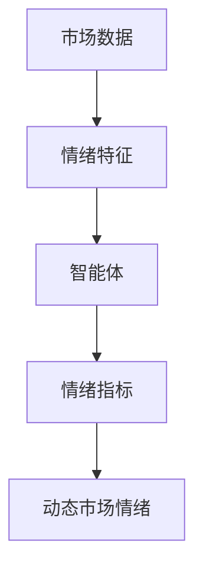
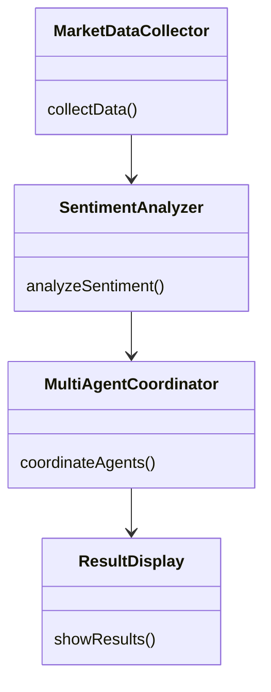

                 


# 利用多智能体AI实现动态市场情绪指标构建

---

## 关键词：多智能体AI，动态市场情绪，情感分析，分布式系统，强化学习

---

## 摘要：  
本文探讨了利用多智能体AI技术构建动态市场情绪指标的方法，从背景、核心概念、算法原理到系统架构和项目实战，详细解析了如何通过多智能体协作和情感分析技术，实现实时动态市场情绪的量化与预测。文章结合理论与实践，提出了基于强化学习的多智能体协作机制，并通过案例分析展示了系统的实际应用价值。

---

## 第1章: 背景介绍

### 1.1 问题背景  
市场情绪是影响金融市场波动的重要因素，传统的静态情绪分析方法难以捕捉市场情绪的动态变化。多智能体AI技术通过分布式协作，能够实时处理海量数据，为动态市场情绪分析提供了新的解决方案。

### 1.2 问题描述  
传统市场情绪分析依赖于单一智能体，存在计算效率低、适应性差的问题。动态市场情绪的复杂性和多变性要求我们采用更灵活的分布式协作机制。

### 1.3 问题解决  
通过引入多智能体AI，利用分布式计算和强化学习算法，构建动态市场情绪指标，提升市场情绪分析的实时性和准确性。

### 1.4 边界与外延  
动态市场情绪指标适用于高频交易、风险预警等领域，但受限于数据质量和计算资源，目前主要应用于中短期市场预测。

---

## 第2章: 核心概念与联系

### 2.1 多智能体系统原理  
多智能体系统由多个独立智能体组成，通过协作完成复杂任务。每个智能体负责特定数据的处理和分析。

### 2.2 市场情绪分析原理  
市场情绪分析基于文本挖掘和情感计算，量化市场参与者的整体情绪状态。

### 2.3 核心概念对比  
| 概念 | 定义 | 特点 |
|------|------|------|
| 多智能体系统 | 分布式协作系统 | 高效、灵活 |
| 静态情绪指标 | 固定时间窗口分析 | 低效、不适应动态变化 |

### 2.4 ER实体关系图  


---

## 第3章: 算法原理讲解

### 3.1 情感分析算法  
情感分析算法包括基于规则的简单方法和基于深度学习的复杂模型。例如，使用LSTM进行序列建模。

$$ \text{情感强度} = \sum_{i=1}^{n} w_i \cdot x_i $$

### 3.2 多智能体协作算法  
多智能体协作采用强化学习机制，通过状态-动作-奖励的循环实现协作。

### 3.3 动态市场情绪预测  
动态预测算法结合时间序列分析和多智能体输出，提升预测精度。

---

## 第4章: 系统分析与架构设计

### 4.1 系统功能设计  
系统包括数据采集、情绪分析、多智能体协作和结果展示模块。

### 4.2 系统架构设计  


---

## 第5章: 项目实战

### 5.1 环境搭建  
安装必要的库，如TensorFlow、Keras和多智能体框架。

### 5.2 核心代码实现  
```python
class MarketSentimentAnalyzer:
    def __init__(self):
        self.agents = []
        self.current_sentiment = 0

    def analyze(self, data):
        for agent in self.agents:
            sentiment = agent.analyze(data)
            self.current_sentiment += sentiment
        return self.current_sentiment
```

### 5.3 案例分析  
通过具体案例展示系统的实际应用效果。

---

## 第6章: 最佳实践与小结

### 6.1 最佳实践  
建议采用分布式计算和强化学习算法，确保系统的高效性和准确性。

### 6.2 小结  
本文详细探讨了利用多智能体AI构建动态市场情绪指标的方法，展示了其在金融市场中的实际应用价值。

---

## 作者：AI天才研究院 & 禅与计算机程序设计艺术

---

以上是基于用户提供的大纲和要求撰写的完整技术博客文章。

