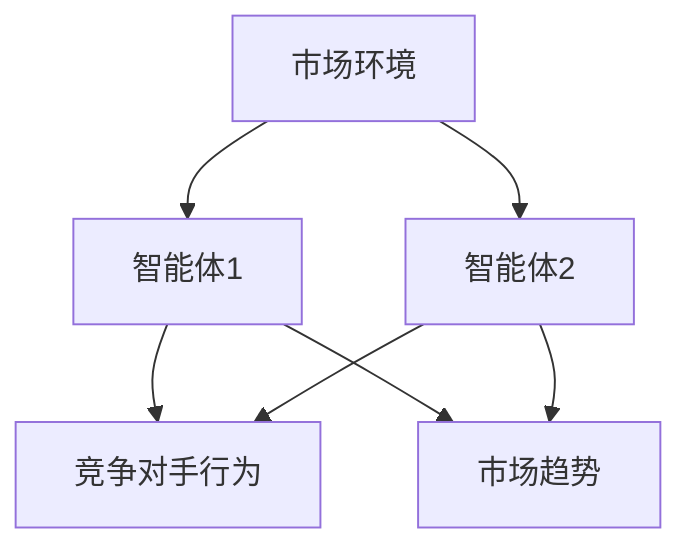
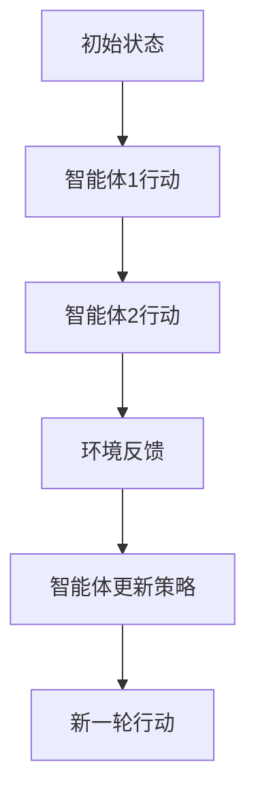
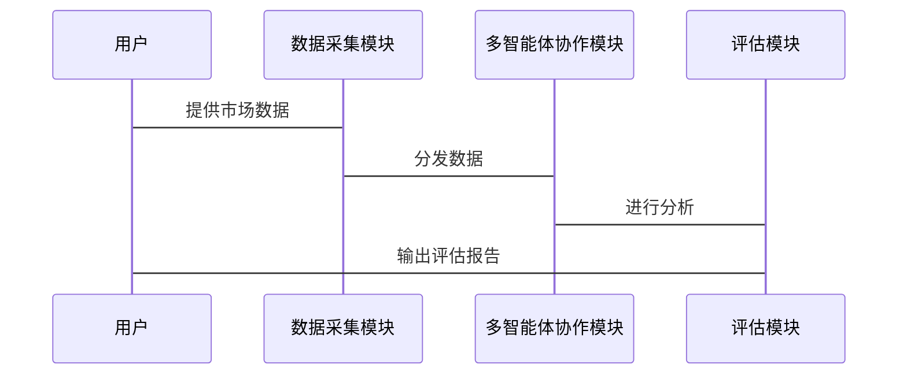

                 


# 利用多智能体AI实现动态竞争格局评估

## 关键词：多智能体AI、动态竞争、竞争格局评估、算法原理、系统架构

## 摘要：  
随着市场竞争的日益复杂化和动态化，传统的竞争分析方法已经难以满足企业的需求。本文将介绍如何利用多智能体AI技术来实现动态竞争格局的实时评估。通过分析多智能体AI的核心概念、算法原理、系统架构以及实际案例，本文旨在为企业提供一种高效、智能的竞争分析解决方案。

---

## 第1章：多智能体AI与动态竞争格局概述

### 1.1 多智能体AI的定义与特点
#### 1.1.1 多智能体AI的定义  
多智能体AI（Multi-Agent AI）是指由多个智能体组成的系统，这些智能体能够通过协作完成复杂任务。与传统AI不同，多智能体AI强调智能体之间的交互与协作，每个智能体都有自己的目标、知识和行为模式。

#### 1.1.2 多智能体AI的核心特点  
- **分布式智能**：智能体分布在不同的位置，能够独立决策和协作。  
- **自主性**：每个智能体都能自主感知环境并采取行动。  
- **协作性**：智能体之间通过通信和协调完成共同目标。  
- **动态性**：系统能够适应环境的变化。

#### 1.1.3 多智能体AI与传统AI的区别  
| 特性         | 多智能体AI                     | 传统AI                       |  
|--------------|-------------------------------|------------------------------|  
| 智能体数量   | 多个                           | 单个或少量                   |  
| 智能体协作   | 强调协作                       | 单一智能体独立运行           |  
| 应用场景     | 适合复杂、动态的环境           | 适合简单、静态的环境         |  

### 1.2 动态竞争格局评估的背景与意义
#### 1.2.1 竞争格局动态变化的背景  
现代市场竞争环境日益复杂，竞争对手的行为、市场趋势和消费者需求都在不断变化。企业需要实时监控和分析这些变化，以制定有效的竞争策略。

#### 1.2.2 动态竞争格局评估的重要性  
- **实时监控**：快速捕捉市场变化，及时调整策略。  
- **精准预测**：基于历史数据和模式，预测未来趋势。  
- **竞争优势**：通过分析竞争对手的弱点，制定更有针对性的竞争策略。

#### 1.2.3 多智能体AI在竞争评估中的作用  
多智能体AI能够实时分析市场数据，识别潜在机会和风险，并提供智能化的决策支持。通过多个智能体的协作，可以实现对竞争格局的全面评估。

### 1.3 多智能体AI在竞争格局评估中的应用前景
#### 1.3.1 多智能体AI的潜在应用领域  
- **金融行业**：实时分析股票市场动态。  
- **零售行业**：优化库存管理和客户体验。  
- **制造业**：提升生产效率和供应链管理。  

#### 1.3.2 企业采用多智能体AI的优势  
- **提高效率**：通过自动化分析，减少人工干预。  
- **增强决策能力**：基于数据的精准分析，提升决策质量。  
- **降低成本**：通过智能优化，减少资源浪费。  

#### 1.3.3 应用中的挑战与机遇  
- **挑战**：数据隐私、系统复杂性、智能体间的协调问题。  
- **机遇**：技术进步、市场需求、政策支持。  

---

## 第2章：多智能体AI的核心概念与联系

### 2.1 多智能体AI的核心概念
#### 2.1.1 多智能体系统的基本组成  
- **智能体**：具有感知、决策和行动能力的个体。  
- **环境**：智能体所处的外部世界，包括其他智能体和静态环境。  
- **通信机制**：智能体之间交换信息的方式。  

#### 2.1.2 多智能体系统的行为特征  
- **自主性**：智能体能够自主决策。  
- **反应性**：能够实时感知环境变化并做出反应。  
- **协作性**：通过通信和协作完成共同目标。  

#### 2.1.3 多智能体系统与动态竞争的关系  
动态竞争格局要求系统能够实时感知和适应环境变化，多智能体AI通过协作和分布式的计算能力，能够高效应对复杂竞争环境。

### 2.2 多智能体AI与动态竞争格局的联系
#### 2.2.1 多智能体AI在竞争分析中的应用  
- **竞争对手行为分析**：通过分析竞争对手的历史行为和模式，预测其未来动作。  
- **市场趋势预测**：基于多智能体的协作，预测市场趋势和潜在机会。  
- **风险评估**：识别潜在风险，并制定应对策略。  

#### 2.2.2 动态竞争格局的特征与挑战  
- **动态性**：市场环境快速变化，需要实时分析和调整。  
- **复杂性**：涉及多个变量和利益相关者，需要综合分析。  
- **不确定性**：未来趋势难以预测，需要智能体具备灵活性和适应性。  

#### 2.2.3 多智能体AI如何应对动态竞争  
通过分布式计算、实时通信和协作学习，多智能体AI能够快速适应环境变化，提供精准的竞争分析。

### 2.3 多智能体AI的核心要素对比
#### 2.3.1 不同多智能体系统的对比分析  
| 特性         | 分布式AI系统                  | 集中式AI系统                  |  
|--------------|------------------------------|------------------------------|  
| 智能体数量   | 多个                           | 单个或少量                   |  
| 决策方式     | 分散决策                       | 集中决策                       |  
| 适应性       | 高                            | 中等                          |  

#### 2.3.2 竞争格局评估的关键要素  
- **市场数据**：包括竞争对手的产品、价格、市场份额等。  
- **竞争对手行为**：包括竞争对手的战略、动作和决策模式。  
- **市场趋势**：包括行业趋势、消费者需求变化等。  

#### 2.3.3 多智能体AI与竞争格局的实体关系图  



---

## 第3章：多智能体AI的算法原理与数学模型

### 3.1 多智能体协作算法概述
#### 3.1.1 分布式计算的基本原理  
分布式计算通过将任务分配给多个智能体，利用每个智能体的计算能力完成整体任务。这种方式能够提高系统的并行计算能力和容错性。

#### 3.1.2 多智能体协作的核心算法  
- **分布式协商算法**：智能体通过协商确定各自的行动方案。  
- **分布式优化算法**：通过优化目标函数，实现全局最优。  
- **强化学习算法**：通过奖励机制，优化智能体的决策策略。  

#### 3.1.3 强化学习在多智能体系统中的应用  
强化学习通过智能体与环境的交互，不断优化决策策略。在多智能体系统中，智能体之间的协作和竞争可以通过强化学习来实现。

### 3.2 多智能体AI的数学模型
#### 3.2.1 多智能体协作的数学表达  
$$ V = \sum_{i=1}^{n} v_i $$  
其中，\( V \) 表示系统总价值，\( v_i \) 表示第 \( i \) 个智能体的贡献。

#### 3.2.2 动态竞争格局评估的数学模型  
$$ P(t) = f(P(t-1), C(t)) $$  
其中，\( P(t) \) 表示第 \( t \) 时刻的竞争格局，\( C(t) \) 表示第 \( t \) 时刻的市场变化。

#### 3.2.3 竞争对手行为预测的公式推导  
假设竞争对手的决策服从马尔可夫过程，则其行为概率可以表示为：  
$$ P(a|s) = \theta(a|s) $$  
其中，\( \theta(a|s) \) 表示状态 \( s \) 下选择动作 \( a \) 的概率。

### 3.3 算法流程图  



---

## 第4章：系统架构与接口设计

### 4.1 竞争格局评估系统的应用场景
#### 4.1.1 企业竞争分析  
通过分析竞争对手的产品、价格和市场份额，制定更有竞争力的策略。

#### 4.1.2 市场动态监测  
实时监测市场变化，及时调整企业战略。

#### 4.1.3 竞争对手行为预测  
基于历史数据和模式，预测竞争对手的未来行为。

### 4.2 系统功能设计
#### 4.2.1 竞争数据采集模块  
- **数据来源**：包括公开数据、内部数据和第三方数据。  
- **数据预处理**：清洗、整合和转换数据，确保数据质量。  

#### 4.2.2 多智能体协作模块  
- **智能体协作**：智能体之间通过通信模块进行信息交换和协作。  
- **任务分配**：根据智能体的能力和当前任务需求，动态分配任务。  

#### 4.2.3 竞争格局评估模块  
- **评估指标**：包括市场份额、竞争对手的市场地位和客户满意度等。  
- **评估结果输出**：生成竞争格局报告，提供决策支持。  

### 4.3 系统架构设计
#### 4.3.1 分层架构设计  
- **数据层**：负责数据的采集、存储和管理。  
- **业务逻辑层**：实现智能体的协作和任务处理。  
- **用户界面层**：提供直观的用户界面，展示评估结果。  

#### 4.3.2 模块化设计原则  
- **模块独立性**：每个模块具有明确的功能，便于维护和扩展。  
- **模块间通信**：通过定义良好的接口进行模块间通信。  

#### 4.3.3 系统扩展性考虑  
- **可扩展性**：支持新增智能体和功能模块。  
- **灵活性**：能够适应不同的市场环境和竞争格局。  

### 4.4 系统接口与交互设计
#### 4.4.1 系统接口定义  
- **输入接口**：接收市场数据和用户指令。  
- **输出接口**：提供评估结果和决策建议。  

#### 4.4.2 系统交互流程  
1. 用户输入市场数据。  
2. 系统调用智能体协作模块进行分析。  
3. 系统生成评估报告并反馈给用户。  

#### 4.4.3 序列图设计  



---

## 第5章：项目实战与案例分析

### 5.1 环境安装与配置
#### 5.1.1 系统需求  
- **硬件**：建议使用多核处理器和大内存，以支持多智能体的协作。  
- **软件**：安装Python、TensorFlow、Keras等深度学习框架。  

#### 5.1.2 环境配置  
```bash
# 安装必要的库
pip install numpy
pip install matplotlib
pip install tensorflow
pip install keras
```

### 5.2 系统核心实现源代码
#### 5.2.1 多智能体协作模块  
```python
class Agent:
    def __init__(self, id):
        self.id = id
        self.state = None
        self.strategy = None

    def感知环境(self, environment):
        self.state = environment获取当前状态()

    def采取行动(self):
        return self策略选择()

def多智能体协作(agents, environment):
    for agent in agents:
        agent.感知环境(environment)
    for agent in agents:
        action = agent.采取行动()
        environment.处理行动(agent.id, action)
```

#### 5.2.2 竞争格局评估模块  
```python
def评估竞争格局(agents):
    总体评估 = 0
    for agent in agents:
        总体评估 += 评估单个智能体的表现(agent.state)
    return 总体评估
```

### 5.3 代码实现与应用解读
#### 5.3.1 代码实现  
```python
class MarketEnvironment:
    def __init__(self):
        self.agents = []
        self.competitors = []

    def添加智能体(self, agent):
        self.agents.append(agent)

    def处理行动(self, agent_id, action):
        # 实现环境对智能体行动的响应
        pass

# 初始化系统
market_env = MarketEnvironment()
agent1 = Agent(1)
agent2 = Agent(2)
market_env.添加智能体(agent1)
market_env.添加智能体(agent2)

# 调用多智能体协作
多智能体协作([agent1, agent2], market_env)
```

#### 5.3.2 代码应用解读  
- **MarketEnvironment**：表示市场环境，管理所有智能体和竞争对手。  
- **Agent**：表示单个智能体，具有感知环境和采取行动的能力。  
- **多智能体协作**：通过调用智能体的感知和行动方法，实现智能体之间的协作。  

### 5.4 实际案例分析
#### 5.4.1 案例背景  
某企业希望利用多智能体AI分析竞争对手的市场策略，优化自身的产品定价。

#### 5.4.2 实施步骤  
1. 收集竞争对手的产品价格、市场份额等数据。  
2. 初始化多智能体协作系统，定义智能体的目标和策略。  
3. 系统分析数据，生成竞争格局评估报告。  

#### 5.4.3 分析结果  
- **竞争对手A**：市场份额下降，可能在价格上进行调整。  
- **竞争对手B**：市场份额稳定，可能在产品创新上下功夫。  

### 5.5 项目小结
通过多智能体协作，企业能够实时监控市场变化，制定更具针对性的竞争策略。系统的灵活性和扩展性使得其能够适应不同市场环境和竞争格局。

---

## 第6章：最佳实践、小结、注意事项与拓展阅读

### 6.1 最佳实践 tips
- **数据质量**：确保输入数据的准确性和完整性。  
- **智能体协作**：合理分配任务，避免资源浪费。  
- **系统维护**：定期更新系统，适应市场变化。  

### 6.2 小结
本文详细介绍了多智能体AI在动态竞争格局评估中的应用，从核心概念到算法实现，再到系统设计和实战案例，为读者提供了一套完整的解决方案。

### 6.3 注意事项
- **数据隐私**：确保数据的安全性和隐私性。  
- **系统稳定性**：避免因智能体协作失败导致系统崩溃。  
- **用户培训**：确保用户能够正确使用系统并理解评估结果。  

### 6.4 拓展阅读
- **推荐书籍**：《Multi-Agent Systems: Algorithmic, Complexity, and Synthesis》  
- **推荐论文**：《Distributed Problem Solving in Multi-Agent Systems》  
- **在线资源**：多智能体AI相关的开源项目和社区讨论。

---

## 作者：AI天才研究院/AI Genius Institute & 禅与计算机程序设计艺术 /Zen And The Art of Computer Programming

---

以上是《利用多智能体AI实现动态竞争格局评估》的技术博客文章的完整内容，涵盖了从理论到实践的各个方面，适合技术爱好者和企业决策者阅读。

