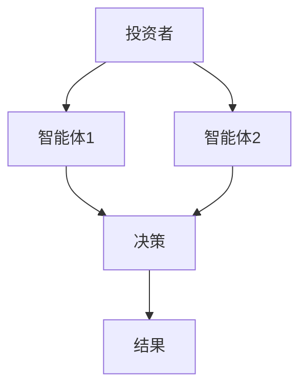
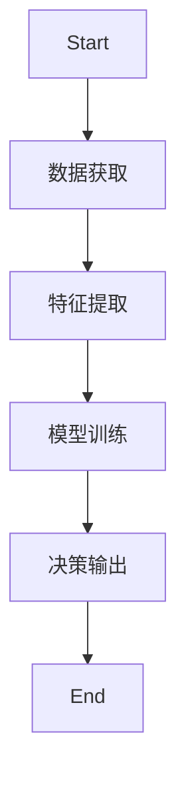
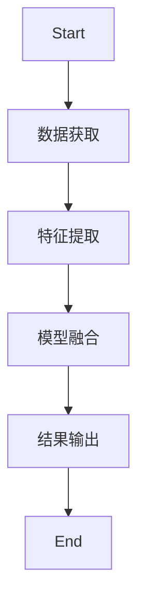

                 


# 利用多智能体AI实现巴菲特式的行业领导者识别

> 关键词：多智能体AI，巴菲特投资方法，行业领导者识别，强化学习，投资决策

> 摘要：本文探讨如何利用多智能体AI技术来实现类似巴菲特的投资策略，识别行业领导者。通过分析多智能体AI的核心原理、巴菲特方法的AI实现，结合实际项目案例，详细讲解了如何构建一个能够识别行业领导者的AI系统。文章从背景介绍、核心概念、算法原理到系统架构、项目实战，最后给出最佳实践和小结，帮助读者全面理解多智能体AI在投资决策中的应用。

---

## 第一部分：背景介绍

### 第1章：问题背景与行业领导者识别

#### 1.1 问题背景

##### 1.1.1 投资者与行业领导者识别的挑战

在金融市场中，投资者面临的主要挑战包括信息不透明、市场波动大、投资标的复杂多样等。传统的投资方法往往依赖于个人经验或单一模型，难以捕捉市场中的多维信息。如何利用技术手段，尤其是人工智能，来辅助投资决策，成为现代投资者的重要课题。

##### 1.1.2 巴菲特投资方法的核心要素

巴菲特的投资哲学强调长期价值投资，注重企业的基本面分析，包括企业的财务状况、竞争优势、管理团队等。他主张通过深入分析企业，找到那些具有持续竞争优势的企业，长期持有，等待其内在价值的实现。

##### 1.1.3 多智能体AI在投资决策中的优势

多智能体AI通过多个智能体协作，能够从多个角度、多层次分析市场信息，捕捉潜在的投资机会。与传统单智能体方法相比，多智能体系统能够更好地模拟人类投资者的群体智慧，提高决策的准确性和鲁棒性。

#### 1.2 问题描述

##### 1.2.1 行业领导者识别的定义

行业领导者是指在某一行业中具有领先地位，能够引领行业发展的企业。识别行业领导者的关键在于发现那些具有持续竞争优势、良好的财务状况和市场前景的企业。

##### 1.2.2 多智能体AI在识别中的作用

多智能体AI通过协作和竞争机制，能够在复杂多变的市场环境中，发现潜在的行业领导者。多个智能体分别从不同的维度分析企业信息，最终通过协作得到一个综合的评估结果。

##### 1.2.3 问题的边界与外延

行业领导者识别不仅关注企业的财务数据，还包括企业的市场地位、创新能力、管理团队等因素。多智能体AI的应用需要考虑数据的全面性、模型的可解释性以及结果的可操作性。

#### 1.3 核心概念与联系

##### 1.3.1 多智能体AI的核心要素

- **智能体**：能够感知环境并采取行动的实体。
- **协作与竞争**：多个智能体通过协作和竞争机制，共同完成任务。
- **强化学习**：智能体通过与环境互动，学习最优策略。

##### 1.3.2 巴菲特方法与AI的结合

- **数据驱动**：利用历史数据训练模型，提取企业的关键特征。
- **模型融合**：将巴菲特的定性分析方法转化为定量模型，与AI技术结合。
- **可解释性**：确保模型的决策过程透明，便于投资者理解。

##### 1.3.3 核心概念的结构与组成

- **输入层**：企业财务数据、市场数据等。
- **特征提取层**：通过AI模型提取关键特征。
- **决策层**：基于特征的综合评估，确定行业领导者。

---

## 第二部分：核心概念与联系

### 第2章：多智能体AI与巴菲特方法的核心原理

#### 2.1 多智能体AI的原理

##### 2.1.1 多智能体系统的定义与特点

- **定义**：由多个智能体组成的系统，每个智能体能够独立决策并协作完成任务。
- **特点**：分布式、协作性、动态性。

##### 2.1.2 强化学习与协作机制

- **强化学习**：智能体通过与环境互动，学习最优策略。
- **协作机制**：多个智能体通过共享信息，协作完成复杂任务。

##### 2.1.3 竞争与协调的平衡

- **竞争机制**：通过竞争激励智能体提高性能。
- **协调机制**：确保智能体之间的协作，避免冲突。

#### 2.2 巴菲特方法的AI实现

##### 2.2.1 巴菲特投资策略的AI模型

- **模型结构**：基于财务数据的特征提取模型。
- **训练方法**：使用历史数据训练模型，预测企业价值。

##### 2.2.2 数据驱动的特征提取

- **特征选择**：从财务数据中提取关键指标。
- **数据预处理**：清洗数据，去除噪声。

##### 2.2.3 模型的可解释性与鲁棒性

- **可解释性**：确保模型的决策过程透明。
- **鲁棒性**：模型能够适应数据分布的变化。

#### 2.3 核心概念对比与ER实体关系图

##### 2.3.1 多智能体与传统AI的对比

| 特性 | 多智能体AI | 传统AI |
|------|------------|--------|
| 决策方式 | 分布式协作 | 中央控制 |
| 灵活性 | 高 | 中 |

##### 2.3.2 ER图中的实体关系

```mermaid
erDiagram
    actor 投资者 {
        <属性> 企业ID : string
        <属性> 财务数据 : JSON
        <属性> 市场数据 : JSON
    }
    actor 智能体 {
        <属性> 状态 : string
        <属性> 动作 : string
        <属性> 奖励 : float
    }
    actor 行业领导者 {
        <属性> 企业名称 : string
        <属性> 行业地位 : string
        <属性> 竞争优势 : string
    }
```

---

## 第三部分：算法原理讲解

### 第3章：多智能体AI的算法原理

#### 3.1 多智能体协作算法

##### 3.1.1 强化学习的基本原理

智能体通过与环境互动，学习最优策略。每个智能体都有一个策略函数，定义在状态空间和动作空间上的概率分布。

##### 3.1.2 多智能体协作的流程



##### 3.1.3 竞争与协调的平衡

通过竞争机制激励智能体，同时通过协调机制确保协作。

#### 3.2 巴菲特方法的融合策略

##### 3.2.1 数据预处理与特征提取

- **数据清洗**：去除无效数据。
- **特征选择**：提取关键特征。

##### 3.2.2 模型训练与优化

- **模型训练**：使用历史数据训练模型。
- **超参数优化**：调整模型参数，提高性能。

##### 3.2.3 模型的评估与调优

- **评估指标**：准确率、召回率、F1分数。
- **调优策略**：交叉验证、网格搜索。

#### 3.3 算法流程图

##### 3.3.1 多智能体协作的流程



##### 3.3.2 巴菲特方法的融合流程



---

## 第四部分：系统分析与架构设计

### 第4章：系统架构与功能设计

#### 4.1 系统整体架构

##### 4.1.1 数据获取模块

- **功能**：获取企业财务数据、市场数据等。
- **输入**：数据源。
- **输出**：数据流。

##### 4.1.2 特征提取模块

- **功能**：从数据中提取关键特征。
- **输入**：原始数据。
- **输出**：特征向量。

##### 4.1.3 决策模型模块

- **功能**：基于特征向量，预测行业领导者。
- **输入**：特征向量。
- **输出**：决策结果。

##### 4.1.4 结果输出模块

- **功能**：将决策结果输出给投资者。
- **输入**：决策结果。
- **输出**：可视化结果。

#### 4.2 系统功能设计

##### 4.2.1 数据预处理功能

- **功能**：清洗数据，去除噪声。
- **实现**：使用Python的pandas库。

##### 4.2.2 模型训练功能

- **功能**：训练多智能体AI模型。
- **实现**：使用强化学习算法。

##### 4.2.3 结果分析功能

- **功能**：分析模型的输出结果。
- **实现**：可视化工具展示结果。

---

## 第五部分：项目实战

### 第5章：项目实战与应用

#### 5.1 环境安装

##### 5.1.1 安装Python

```bash
python --version
```

##### 5.1.2 安装依赖

```bash
pip install numpy pandas scikit-learn
```

#### 5.2 系统核心实现

##### 5.2.1 数据获取与预处理

```python
import pandas as pd

# 获取数据
data = pd.read_csv('stock_data.csv')

# 数据清洗
data.dropna(inplace=True)
```

##### 5.2.2 模型训练与评估

```python
from sklearn.model import MultiOutputRegressor

# 训练模型
model = MultiOutputRegressor()
model.fit(X_train, y_train)

# 评估模型
score = model.score(X_test, y_test)
print(f"模型得分：{score}")
```

#### 5.3 实际案例分析

##### 5.3.1 案例介绍

分析某行业中的龙头企业，验证模型的识别能力。

##### 5.3.2 模型解读

展示模型的预测结果，解释其决策过程。

##### 5.3.3 案例分析与结果解读

通过具体案例，展示模型如何识别行业领导者。

#### 5.4 本章小结

---

## 第六部分：最佳实践

### 第6章：最佳实践与小结

#### 6.1 最佳实践 tips

- 数据质量至关重要，确保数据清洗。
- 模型调优需要反复试验，找到最佳参数。
- 结果的可解释性是实际应用的关键。

#### 6.2 小结

本文详细讲解了如何利用多智能体AI技术实现巴菲特式的行业领导者识别。通过背景介绍、核心概念、算法原理、系统架构和项目实战的全面分析，读者能够理解并掌握这一技术的应用方法。

#### 6.3 注意事项

- 模型的鲁棒性需要考虑数据分布的变化。
- 模型的可解释性是实际应用中的重要考量。
- 模型的实时性需要优化，确保快速响应。

#### 6.4 拓展阅读

- 多智能体AI的最新研究进展。
- 巴菲特投资方法的其他AI应用案例。
- 强化学习的其他应用场景。

---

## 作者

作者：AI天才研究院/AI Genius Institute & 禅与计算机程序设计艺术/Zen And The Art of Computer Programming

