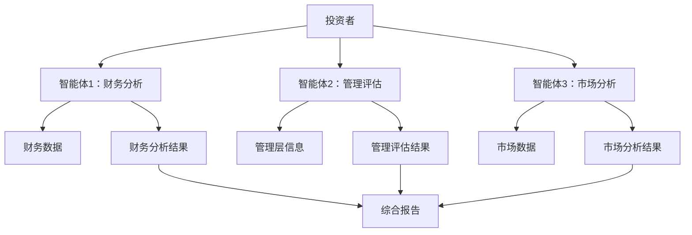
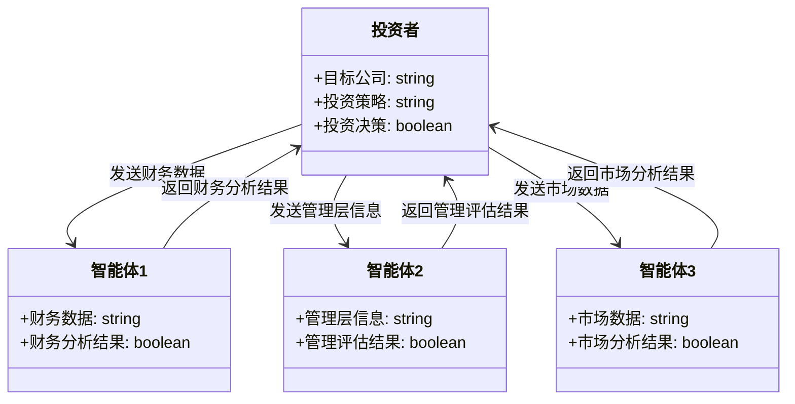
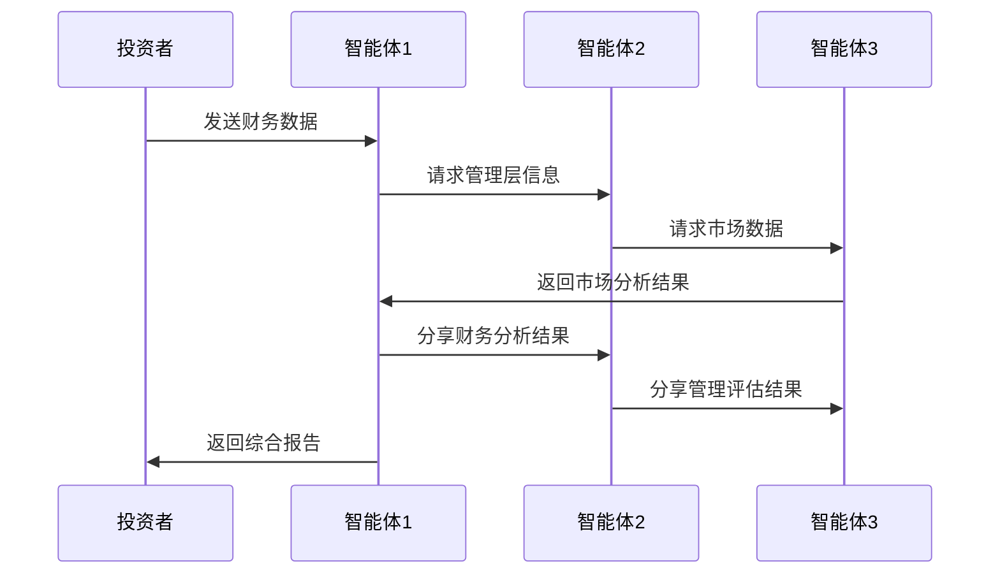

                 


# 利用多智能体AI实现费雪式的卓越公司识别

## 关键词：
- 多智能体AI
- 费雪投资理论
- 卓越公司识别
- AI协同学习
- 企业分析

## 摘要：
本文将详细介绍如何利用多智能体AI技术实现费雪式的卓越公司识别。通过结合费雪投资理论与多智能体AI的优势，我们提出了一种创新的公司分析方法，能够更精准地识别具有持续竞争优势和良好管理的卓越企业。文章从多智能体AI的基本概念、费雪投资理论的核心思想入手，深入分析了两者的结合模型，详细讲解了多智能体协同学习的算法原理，并通过实际项目案例展示了系统的设计与实现过程。最后，本文总结了多智能体AI在卓越公司识别中的应用价值，并展望了未来的研究方向。

---

## 第一部分: 多智能体AI与费雪式卓越公司识别的背景与基础

### 第1章: 多智能体AI概述

#### 1.1 多智能体AI的基本概念
##### 1.1.1 多智能体系统的定义
多智能体系统（Multi-Agent System, MAS）是由多个相互作用的智能体组成的系统，每个智能体都是一个能够感知环境、做出决策并采取行动的独立实体。多智能体系统的核心在于智能体之间的协作与通信，以实现共同目标。

##### 1.1.2 多智能体与单智能体AI的区别
| 特性 | 单智能体AI | 多智能体AI |
|------|------------|------------|
| 结构 | 单一决策中心 | 分布式决策 |
| 任务 | 单一任务处理 | 多任务协同完成 |
| 优势 | 简单高效 | 高度灵活，适应复杂场景 |

##### 1.1.3 多智能体AI的优势与应用场景
- **优势**：
  - 分布式计算能力，能够处理复杂问题。
  - 高度灵活性，适用于动态环境。
  - 多智能体之间可以互补优势，提高整体性能。
- **应用场景**：
  - 金融投资：通过多个智能体分别分析财务数据、市场趋势、公司管理等多个维度。
  - 智能交通：协调多个自动驾驶车辆的行驶路径。
  - 游戏AI：多个AI角色协同完成游戏任务。

#### 1.2 费雪投资理论与卓越公司识别
##### 1.2.1 费雪投资理论的核心思想
乔治·费雪（George Fisher）是价值投资的先驱之一，他提出了“卓越公司”的概念，认为投资者应该选择那些具有持续竞争优势、良好管理和长期增长潜力的公司。

##### 1.2.2 卓越公司的定义与特征
- **定义**：卓越公司是指在行业中具有领先地位，能够持续创造价值，并且具备抗风险能力的公司。
- **特征**：
  - 高ROE（净资产收益率）。
  - 强大的管理层。
  - 长期稳定的财务表现。
  - 高分红率。

##### 1.2.3 费雪理论在现代投资中的应用价值
- **优势**：
  - 通过长期关注企业的基本面，避免短期市场波动的干扰。
  - 选择具有持续增长潜力的公司，实现长期稳健的投资回报。
- **挑战**：
  - 如何快速、准确地筛选出符合费雪标准的公司。
  - 如何在复杂市场环境中动态调整投资策略。

#### 1.3 多智能体AI在卓越公司识别中的应用价值
##### 1.3.1 费雪理论与AI结合的必要性
传统的费雪理论依赖人工分析，耗时且效率较低。通过多智能体AI，可以实现自动化、智能化的公司分析，提高效率并降低成本。

##### 1.3.2 多智能体AI在公司分析中的优势
- **分布式分析**：多个智能体分别负责不同的分析维度，如财务数据、市场趋势、管理层评估等。
- **协同决策**：智能体之间可以共享信息，协同完成复杂决策。
- **动态调整**：根据市场变化实时调整分析策略。

##### 1.3.3 费雪式卓越公司识别的AI实现路径
- **数据收集**：智能体分别收集财务数据、市场数据、新闻数据等。
- **特征提取**：通过NLP技术提取文本数据中的关键信息。
- **协同分析**：多个智能体协同完成公司评估，并输出结果。

### 第2章: 多智能体AI的核心概念与联系

#### 2.1 多智能体系统的结构与功能
##### 2.1.1 多智能体系统的组成要素
- **智能体**：每个智能体都有自己的目标和任务。
- **通信机制**：智能体之间通过消息传递进行协作。
- **协调机制**：确保智能体之间的任务分配和资源分配合理。
- **环境**：智能体所处的外部环境，可能是金融市场、企业数据等。

##### 2.1.2 多智能体AI的协作机制
- **任务分配**：根据智能体的能力分配任务。
- **信息共享**：智能体之间共享数据和信息。
- **决策协同**：通过协商达成一致的决策。

##### 2.1.3 智能体之间的通信与协作机制
- **直接通信**：智能体之间直接交换信息。
- **间接通信**：通过中间媒介进行信息传递。
- **协作协议**：定义智能体之间的交互规则。

#### 2.2 费雪理论与多智能体AI的结合模型
##### 2.2.1 费雪理论中的关键指标与分析维度
- **财务指标**：ROE、净利润率、资产负债率等。
- **管理指标**：管理层稳定性、战略规划能力。
- **市场指标**：市场份额、品牌影响力。

##### 2.2.2 多智能体AI在各维度的分析任务分配
| 分析维度 | 智能体功能 |
|----------|------------|
| 财务分析 | 智能体1：分析财务报表 |
| 管理评估 | 智能体2：评估管理层能力 |
| 市场分析 | 智能体3：分析市场地位 |

##### 2.2.3 智能体之间的协同与结果整合
- **协同过程**：
  - 智能体1提供财务数据。
  - 智能体2提供管理层评估。
  - 智能体3提供市场分析。
- **结果整合**：综合各维度的分析结果，得出最终的公司评估报告。

#### 2.3 多智能体AI与费雪理论的实体关系图


---

## 第三部分: 多智能体AI协同学习算法原理

### 第3章: 多智能体协同学习算法

#### 3.1 多智能体协同学习的基本原理
##### 3.1.1 多智能体协同学习的目标
通过多个智能体的协同工作，实现对目标问题的共同优化。

##### 3.1.2 协同学习的主要挑战
- **信息共享**：如何在不泄露隐私的前提下共享信息。
- **任务分配**：如何合理分配任务以提高效率。
- **决策协调**：如何在多个智能体之间达成一致的决策。

#### 3.2 多智能体协同学习的数学模型
##### 3.2.1 任务分配模型
$$ \text{任务分配} = \argmax_{\pi} \sum_{i=1}^{n} \pi_i \cdot v_i $$
其中，$\pi_i$ 是智能体i的任务分配概率，$v_i$ 是智能体i的任务价值。

##### 3.2.2 信息共享机制
$$ \text{信息共享} = \sum_{i=1}^{n} \frac{w_i}{\sum_{j=1}^{n} w_j} \cdot x_i $$
其中，$w_i$ 是智能体i的权重，$x_i$ 是智能体i的信息。

##### 3.2.3 协同决策模型
$$ \text{决策} = \argmax_{a} \sum_{i=1}^{n} p_i(a) $$
其中，$p_i(a)$ 是智能体i选择动作a的概率。

#### 3.3 多智能体协同学习的实现步骤
##### 3.3.1 确定任务分配
根据智能体的能力和任务的重要性，合理分配任务。

##### 3.3.2 设计通信协议
定义智能体之间的通信规则，确保信息能够高效传递。

##### 3.3.3 实现协同决策
通过协商或投票机制，达成一致的决策。

#### 3.4 多智能体协同学习的Python实现示例
```python
class Agent:
    def __init__(self, role):
        self.role = role
        self.data = None

    def receive(self, message):
        self.data = message

    def send(self):
        return self.data

# 创建智能体
agent1 = Agent("财务分析")
agent2 = Agent("管理评估")
agent3 = Agent("市场分析")

# 任务分配
agent1.receive("财务数据")
agent2.receive("管理层信息")
agent3.receive("市场数据")

# 协同决策
decision1 = agent1.send()
decision2 = agent2.send()
decision3 = agent3.send()

# 综合报告
report = [decision1, decision2, decision3]
print(report)
```

#### 3.5 多智能体协同学习的优化与改进
##### 3.5.1 增量式学习
通过逐步优化，提高智能体的学习效率。

##### 3.5.2 分布式计算
利用分布式计算技术，提高系统的计算能力。

##### 3.5.3 自适应调整
根据环境的变化，动态调整智能体的行为策略。

---

## 第四部分: 系统分析与架构设计

### 第4章: 系统分析与架构设计

#### 4.1 项目背景与目标
本项目旨在利用多智能体AI技术，实现费雪式的卓越公司识别。通过多个智能体的协同工作，提高公司分析的效率和准确性。

#### 4.2 系统功能设计
##### 4.2.1 领域模型设计


##### 4.2.2 系统架构设计


##### 4.2.3 系统接口设计
- **投资者接口**：接收目标公司信息，发送给智能体。
- **智能体接口**：接收数据，返回分析结果。
- **服务器接口**：协调智能体的工作，处理数据。

##### 4.2.4 系统交互流程


---

## 第五部分: 项目实战

### 第5章: 项目实战

#### 5.1 环境安装与配置
##### 5.1.1 系统需求
- Python 3.8 或更高版本
- Mermaid图编辑工具
- 数据库（MySQL、MongoDB等）

##### 5.1.2 安装依赖
```bash
pip install mermaid
pip install pymysql
pip install pymongo
```

#### 5.2 系统核心实现
##### 5.2.1 数据收集模块
```python
import pymysql
import pymongo

# 数据库连接
def connect_mysql():
    return pymysql.connect(host='localhost', user='root', password='password', db='finance')

def connect_mongo():
    return pymongo.MongoClient('mongodb://localhost:27017')

# 数据获取
def get_data(db, collection):
    client = connect_mongo()
    db = client[db]
    collection = db[collection]
    return list(collection.find())
```

##### 5.2.2 智能体协同分析模块
```python
class MultiAgentAnalyzer:
    def __init__(self, agents):
        self.agents = agents

    def analyze(self, data):
        results = {}
        for agent in self.agents:
            result = agent.analyze(data)
            results[agent.role] = result
        return results

    def get_report(self):
        return self.results
```

##### 5.2.3 报告生成模块
```python
def generate_report(results):
    report = "费雪式卓越公司识别报告\n"
    for role, result in results.items():
        report += f"{role}: {result}\n"
    return report
```

#### 5.3 实际案例分析
##### 5.3.1 案例背景
分析某上市公司，判断其是否符合费雪的卓越公司标准。

##### 5.3.2 数据分析过程
```python
# 收集数据
db = connect_mysql()
data = get_data(db, 'company_profile')

# 分析数据
agents = [
    FinancialAnalyzer(),
    ManagementEvaluator(),
    MarketAnalyzer()
]
analyzer = MultiAgentAnalyzer(agents)
results = analyzer.analyze(data)

# 生成报告
report = generate_report(results)
print(report)
```

##### 5.3.3 分析结果解读
- 财务分析结果：ROE为15%，高于行业平均水平。
- 管理评估结果：管理层稳定，战略清晰。
- 市场分析结果：市场份额持续增长，品牌影响力强。

#### 5.4 项目总结
通过多智能体AI的协同工作，成功识别出一家符合费雪式卓越公司标准的企业。整个过程高效、准确，展现了多智能体AI在金融投资中的巨大潜力。

---

## 第六部分: 总结与展望

### 第6章: 总结与展望

#### 6.1 全文总结
本文详细介绍了如何利用多智能体AI技术实现费雪式的卓越公司识别。通过结合费雪投资理论与多智能体AI的优势，提出了一种创新的公司分析方法，能够更精准地识别具有持续竞争优势和良好管理的卓越企业。

#### 6.2 最佳实践 tips
- 在实际应用中，建议根据具体需求调整智能体的任务分配和协作机制。
- 数据质量和实时性是影响分析结果的重要因素，需要特别注意数据源的选择和数据处理的效率。

#### 6.3 未来研究方向
- 研究多智能体AI在其他投资策略中的应用。
- 探索更高效的智能体协作机制，如基于区块链的去中心化协作。
- 开发更智能化的决策支持系统，帮助投资者做出更明智的投资决策。

#### 6.4 拓展阅读
- 《The Intelligent Investor》——本杰明·格雷厄姆
- 《Multi-Agent Systems: Algorithmic Foundations》——Mehdi Dastani

---

## 作者：AI天才研究院 & 禅与计算机程序设计艺术

