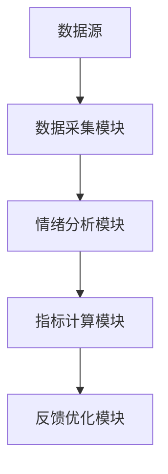

                 


# 利用多智能体AI构建动态市场情绪指标

## 关键词：多智能体AI，动态市场情绪指标，情绪分析，自然语言处理，时间序列分析

## 摘要：本文详细介绍了利用多智能体AI构建动态市场情绪指标的方法。通过分析多智能体系统的特点和动态市场情绪指标的构建要素，探讨了基于强化学习和自然语言处理的算法原理，并通过实际案例展示了系统架构设计和项目实现过程，最后总结了多智能体AI在市场情绪分析中的应用前景。

---

# 第一部分: 多智能体AI与动态市场情绪指标概述

## 第1章: 多智能体AI与动态市场情绪指标的背景介绍

### 1.1 多智能体AI的定义与特点

#### 1.1.1 多智能体系统的定义

多智能体系统（Multi-Agent System, MAS）是由多个智能体（Agent）组成的分布式系统，这些智能体能够通过交互协作完成复杂任务。智能体可以是软件程序或硬件设备，具备感知环境、自主决策和执行任务的能力。

#### 1.1.2 多智能体系统的核心特点

- **分布式性**：多个智能体独立运行，通过通信协作完成任务。
- **自主性**：每个智能体具备自主决策的能力。
- **反应性**：智能体能够实时感知环境变化并做出反应。
- **协作性**：智能体之间通过协作提高整体系统的性能。

#### 1.1.3 多智能体系统与单智能体AI的区别

| 特性 | 单智能体AI | 多智能体AI |
|------|------------|------------|
| 决策中心 | 单一决策中心 | 分布式决策中心 |
| 任务处理 | 单一任务处理 | 多任务协作处理 |
| 可扩展性 | 较低 | 较高 |

### 1.2 动态市场情绪指标的定义与应用

#### 1.2.1 市场情绪指标的定义

市场情绪指标是反映市场参与者情绪状态的量化指标，通常通过分析市场数据、新闻、社交媒体等信息来计算。

#### 1.2.2 动态市场情绪指标的特点

- **实时性**：能够实时更新市场情绪变化。
- **动态性**：根据市场变化快速调整指标值。
- **准确性**：通过多源数据融合提高指标的准确性。

#### 1.2.3 动态市场情绪指标在金融领域的应用

- **股票交易**：帮助投资者判断市场趋势，制定交易策略。
- **风险管理**：识别市场情绪波动，防范潜在风险。
- **市场预测**：通过情绪指标预测市场走势。

### 1.3 多智能体AI在市场情绪分析中的优势

#### 1.3.1 多智能体AI的优势

- **分布式计算能力**：能够处理大规模数据，提高计算效率。
- **协作能力**：多个智能体协同工作，提高分析的全面性。
- **适应性**：能够快速响应市场变化，实时调整分析策略。

#### 1.3.2 多智能体AI在市场情绪分析中的独特价值

- **多源数据处理**：能够同时分析文本、语音、图像等多种数据源，提高情绪分析的准确性。
- **实时反馈机制**：智能体之间的协作能够快速反馈市场情绪变化，提供实时指标。

#### 1.3.3 多智能体AI与传统市场情绪分析方法的对比

| 特性 | 传统方法 | 多智能体AI |
|------|-----------|------------|
| 数据处理能力 | 单一数据源 | 多数据源 |
| 计算效率 | 较低 | 较高 |
| 实时性 | 较差 | 较好 |

### 1.4 本章小结

本章介绍了多智能体AI的基本概念和特点，分析了动态市场情绪指标的定义和应用，并对比了多智能体AI与传统市场情绪分析方法的优缺点，为后续章节奠定了理论基础。

---

## 第2章: 多智能体AI与动态市场情绪指标的核心概念

### 2.1 多智能体系统的核心要素

#### 2.1.1 智能体的定义与角色

智能体是多智能体系统的基本单位，具备以下角色：

- **感知者**：负责感知环境信息。
- **决策者**：负责制定决策策略。
- **执行者**：负责执行决策。

#### 2.1.2 智能体之间的通信机制

智能体之间的通信机制包括：

- **直接通信**：智能体之间直接交换信息。
- **间接通信**：通过中间媒介传递信息。

#### 2.1.3 智能体的协作与协调

智能体的协作与协调是通过以下机制实现的：

- **协商机制**：智能体之间通过协商确定任务分配。
- **同步机制**：确保智能体之间的行为同步。

### 2.2 动态市场情绪指标的构建要素

#### 2.2.1 数据源的选择与整合

动态市场情绪指标的数据源包括：

- **新闻数据**：分析新闻标题和内容，提取情绪信息。
- **社交媒体数据**：分析用户评论、帖子等，捕捉市场情绪。
- **市场数据**：分析股票价格、成交量等市场数据，结合情绪指标。

#### 2.2.2 情绪指标的计算方法

情绪指标的计算方法包括：

- **情感分析**：通过自然语言处理技术，分析文本中的情感倾向。
- **情绪强度计算**：量化情绪的强度，如积极、消极、中性。

#### 2.2.3 动态指标的更新机制

动态指标的更新机制包括：

- **实时更新**：根据最新数据，实时更新指标值。
- **周期性更新**：定期更新指标值，减少计算开销。

### 2.3 多智能体与动态情绪指标的协同关系

#### 2.3.1 多智能体系统如何支持动态情绪指标

- **数据采集**：多个智能体分别采集不同数据源的信息，提高数据的全面性。
- **情绪分析**：多个智能体协同完成对多源数据的情绪分析，提高分析的准确性。

#### 2.3.2 动态情绪指标如何反馈到多智能体系统

- **反馈机制**：将情绪指标反馈到智能体系统，调整智能体的行为策略。
- **优化决策**：利用情绪指标优化智能体的决策过程，提高系统的整体性能。

#### 2.3.3 多智能体系统与动态情绪指标的协同优化

- **协同学习**：智能体之间通过协同学习，提高情绪指标的计算精度。
- **动态调整**：根据市场变化，动态调整智能体的协作策略。

### 2.4 本章小结

本章详细介绍了多智能体系统的核心要素和动态市场情绪指标的构建要素，并分析了两者之间的协同关系，为后续的算法设计奠定了基础。

---

## 第3章: 多智能体AI构建动态市场情绪指标的算法原理

### 3.1 多智能体协作算法

#### 3.1.1 分布式多智能体算法

分布式多智能体算法通过将任务分配给多个智能体，利用分布式计算提高处理效率。例如，使用分布式计算框架（如Hadoop）处理大规模数据。

#### 3.1.2 基于强化学习的多智能体协作

强化学习是一种通过智能体与环境互动来学习策略的算法。在多智能体系统中，多个智能体通过强化学习协作完成任务。例如，使用多智能体强化学习算法（如Q-Learning）进行协作。

#### 3.1.3 多智能体系统的通信协议

通信协议是智能体之间交换信息的规则。例如，使用简单的消息传递协议（如HTTP）进行通信。

### 3.2 动态情绪指标计算算法

#### 3.2.1 基于时间序列分析的情绪指标计算

时间序列分析是一种通过分析数据的时间特性来预测未来值的方法。例如，使用ARIMA模型预测情绪指标的变化趋势。

#### 3.2.2 基于机器学习的情绪指标预测

机器学习是一种通过训练数据模型来预测未来值的方法。例如，使用随机森林模型预测情绪指标。

#### 3.2.3 基于自然语言处理的情绪分析

自然语言处理（NLP）技术用于分析文本中的情感倾向。例如，使用情感分析模型（如LSTM）分析新闻标题的情绪。

### 3.3 算法实现的数学模型

#### 3.3.1 多智能体协作的数学模型

多智能体协作的数学模型可以表示为：

$$ V_i = \sum_{j=1}^{n} w_{ij} V_j $$

其中，$V_i$ 表示智能体i的价值函数，$w_{ij}$ 表示智能体i和j之间的权重。

#### 3.3.2 动态情绪指标计算的数学模型

动态情绪指标计算的数学模型可以表示为：

$$ S(t) = \alpha S(t-1) + (1-\alpha) E(t) $$

其中，$S(t)$ 表示当前时刻的情绪指标，$\alpha$ 表示平滑因子，$E(t)$ 表示当前时刻的情绪值。

### 3.4 本章小结

本章介绍了多智能体协作算法和动态情绪指标计算算法，并通过数学模型详细解释了算法的实现原理。

---

## 第4章: 多智能体AI与动态市场情绪指标的系统架构设计

### 4.1 系统架构概述

#### 4.1.1 系统的整体架构

系统整体架构包括数据采集模块、情绪分析模块、指标计算模块和反馈优化模块。

#### 4.1.2 系统的分层架构

系统的分层架构包括数据层、业务逻辑层和表现层。

#### 4.1.3 系统的模块划分

系统模块包括数据采集模块、情绪分析模块、指标计算模块和反馈优化模块。

### 4.2 系统功能设计

#### 4.2.1 数据采集模块

数据采集模块负责从多种数据源采集数据，如新闻、社交媒体等。

#### 4.2.2 情绪分析模块

情绪分析模块负责对采集的数据进行情绪分析，如情感分析和情绪强度计算。

#### 4.2.3 指标计算模块

指标计算模块负责根据情绪分析结果计算动态市场情绪指标。

#### 4.2.4 反馈优化模块

反馈优化模块负责根据计算出的指标值优化系统参数，提高系统的整体性能。

### 4.3 系统架构的mermaid图



### 4.4 系统接口设计

#### 4.4.1 数据接口

数据接口用于数据采集模块与外部数据源的交互。

#### 4.4.2 模块间接口

模块间接口用于不同模块之间的数据交换和通信。

#### 4.4.3 用户接口

用户接口用于用户与系统的交互，如输入参数、查看指标结果等。

### 4.5 本章小结

本章详细描述了系统的整体架构和功能设计，并通过mermaid图展示了系统的模块划分和交互流程。

---

## 第5章: 多智能体AI构建动态市场情绪指标的项目实战

### 5.1 项目背景与目标

#### 5.1.1 项目背景

本项目旨在利用多智能体AI技术构建动态市场情绪指标，帮助投资者更好地理解市场情绪变化。

#### 5.1.2 项目目标

- 实现多智能体协作系统，采集多源数据。
- 构建动态市场情绪指标，提供实时情绪分析结果。
- 优化系统参数，提高指标计算的准确性。

#### 5.1.3 项目范围

项目范围包括数据采集、情绪分析、指标计算和反馈优化四个模块。

### 5.2 项目环境与工具安装

#### 5.2.1 环境要求

- 操作系统：Linux/Windows/MacOS
- 开发工具：Python、Jupyter Notebook
- 依赖库：numpy、pandas、scikit-learn、spacy、tensorflow

#### 5.2.2 工具安装

安装必要的Python库：

```bash
pip install numpy pandas scikit-learn spacy tensorflow
```

#### 5.2.3 数据准备

准备新闻数据和社交媒体数据，用于后续的情绪分析。

### 5.3 项目核心实现

#### 5.3.1 数据采集与预处理

使用Python的requests库采集新闻数据，使用BeautifulSoup进行数据清洗。

#### 5.3.2 情绪分析模块实现

使用自然语言处理库（如spaCy）进行情感分析，计算情绪强度。

#### 5.3.3 指标计算与优化

根据情绪分析结果，计算动态市场情绪指标，并通过反馈优化模块调整系统参数。

### 5.4 项目代码示例

以下是项目的核心代码示例：

```python
import numpy as np
import pandas as pd
from sklearn.ensemble import RandomForestClassifier
from spacy.lang.en import English
from spacy.pipeline import Sentencizer

# 初始化自然语言处理模型
nlp = English()
nlp.add_pipe("sentencizer")

# 数据采集与预处理
def fetch_data():
    # 从新闻网站采集数据
    pass

def preprocess_data(data):
    # 数据清洗和预处理
    pass

# 情绪分析模块
def sentiment_analysis(text):
    doc = nlp(text)
    sentences = doc.sents
    sentiment_scores = []
    for sent in sentences:
        # 计算每句话的情感倾向
        pass
    return sentiment_scores

# 指标计算模块
def compute_sentiment_score(sentiment_scores):
    # 计算综合情绪指标
    pass

# 反馈优化模块
def optimize_system(sentiment_score):
    # 根据情绪指标优化系统参数
    pass

# 主函数
def main():
    data = fetch_data()
    processed_data = preprocess_data(data)
    sentiment_scores = sentiment_analysis(processed_data)
    sentiment_score = compute_sentiment_score(sentiment_scores)
    optimize_system(sentiment_score)

if __name__ == "__main__":
    main()
```

### 5.5 本章小结

本章通过实际案例展示了多智能体AI构建动态市场情绪指标的项目实现过程，包括数据采集、情绪分析、指标计算和反馈优化四个模块的核心代码和实现步骤。

---

## 第6章: 总结与展望

### 6.1 总结

本文详细介绍了利用多智能体AI构建动态市场情绪指标的方法，包括多智能体系统的背景、核心概念、算法原理、系统架构设计和项目实战。通过理论与实践相结合的方式，展示了多智能体AI在市场情绪分析中的应用前景。

### 6.2 展望

未来，随着人工智能技术的不断发展，多智能体AI在动态市场情绪指标构建中的应用将更加广泛。可以通过以下方式进一步优化系统：

- **优化算法**：引入更先进的强化学习算法，提高系统的协作效率。
- **多模态数据处理**：结合图像、语音等多种数据源，提高情绪分析的准确性。
- **实时性优化**：通过分布式计算和边缘计算技术，进一步提高系统的实时性。

---

## 作者：AI天才研究院/AI Genius Institute & 禅与计算机程序设计艺术 /Zen And The Art of Computer Programming

---

以上就是《利用多智能体AI构建动态市场情绪指标》的完整目录和内容概要。

