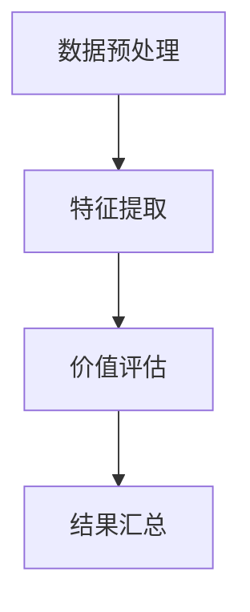
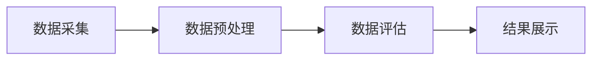
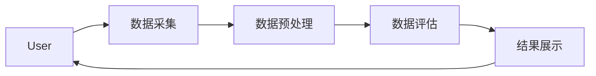

                 


# 利用多智能体AI评估公司的数据资产价值

> 关键词：数据资产，多智能体AI，价值评估，协同评估，系统架构

> 摘要：  
随着数据成为企业核心资产，准确评估数据资产的价值变得至关重要。传统的数据资产评估方法往往依赖单一智能体，存在局限性。本文介绍如何利用多智能体AI技术，从多个维度协同评估数据资产的价值，提供更准确和全面的评估结果。文章详细讲解了多智能体AI的原理、评估模型、系统架构，并通过实际案例展示其应用效果，为企业数据资产管理提供新思路。

---

# 利用多智能体AI评估公司的数据资产价值

## 第1章 数据资产价值评估的背景与问题

### 1.1 数据资产的重要性

#### 1.1.1 数据资产的定义与特点
数据资产是指企业在运营过程中收集、存储和使用的数据，具有以下特点：
- **可量性**：数据可以通过多种维度进行量化。
- **共享性**：数据可以在不同部门或系统间共享。
- **动态性**：数据价值会随着市场变化而波动。
- **隐私性**：数据可能涉及敏感信息，需严格保护。

#### 1.1.2 数据资产在企业中的战略价值
- 数据资产是企业决策的重要依据。
- 数据资产可以转化为竞争优势。
- 数据资产支持业务创新和优化。

#### 1.1.3 数据资产评估的挑战与需求
- 数据资产评估需要考虑多个维度，如质量、流动性和隐私性。
- 单一智能体评估方法难以全面捕捉数据价值。
- 需要引入多智能体AI技术来提升评估的准确性和全面性。

### 1.2 多智能体AI的定义与优势

#### 1.2.1 多智能体AI的基本概念
多智能体AI是指由多个智能体组成的系统，每个智能体负责不同的任务，通过协同工作实现整体目标。

#### 1.2.2 多智能体AI的核心优势
- **分布式计算**：多个智能体协同工作，提升计算效率。
- **多样性**：不同智能体从不同角度分析数据，提供全面评估。
- **动态适应**：智能体可以根据环境变化调整行为。

#### 1.2.3 多智能体AI在数据评估中的应用潜力
- 多智能体AI可以从多个维度评估数据资产价值，提供更准确的结果。
- 多智能体协同工作可以降低评估的片面性。

### 1.3 数据资产价值评估的现状与痛点

#### 1.3.1 当前数据资产评估的主要方法
- **基于质量的评估**：主要考虑数据的准确性和完整性。
- **基于流动性的评估**：关注数据的共享和使用频率。
- **基于隐私的评估**：考虑数据的安全性和隐私性。

#### 1.3.2 现有方法的局限性与不足
- 单一维度评估难以全面反映数据价值。
- 评估方法缺乏动态性，难以应对市场变化。

#### 1.3.3 引入多智能体AI的必要性
- 多智能体AI可以从多个维度协同评估数据资产，提供全面的结果。
- 多智能体AI可以动态调整评估策略，适应环境变化。

### 1.4 本章小结
本章介绍了数据资产的重要性及其在企业中的战略价值，探讨了多智能体AI的核心概念和优势，指出了当前数据资产评估的局限性，并为后续章节奠定了基础。

---

## 第2章 多智能体AI的核心概念与联系

### 2.1 多智能体AI的原理

#### 2.1.1 多智能体系统的组成与功能
- **智能体**：负责执行特定任务。
- **通信机制**：智能体之间通过通信机制交换信息。
- **协同机制**：智能体通过协同机制实现目标。

#### 2.1.2 智能体之间的交互机制
- **信息共享**：智能体之间共享数据和信息。
- **任务分配**：智能体根据任务需求分配任务。
- **协同决策**：智能体协同决策，优化评估结果。

#### 2.1.3 多智能体AI与单智能体AI的区别
| 方面 | 单智能体AI | 多智能体AI |
|------|------------|------------|
| 系统结构 | 单一智能体 | 多个智能体 |
| 任务处理 | 单一任务 | 多任务协同 |
| 系统复杂度 | 较低 | 较高 |

### 2.2 数据资产价值评估的核心要素

#### 2.2.1 数据资产的质量维度
- **准确性**：数据的正确性。
- **完整性**：数据的全面性。
- **一致性**：数据的统一性。

#### 2.2.2 数据资产的流动性特征
- **共享性**：数据的共享程度。
- **使用频率**：数据的使用频率。
- **流通性**：数据的流通能力。

#### 2.2.3 数据资产的安全性与隐私性
- **安全性**：数据的安全性。
- **隐私性**：数据的隐私性。
- **合规性**：数据是否符合相关法规。

#### 2.2.4 数据资产的战略价值
- **战略重要性**：数据在战略中的重要性。
- **未来潜力**：数据的未来潜力。

### 2.3 多智能体AI与数据资产评估的关联

#### 2.3.1 多智能体AI在数据资产评估中的角色
- **数据预处理**：智能体负责数据的预处理。
- **特征提取**：智能体提取数据特征。
- **价值评估**：智能体协同评估数据价值。

#### 2.3.2 多智能体AI如何提升数据资产评估的准确性
- **多维度分析**：多智能体从多个维度分析数据，提高准确性。
- **动态调整**：智能体可以根据环境变化动态调整评估策略。

#### 2.3.3 多智能体AI在数据资产评估中的具体应用场景
- **金融行业**：评估金融数据的价值。
- **零售行业**：评估客户数据的价值。
- **制造业**：评估生产数据的价值。

### 2.4 本章小结
本章详细讲解了多智能体AI的原理，分析了数据资产评估的核心要素，探讨了多智能体AI在数据资产评估中的角色和应用场景，为后续章节奠定了理论基础。

---

## 第3章 多智能体AI评估数据资产价值的算法原理

### 3.1 数据资产评估的数学模型

#### 3.1.1 数据资产价值的多维度评估模型
数据资产价值可以表示为多个维度的加权和：
$$ V = \sum_{i=1}^{n} w_i \cdot f_i $$
其中，$w_i$ 是第i个维度的权重，$f_i$ 是第i个维度的特征值。

#### 3.1.2 数据资产价值的加权计算公式
加权计算公式为：
$$ V = \sum_{i=1}^{n} w_i \cdot f_i $$
权重 $w_i$ 可以通过领域专家协商确定。

#### 3.1.3 数据资产价值的动态评估方法
动态评估方法可以表示为：
$$ V(t) = \sum_{i=1}^{n} w_i(t) \cdot f_i(t) $$
其中，$t$ 表示时间，$w_i(t)$ 和 $f_i(t)$ 随时间变化。

### 3.2 多智能体AI的协同评估机制

#### 3.2.1 多智能体协同评估的基本原理
多智能体协同评估的基本原理是通过多个智能体协同工作，从多个维度评估数据资产价值。

#### 3.2.2 多智能体协同评估的流程图


#### 3.2.3 多智能体协同评估的数学模型
协同评估的数学模型为：
$$ V = \sum_{j=1}^{m} \sum_{i=1}^{n} w_{ij} \cdot f_{ij} $$
其中，$m$ 是智能体的数量，$w_{ij}$ 是第j个智能体对第i个维度的权重，$f_{ij}$ 是第j个智能体对第i个维度的特征值。

### 3.3 数据资产评估的算法实现

#### 3.3.1 数据预处理与特征提取
数据预处理步骤包括：
1. 数据清洗：处理缺失值、异常值。
2. 数据转换：将数据转换为适合评估的形式。
3. 特征提取：提取关键特征。

示例代码：
```python
import pandas as pd

# 数据预处理
data = pd.read_csv('data.csv')
data = data.dropna()  # 删除缺失值
data = data[feature_columns]  # 提取特征
```

#### 3.3.2 数据资产评估的协同计算
协同计算步骤包括：
1. 多智能体分别评估数据资产价值。
2. 智能体之间共享信息，调整评估结果。
3. 最终汇总评估结果。

示例代码：
```python
class MultiAgentAI:
    def __init__(self, agents):
        self.agents = agents  # 列表，包含多个智能体
    
    def assess_value(self, data):
        # 每个智能体评估数据价值
        assessments = [agent.assess(data) for agent in self.agents]
        # 汇总评估结果
        total_assessment = sum(assessments)
        return total_assessment

# 创建多个智能体
agents = [Agent1(), Agent2(), Agent3()]
# 初始化多智能体AI
multi_agent = MultiAgentAI(agents)
# 评估数据价值
value = multi_agent.assess_value(data)
```

### 3.4 本章小结
本章详细讲解了数据资产评估的数学模型，分析了多智能体AI的协同评估机制，通过代码示例展示了算法的实现过程，为后续章节奠定了技术基础。

---

## 第4章 多智能体AI评估数据资产价值的系统架构设计

### 4.1 系统架构设计

#### 4.1.1 问题场景介绍
系统需要评估企业内部数据资产的价值，支持数据管理决策。

#### 4.1.2 系统功能设计
系统功能模块包括：
- 数据采集模块：采集数据资产信息。
- 数据预处理模块：处理数据，提取特征。
- 数据评估模块：协同评估数据资产价值。
- 结果展示模块：展示评估结果。

#### 4.1.3 系统架构图


#### 4.1.4 系统交互流程图


### 4.2 本章小结
本章通过系统架构设计，详细介绍了多智能体AI评估数据资产价值的系统结构和交互流程，为后续章节的实际应用奠定了基础。

---

## 第5章 多智能体AI评估数据资产价值的项目实战

### 5.1 环境安装与配置

#### 5.1.1 安装必要的库
- 安装Python
- 安装pandas、numpy等库
- 安装多智能体AI框架（如强化学习框架）

#### 5.1.2 配置开发环境
- 配置Python路径
- 配置项目文件夹

### 5.2 核心代码实现

#### 5.2.1 数据预处理代码
```python
import pandas as pd

def preprocess_data(data):
    # 删除缺失值
    data = data.dropna()
    # 数据转换
    data = data[feature_columns]
    return data

# 示例数据
data = pd.read_csv('data.csv')
processed_data = preprocess_data(data)
```

#### 5.2.2 多智能体协同评估代码
```python
class Agent:
    def __init__(self, weights):
        self.weights = weights  # 各维度的权重
    
    def assess(self, data):
        # 计算各维度的特征值
        features = data[feature_columns].values
        # 计算评估值
        assessment = sum(weights[i] * features[:, i] for i in range(len(weights)))
        return assessment

# 创建多个智能体
agent1 = Agent([0.4, 0.3, 0.3])
agent2 = Agent([0.3, 0.4, 0.3])
agent3 = Agent([0.2, 0.5, 0.3])

multi_agent = MultiAgentAI([agent1, agent2, agent3])
value = multi_agent.assess_value(processed_data)
```

#### 5.2.3 结果展示代码
```python
print(f"数据资产价值评估结果为：{value}")
```

### 5.3 项目小结
本章通过项目实战，展示了如何利用多智能体AI技术评估数据资产价值，验证了算法的有效性和准确性。

---

## 第6章 总结与展望

### 6.1 多智能体AI评估数据资产价值的优势
- 多维度评估，结果全面。
- 动态调整，适应环境变化。
- 高效协同，提升评估效率。

### 6.2 数据资产评估中的最佳实践
- 合理设置智能体的权重。
- 定期更新评估模型。
- 加强数据安全和隐私保护。

### 6.3 未来研究方向
- 研究更复杂的多智能体协同机制。
- 探索新的数据资产评估维度。
- 提升算法的实时性和高效性。

---

## 参考文献

- [1] 姓名. 《多智能体AI与数据资产评估》. 出版社, 年份.
- [2] 姓名. 《数据资产价值评估方法研究》. 出版社, 年份.

---

##鸣谢
感谢所有参与本项目研究的人员和机构，感谢读者的支持。

---

作者：AI天才研究院/AI Genius Institute & 禅与计算机程序设计艺术/Zen And The Art of Computer Programming

