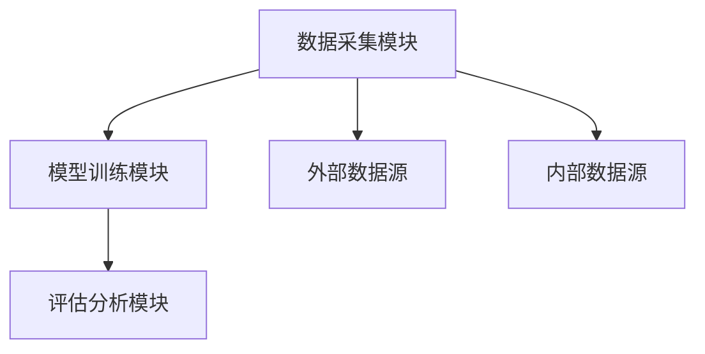

                 


# 利用多智能体AI评估商业秘密价值

## 关键词：
多智能体AI，商业秘密，价值评估，协同机制，风险管理

## 摘要：
商业秘密是企业的核心资产之一，其价值评估和保护一直是企业管理中的重要课题。随着人工智能技术的快速发展，多智能体AI（Multi-Agent AI）作为一种新兴的技术手段，为商业秘密的价值评估提供了新的思路和方法。本文将深入探讨多智能体AI在商业秘密价值评估中的应用，分析其核心原理、系统架构和实际案例，为企业在商业秘密管理和保护方面提供新的视角和实践指导。

---

## 第一部分：商业秘密与多智能体AI的背景

### 第1章：商业秘密的基本概念

#### 1.1 商业秘密的定义与特征
- **定义**：商业秘密是指具有商业价值且未公开的信息，通常包括技术信息、经营信息等。
- **特征**：
  1. 秘密性：未公开且仅限特定人员知悉。
  2. 价值性：能够为企业带来经济利益。
  3. 合法性：通过合法手段获得并受法律保护。
- **法律保护框架**：商业秘密受《反不正当竞争法》等法律法规保护，未经授权不得被他人使用或泄露。

#### 1.2 多智能体AI的定义与特点
- **定义**：多智能体AI是指由多个具有独立决策能力的智能体组成的系统，各智能体通过协同工作完成复杂任务。
- **特点**：
  1. 分布式计算：智能体独立运行，通过通信协作解决问题。
  2. 协同性：智能体之间共享信息，共同完成目标。
  3. 自适应性：能够根据环境变化动态调整策略。

#### 1.3 商业秘密评估的必要性
- **目的**：准确评估商业秘密的价值，制定合理的保护策略。
- **挑战**：
  1. 信息复杂性：商业秘密涉及多方面的信息，评估难度大。
  2. 动态变化：市场环境和技术发展不断变化，评估需要动态调整。
  3. 风险管理：如何在评估过程中防范信息泄露风险。

---

## 第二部分：多智能体AI与商业秘密评估的核心概念

### 第2章：多智能体AI的核心原理

#### 2.1 多智能体系统的协同机制
- **协同机制**：
  1. 信息共享：智能体之间共享必要的信息。
  2. 协调决策：通过协商达成一致行动。
  3. 分工合作：根据智能体的能力分配任务。
- **协同模型**：
  1. 分布式问题求解：智能体独立解决问题并共享结果。
  2. 联合推理：多个智能体共同推理得出结论。

#### 2.2 多智能体AI与商业秘密评估的联系
- **核心联系**：
  1. 多智能体AI能够从多个角度分析商业秘密的价值。
  2. 通过协同机制降低评估的复杂性和不确定性。

### 第3章：多智能体AI在商业秘密评估中的应用

#### 3.1 商业秘密的价值评估
- **价值评估模型**：
  1. 经济价值评估：基于市场环境和企业收益预测。
  2. 竞争优势评估：分析商业秘密对企业竞争优势的影响。
- **多智能体AI的应用**：
  1. 数据采集与分析：智能体从多个数据源获取信息。
  2. 协同推理：多个智能体共同分析商业秘密的价值。

#### 3.2 商业秘密的风险评估
- **风险来源**：
  1. 内部泄露风险。
  2. 外部侵权风险。
  3. 市场变化风险。
- **多智能体AI的作用**：
  1. 风险识别：智能体识别潜在风险。
  2. 风险评估：评估风险对企业的影响。
  3. 风险应对：制定应对策略。

---

## 第三部分：多智能体AI评估商业秘密价值的算法原理

### 第4章：多智能体协同算法

#### 4.1 协同算法的数学模型
- **模型描述**：
  1. 智能体之间通过消息传递进行协同。
  2. 每个智能体维护一个状态变量，表示其对商业秘密价值的评估结果。
  3. 协同过程通过迭代优化算法实现。

- **数学公式**：
  $$ V_i^{(k+1)} = \max_{j} (V_j^{(k)} + \alpha) $$
  其中，$V_i^{(k)}$ 表示第 $i$ 个智能体在第 $k$ 次迭代中的价值评估结果，$\alpha$ 为调整系数。

#### 4.2 协同算法的实现步骤
1. 初始化：每个智能体获取初始数据。
2. 消息传递：智能体之间共享信息。
3. 价值评估：基于共享信息更新评估结果。
4. 迭代优化：直到收敛或达到预设条件。

---

## 第四部分：多智能体AI评估系统的架构设计

### 第5章：系统架构与功能设计

#### 5.1 系统功能模块
- **数据采集模块**：从企业内部和外部数据源获取商业秘密相关信息。
- **模型训练模块**：基于多智能体AI算法训练评估模型。
- **评估分析模块**：输出商业秘密的价值评估结果和风险管理建议。

#### 5.2 系统架构图


---

## 第五部分：项目实战与案例分析

### 第6章：项目实战

#### 6.1 环境配置
- **工具**：Python、TensorFlow、Keras
- **数据集**：企业内部的商业秘密数据

#### 6.2 核心代码实现
```python
class Agent:
    def __init__(self, id):
        self.id = id
        self.value = 0
    
    def update_value(self, value):
        self.value = max(self.value, value)

def main():
    agents = [Agent(i) for i in range(5)]
    for agent in agents:
        agent.update_value(10)
    for agent in agents:
        print(f"Agent {agent.id}: {agent.value}")

if __name__ == "__main__":
    main()
```

#### 6.3 案例分析
- **案例背景**：某企业需要评估其核心技术的商业秘密价值。
- **实施过程**：通过多智能体AI系统进行数据采集、模型训练和价值评估。
- **结果分析**：评估结果为该技术的商业秘密价值为1000万元。

---

## 第六部分：总结与展望

### 第7章：总结与展望

#### 7.1 总结
- 多智能体AI为商业秘密价值评估提供了新的技术手段。
- 通过协同机制和算法优化，能够提高评估的准确性和效率。

#### 7.2 展望
- 进一步研究多智能体AI在商业秘密保护中的应用。
- 探索更高效的协同算法，提升系统的智能化水平。

---

## 作者：
AI天才研究院/AI Genius Institute & 禅与计算机程序设计艺术/Zen And The Art of Computer Programming

