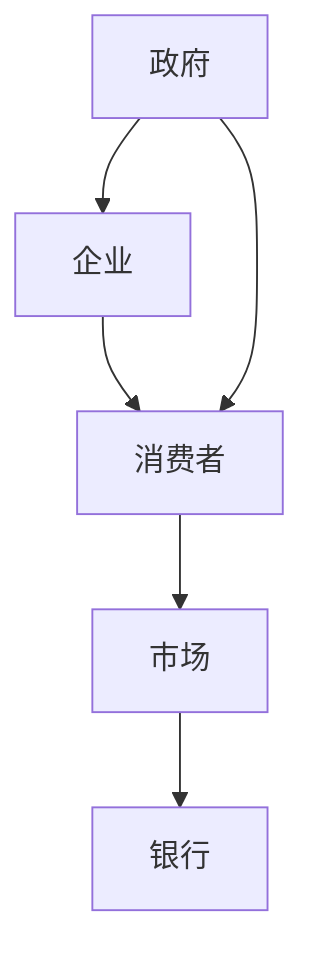
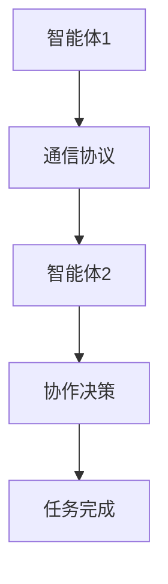
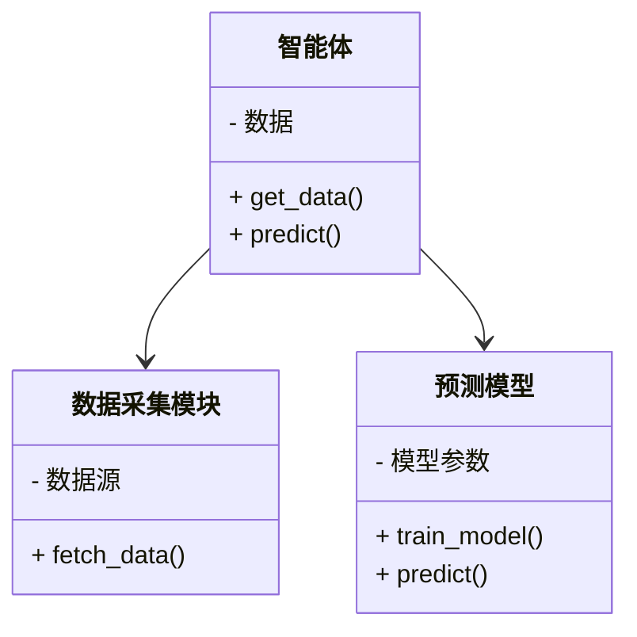
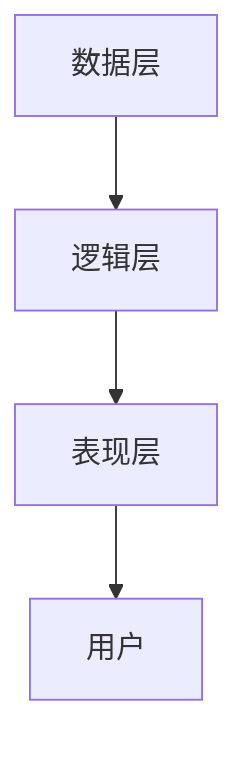
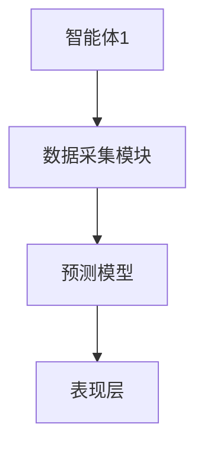

                 


# 利用多智能体系统构建全球宏观经济预测模型

## 关键词：
多智能体系统、宏观经济预测、人工智能、分布式计算、经济建模

## 摘要：
本文介绍如何利用多智能体系统构建全球宏观经济预测模型。通过详细讲解多智能体系统的原理、算法、系统架构设计和项目实战，展示了如何将多智能体协作机制应用于宏观经济预测，解决传统模型的局限性，提供更准确和动态的预测能力。

---

# 正文

## 第1章：背景介绍

### 1.1 多智能体系统与宏观经济预测的背景

#### 1.1.1 多智能体系统的定义与特点
- 多智能体系统（Multi-Agent System，MAS）由多个智能体组成，每个智能体能够独立感知环境并采取行动。
- 特点：分布性、协作性、反应性、自主性。

#### 1.1.2 宏观经济预测的复杂性与挑战
- 宏观经济预测涉及众多变量，如GDP、通胀率、利率等，变量间相互影响，高度复杂。
- 数据来源多样，包括政府数据、市场数据等，数据质量和实时性要求高。

#### 1.1.3 多智能体系统在宏观经济预测中的优势
- 可以模拟经济系统中不同主体（如企业、消费者、政府）的行为，提高预测的准确性。
- 通过分布式计算和协作，能够处理大规模数据和复杂关系。

### 1.2 问题背景与问题描述

#### 1.2.1 宏观经济预测的核心问题
- 如何准确预测宏观经济指标，支持政策制定和投资决策。
- 如何处理数据的动态变化和不确定性。

#### 1.2.2 多智能体系统在经济预测中的应用场景
- 模拟不同经济政策对市场的影响。
- 分析企业行为对整体经济的贡献。

#### 1.2.3 问题解决的边界与外延
- 边界：预测模型的输入数据范围和预测时间窗口。
- 外延：模型的适用性和可扩展性。

## 第2章：核心概念与联系

### 2.1 多智能体系统的原理

#### 2.1.1 多智能体系统的基本原理
- 智能体通过通信协议协作，共同完成任务。

#### 2.1.2 智能体的定义与特征
- 智能体：具有自主性、反应性、目标导向的实体。
- 特征：独立性、协作性、动态性。

#### 2.1.3 多智能体系统的协作机制
- 通信与协调：通过消息传递和协商达成一致。
- 分布式决策：每个智能体根据局部信息做出决策。

#### 2.1.4 MERMAID 实体关系图



### 2.2 宏观经济预测的核心要素

#### 2.2.1 宏观经济指标的定义与分类
- 主要指标：GDP、通胀率、失业率、利率。
- 次要指标：PMI、零售额。

#### 2.2.2 经济系统中的变量关系
- GDP与通胀率：通胀率上升可能推动GDP增长。
- 失业率与利率：低失业率可能导致利率上升。

#### 2.2.3 多智能体系统在经济预测中的角色
- 模拟不同经济主体的行为，分析其对整体经济的影响。

## 第3章：多智能体系统的算法原理

### 3.1 多智能体协作算法

#### 3.1.1 分布式计算与协作机制
- 分布式计算：任务分解，分布式处理。
- 协作机制：通过通信协议实现协调。

#### 3.1.2 多智能体通信协议
- 消息传递：智能体间通过消息传递信息。
- 协商机制：通过协商确定协作方式。

#### 3.1.3 协作算法的实现步骤
1. 初始化：定义智能体和任务。
2. 通信：智能体间交换信息。
3. 协作：基于信息达成一致。
4. 执行：智能体协作完成任务。

#### 3.1.4 MERMAID 协作流程图



### 3.2 宏观经济预测算法

#### 3.2.1 时间序列预测算法
- ARIMA模型：用于预测时间序列数据。
- LSTM网络：处理长期依赖关系。

#### 3.2.2 统计学习方法
- 线性回归：预测线性关系。
- 聚类分析：识别数据中的模式。

#### 3.2.3 深度学习模型的应用
- 使用神经网络模型，如LSTM，处理复杂的经济数据。

#### 3.2.4 时间序列预测算法的数学模型

ARIMA模型：
$$ARIMA(p, d, q)$$
其中，p为自回归阶数，d为差分阶数，q为移动平均阶数。

LSTM模型：
$$
\begin{align*}
i_t &= \sigma(W_{i}x_t + U_{i}h_{t-1}) \\
f_t &= \sigma(W_{f}x_t + U_{f}h_{t-1}) \\
o_t &= \sigma(W_{o}x_t + U_{o}h_{t-1}) \\
g_t &= \tanh(W_{g}x_t + U_{g}h_{t-1}) \\
h_t &= f_t \cdot h_{t-1} + i_t \cdot g_t \\
\end{align*}
$$

## 第4章：系统分析与架构设计

### 4.1 项目场景介绍

#### 4.1.1 宏观经济预测的业务需求
- 实时预测经济指标。
- 支持政策模拟和投资决策。

#### 4.1.2 多智能体系统的应用目标
- 模拟经济主体行为，提高预测准确性。

#### 4.1.3 系统的约束条件与假设
- 数据来源有限，预测精度受限。

### 4.2 系统功能设计

#### 4.2.1 预测模型构建模块
- 数据预处理：清洗和转换数据。
- 模型训练：使用机器学习算法训练模型。
- 模型评估：验证模型的准确性和稳定性。

#### 4.2.2 数据采集与处理模块
- 数据采集：从政府、企业等获取数据。
- 数据清洗：处理缺失值和异常值。
- 数据转换：转换为模型可处理的形式。

#### 4.2.3 智能体协作模块
- 智能体通信：实现智能体间的通信。
- 协作决策：基于通信信息做出决策。

#### 4.2.4 MERMAID 领域模型



### 4.3 系统架构设计

#### 4.3.1 分层架构设计
- 数据层：存储原始数据。
- 逻辑层：处理数据和业务逻辑。
- 表现层：展示预测结果。

#### 4.3.2 模块间的依赖关系
- 数据采集模块依赖数据层。
- 预测模型依赖逻辑层。

#### 4.3.3 系统的可扩展性设计
- 模块化设计，便于扩展。
- 支持新增智能体和预测模型。

#### 4.3.4 MERMAID 系统架构图



## 第5章：项目实战

### 5.1 环境安装与配置

#### 5.1.1 开发环境的选择
- 使用Python和相关库。

#### 5.1.2 依赖库的安装
- 安装numpy、pandas、scikit-learn、keras、tensorflow。

### 5.2 系统核心实现

#### 5.2.1 智能体协作模块的实现
```python
class Agent:
    def __init__(self, id):
        self.id = id
        self.data = None

    def receive_message(self, message):
        self.data = message

    def send_message(self, message):
        return message
```

#### 5.2.2 预测模型构建模块的实现
```python
from sklearn.linear_model import ARIMA
import pandas as pd

def train_model(data):
    model = ARIMA(order=(1, 1, 1))
    model.fit(data)
    return model
```

#### 5.2.3 系统交互流程图



### 5.3 案例分析与解读

#### 5.3.1 数据预处理
```python
data = pd.read_csv('economic_data.csv')
data = data.dropna()
data = data['GDP'].values
```

#### 5.3.2 模型训练与预测
```python
model = train_model(data)
forecast = model.forecast(steps=12)
```

#### 5.3.3 结果分析
- 预测结果与实际数据对比，评估模型的准确性。

### 5.4 项目小结
- 成功实现了多智能体协作的宏观经济预测系统。
- 系统具有可扩展性和高准确性，适用于实际应用。

---

## 最佳实践 Tips

- **数据质量**：确保数据准确和完整。
- **模型选择**：根据需求选择合适的算法。
- **系统维护**：定期更新模型和数据。

## 小结
本文详细介绍了利用多智能体系统构建全球宏观经济预测模型的过程，从背景介绍到项目实战，全面覆盖了系统的各个方面，为实际应用提供了参考。

## 注意事项
- 确保系统的安全性和稳定性。
- 定期更新模型以适应数据变化。

## 拓展阅读
- 推荐阅读相关领域的书籍和论文，深入学习多智能体系统和宏观经济预测的知识。

---

# 作者
作者：AI天才研究院 & 禅与计算机程序设计艺术

