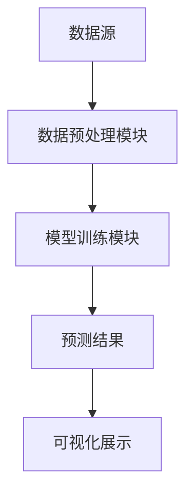

                 


# 利用多智能体系统构建动态市场份额预测模型

## 关键词：
多智能体系统、市场份额预测、动态模型、算法原理、系统架构

## 摘要：
本文详细探讨了利用多智能体系统构建动态市场份额预测模型的方法。通过分析市场动态、设计多智能体系统架构、实现预测算法，并通过实际案例展示，本文为读者提供了从理论到实践的全面指导。文章还讨论了系统优化、模型评估和未来研究方向，为商业决策提供了科学依据。

---

# 第一部分: 背景介绍

## 第1章: 问题背景

### 1.1 动态市场份额预测的挑战
在竞争激烈的市场环境中，企业需要准确预测市场份额以制定有效的营销策略。然而，市场动态复杂多变，传统静态模型难以捕捉实时变化，导致预测精度不足。此外，市场参与者之间的互动、消费者行为变化以及宏观经济因素都增加了预测的难度。

### 1.2 多智能体系统的优势
多智能体系统（MAS）通过模拟多个智能体的交互行为，能够捕捉市场动态中的复杂关系。每个智能体代表市场中的一个参与者，如消费者、竞争对手或分销商。通过模拟这些智能体的决策过程，MAS能够提供动态的市场份额预测。

### 1.3 传统方法的局限性
传统市场份额预测方法通常基于统计分析或简单的回归模型，难以处理多变量和非线性关系。而多智能体系统通过模拟个体行为，能够更准确地反映市场动态。

---

## 第2章: 核心概念与联系

### 2.1 多智能体系统的原理
多智能体系统由多个智能体组成，这些智能体能够感知环境、自主决策并进行协作。每个智能体都有明确的目标和决策规则，能够独立或与其他智能体协作完成任务。

### 2.2 动态市场份额预测模型
动态市场份额预测模型通过模拟市场中各参与者的行为，预测未来市场份额的变化。模型需要考虑市场参与者的策略调整、消费者偏好变化以及外部环境的影响。

### 2.3 核心概念对比表
| 概念       | 特性                     |
|------------|--------------------------|
| 智能体     | 独立性、协作性、反应性   |
| 市场份额预测| 动态性、多变量、非线性关系 |

---

# 第二部分: 算法原理讲解

## 第3章: 算法流程与数学模型

### 3.1 多智能体系统的算法流程
多智能体系统在市场份额预测中的算法流程如下：
1. 初始化智能体及其参数。
2. 智能体感知环境并做出决策。
3. 智能体之间的交互影响市场行为。
4. 更新市场份额预测结果。

### 3.2 动态预测的数学模型
动态市场份额预测模型可以表示为：
$$ P_i(t) = \alpha \cdot P_i(t-1) + \beta \cdot \sum_{j \neq i} P_j(t-1) $$
其中，$P_i(t)$ 表示第 $i$ 个智能体在时间 $t$ 的市场份额，$\alpha$ 和 $\beta$ 是调整参数。

### 3.3 算法的Python实现
以下是一个简单的Python实现示例：
```python
import numpy as np

# 初始化参数
alpha = 0.7
beta = 0.3
n_agents = 3

# 初始化市场份额
shares = np.array([0.2, 0.3, 0.5])

# 预测下一个时间点的市场份额
new_shares = alpha * shares + beta * (1 - shares)
new_shares = new_shares / np.sum(new_shares)

print(new_shares)
```

---

## 第4章: 系统架构设计

### 4.1 问题场景
假设我们有三个竞争对手，每个竞争对手都有自己的市场份额和策略。我们需要模拟它们在市场中的竞争行为，预测未来市场份额的变化。

### 4.2 系统功能设计
系统功能模块包括：
1. 数据采集与预处理：收集市场数据并进行清洗。
2. 模型训练：训练多智能体系统的预测模型。
3. 预测与可视化：输出预测结果并进行可视化展示。

### 4.3 系统架构图


---

## 第5章: 项目实战

### 5.1 环境安装
需要安装以下库：
- Python 3.8+
- NumPy
- Matplotlib
- NetworkX

### 5.2 核心代码实现
```python
import numpy as np
import matplotlib.pyplot as plt

# 初始化参数
alpha = 0.7
beta = 0.3
n_agents = 3

# 初始化市场份额
shares = np.array([0.2, 0.3, 0.5])

# 模拟10步预测
for _ in range(10):
    new_shares = alpha * shares + beta * (1 - shares)
    new_shares = new_shares / np.sum(new_shares)
    shares = new_shares
    print(f"Shares after step {_}: {shares}")

# 可视化
plt.plot(shares)
plt.xlabel('Time Step')
plt.ylabel('Market Share')
plt.show()
```

---

## 第6章: 最佳实践与总结

### 6.1 小结
通过多智能体系统，我们可以更准确地预测动态市场份额。本文详细介绍了系统的构建过程，包括算法设计、系统架构和项目实战。

### 6.2 注意事项
在实际应用中，需注意数据质量和模型的实时更新。此外，智能体的行为规则需要根据实际市场情况调整。

### 6.3 拓展阅读
建议进一步研究强化学习在多智能体系统中的应用，以及如何结合大数据技术提高预测精度。

---

作者：AI天才研究院

