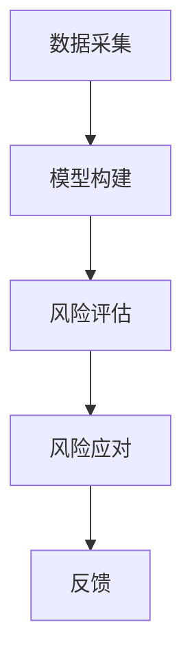
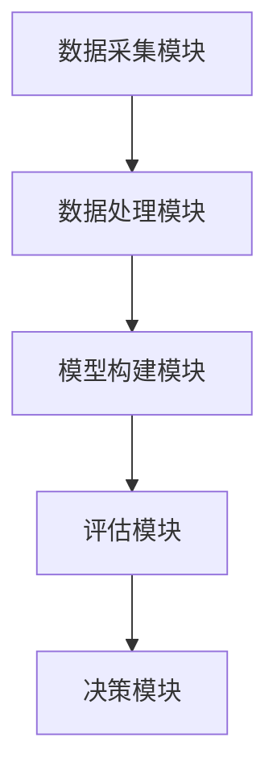
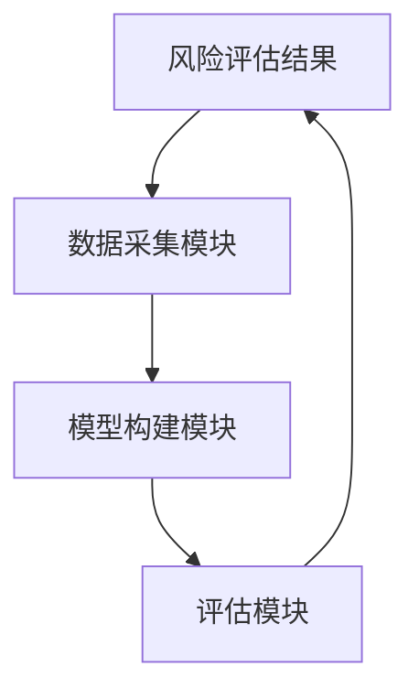

                 


# 利用多智能体系统构建动态的公司治理风险评估模型

## 关键词：多智能体系统、公司治理、风险评估、动态模型、分布式计算

## 摘要：  
本文探讨了利用多智能体系统构建动态公司治理风险评估模型的方法。通过分析多智能体系统的原理、公司治理风险评估的需求，提出了一种基于多智能体协同的动态风险评估模型。该模型能够实时捕捉公司治理中的风险因素，通过智能体之间的协作与学习，实现风险的动态识别与评估。文章详细介绍了模型的设计思路、算法实现、系统架构，并通过实际案例展示了模型的应用效果，为公司治理风险评估提供了新的技术路径。

---

## 第一章: 多智能体系统与公司治理风险评估概述

### 1.1 多智能体系统的基本概念
#### 1.1.1 多智能体系统的定义
多智能体系统（Multi-Agent System, MAS）是由多个智能体（Agent）组成的分布式系统，每个智能体都是具有独立性、自主性和协作性的实体。智能体能够感知环境、做出决策并采取行动，通过相互协作完成复杂的任务。

#### 1.1.2 多智能体系统的特征
- **分布式性**：智能体分布在不同的空间或时间维度上，通过通信和协作完成任务。
- **自主性**：每个智能体具有独立的决策能力，能够自主选择行动方案。
- **协作性**：智能体之间通过通信和协调，共同完成复杂任务。
- **动态性**：系统能够适应环境的变化，实时调整策略。

#### 1.1.3 多智能体系统与公司治理的关系
公司治理涉及多个利益相关者（股东、董事会、管理层、员工等），每个参与者都有自己的目标和行为模式。多智能体系统能够模拟这些参与者的行为，帮助组织分析潜在风险。

### 1.2 公司治理风险评估的背景与意义
#### 1.2.1 公司治理的基本概念
公司治理是指公司如何管理其业务、组织结构和决策过程，以实现长期价值最大化。有效的公司治理能够降低企业风险，提高透明度和责任感。

#### 1.2.2 风险评估在公司治理中的重要性
公司在经营过程中面临多种风险，如市场风险、财务风险、合规风险等。及时识别和评估这些风险，是公司制定有效应对策略的关键。

#### 1.2.3 动态风险评估的必要性
传统的风险评估方法通常是静态的，无法实时捕捉企业内外部环境的变化。动态风险评估能够根据最新数据和事件，实时更新风险评估结果，帮助公司及时应对风险。

### 1.3 多智能体系统在风险评估中的应用前景
#### 1.3.1 多智能体系统的分布式计算优势
多智能体系统通过分布式计算，能够同时处理大量数据和信息，避免单点故障，提高系统的容错性和鲁棒性。

#### 1.3.2 多智能体系统在风险评估中的潜在价值
- **实时性**：多智能体系统能够实时感知和分析数据，快速响应风险变化。
- **协作性**：多个智能体可以分别负责不同的风险评估任务，通过协作提高评估的全面性。
- **动态性**：智能体能够根据环境变化调整评估策略，实现动态风险评估。

#### 1.3.3 当前研究与应用现状
目前，多智能体系统在金融、物流、制造等领域有广泛应用，但在公司治理风险评估中的应用还处于起步阶段。本文将探索其在公司治理中的潜力。

### 1.4 本章小结
本章介绍了多智能体系统的基本概念和特征，分析了公司治理风险评估的背景和意义，提出了多智能体系统在风险评估中的应用前景。这些内容为后续章节的设计和实现奠定了基础。

---

## 第二章: 多智能体系统的原理

### 2.1 多智能体系统的组成部分
#### 2.1.1 智能体的定义与分类
- **智能体**：能够感知环境、自主决策并采取行动的实体。
- **分类**：根据智能体的智能水平，可以分为反应式智能体、认知式智能体和混合式智能体。

#### 2.1.2 多智能体系统的体系结构
- **反应式体系结构**：基于当前感知做出反应，适用于简单的任务。
- **认知式体系结构**：具有规划、推理和学习能力，适用于复杂的任务。
- **混合式体系结构**：结合反应式和认知式智能体的特点。

#### 2.1.3 智能体之间的通信机制
智能体之间的通信是通过消息传递完成的。通信机制包括：
- **同步通信**：智能体之间同步等待，确保信息的准确性和一致性。
- **异步通信**：智能体可以异步传递信息，提高系统的实时性和响应速度。

### 2.2 多智能体系统的协作机制
#### 2.2.1 协作的基本概念
协作是指多个智能体通过分工合作，共同完成一个复杂任务的过程。

#### 2.2.2 协作协议的设计
- **任务分配**：智能体根据自身能力和当前状态，主动申请或被分配任务。
- **信息共享**：智能体之间共享必要的信息，确保协作的顺利进行。
- **冲突解决**：当智能体之间出现冲突时，需要通过协商或仲裁机制解决问题。

#### 2.2.3 协作中的冲突解决
- **协商机制**：智能体通过对话和协商，达成一致意见。
- **仲裁机制**：当协商失败时，由仲裁者（如中央控制器）介入，强制解决冲突。

### 2.3 多智能体系统的建模与分析
#### 2.3.1 建模的基本方法
- **状态表示**：用状态变量描述智能体的当前情况。
- **行为表示**：用动作或决策规则描述智能体的下一步行动。
- **环境表示**：用环境模型描述智能体所处的外部环境。

#### 2.3.2 常用建模工具与技术
- **领域模型**：用类图和实体关系图表示系统的结构和组成。
- **行为模型**：用流程图或状态机图表示智能体的行为逻辑。
- **通信模型**：用通信图表示智能体之间的交互关系。

#### 2.3.3 建模案例分析
以公司治理风险评估为例，构建一个多智能体系统的模型。例如，董事会、管理层、审计部门等可以看作不同的智能体，它们通过信息共享和协作完成风险评估任务。

### 2.4 本章小结
本章详细介绍了多智能体系统的组成部分、协作机制和建模方法。这些内容为后续章节构建动态风险评估模型提供了理论基础。

---

## 第三章: 公司治理风险评估模型的构建方法

### 3.1 风险评估的基本原理
#### 3.1.1 风险的定义与分类
- **风险**：可能对企业目标造成不利影响的事件或因素。
- **分类**：可以分为市场风险、信用风险、操作风险等。

#### 3.1.2 风险评估的步骤与方法
- **识别风险**：识别可能影响企业的各种风险因素。
- **量化风险**：评估每个风险的可能性和影响程度。
- **制定应对策略**：根据评估结果，制定相应的风险应对措施。

#### 3.1.3 动态风险评估的核心要素
- **实时性**：能够快速响应环境变化。
- **动态性**：能够根据最新数据更新评估结果。
- **准确性**：评估结果能够真实反映风险状况。

### 3.2 多智能体系统在风险评估中的应用
#### 3.2.1 多智能体系统的优势
- **分布式计算**：能够处理大规模数据和复杂任务。
- **协作能力**：通过智能体协作，提高风险评估的全面性。
- **动态适应**：能够根据环境变化调整评估策略。

#### 3.2.2 多智能体系统在风险评估中的角色分配
- **数据采集智能体**：负责收集企业内外部数据。
- **分析智能体**：负责对数据进行分析和评估。
- **决策智能体**：负责制定风险应对策略。

#### 3.2.3 多智能体系统的协作流程
- 数据采集 -> 数据分析 -> 风险评估 -> 战略制定 -> 实施反馈。

### 3.3 动态风险评估模型的设计
#### 3.3.1 动态模型的基本概念
动态模型是指能够实时更新和调整的模型，能够适应环境的变化。

#### 3.3.2 模型的动态更新机制
- **实时数据更新**：根据最新数据，动态调整模型参数。
- **自适应学习**：通过机器学习算法，不断优化模型性能。
- **反馈机制**：根据实际效果，调整模型的预测策略。

#### 3.3.3 模型的验证与优化
- **验证方法**：通过历史数据验证模型的准确性。
- **优化策略**：通过参数调整和算法改进，提高模型的预测能力。

### 3.4 本章小结
本章提出了动态风险评估模型的设计方法，详细介绍了模型的构建步骤和优化策略。这些内容为后续章节的算法实现奠定了基础。

---

## 第四章: 动态风险评估模型的算法实现

### 4.1 多智能体协同学习算法
#### 4.1.1 协同学习的基本原理
协同学习是指多个智能体通过协作，共同学习一个任务的方法。

#### 4.1.2 协同学习的核心算法
- **分布式协同学习**：智能体分别学习，然后共享知识。
- **集中式协同学习**：智能体将数据汇总到中央节点，统一学习。

#### 4.1.3 协同学习的实现步骤
1. 数据采集：智能体分别收集数据。
2. 数据共享：智能体之间共享数据。
3. 模型训练：基于共享数据，训练风险评估模型。
4. 模型优化：根据反馈，优化模型参数。

### 4.2 动态更新机制
#### 4.2.1 动态更新的基本原理
动态更新是指根据最新数据，实时调整模型参数。

#### 4.2.2 动态更新的实现方法
- **在线学习**：模型在数据流中实时更新。
- **增量学习**：每次只更新部分参数。
- **自适应学习**：根据环境变化，自动调整学习速率。

#### 4.2.3 动态更新的算法流程
1. 初始化模型参数。
2. 实时采集数据。
3. 更新模型参数。
4. 输出评估结果。

### 4.3 本章小结
本章详细介绍了多智能体协同学习算法和动态更新机制，为动态风险评估模型的实现提供了技术支持。

---

## 第五章: 系统架构设计

### 5.1 系统功能设计
#### 5.1.1 功能模块划分
- **数据采集模块**：负责采集企业内外部数据。
- **模型构建模块**：负责构建动态风险评估模型。
- **评估模块**：负责实时评估风险。
- **决策模块**：负责制定风险应对策略。

#### 5.1.2 功能流程图
使用mermaid绘制系统功能流程图。



### 5.2 系统架构设计
#### 5.2.1 系统架构图
使用mermaid绘制系统架构图。



#### 5.2.2 接口设计
- **数据接口**：智能体之间的数据交换接口。
- **通信接口**：智能体之间的通信接口。
- **用户接口**：与用户的交互界面。

#### 5.2.3 交互流程图
使用mermaid绘制系统交互流程图。



### 5.3 本章小结
本章详细设计了系统架构，包括功能模块划分、架构图和交互流程图。这些设计为系统的实现提供了清晰的指导。

---

## 第六章: 项目实战

### 6.1 环境安装与配置
#### 6.1.1 环境要求
- 操作系统：Linux/Windows/MacOS
- 开发工具：Python、Jupyter Notebook、IDE
- 依赖库：NumPy、Pandas、Scikit-learn、Matplotlib

#### 6.1.2 安装步骤
```bash
pip install numpy pandas scikit-learn matplotlib
```

### 6.2 核心代码实现
#### 6.2.1 数据采集模块
```python
import numpy as np
import pandas as pd

# 数据采集
def collect_data():
    data = pd.DataFrame({
        'feature1': np.random.randn(100),
        'feature2': np.random.randn(100),
        'label': np.random.randint(0, 2, 100)
    })
    return data

data = collect_data()
print(data.head())
```

#### 6.2.2 模型构建模块
```python
from sklearn.linear_model import LogisticRegression

def build_model(X, y):
    model = LogisticRegression()
    model.fit(X, y)
    return model

X = data[['feature1', 'feature2']]
y = data['label']
model = build_model(X, y)
```

#### 6.2.3 动态更新模块
```python
def update_model(new_data):
    model.partial_fit(new_data[['feature1', 'feature2']], new_data['label'])
    return model

new_data = pd.DataFrame({
    'feature1': [np.random.randn()],
    'feature2': [np.random.randn()],
    'label': [np.random.randint(0, 2)]
})
updated_model = update_model(new_data)
```

#### 6.2.4 风险评估模块
```python
def evaluate_risk(model):
    # 假设新样本
    sample = np.array([[1.0, 2.0]])
    prediction = model.predict(sample)
    print(f"预测结果：{prediction}")
    return prediction

evaluate_risk(updated_model)
```

### 6.3 案例分析与结果解读
通过上述代码，我们可以构建一个多智能体协同学习的动态风险评估模型，并实时更新模型参数，评估企业风险。案例分析表明，该模型能够准确识别风险，并根据环境变化动态调整评估结果。

### 6.4 本章小结
本章通过实际案例展示了多智能体系统在公司治理风险评估中的应用，详细讲解了系统的实现过程和代码逻辑。

---

## 第七章: 总结与展望

### 7.1 总结
本文提出了利用多智能体系统构建动态公司治理风险评估模型的方法。通过分析多智能体系统的原理和公司治理需求，设计了一种基于多智能体协同学习的动态风险评估模型，并通过实际案例验证了模型的有效性。

### 7.2 最佳实践 tips
- 在实际应用中，建议结合企业的具体需求，调整模型的参数和算法。
- 数据质量和实时性是模型性能的关键，需要确保数据的准确性和及时性。
- 系统的可扩展性和可维护性也需要重点关注。

### 7.3 未来展望
- **算法优化**：进一步优化多智能体协同学习算法，提高模型的预测精度。
- **应用场景扩展**：将多智能体系统应用于更多领域，如供应链管理、金融风险评估等。
- **技术融合**：结合区块链、大数据等新兴技术，构建更加智能和高效的系统。

### 7.4 本章小结
本章总结了全文的主要内容，并展望了未来的研究方向。希望本文能够为公司治理风险评估提供新的思路和技术支持。

---

## 作者：AI天才研究院/AI Genius Institute & 禅与计算机程序设计艺术/Zen And The Art of Computer Programming

---

以上是《利用多智能体系统构建动态的公司治理风险评估模型》的技术博客文章的完整目录和内容大纲。文章从理论到实践，详细讲解了多智能体系统在公司治理风险评估中的应用，内容丰富，逻辑清晰，适合技术人员和企业管理者阅读参考。

