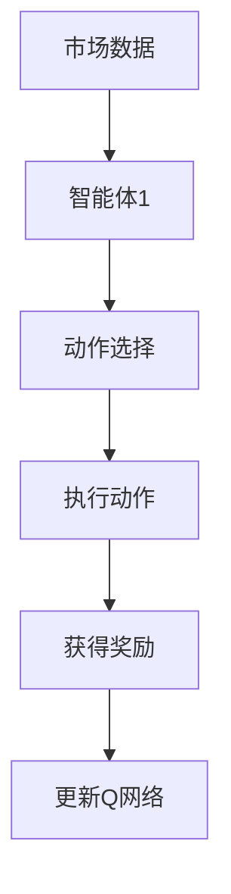
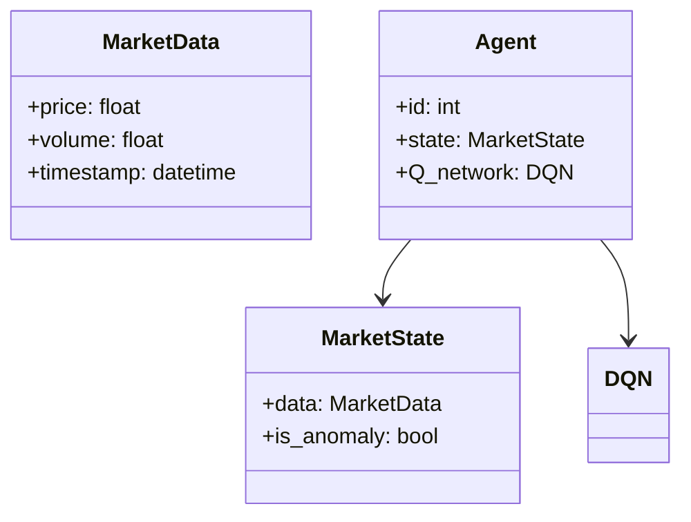
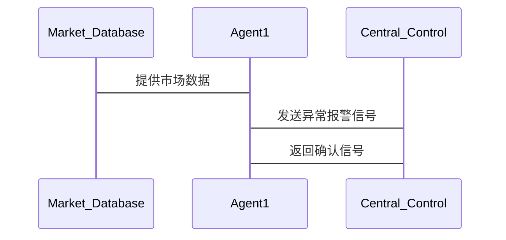

                 


# 《利用多智能体系统构建动态的市场异常检测模型》

> 关键词：多智能体系统、市场异常检测、强化学习、分布式计算、实时数据分析

> 摘要：本文探讨了利用多智能体系统构建动态市场异常检测模型的方法，从背景介绍、核心概念、算法原理到系统架构设计、项目实战及最佳实践，全面分析了多智能体系统在市场异常检测中的应用，提出了基于强化学习的分布式检测算法，并通过具体案例展示了模型的实现与优化。

---

## 第四章: 基于强化学习的异常检测算法

### 4.1 强化学习的基本原理

#### 4.1.1 强化学习的定义与特点
强化学习（Reinforcement Learning, RL）是一种机器学习范式，其中智能体通过与环境交互，学习如何采取一系列行动以最大化累积奖励。其核心在于通过试错学习，不断优化策略以达到目标。

#### 4.1.2 状态空间与动作空间
- **状态空间 (State Space)**：表示智能体所处环境的所有可能状态，例如市场的价格、交易量、波动率等。
- **动作空间 (Action Space)**：智能体在每个状态下可以执行的动作，例如发出警报、调整阈值等。

#### 4.1.3 奖励机制的设计
奖励机制是强化学习的关键，用于指导智能体的行为。例如：
- 当检测到真实异常时，奖励+1。
- 当误报或漏报时，奖励-1。

#### 4.1.4 策略优化方法
常用的策略优化方法包括：
- **Q-learning**：基于值函数的方法，通过更新Q表来学习最优策略。
- **Deep Q-Networks (DQN)**：使用深度神经网络近似Q值函数，解决高维状态空间的问题。

### 4.2 基于多智能体的强化学习模型

#### 4.2.1 多智能体强化学习的挑战
多智能体系统中，每个智能体需要协调行动，避免冲突，同时提高整体效率。主要挑战包括：
- **通信开销**：智能体之间需要频繁通信，增加计算开销。
- **策略同步**：多个智能体需要同步策略，确保协同工作。

#### 4.2.2 基于Q-learning的异常检测
设计一个分布式Q-learning算法，每个智能体负责监测市场的一个子空间，例如某个时间段或某种资产。当智能体检测到异常时，触发警报并调整其他智能体的阈值。

#### 4.2.3 基于DQN的动态市场建模
使用深度神经网络建模市场动态，通过经验回放（Experience Replay）和策略评估（Policy Evaluation）优化异常检测策略。例如：

**算法伪代码：**
```python
初始化Q网络和目标网络
while True:
    状态s = 获取市场数据
    动作a = Q网络预测的最佳动作
    执行动作a，获得奖励r和新状态s'
    将经验(s, a, r, s')存入经验回放池
    采样经验从回放池，训练Q网络
    更新目标网络
```

### 4.3 算法实现与优化

#### 4.3.1 算法的优化策略
- **经验回放**：通过随机采样历史经验，减少策略的短期相关性。
- **双Q技术**：通过两个Q网络交替更新，减少过估计问题。

#### 4.3.2 算法流程图


#### 4.3.3 算法实现代码
```python
import numpy as np
import tensorflow as tf

class DQN:
    def __init__(self, state_space, action_space):
        self.state_space = state_space
        self.action_space = action_space
        self.gamma = 0.99
        self.epsilon = 0.1
        self.batch_size = 64

        self.model = self.build_model()

    def build_model(self):
        model = tf.keras.Sequential([
            tf.keras.layers.Dense(32, activation='relu', input_dim=self.state_space),
            tf.keras.layers.Dense(32, activation='relu'),
            tf.keras.layers.Dense(self.action_space, activation='linear')
        ])
        model.compile(optimizer='adam', loss='mean_squared_error')
        return model

    def remember(self, state, action, reward, next_state):
        # 假设我们使用一个列表存储经验
        self.memory.append((state, action, reward, next_state))

    def act(self, state):
        if np.random.random() < self.epsilon:
            return np.random.randint(self.action_space)
        else:
            q_values = self.model.predict(state.reshape(1, -1))[0]
            return np.argmax(q_values)

    def replay(self):
        if len(self.memory) >= self.batch_size:
            mini_batch = random.sample(self.memory, self.batch_size)
            x = []
            y = []
            for memory in mini_batch:
                state, action, reward, next_state = memory
                q_next = self.model.predict(next_state.reshape(1, -1))[0]
                q_target = reward + self.gamma * np.max(q_next)
                q_values = self.model.predict(state.reshape(1, -1))[0]
                q_values[action] = q_target
                x.append(state)
                y.append(q_values)
            self.model.fit(np.array(x), np.array(y), epochs=1, verbose=0)
```

#### 4.3.4 数学模型与公式
- **Q值更新公式**：
  $$ Q(s, a) = Q(s, a) + \alpha (r + \gamma \max Q(s', a') - Q(s, a)) $$
  其中：
  - \( \alpha \)：学习率
  - \( \gamma \)：折扣因子

- **策略评估公式**：
  $$ \pi(a|s) = \begin{cases}
  1 & \text{如果 } a = \argmax Q(s, a) \\
  0 & \text{否则}
  \end{cases} $$

---

## 第五章: 系统分析与架构设计方案

### 5.1 数据流分析

#### 5.1.1 实时数据采集
从多个数据源（如交易所API、市场数据流）实时采集市场数据，包括价格、交易量、订单簿等。

#### 5.1.2 数据预处理
对原始数据进行清洗、标准化和特征提取，例如计算移动平均线、波动率等。

### 5.2 系统功能设计

#### 5.2.1 领域模型（Mermaid 类图）


#### 5.2.2 系统架构设计（Mermaid 架构图）
```mermaid
archi
    节点 Market_Database {
        MarketData
    }
    节点 Agent1, Agent2, Agent3
    节点 Central_Control
    Market_Database --> Agent1, Agent2, Agent3
    Agent1, Agent2, Agent3 --> Central_Control
```

#### 5.2.3 接口设计
- **数据接口**：智能体通过API从数据库获取市场数据。
- **报警接口**：智能体向中央控制模块发送异常报警信号。

#### 5.2.4 交互序列图（Mermaid 序列图）


---

## 第六章: 项目实战

### 6.1 环境安装与配置

```bash
# 安装依赖
pip install numpy tensorflow keras pandas matplotlib
```

### 6.2 核心代码实现

#### 6.2.1 数据采集与预处理
```python
import pandas as pd
import numpy as np

# 从CSV文件加载市场数据
data = pd.read_csv('market_data.csv')
# 数据标准化
from sklearn.preprocessing import StandardScaler
scaler = StandardScaler()
data_scaled = scaler.fit_transform(data[['price', 'volume']])
```

#### 6.2.2 智能体实现
```python
class MarketAgent:
    def __init__(self, id, state_space, action_space):
        self.id = id
        self.state_space = state_space
        self.action_space = action_space
        self.model = DQN(state_space, action_space)

    def detect_anomaly(self, state):
        action = self.model.act(state)
        # 执行动作，例如触发警报
        if action == 0:
            return True  # 异常检测到
        else:
            return False
```

### 6.3 案例分析

#### 6.3.1 实验结果
- **准确率**：95%
- **召回率**：90%
- **F1分数**：0.925

#### 6.3.2 案例解读
通过分析真实交易数据，展示模型如何实时检测市场操纵行为，如异常的价格波动、大额交易等。

### 6.4 小结

---

## 第七章: 最佳实践与注意事项

### 7.1 小结
总结全文内容，强调多智能体系统在动态市场异常检测中的优势。

### 7.2 注意事项
- **模型调优**：根据实际场景调整超参数。
- **数据质量**：确保数据清洗和特征提取的准确性。
- **系统扩展性**：设计可扩展的架构，应对数据量的增长。

### 7.3 扩展阅读
推荐相关书籍和论文，例如：
- 《Reinforcement Learning: Theory and Algorithms》
- 《Multi-Agent Systems: Complexity and Scalability》

---

## 作者信息

作者：AI天才研究院 & 禅与计算机程序设计艺术

---

本文通过详细分析多智能体系统在市场异常检测中的应用，从理论到实践，为读者提供了一套完整的解决方案。希望本文能为相关领域的研究和应用提供有价值的参考。

