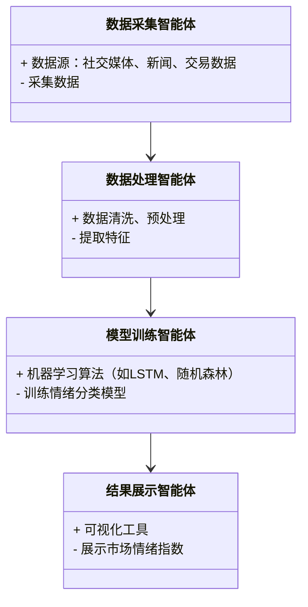

                 


# 利用多智能体系统构建动态的市场情绪指数

> **关键词**: 多智能体系统, 市场情绪指数, 动态调整, 机器学习, 实时计算, 分布式系统

> **摘要**: 本文详细探讨了利用多智能体系统构建动态市场情绪指数的方法。通过分析市场情绪指数的动态特性，结合多智能体系统的分布式计算优势，提出了一种基于多智能体系统的市场情绪指数构建框架。文章从背景介绍、核心概念、算法原理、系统架构设计到项目实战，详细阐述了构建动态市场情绪指数的全过程，并通过实际案例验证了该方法的有效性。

---

## 第一部分: 多智能体系统与市场情绪指数概述

### 第1章: 多智能体系统与市场情绪指数的背景介绍

#### 1.1 多智能体系统的定义与特点
多智能体系统（Multi-Agent System, MAS）是由多个智能体（Agent）组成的分布式系统，每个智能体都是一个能够感知环境、自主决策的实体。以下是多智能体系统的核心特点：

- **分布式计算**：多个智能体协同工作，任务分解和计算分布进行。
- **自主性**：每个智能体能够独立感知环境并自主决策。
- **协作性**：智能体之间通过通信和协作完成共同目标。
- **动态性**：系统能够适应环境的变化，实时调整策略。
- **可扩展性**：系统可以方便地添加或移除智能体，适应不同的应用场景。

#### 1.2 市场情绪指数的定义与意义
市场情绪指数是用来衡量市场参与者情绪状态的量化指标。它反映了市场参与者对某种资产、股票或市场的整体情绪，通常分为积极、消极和中性三种状态。市场情绪指数的意义在于帮助投资者做出更明智的决策，尤其是在高频交易和实时监控中，动态调整市场情绪指数具有重要的应用价值。

#### 1.3 多智能体系统在市场情绪指数中的应用背景
传统市场情绪指数的构建方法通常依赖于单一的数据源或简单的统计方法，存在以下问题：
- 数据来源单一，无法全面捕捉市场情绪。
- 计算能力有限，难以实时更新情绪指数。
- 缺乏灵活性，无法根据市场变化快速调整。

多智能体系统通过分布式计算和协作能力，能够实时收集、处理和更新市场情绪数据，从而构建动态的市场情绪指数。以下是多智能体系统在市场情绪指数中的优势：
- **分布式数据采集**：多个智能体可以同时从不同数据源采集市场情绪数据。
- **实时计算能力**：多智能体系统能够快速处理数据并更新情绪指数。
- **动态调整**：系统可以根据市场变化实时调整情绪指数的权重和计算方法。

---

### 第2章: 多智能体系统与市场情绪指数的核心概念

#### 2.1 多智能体系统的组成与功能
多智能体系统由多个智能体组成，每个智能体都有特定的功能和职责。以下是多智能体系统的主要组成和功能：

- **数据采集智能体**：负责从多种数据源（如社交媒体、新闻、交易数据）采集市场情绪数据。
- **数据处理智能体**：对采集到的数据进行清洗、预处理和特征提取。
- **模型训练智能体**：利用机器学习算法（如LSTM、随机森林）训练情绪分类模型。
- **结果展示智能体**：将市场情绪指数以可视化的方式呈现给用户。

#### 2.2 市场情绪指数的构建逻辑
市场情绪指数的构建逻辑包括以下几个步骤：
1. **数据预处理**：对原始数据进行清洗和标准化处理。
2. **特征提取**：从数据中提取有用的特征（如情感强度、关键词频率）。
3. **模型训练**：利用机器学习算法训练情绪分类模型。
4. **动态更新**：根据市场变化实时更新情绪指数。

#### 2.3 多智能体系统与市场情绪指数的关系
多智能体系统通过分布式计算和协作能力，为市场情绪指数的构建提供了以下优势：
- **高效的数据处理**：多智能体系统可以同时处理大量数据，提高计算效率。
- **实时更新能力**：系统可以根据市场变化快速调整情绪指数。
- **灵活性**：可以根据不同的市场环境调整智能体的功能和权重。

---

## 第二部分: 多智能体系统构建动态市场情绪指数的核心原理

### 第3章: 多智能体系统的核心原理

#### 3.1 多智能体系统的通信与协作机制
多智能体系统的通信与协作机制是系统正常运行的核心。以下是多智能体系统的主要通信与协作机制：

- **通信协议**：智能体之间通过特定的通信协议（如HTTP、WebSocket）进行数据交换。
- **任务分配**：系统通过任务分配算法（如DAG调度算法）将任务分配给不同的智能体。
- **协作推理**：智能体通过协作推理算法（如分布式推理算法）共同完成复杂任务。

#### 3.2 多智能体系统的任务分解与分配
任务分解与分配是多智能体系统设计中的重要环节。以下是多智能体系统任务分解与分配的主要步骤：

1. **任务分解**：将整体任务分解为多个子任务，每个子任务由一个智能体完成。
2. **任务分配**：根据智能体的能力和当前负载，将任务分配给合适的智能体。
3. **任务执行**：智能体根据分配的任务执行相应的操作，并通过通信机制与其他智能体协作。

---

### 第4章: 市场情绪指数的构建原理

#### 4.1 数据预处理与特征提取
数据预处理与特征提取是市场情绪指数构建的基础。以下是数据预处理与特征提取的主要步骤：

- **数据清洗**：去除噪声数据（如重复数据、无效数据）。
- **数据标准化**：将数据转换为统一的格式，便于后续处理。
- **特征提取**：从数据中提取有用的特征（如情感强度、关键词频率）。

#### 4.2 情绪分类与指数计算
情绪分类与指数计算是市场情绪指数构建的核心。以下是情绪分类与指数计算的主要步骤：

1. **情绪分类**：利用机器学习算法（如LSTM、随机森林）对市场情绪进行分类（如积极、消极、中性）。
2. **指数计算**：根据分类结果和权重计算市场情绪指数。

---

## 第三部分: 系统架构设计与项目实战

### 第5章: 系统架构设计

#### 5.1 系统功能设计
以下是系统的主要功能模块：

- **数据采集模块**：从多种数据源采集市场情绪数据。
- **数据处理模块**：对数据进行清洗、预处理和特征提取。
- **模型训练模块**：利用机器学习算法训练情绪分类模型。
- **结果展示模块**：将市场情绪指数以可视化的方式呈现给用户。

#### 5.2 系统架构设计
以下是系统架构设计的类图和序列图：



### 第6章: 项目实战

#### 6.1 环境配置
以下是项目实战的环境配置步骤：

1. **安装Python**：安装Python 3.8或更高版本。
2. **安装依赖库**：安装必要的Python库（如pandas、numpy、scikit-learn、tensorflow）。
3. **配置数据源**：选择合适的数据源（如社交媒体API、新闻API）。

#### 6.2 核心实现代码
以下是核心实现代码示例：

```python
import pandas as pd
import numpy as np
from sklearn.model_selection import train_test_split
from sklearn.ensemble import RandomForestClassifier
from tensorflow.keras.models import Sequential
from tensorflow.keras.layers import LSTM, Dense

# 数据预处理
def preprocess_data(data):
    # 数据清洗
    data = data.dropna()
    # 标准化
    data = (data - data.mean()) / data.std()
    return data

# 特征提取
def extract_features(data):
    features = data.drop(columns=['label'])
    labels = data['label']
    return features, labels

# 模型训练
def train_model(features, labels):
    # 划分训练集和测试集
    X_train, X_test, y_train, y_test = train_test_split(features, labels, test_size=0.2)
    # 训练随机森林模型
    rf_model = RandomForestClassifier()
    rf_model.fit(X_train, y_train)
    # 训练LSTM模型
    lstm_model = Sequential()
    lstm_model.add(LSTM(64, input_shape=(X_train.shape[1], 1)))
    lstm_model.add(Dense(1, activation='sigmoid'))
    lstm_model.compile(loss='binary_crossentropy', optimizer='adam', metrics=['accuracy'])
    lstm_model.fit(X_train.reshape(X_train.shape[0], X_train.shape[1], 1), y_train, epochs=10, batch_size=32)
    return rf_model, lstm_model

# 结果展示
def display_results(models, test_features, test_labels):
    # 随机森林模型预测
    rf_model, lstm_model = models
    rf_pred = rf_model.predict(test_features)
    lstm_pred = lstm_model.predict(test_features.reshape(test_features.shape[0], test_features.shape[1], 1))
    # 计算准确率
    rf_accuracy = sum(rf_pred == test_labels) / len(test_labels)
    lstm_accuracy = sum(lstm_pred.round() == test_labels) / len(test_labels)
    print(f"随机森林准确率: {rf_accuracy}")
    print(f"LSTM准确率: {lstm_accuracy}")

# 主程序
if __name__ == "__main__":
    # 加载数据
    data = pd.read_csv('market_sentiment.csv')
    # 数据预处理
    processed_data = preprocess_data(data)
    # 特征提取
    features, labels = extract_features(processed_data)
    # 模型训练
    rf_model, lstm_model = train_model(features, labels)
    # 结果展示
    display_results((rf_model, lstm_model), features, labels)
```

#### 6.3 实际案例分析
以下是实际案例分析：

1. **数据来源**：使用社交媒体数据和新闻数据训练情绪分类模型。
2. **模型训练**：训练随机森林和LSTM模型，分别计算准确率。
3. **结果展示**：将市场情绪指数以可视化的方式呈现给用户。

---

## 第四部分: 最佳实践与总结

### 第7章: 最佳实践

#### 7.1 数据质量的重要性
数据质量是市场情绪指数构建的关键因素。以下是数据质量的注意事项：

- **数据来源的多样性**：从多种数据源采集数据，提高数据的全面性。
- **数据清洗的准确性**：确保数据清洗过程的准确性，避免噪声数据的影响。
- **数据更新的及时性**：实时更新数据，保证数据的时效性。

#### 7.2 模型调优的技巧
模型调优是提高市场情绪指数准确率的重要步骤。以下是模型调优的技巧：

- **参数优化**：通过网格搜索优化模型参数。
- **模型集成**：将多个模型的结果进行集成，提高准确率。
- **实时监控**：实时监控模型性能，及时调整模型参数。

#### 7.3 系统可扩展性
系统的可扩展性是多智能体系统设计的重要考虑因素。以下是系统的可扩展性设计：

- **模块化设计**：将系统设计为模块化结构，便于添加或移除智能体。
- **负载均衡**：通过负载均衡算法分配任务，避免单点故障。
- **动态调整**：根据系统负载动态调整智能体的数量和功能。

### 第8章: 总结

#### 8.1 项目总结
通过本项目，我们成功构建了一个基于多智能体系统的动态市场情绪指数。系统通过分布式计算和协作能力，能够实时更新市场情绪指数，帮助投资者做出更明智的决策。

#### 8.2 未来展望
未来，我们可以从以下几个方面进一步优化系统：

- **优化数据采集模块**：引入更多数据源，提高数据的全面性。
- **改进模型算法**：研究更先进的机器学习算法，提高模型的准确率。
- **增强系统的实时性**：通过优化通信机制和任务分配算法，提高系统的实时性。

---

## 作者

作者：AI天才研究院/AI Genius Institute & 禅与计算机程序设计艺术 /Zen And The Art of Computer Programming

