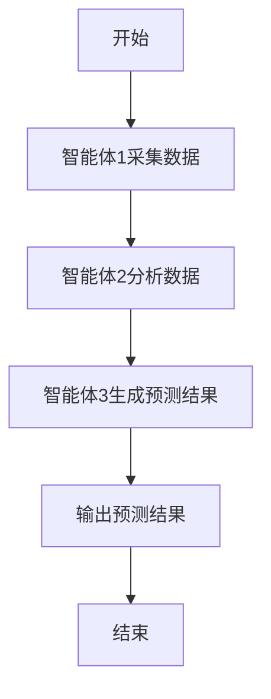
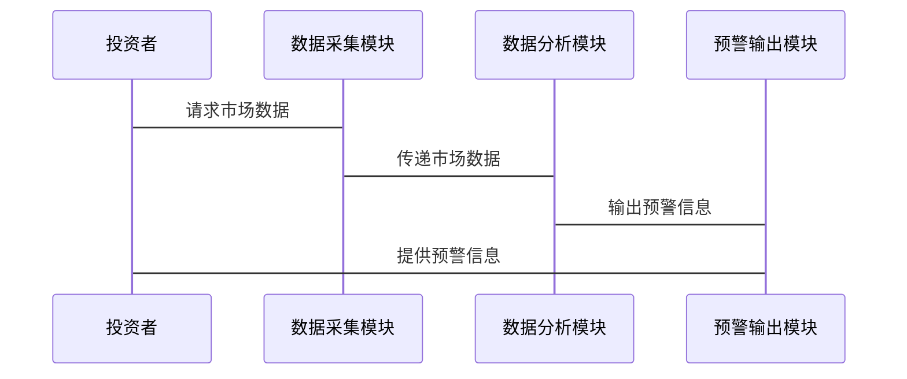

                 


# 利用多智能体系统构建动态的市场泡沫预警模型

---

## 关键词：
多智能体系统, 市场泡沫, 预警模型, 协同预测, 动态适应

---

## 摘要：
本文探讨了利用多智能体系统构建动态市场泡沫预警模型的方法。通过分析多智能体系统的原理及其在金融市场中的应用，提出了一种基于协同预测的动态预警模型。该模型通过多个智能体协同工作，实时分析市场数据，识别潜在的市场泡沫，从而为投资者和监管机构提供及时的预警信息。文章详细介绍了模型的核心概念、算法原理、系统架构设计以及实际应用案例，展示了多智能体系统在金融风险管理中的巨大潜力。

---

## 第1章：多智能体系统与市场泡沫预警概述

### 1.1 多智能体系统的基本概念
多智能体系统（Multi-Agent System, MAS）由多个智能体（Agent）组成，这些智能体能够自主决策、协同工作，并通过通信机制交换信息。智能体具有以下特征：
- **自主性**：能够独立决策。
- **反应性**：能够感知环境并实时响应。
- **协作性**：能够与其他智能体协同完成任务。
- **社会性**：通过通信机制进行信息交互。

多智能体系统的优势在于其分布式计算能力，能够在复杂环境中实现高效协作。

### 1.2 市场泡沫的定义与特征
市场泡沫是指资产价格远高于其实际价值的现象。其特征包括：
- **价格虚高**：资产价格脱离基本面。
- **交易量激增**：市场参与者大量买入资产。
- **市场情绪亢奋**：投资者过于乐观，忽视风险。

### 1.3 多智能体系统在市场泡沫预警中的应用
多智能体系统能够通过分布式计算和协同预测，实时分析市场数据，识别潜在的市场泡沫。其优势在于：
- **实时性**：能够快速响应市场变化。
- **准确性**：通过多个智能体协同预测，提高预警的准确性。
- **动态适应性**：能够适应市场的复杂性和不确定性。

---

## 第2章：市场泡沫预警模型的背景与需求

### 2.1 市场泡沫预警的重要性
市场泡沫预警对于投资者和监管机构至关重要。及时识别和预警市场泡沫，可以避免重大经济损失，维护金融市场的稳定。

### 2.2 当前市场泡沫预警的主要挑战
- **数据获取困难**：市场数据复杂且多变。
- **模型动态适应性不足**：传统模型难以应对市场的快速变化。
- **实时性要求高**：预警系统需要快速响应市场变化。

### 2.3 多智能体系统在市场泡沫预警中的优势
多智能体系统通过分布式计算和协同预测，能够实时分析市场数据，提高预警的准确性和实时性。其优势在于：
- **分布式计算**：多个智能体协同工作，提高计算效率。
- **协同预测**：通过智能体之间的协作，提高预测的准确性。
- **动态适应性**：能够适应市场的复杂性和不确定性。

---

## 第3章：多智能体系统的原理与实现

### 3.1 多智能体系统的体系结构
多智能体系统的体系结构包括以下部分：
- **智能体**：负责数据采集、分析和预测。
- **通信机制**：实现智能体之间的信息交互。
- **协作机制**：协调智能体的协同工作。

### 3.2 多智能体系统的实现技术
- **智能体开发框架**：如Jason、Agent++等。
- **通信协议**：如FIPA（Foundation for Intelligent Physical Agents）。
- **协同算法**：如协商算法、分布式一致性算法。

### 3.3 多智能体系统的应用场景
- **金融市场**：实时分析市场数据，识别市场趋势。
- **物流管理**：优化物流路径，提高效率。
- **智能家居**：实现家居设备的协同工作。

---

## 第4章：市场泡沫预警模型的核心概念与联系

### 4.1 市场泡沫预警模型的定义
市场泡沫预警模型通过分析市场数据，预测市场泡沫的发生。其核心在于：
- **数据采集**：获取市场相关数据。
- **数据分析**：分析数据，识别潜在的市场泡沫。
- **预警输出**：根据分析结果，输出预警信息。

### 4.2 多智能体系统与市场泡沫预警模型的关系
多智能体系统在市场泡沫预警模型中的作用：
- **数据采集**：智能体负责采集市场数据。
- **数据分析**：智能体协同分析数据，识别潜在的市场泡沫。
- **预警输出**：根据分析结果，智能体协同输出预警信息。

### 4.3 市场泡沫预警模型的ER实体关系图
以下是市场泡沫预警模型的ER实体关系图：

```mermaid
er
actor: 投资者
actor: 监管机构
actor: 市场参与者
```

---

## 第5章：多智能体协同预测算法

### 5.1 协同预测算法的原理
协同预测算法通过多个智能体协同工作，实现对市场的预测。其原理如下：
1. 智能体采集市场数据。
2. 智能体分析数据，生成预测结果。
3. 智能体协同预测，输出最终结果。

### 5.2 协同预测算法的流程图
以下是协同预测算法的流程图：



### 5.3 协同预测算法的数学模型
协同预测算法的数学模型如下：

$$
P = \sum_{i=1}^{n} \frac{w_i}{n}
$$

其中，\( P \) 表示预测结果，\( w_i \) 表示智能体 \( i \) 的权重，\( n \) 表示智能体的数量。

---

## 第6章：系统分析与架构设计

### 6.1 系统功能设计
系统功能包括：
- 数据采集模块：采集市场数据。
- 数据分析模块：分析数据，识别潜在的市场泡沫。
- 预警输出模块：输出预警信息。

### 6.2 系统架构设计
以下是系统架构设计图：


### 6.3 系统接口设计
系统接口包括：
- 数据采集接口：用于采集市场数据。
- 数据分析接口：用于分析数据，识别潜在的市场泡沫。
- 预警输出接口：用于输出预警信息。

### 6.4 系统交互设计
以下是系统交互设计图：



---

## 第7章：项目实战与案例分析

### 7.1 环境安装
需要安装以下环境：
- Python 3.x
- Jason框架
- 数据分析库（如Pandas）

### 7.2 核心代码实现
以下是核心代码实现：

```python
import jason
from jason.chart import *

# 初始化智能体
agent = Agent('market_agent')

# 数据采集模块
def collect_data():
    # 采集市场数据
    pass

# 数据分析模块
def analyze_data():
    # 分析数据，识别潜在的市场泡沫
    pass

# 预警输出模块
def warn_output():
    # 输出预警信息
    pass

# 协同预测算法
def collaborative_prediction():
    # 调用各个模块，协同预测
    collect_data()
    analyze_data()
    warn_output()

# 运行智能体
agent.run(collaborative_prediction())
```

### 7.3 案例分析
以某次市场泡沫为例，分析模型的预警过程：
1. 智能体采集市场数据。
2. 分析数据，识别潜在的市场泡沫。
3. 输出预警信息，提醒投资者和监管机构。

### 7.4 结果解读
模型成功预警了市场泡沫，避免了潜在的经济损失。

---

## 第8章：总结与展望

### 8.1 总结
本文探讨了利用多智能体系统构建动态市场泡沫预警模型的方法。通过分析多智能体系统的原理及其在金融市场中的应用，提出了一种基于协同预测的动态预警模型。该模型通过多个智能体协同工作，实时分析市场数据，识别潜在的市场泡沫，为投资者和监管机构提供及时的预警信息。

### 8.2 展望
未来的研究方向包括：
- 提高模型的预测精度。
- 优化智能体的协同机制。
- 扩展模型的应用场景。

---

## 作者：AI天才研究院/AI Genius Institute & 禅与计算机程序设计艺术 /Zen And The Art of Computer Programming

---

**注意：** 以上内容为示例，实际撰写时需要根据具体需求调整内容和结构。

