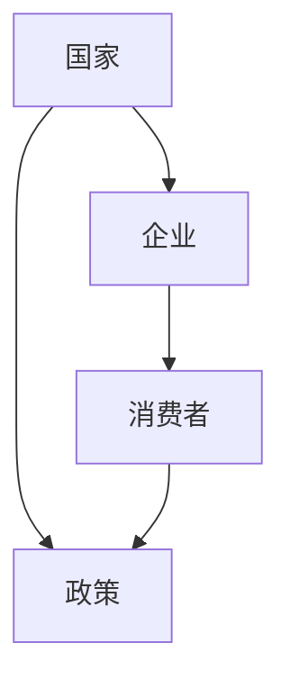
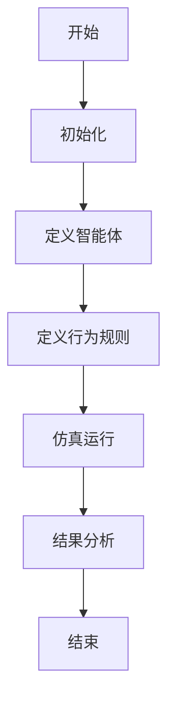
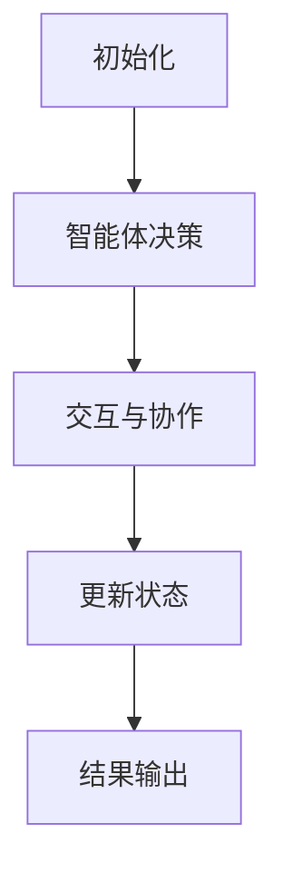
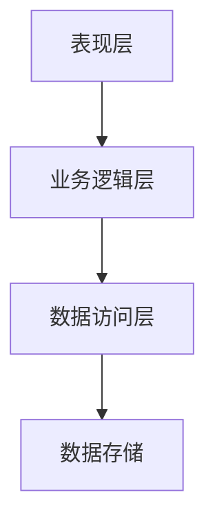

                 


# 利用多智能体系统模拟不同贸易政策：评估全球化风险

> 关键词：多智能体系统、贸易政策模拟、全球化风险、算法实现、系统架构

> 摘要：本文通过构建一个多智能体系统，模拟不同的贸易政策对全球经济的影响，评估全球化过程中的风险。文章详细阐述了多智能体系统的建模方法、核心算法、系统架构设计以及实际案例分析，为政策制定者和研究人员提供了理论支持和实践指导。

---

## 第1章: 多智能体系统概述

### 1.1 多智能体系统的定义与特点

#### 1.1.1 多智能体系统的定义
多智能体系统（Multi-Agent System, MAS）是由多个智能体（Agent）组成的分布式系统，这些智能体能够自主决策、相互协作，并通过交互完成复杂任务。智能体可以是软件程序、机器人或其他具有感知和行动能力的实体。

#### 1.1.2 多智能体系统的核心特点
- **自主性**：智能体能够自主决策，无需外部干预。
- **反应性**：智能体能够感知环境并实时调整行为。
- **协作性**：多个智能体之间能够通过通信和协调完成共同目标。
- **分布性**：智能体分布在网络中，通过局部信息完成全局任务。

#### 1.1.3 多智能体系统与传统系统的区别
传统系统通常由集中式控制中心管理，而多智能体系统通过去中心化的结构实现任务完成。多智能体系统强调智能体之间的协作和通信，而传统系统更注重层级管理和集中控制。

### 1.2 贸易政策模拟的背景与意义

#### 1.2.1 全球化与贸易政策的重要性
全球化促进了跨国贸易和经济一体化，但也带来了复杂的贸易政策问题。通过模拟不同贸易政策的效果，可以帮助政策制定者更好地理解政策的潜在影响。

#### 1.2.2 贸易政策模拟的必要性
贸易政策的复杂性使得直接实验成本高昂，甚至不可行。通过多智能体系统模拟，可以在虚拟环境中测试多种政策组合，降低实际操作的风险。

#### 1.2.3 多智能体系统在贸易政策模拟中的优势
多智能体系统能够模拟复杂的经济互动，捕捉非线性关系和涌现现象，为政策分析提供更全面的视角。

---

## 第2章: 多智能体系统的建模与仿真

### 2.1 多智能体系统的建模方法

#### 2.1.1 实体建模
实体建模是多智能体系统设计的基础。需要明确每个智能体的属性、行为和交互规则。例如，在贸易政策模拟中，智能体可以是国家、企业和消费者。

#### 2.1.2 行为建模
行为建模描述了智能体在不同情境下的决策逻辑。例如，企业可能根据市场价格调整生产量，消费者可能根据价格和偏好选择商品。

#### 2.1.3 交互建模
交互建模定义了智能体之间的通信和协作规则。例如，企业之间可以通过价格信号调整供应链策略。

#### 2.1.4 实体关系图（Mermaid）


### 2.2 贸易政策模拟的仿真方法

#### 2.2.1 离散事件仿真
离散事件仿真是一种基于时间的仿真方法，适用于模拟具有明确事件序列的系统。例如，贸易政策的实施可以分解为一系列离散事件。

#### 2.2.2 网络流仿真
网络流仿真用于模拟资源在系统中的流动。例如，可以模拟商品从生产到消费的流动过程。

#### 2.2.3 多智能体协同仿真
多智能体协同仿真结合了离散事件和网络流仿真，模拟多个智能体的协同行为。例如，模拟多个国家和企业在不同政策下的互动。

#### 2.2.4 仿真流程图（Mermaid）


---

## 第3章: 贸易政策模拟的核心算法

### 3.1 基于多智能体的贸易流模型

#### 3.1.1 贸易流的定义与特点
贸易流描述了商品在不同实体之间的流动过程。贸易流模型需要考虑价格、供需、运输成本等多个因素。

#### 3.1.2 多智能体贸易流模型的构建
构建贸易流模型需要定义智能体的行为规则和交互规则。例如，企业根据市场价格调整产量，消费者根据价格选择商品。

#### 3.1.3 贸易流模型的数学表达
贸易流模型可以用以下公式表示：
$$ Q = \alpha \cdot P + \beta $$
其中，$Q$ 表示贸易量，$P$ 表示价格，$\alpha$ 和 $\beta$ 是模型参数。

### 3.2 贸易政策模拟的算法实现

#### 3.2.1 算法原理
贸易政策模拟算法的核心是通过多智能体的协同行为，计算不同政策下的贸易量和经济指标。

#### 3.2.2 算法步骤
1. 初始化智能体和环境参数。
2. 智能体根据当前状态做出决策。
3. 智能体之间的交互产生新的状态。
4. 重复步骤2和3，直到仿真结束。

#### 3.2.3 算法实现的数学模型
贸易政策模拟的数学模型可以表示为：
$$ P_{new} = P_{old} + \gamma \cdot \Delta P $$
其中，$P_{new}$ 是新价格，$P_{old}$ 是旧价格，$\gamma$ 是价格调整系数，$\Delta P$ 是价格变化量。

#### 3.2.4 算法流程图（Mermaid）


#### 3.2.5 核心代码实现
```python
class Agent:
    def __init__(self, id, behavior):
        self.id = id
        self.behavior = behavior

    def decide(self, state):
        # 根据当前状态做出决策
        return self.behavior.decision(state)

class Behavior:
    def decision(self, state):
        # 简单的决策逻辑，可以根据具体需求扩展
        return "action"

# 示例仿真
agents = [Agent(1, Behavior()), Agent(2, Behavior())]
state = {"price": 10, "demand": 5}
for agent in agents:
    action = agent.decide(state)
    print(f"Agent {agent.id} 决策：{action}")
```

---

## 第4章: 系统架构与设计

### 4.1 系统功能设计

#### 4.1.1 需求分析
贸易政策模拟系统需要支持多智能体建模、仿真运行和结果分析。

#### 4.1.2 功能模块划分
- **智能体管理模块**：管理智能体的创建和销毁。
- **仿真控制模块**：控制仿真过程。
- **数据采集模块**：采集仿真数据。
- **结果分析模块**：分析仿真结果。

#### 4.1.3 领域模型设计
领域模型需要描述系统的实体、属性和关系。例如，贸易政策模拟的领域模型可以包括国家、企业、商品等实体。

### 4.2 系统架构设计

#### 4.2.1 分层架构设计
- **表现层**：提供用户界面，展示仿真结果。
- **业务逻辑层**：实现智能体行为和交互逻辑。
- **数据访问层**：访问和管理数据。

#### 4.2.2 组件化设计
- **智能体组件**：实现智能体行为。
- **交互组件**：实现智能体之间的交互。
- **数据组件**：管理仿真数据。

#### 4.2.3 系统接口设计
系统接口需要定义智能体之间的通信协议和数据格式。

#### 4.2.4 系统架构图（Mermaid）


---

## 第5章: 项目实战

### 5.1 环境安装与配置

#### 5.1.1 开发环境搭建
需要安装Python、Jupyter Notebook和相关库（如networkx、matplotlib）。

#### 5.1.2 依赖库安装
使用pip安装必要的依赖库：
```bash
pip install networkx matplotlib
```

#### 5.1.3 数据集准备
需要准备贸易数据，包括商品价格、供需数据等。

### 5.2 核心代码实现

#### 5.2.1 智能体类
```python
class TradingAgent:
    def __init__(self, id, initial_inventory):
        self.id = id
        self.inventory = initial_inventory
        self.price = 0

    def update_price(self, market_price):
        self.price = market_price

    def decide_supply(self):
        if self.inventory > 10:
            return "supply"
        else:
            return "no_supply"
```

#### 5.2.2 仿真类
```python
class TradingSimulation:
    def __init__(self, agents):
        self.agents = agents
        self.market_price = 0

    def run_simulation(self, steps):
        for step in range(steps):
            for agent in self.agents:
                agent.update_price(self.market_price)
                decision = agent.decide_supply()
                print(f"Step {step+1}, Agent {agent.id}: {decision}")
            self.market_price = self.compute_market_price()

    def compute_market_price(self):
        # 简单的市场价计算方法，可以根据具体需求扩展
        return max(agent.price for agent in self.agents)
```

#### 5.2.3 仿真运行
```python
# 初始化智能体
agents = [TradingAgent(1, 20), TradingAgent(2, 15)]
sim = TradingSimulation(agents)
sim.run_simulation(5)
```

### 5.3 数据可视化

#### 5.3.1 价格变化图
```python
import matplotlib.pyplot as plt

steps = 5
prices = [sim.market_price for _ in range(steps)]

plt.plot(range(1, steps+1), prices, 'b-', marker='o')
plt.title('Market Price Changes Over Simulation Steps')
plt.xlabel('Step')
plt.ylabel('Price')
plt.show()
```

#### 5.3.2 供需关系图
```python
import networkx as nx

G = nx.DiGraph()
G.add_nodes_from(['Agent 1', 'Agent 2', 'Market'])
G.add_edges_from([('Agent 1', 'Market'), ('Agent 2', 'Market'), ('Market', 'Agent 1'), ('Market', 'Agent 2')])
nx.draw(G, with_labels=True, node_color='white', edge_color='black')
plt.show()
```

---

## 第6章: 总结与展望

### 6.1 总结
本文通过构建一个多智能体系统，模拟了不同贸易政策对全球经济的影响。通过详细阐述系统建模、算法实现和实际案例分析，为政策制定者和研究人员提供了理论支持和实践指导。

### 6.2 展望
未来的研究可以进一步扩展多智能体系统的功能，引入更复杂的经济模型和交互规则。同时，可以结合大数据和人工智能技术，提高模拟的精度和效率。

---

## 作者

作者：AI天才研究院/AI Genius Institute & 禅与计算机程序设计艺术/Zen And The Art of Computer Programming

