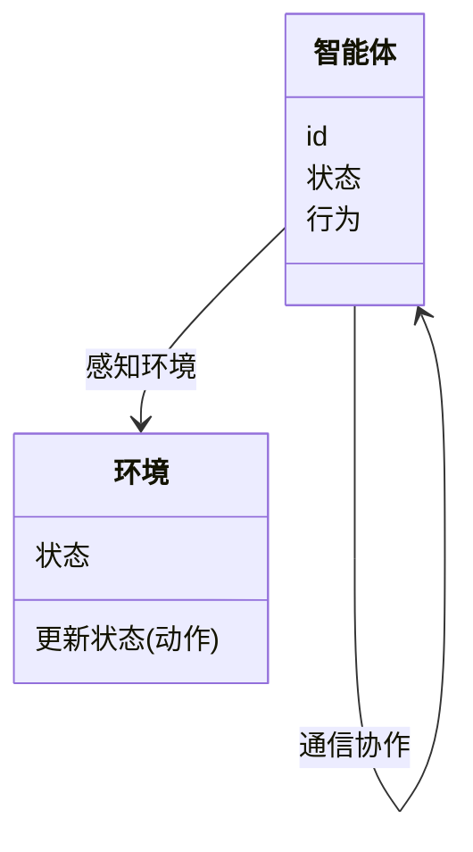
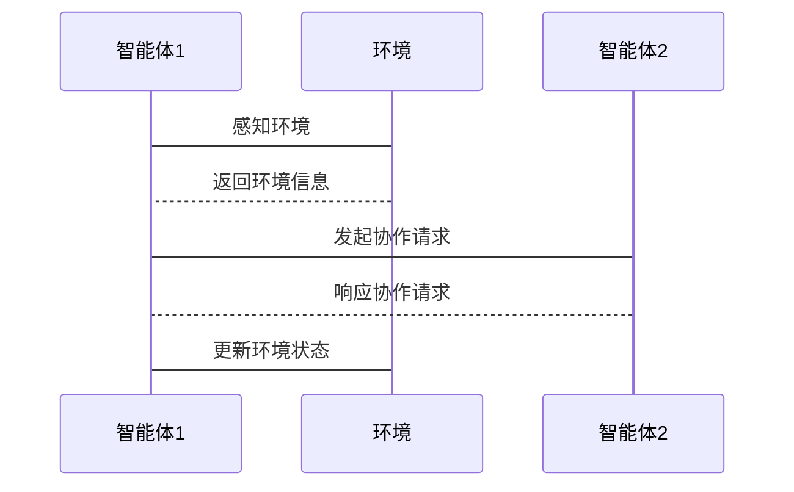

                 


# 利用多智能体系统模拟不同通胀情景：评估公司抗通胀能力

> 关键词：通胀情景模拟，多智能体系统，抗通胀能力，企业风险管理，经济建模，系统设计

> 摘要：本文探讨了利用多智能体系统模拟不同通胀情景的方法，旨在帮助企业评估其抗通胀能力。通过详细分析多智能体系统的原理、算法实现、系统架构设计及实际案例，本文展示了如何利用多智能体系统对企业在不同通胀情景下的应对策略进行建模和评估，为企业制定有效的风险管理策略提供科学依据。

---

# 第一部分: 利用多智能体系统模拟通胀情景的背景与核心概念

## 第1章: 通胀情景模拟的背景与意义

### 1.1 通胀的定义与影响

#### 1.1.1 通胀的基本概念
通胀（Inflation）是指物价总水平在一段时间内持续上涨的现象。通常用消费者价格指数（CPI）或生产者价格指数（PPI）来衡量。通胀对企业经营的影响是多方面的，包括成本增加、利润下降、投资决策不确定性等。

#### 1.1.2 通胀对企业经营的影响
- 成本上升：原材料价格上涨导致生产成本增加。
- 利润压缩：售价无法完全转嫁成本，企业利润下降。
- 投资决策不确定性：通胀不确定性影响企业投资决策。

#### 1.1.3 模拟通胀情景的重要性
通过模拟不同通胀情景，企业可以提前制定应对策略，优化资源配置，降低通胀对企业经营的负面影响。

---

### 1.2 多智能体系统的定义与特点

#### 1.2.1 多智能体系统的基本概念
多智能体系统（Multi-Agent System, MAS）是由多个智能体（Agent）组成的分布式系统，智能体能够自主决策、协作完成任务。

#### 1.2.2 多智能体系统的核心特点
- 分布式：智能体独立运行，通过通信协作解决问题。
- 反应式：智能体能够实时感知环境变化并做出反应。
- 协作性：智能体之间通过协作完成复杂任务。

#### 1.2.3 多智能体系统与传统模型的区别
| 特性 | 多智能体系统 | 传统模型 |
|------|--------------|-----------|
| 结构 | 分布式、协作 | 集中式、单层 | 
| 行为 | 自主决策 | 中央控制 | 
| 应用 | 复杂动态环境 | 简单静态环境 |

---

### 1.3 本章小结
本章介绍了通胀的基本概念及其对企业的影响，阐述了多智能体系统的定义、特点及其在复杂经济环境中的优势。

---

# 第二部分: 多智能体系统与通胀情景模拟的核心概念

## 第2章: 多智能体系统的原理与架构

### 2.1 多智能体系统的原理

#### 2.1.1 多智能体系统的组成要素
- 智能体（Agent）：能够感知环境并采取行动的实体。
- 环境（Environment）：智能体所处的外部世界。
- 通信机制（Communication）：智能体之间交换信息的方式。
- 协作机制（Coordination）：智能体之间协同完成任务的方式。

#### 2.1.2 多智能体系统的通信机制
- 直接通信：智能体之间直接交换信息。
- 间接通信：通过共享数据库或消息中间件进行通信。

#### 2.1.3 多智能体系统的协作机制
- 协商（Negotiation）：智能体通过协商确定任务分工。
- 协作（Cooperation）：智能体协同完成任务。

---

### 2.2 多智能体系统的架构设计

#### 2.2.1 分层架构
- 顶层：全局协调者。
- 中间层：区域协调者。
- 底层：执行智能体。

#### 2.2.2 分布式架构
- 每个智能体独立运行，通过通信协作解决问题。

#### 2.2.3 混合架构
- 结合分层架构和分布式架构的优势。

---

### 2.3 多智能体系统的实现工具

#### 2.3.1 常见的多智能体建模工具
- NetLogo：适合复杂系统模拟。
- Repast：支持多智能体建模和仿真。
- AgentSpeak：基于逻辑推理的智能体编程语言。

---

## 第3章: 通胀情景模拟的核心概念

### 3.1 通胀情景的定义与分类

#### 3.1.1 通胀情景的分类
- 温和通胀：通胀率在合理范围内。
- 高通胀：通胀率显著高于目标。
- 超高通胀：通胀失控，经济不稳定。

#### 3.1.2 不同通胀情景对企业的影响
| 情景 | 影响 |
|------|------|
| 温和通胀 | 成本上升，利润压缩 |
| 高通胀 | 供应链中断，投资停滞 |
| 超高通胀 | 经济崩溃，企业倒闭 |

---

### 3.2 多智能体系统在通胀模拟中的应用

#### 3.2.1 多智能体系统在经济建模中的作用
- 模拟经济主体行为。
- 分析经济系统的动态变化。

#### 3.2.2 多智能体系统在通胀预测中的优势
- 能够模拟复杂经济系统的非线性关系。
- 可以捕捉经济主体之间的互动效应。

---

### 3.3 本章小结
本章明确了通胀情景的分类及其对企业的不同影响，阐述了多智能体系统在通胀模拟中的独特优势。

---

# 第三部分: 多智能体系统模拟通胀情景的算法与模型

## 第4章: 多智能体系统的算法原理

### 4.1 多智能体系统的算法基础

#### 4.1.1 基于Agent的建模方法
- Agent-Based Modeling (ABM)：通过模拟个体行为来研究系统整体行为。

#### 4.1.2 多智能体系统的通信协议
- 采用基于消息传递的通信机制。

#### 4.1.3 多智能体系统的协作算法
- 使用分布式协商算法（Distributed Negotiation Algorithm）。

---

### 4.2 常见的多智能体算法

#### 4.2.1 进化算法
- 用于优化智能体的行为策略。

#### 4.2.2 分布式计算算法
- 使用分布式计算技术实现多智能体协作。

---

### 4.3 基于Agent的通胀模拟算法实现

#### 4.3.1 算法流程
1. 初始化智能体及其环境参数。
2. 智能体感知环境并做出决策。
3. 智能体通过通信机制交换信息。
4. 系统更新环境状态。
5. 重复步骤2-4，直到达到终止条件。

#### 4.3.2 算法实现代码
```python
class Agent:
    def __init__(self, id):
        self.id = id
        self.state = "idle"
    
    def感知环境(self, 环境):
        # 根据环境信息做出决策
        pass
    
    def 采取行动(self):
        # 根据决策采取行动
        pass

class 环境:
    def __init__(self):
        self.状态 = "正常"
    
    def 更新状态(self, action):
        # 根据智能体的行动更新环境状态
        pass
```

---

## 第5章: 通胀情景模拟的数学模型与公式

### 5.1 通胀情景模拟的数学模型

#### 5.1.1 通胀传播模型
$$ I(t) = I(t-1) \times (1 + r) $$
其中，$I(t)$ 表示第 $t$ 时期的通胀率，$r$ 表示通胀增长率。

#### 5.1.2 企业成本模型
$$ C(t) = C(t-1) \times (1 + I(t)) $$
其中，$C(t)$ 表示第 $t$ 时期的企业成本。

---

### 5.2 系统动力学模型

#### 5.2.1 系统动力学模型的构建
$$ \frac{dI}{dt} = \alpha \times I - \beta \times C $$
其中，$\alpha$ 和 $\beta$ 是比例系数。

---

# 第四部分: 系统分析与架构设计方案

## 第6章: 通胀情景模拟系统的架构设计

### 6.1 问题场景介绍
企业需要在不同通胀情景下评估其抗通胀能力，优化资源配置。

### 6.2 系统功能设计

#### 6.2.1 领域模型（Mermaid 类图）


#### 6.2.2 系统架构设计（Mermaid 架构图）


---

## 第7章: 系统接口与交互设计

### 7.1 系统接口设计
| 接口名称 | 描述 | 调用方 |
|----------|------|--------|
| 感知环境 | 智能体感知环境状态 | 智能体 |
| 通信协作 | 智能体之间通信协作 | 智能体 |
| 更新状态 | 环境状态更新 | 环境 |

---

### 7.2 系统交互设计（Mermaid 序列图）


---

# 第五部分: 项目实战

## 第8章: 多智能体系统模拟通胀情景的实现

### 8.1 环境配置与安装

#### 8.1.1 环境要求
- Python 3.8+
- 安装必要的库（如 Repast、NetLogo）。

#### 8.1.2 安装步骤
```bash
pip install repast
pip install netlogo
```

---

### 8.2 系统核心实现

#### 8.2.1 智能体实现
```python
class CompanyAgent:
    def __init__(self, id):
        self.id = id
        self.resources = 100  # 初始资源
        self抗通胀能力 = 0.8  # 抗通胀能力系数
    
    def 感知环境(self, 环境):
        self.环境通胀率 = 环境通胀率
    
    def 评估抗通胀能力(self):
        return self.resources * self.抗通胀能力
```

#### 8.2.2 环境实现
```python
class 环境:
    def __init__(self, 通胀率):
        self.通胀率 = 通胀率
    
    def 更新通胀率(self, 新通胀率):
        self.通胀率 = 新通胀率
```

---

### 8.3 实际案例分析与结果解读

#### 8.3.1 案例介绍
假设通胀率为5%，企业抗通胀能力系数为0.8，初始资源为100。

#### 8.3.2 模拟结果
$$ 抗通胀能力 = 100 \times 0.8 = 80 $$

---

## 第9章: 总结与展望

### 9.1 本章总结
本文通过详细分析多智能体系统的原理与架构，结合实际案例，展示了如何利用多智能体系统模拟不同通胀情景，评估企业抗通胀能力。

### 9.2 注意事项
- 模型的复杂度与实际需求相匹配。
- 数据的准确性和实时性。

### 9.3 未来研究方向
- 开发更复杂的多智能体模型。
- 研究多智能体系统在其他经济领域的应用。

---

# 第六部分: 最佳实践与小结

## 第10章: 最佳实践与小结

### 10.1 小结
通过多智能体系统的模拟，企业可以更好地应对不同通胀情景，优化资源配置，提升抗通胀能力。

### 10.2 注意事项
- 模型需要根据实际情况进行调整和优化。
- 需要结合企业的具体业务需求。

### 10.3 拓展阅读
- 推荐阅读《多智能体系统与经济建模》。
- 参考Repast和NetLogo的官方文档。

---

# 作者：AI天才研究院/AI Genius Institute & 禅与计算机程序设计艺术 /Zen And The Art of Computer Programming

