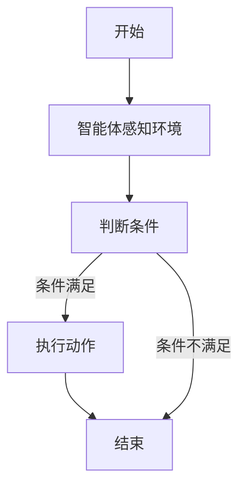
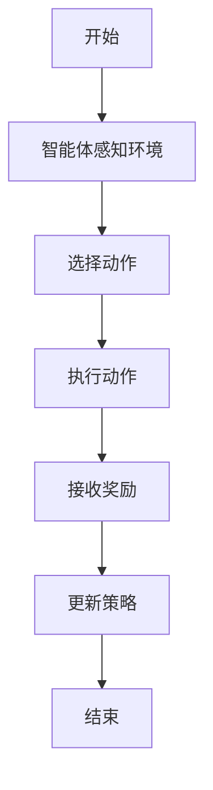
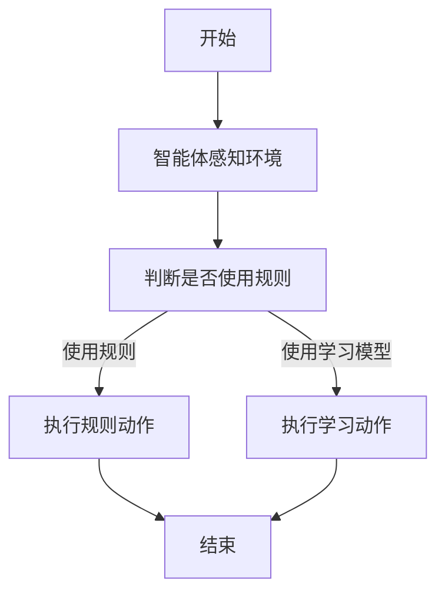
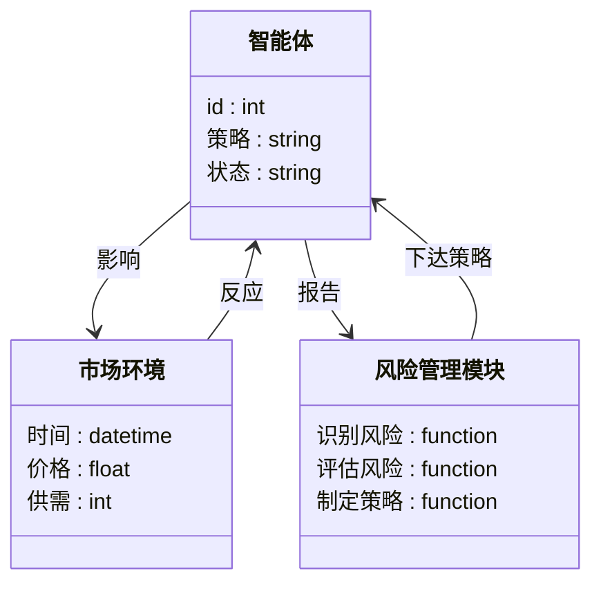
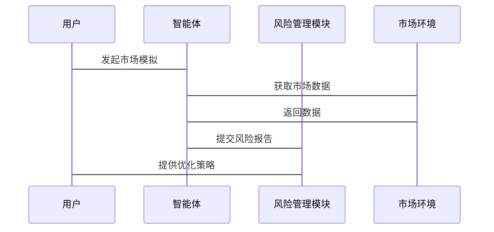

                 


# 利用多智能体系统模拟市场情景：增强风险管理

## 关键词：多智能体系统，市场模拟，风险管理，算法原理，系统架构

## 摘要：  
本文通过详细分析多智能体系统在市场模拟中的应用，探讨其在风险管理中的增强作用。从基本概念到算法原理，再到系统架构与项目实战，系统地阐述了多智能体系统如何帮助我们更好地理解和管理市场风险。文章结合理论与实践，通过丰富的案例和详细的代码示例，为读者提供了一套完整的解决方案。

---

# 第一部分：多智能体系统与市场模拟基础

---

# 第1章：多智能体系统概述

## 1.1 多智能体系统的定义与特点

### 1.1.1 多智能体系统的定义  
多智能体系统（Multi-Agent System, MAS）是由多个智能体（Agent）组成的复杂系统，这些智能体通过协作与竞争完成特定目标。每个智能体都是一个独立的实体，具有自主性、反应性、目标导向性和社会性。

### 1.1.2 多智能体系统的特性  
- **自主性**：智能体能够独立决策和行动。  
- **反应性**：智能体能够感知环境并实时调整行为。  
- **目标导向性**：智能体的行为以实现特定目标为导向。  
- **社会性**：智能体之间可以通信、协作或竞争。  

### 1.1.3 多智能体系统与传统单智能体系统的区别  
| 特性                | 单智能体系统         | 多智能体系统         |
|---------------------|--------------------|----------------------|
| 决策主体            | 单一主体            | 多个主体             |
| 通信能力            | 无通信              | 支持通信              |
| 行为复杂度          | 较低                | 较高                 |
| 应用场景            | 简单任务            | 复杂任务（如市场模拟） |

---

## 1.2 市场模拟的必要性与挑战

### 1.2.1 市场模拟的背景与意义  
- 市场模拟是研究市场行为、预测市场趋势的重要工具。  
- 通过模拟，可以降低实际操作中的风险和成本。  

### 1.2.2 市场模拟的主要挑战  
- **复杂性**：市场参与者众多，行为多样。  
- **不确定性**：市场受多种不可预测因素影响。  
- **实时性**：模拟需要快速响应市场变化。  

### 1.2.3 多智能体系统在市场模拟中的优势  
- 能够模拟多个市场参与者的复杂行为。  
- 支持实时协作与竞争，更贴近真实市场环境。  

---

## 1.3 多智能体系统在风险管理中的应用

### 1.3.1 风险管理的核心问题  
- **风险识别**：发现潜在风险源。  
- **风险评估**：量化风险的影响。  
- **风险缓解**：制定应对策略。  

### 1.3.2 多智能体系统如何帮助风险管理  
- 通过模拟市场行为，提前识别潜在风险。  
- 支持实时监控，快速响应风险事件。  

### 1.3.3 市场模拟与风险管理的结合  
- 模拟市场波动，评估风险传播路径。  
- 分析不同策略对风险管理的效果。  

---

# 第2章：多智能体系统的核心概念与联系

## 2.1 多智能体系统的原理

### 2.1.1 多智能体系统的组成要素  
- **智能体**：市场参与者（如投资者、交易员）。  
- **环境**：市场环境（如价格、供需关系）。  
- **通信机制**：智能体之间的信息交换方式。  

### 2.1.2 智能体的行为模型  
- **基于规则的行为**：根据预设规则行动。  
- **基于学习的行为**：通过学习优化决策。  

### 2.1.3 智能体之间的通信与协作  
- **直接通信**：智能体之间直接交换信息。  
- **间接协作**：通过中间媒介实现协作。  

---

## 2.2 多智能体系统与市场模拟的关系

### 2.2.1 市场模拟的核心概念  
- **参与者**：投资者、交易员、机构。  
- **行为**：买卖、报价、策略调整。  
- **环境**：市场价格、供需、政策。  

### 2.2.2 多智能体系统在市场模拟中的角色  
- **模拟参与者**：智能体代表市场参与者。  
- **模拟行为**：智能体执行市场行为。  
- **模拟环境**：环境影响智能体决策。  

### 2.2.3 市场模拟与风险管理的逻辑关系  
- 模拟市场行为，识别风险源。  
- 分析风险传播路径，制定应对策略。  

---

## 2.3 多智能体系统的ER实体关系图

```mermaid
erDiagram
    participant 市场参与者 {
        <属性> id : int
        <属性> 名称 : string
        <属性> 行为 : string
    }
    participant 市场环境 {
        <属性> 时间 : datetime
        <属性> 价格 : float
        <属性> 供需 : int
    }
    participant 智能体 {
        <属性> id : int
        <属性> 类型 : string
        <属性> 策略 : string
    }
    市场参与者 --> 市场环境 : 影响
    市场环境 --> 市场参与者 : 反应
    智能体 --> 市场环境 : 适应
    智能体 --> 市场参与者 : 模拟
```

---

# 第3章：多智能体系统模拟算法原理

## 3.1 基于规则的多智能体模拟算法

### 3.1.1 算法原理  
- 智能体根据预设规则执行行为。  
- 规则可以是简单的条件判断（如价格高于某个阈值时卖出）。  

### 3.1.2 算法流程图  



### 3.1.3 代码实现  

```python
class Agent:
    def __init__(self, id, strategy):
        self.id = id
        self.strategy = strategy
        self.position = 0  # 持股数量
        self.cash = 1000  # 初始资金

    def execute_strategy(self, price):
        # 简单的基于规则的策略
        if price > 100:
            self.position -= 1  # 卖出
        elif price < 90:
            self.position += 1  # 买入

# 模拟环境
prices = [95, 100, 98, 105, 97]
agents = [Agent(1, 'rule-based'), Agent(2, 'rule-based')]

for price in prices:
    for agent in agents:
        agent.execute_strategy(price)
```

---

## 3.2 基于学习的多智能体模拟算法

### 3.2.1 算法原理  
- 智能体通过强化学习（如Q-learning）或深度学习（如DQN）优化决策。  
- 算法目标是最大化累积奖励。  

### 3.2.2 算法流程图  



### 3.2.3 代码实现  

```python
import numpy as np
from collections import deque
import random

class DQNAgent:
    def __init__(self, state_size, action_size):
        self.state_size = state_size
        self.action_size = action_size
        self.memory = deque(maxlen=1000)
        self.gamma = 0.95  # 折扣率
        self.epsilon = 1.0  # 探索率
        self.epsilon_min = 0.01
        self.batch_size = 32

    def remember(self, state, action, reward, next_state):
        self.memory.append((state, action, reward, next_state))

    def act(self, state):
        if random.random() < self.epsilon:
            return random.randint(0, self.action_size - 1)
        return np.argmax(state)

    def replay(self):
        if len(self.memory) < self.batch_size:
            return
        minibatch = random.sample(self.memory, self.batch_size)
        states = np.array([t[0] for t in minibatch])
        actions = np.array([t[1] for t in minibatch])
        rewards = np.array([t[2] for t in minibatch])
        next_states = np.array([t[3] for t in minibatch])
        # 训练模型（假设已有模型）
        # 简化为更新epsilon
        self.epsilon = max(self.epsilon_min, self.epsilon * 0.99)

# 示例环境
state_size = 4  # 示例状态空间
action_size = 2  # 示例动作空间
agent = DQNAgent(state_size, action_size)
agent.act(np.random.randn(state_size))
```

---

## 3.3 组合算法的应用

### 3.3.1 组合算法的原理  
- 结合基于规则和基于学习的算法。  
- 在某些场景下使用规则，在其他场景下使用学习模型。  

### 3.3.2 组合算法的流程图  



### 3.3.3 组合算法的数学模型与公式  
$$ \text{最终决策} = \lambda \cdot \text{规则决策} + (1-\lambda) \cdot \text{学习决策} $$  
其中，$$ 0 < \lambda < 1 $$ 表示规则和学习决策的权重。

---

# 第4章：多智能体系统模拟的数学模型与公式

## 4.1 市场模拟的基本假设与约束条件

### 4.1.1 市场参与者的假设  
- 每个参与者都有明确的目标（如最大化收益）。  
- 参与者的决策基于当前市场状态。  

### 4.1.2 市场行为的约束条件  
- 价格变化服从某种概率分布（如正态分布）。  
- 参与者的行为影响市场状态。  

---

## 4.2 多智能体系统的数学模型

### 4.2.1 智能体行为的数学表达  
$$ a_t = f(s_t) $$  
其中，$$ a_t $$ 是智能体在时间 $$ t $$ 的动作，$$ s_t $$ 是当前状态，$$ f $$ 是决策函数。  

### 4.2.2 智能体之间关系的数学建模  
$$ s_t^{(i)} = g(s_{t-1}^{(i)}, s_{t-1}^{(j)}) $$  
其中，$$ i $$ 和 $$ j $$ 是不同的智能体，$$ g $$ 是关系函数。  

### 4.2.3 系统整体的数学模型  
$$ S_t = \{ s_t^{(1)}, s_t^{(2)}, \ldots, s_t^{(n)} \} $$  
其中，$$ S_t $$ 是系统在时间 $$ t $$ 的整体状态，$$ n $$ 是智能体数量。  

---

## 4.3 风险管理的数学公式

### 4.3.1 风险评估的数学公式  
$$ R = \sum_{i=1}^{n} \text{VaR}_i $$  
其中，$$ \text{VaR}_i $$ 是第 $$ i $$ 个智能体的风险值。  

### 4.3.2 风险传播的数学模型  
$$ \text{Risk}_t^{(i)} = \alpha \cdot \text{Risk}_{t-1}^{(i)} + (1-\alpha) \cdot \text{Risk}_{t-1}^{(j)} $$  
其中，$$ \alpha $$ 是权重系数，$$ j $$ 是影响智能体。  

### 4.3.3 风险缓解的数学策略  
$$ \text{Optimal Strategy} = \arg \min_{s} \sum_{i=1}^{n} \text{Risk}_i $$  

---

# 第5章：系统分析与架构设计

## 5.1 问题场景介绍  
我们以股票市场为例，模拟多个投资者的买卖行为，分析市场波动对风险管理的影响。  

---

## 5.2 系统功能设计

### 5.2.1 领域模型  


---

## 5.3 系统架构设计

### 5.3.1 系统架构图  


---

## 5.4 系统接口设计  
- **输入接口**：接收市场数据和智能体行为。  
- **输出接口**：提供风险评估结果和优化策略。  

---

## 5.5 系统交互设计  



---

# 第6章：项目实战

## 6.1 环境安装  
- 安装Python和相关库（如numpy、pandas、matplotlib）。  

## 6.2 核心代码实现  

```python
import numpy as np
import matplotlib.pyplot as plt

class MarketSimulator:
    def __init__(self, agents):
        self.agents = agents
        self.prices = np.random.randn(100) * 10 + 100  # 示例价格

    def run_simulation(self):
        for i in range(len(self.prices)):
            for agent in self.agents:
                agent.execute_strategy(self.prices[i])

# 示例运行
agent1 = Agent(1, 'rule-based')
agent2 = Agent(2, 'learning-based')
simulator = MarketSimulator([agent1, agent2])
simulator.run_simulation()

# 可视化结果
plt.plot(simulator.prices, label='Price')
plt.xlabel('时间')
plt.ylabel('价格')
plt.legend()
plt.show()
```

---

## 6.3 代码实现与解读  

```python
class Agent:
    def __init__(self, id, strategy):
        self.id = id
        self.strategy = strategy
        self.position = 0
        self.cash = 1000

    def execute_strategy(self, price):
        if self.strategy == 'rule-based':
            if price > 100:
                self.position -= 1
            elif price < 90:
                self.position += 1
        elif self.strategy == 'learning-based':
            # 示例强化学习策略
            if self.cash > 500:
                self.position += 1
                self.cash -= price
            elif self.position > 0 and price < 95:
                self.position -= 1
                self.cash += price

# 分析结果
agent1.position, agent1.cash
```

---

## 6.4 案例分析与总结  

### 6.4.1 案例分析  
- 模拟结果显示，基于规则的策略在价格波动较大时表现不佳。  
- 基于学习的策略能够更快适应市场变化，减少风险。  

### 6.4.2 总结  
- 多智能体系统能够有效模拟市场行为，帮助识别和管理风险。  
- 组合算法（规则+学习）能够在不同市场条件下取得更好的效果。  

---

# 第7章：最佳实践与注意事项

## 7.1 最佳实践  

### 7.1.1 小结  
- 明确市场模拟的目标和边界条件。  
- 合理选择智能体的行为模型和通信机制。  

### 7.1.2 注意事项  
- 避免过度复杂化模型，保持简洁。  
- 定期验证模型的准确性和稳定性。  

## 7.2 拓展阅读  
- 推荐阅读相关领域的经典论文和书籍，深入理解多智能体系统的理论与应用。

---

# 作者：AI天才研究院 & 禅与计算机程序设计艺术  

---

# 完

---

这篇文章结合了理论与实践，通过详细的章节结构和丰富的案例分析，全面阐述了多智能体系统在市场模拟和风险管理中的应用。从基础概念到算法实现，再到系统设计和项目实战，为读者提供了一套完整的解决方案。

