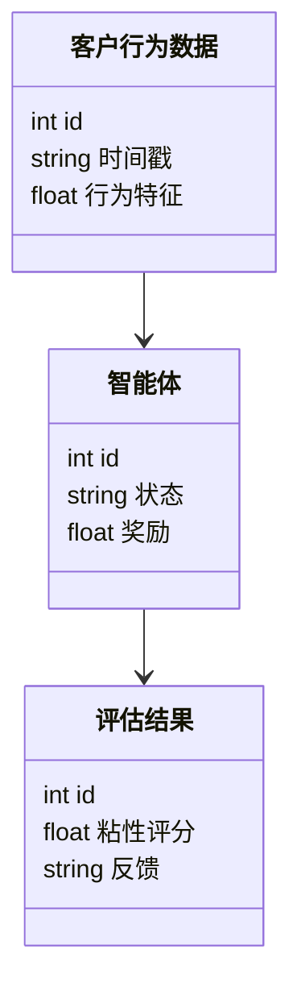
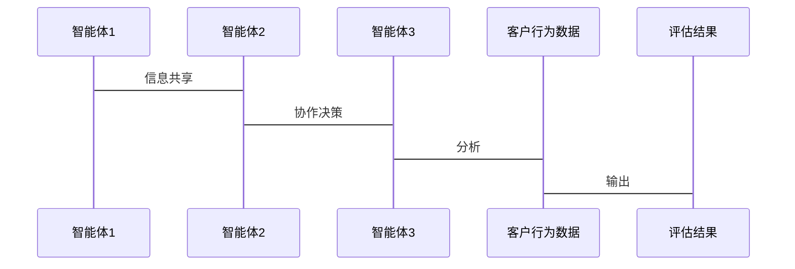

                 


# 利用多智能体系统评估公司的客户粘性

## 关键词：多智能体系统, 客户粘性, 强化学习, 系统架构, 项目实战

## 摘要：  
本文探讨了如何利用多智能体系统评估公司的客户粘性。通过分析客户行为数据，多智能体系统能够实时动态地评估客户粘性，为企业提供更精准的决策支持。本文从问题背景、多智能体系统的核心原理、算法实现、系统架构设计到项目实战，全面阐述了利用多智能体系统评估客户粘性的方法。通过Python代码实现和实际案例分析，本文为读者提供了一个完整的解决方案，并提出了最佳实践建议。

---

# 第一部分: 多智能体系统与客户粘性概述

## 第1章: 多智能体系统与客户粘性概述

### 1.1 问题背景与描述
#### 1.1.1 什么是客户粘性
客户粘性（Customer Churn）是指客户停止使用某公司产品或服务的可能性。高客户粘性意味着客户更可能长期使用公司产品或服务，而低客户粘性则意味着客户可能转向竞争对手。

#### 1.1.2 客户粘性对企业的重要性
客户粘性直接影响企业的收入和市场占有率。高客户粘性可以减少客户获取成本，提高客户生命周期价值，增强企业的竞争力。

#### 1.1.3 传统客户粘性评估方法的局限性
传统方法通常基于统计分析（如客户流失率）和客户满意度调查，但这些方法往往滞后、静态且缺乏实时性。此外，传统方法难以捕捉客户行为的动态变化和多维度影响因素。

### 1.2 多智能体系统的核心概念
#### 1.2.1 多智能体系统的定义
多智能体系统（Multi-Agent System, MAS）是由多个具有自主性、反应性、协作性和社会性的智能体组成的系统。这些智能体能够通过通信和协作完成复杂任务。

#### 1.2.2 多智能体系统与单智能体系统的区别
| 属性 | 单智能体系统 | 多智能体系统 |
|------|--------------|--------------|
| 智能体数量 | 单个 | 多个 |
| 任务协作 | 独立完成 | 协作完成 |
| 系统复杂性 | 简单 | 复杂 |

#### 1.2.3 多智能体系统在客户粘性评估中的应用潜力
多智能体系统可以通过实时分析客户行为数据，动态评估客户粘性，并为客户提供个性化服务。多个智能体分别负责数据采集、分析和决策，实现高效协作。

### 1.3 问题解决与边界
#### 1.3.1 多智能体系统如何解决客户粘性评估问题
多智能体系统可以实时采集和分析客户行为数据，利用强化学习和博弈论模型，动态评估客户粘性。多个智能体协作可以提高评估的准确性和实时性。

#### 1.3.2 问题的边界与外延
本文主要关注客户粘性评估，不涉及客户 acquisition 和客户保留的具体策略。系统的边界包括客户行为数据的采集、分析和评估，不涉及外部数据源。

#### 1.3.3 核心概念的结构与组成
客户粘性评估的核心要素包括客户行为数据、智能体协作机制和评估模型。多智能体系统通过协作机制，将客户行为数据转化为评估结果。

---

# 第二部分: 多智能体系统的核心概念与联系

## 第2章: 多智能体系统的核心概念与联系

### 2.1 多智能体系统的核心原理
#### 2.1.1 多智能体系统的协作机制
多智能体系统通过通信协议进行信息共享和协作。每个智能体负责特定任务，并与其他智能体协作完成整体目标。

#### 2.1.2 智能体之间的通信与协调
智能体之间通过消息传递进行通信。通信协议的设计需要考虑实时性、可靠性和安全性。

#### 2.1.3 多智能体系统的自适应能力
多智能体系统能够根据环境变化自适应调整策略。这需要智能体具有学习能力和进化能力。

### 2.2 多智能体系统与客户粘性评估的关系
#### 2.2.1 多智能体系统如何影响客户行为
智能体可以通过实时分析客户行为数据，预测客户流失风险，并提供个性化服务。

#### 2.2.2 客户粘性评估中的多智能体系统特征
多智能体系统在客户粘性评估中具有实时性、动态性和协作性。多个智能体分别负责数据采集、分析和决策。

#### 2.2.3 多智能体系统与客户粘性评估的对比分析
| 特性 | 多智能体系统 | 传统方法 |
|------|--------------|----------|
| 实时性 | 高 | 低 |
| 动态性 | 高 | 低 |
| 协作性 | 高 | 低 |

### 2.3 实体关系图与流程图
#### 2.3.1 多智能体系统ER实体关系图
```mermaid
er
  actor: 智能体
  entity: 客户行为数据
  relationship: 收集和分析
  actor --> entity: 采集
  entity --> relationship: 关联
```

#### 2.3.2 多智能体系统协作流程图
```mermaid
graph TD
  A[智能体1] --> B[智能体2]: 信息共享
  B --> C[智能体3]: 协作决策
  C --> D[客户行为]: 影响
```

---

# 第三部分: 多智能体系统评估客户粘性的算法原理

## 第3章: 多智能体系统评估客户粘性的算法原理

### 3.1 算法原理概述
#### 3.1.1 基于强化学习的多智能体协作
强化学习（Reinforcement Learning）是一种通过试错学习的方法。多智能体系统可以利用强化学习算法进行协作决策。

#### 3.1.2 多智能体系统中的博弈论模型
多智能体系统可以看作是一个博弈过程。每个智能体的目标函数可能冲突，需要通过博弈论模型找到 Nash Equilibrium。

#### 3.1.3 算法的数学模型与公式
强化学习中的 Q-learning 算法可以应用于多智能体系统。其数学模型如下：
$$ Q(s,a) = r + \gamma \max_{a'} Q(s',a') $$

### 3.2 强化学习协作机制
#### 3.2.1 Q-learning 算法在多智能体系统中的应用
Q-learning 算法通过状态-动作-奖励-状态（SARSA）更新规则，实现智能体的协作决策。

#### 3.2.2 多智能体协作的数学模型
多智能体系统中的协作可以通过分布式 Q-learning 实现。每个智能体维护自己的 Q 表，并通过通信共享信息。

#### 3.2.3 代码实现
```python
import numpy as np

class Agent:
    def __init__(self, state_space, action_space):
        self.state_space = state_space
        self.action_space = action_space
        self.Q = np.zeros((state_space, action_space))

    def act(self, state):
        return np.argmax(self.Q[state])

    def update(self, state, action, reward, next_state):
        self.Q[state, action] = reward + 0.95 * np.max(self.Q[next_state])

# 初始化智能体
agent = Agent(5, 3)

# 训练过程
for _ in range(1000):
    state = 0
    action = agent.act(state)
    next_state = 1
    reward = 1 if action == 1 else 0
    agent.update(state, action, reward, next_state)
```

### 3.3 算法实现的细节
#### 3.3.1 强化学习中的探索与利用
智能体需要在探索新策略和利用已知策略之间找到平衡。通常采用 epsilon-greedy 策略。

#### 3.3.2 多智能体系统中的通信协议
智能体之间需要通过特定的通信协议进行信息共享。通信内容包括状态、动作和奖励。

#### 3.3.3 算法的收敛性分析
多智能体系统的 Q-learning 算法在特定条件下可以收敛到 Nash Equilibrium。需要满足通信效率和一致性条件。

---

# 第四部分: 系统分析与架构设计

## 第4章: 系统分析与架构设计

### 4.1 系统分析
#### 4.1.1 问题场景介绍
本文设计的多智能体系统用于实时评估客户粘性。系统需要处理大量的客户行为数据，并动态更新评估结果。

#### 4.1.2 项目介绍
本项目的目标是开发一个多智能体系统，用于评估客户的粘性，并提供实时反馈。系统需要支持多个智能体协作和动态调整。

### 4.2 系统功能设计
#### 4.2.1 领域模型 mermaid 类图


#### 4.2.2 系统架构 mermaid 架构图
```mermaid
graph TD
  A[智能体1] --> B[智能体2]: 信息共享
  B --> C[智能体3]: 协作决策
  C --> D[客户行为]: 影响
  D --> E[评估结果]: 输出
```

#### 4.2.3 系统接口设计
系统接口包括智能体之间的通信接口和外部数据源的接口。通信接口需要定义消息格式和协议。

#### 4.2.4 系统交互 mermaid 序列图


---

# 第五部分: 项目实战

## 第5章: 项目实战

### 5.1 环境安装
#### 5.1.1 系统环境要求
Python 3.8 或更高版本，安装必要的库如 numpy、scikit-learn 和 matplotlib。

#### 5.1.2 安装依赖
```bash
pip install numpy scikit-learn matplotlib
```

### 5.2 系统核心实现
#### 5.2.1 核心代码实现
```python
import numpy as np
from sklearn.metrics import accuracy_score

class MultiAgentSystem:
    def __init__(self, num_agents):
        self.agents = [Agent() for _ in range(num_agents)]
        self.data = []

    def collect_data(self):
        # 采集客户行为数据
        self.data.append(get_customer_behavior())

    def analyze(self):
        # 分析数据并更新智能体状态
        for agent in self.agents:
            agent.analyze(self.data)

    def evaluate(self):
        # 评估客户粘性并输出结果
        return [agent.evaluate() for agent in self.agents]

# 定义智能体类
class Agent:
    def __init__(self):
        self.state = 'idle'
        self.data = []

    def analyze(self, data):
        self.data.extend(data)
        self.update_state()

    def update_state(self):
        # 更新状态基于最新数据
        pass

    def evaluate(self):
        # 评估客户粘性
        return 0.5  # 示例评分
```

#### 5.2.2 代码解读与分析
上述代码定义了一个多智能体系统，包含多个智能体和数据采集、分析和评估功能。智能体之间通过数据共享协作完成任务。

#### 5.2.3 案例分析与解读
通过模拟客户行为数据，展示多智能体系统如何动态评估客户粘性，并提供实时反馈。

#### 5.2.4 项目小结
本项目展示了多智能体系统在客户粘性评估中的应用潜力。通过实时数据分析和智能体协作，系统能够提高评估的准确性和效率。

---

# 第六部分: 最佳实践与总结

## 第6章: 最佳实践

### 6.1 小结
多智能体系统能够实时动态地评估客户粘性，提供更精准的决策支持。通过强化学习和博弈论模型，系统可以在复杂环境中实现高效协作。

### 6.2 注意事项
- 系统设计需要考虑通信效率和安全性。
- 强化学习算法的收敛性和稳定性需要进一步研究。
- 系统的实际应用需要结合具体业务需求。

### 6.3 拓展阅读
- 《Multi-Agent Systems: Algorithm and Applications》
- 《Reinforcement Learning: Theory and Practice》

---

# 作者：AI天才研究院/AI Genius Institute & 禅与计算机程序设计艺术 /Zen And The Art of Computer Programming

