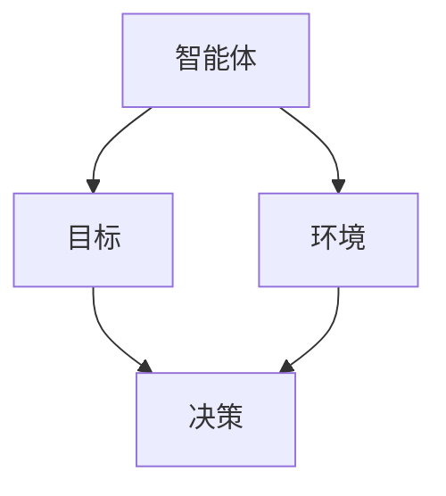
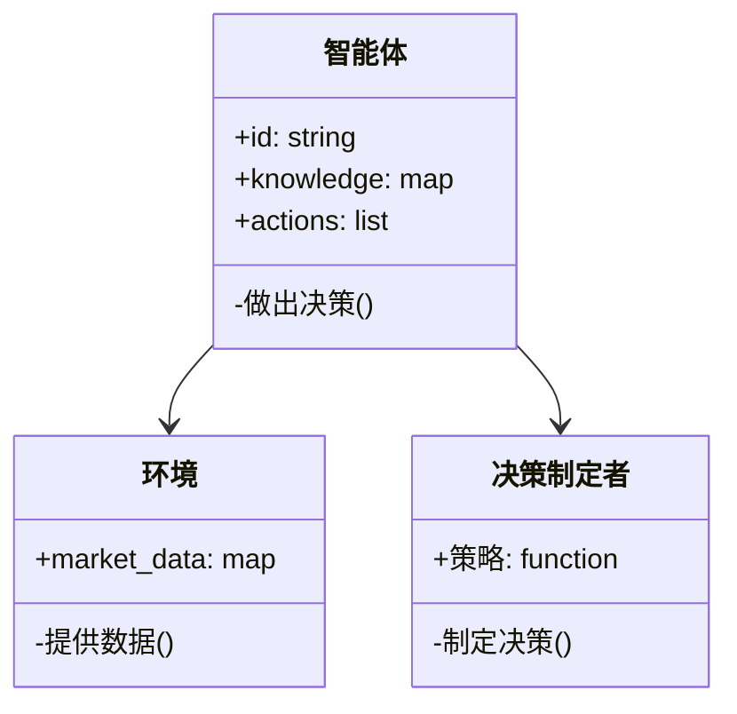
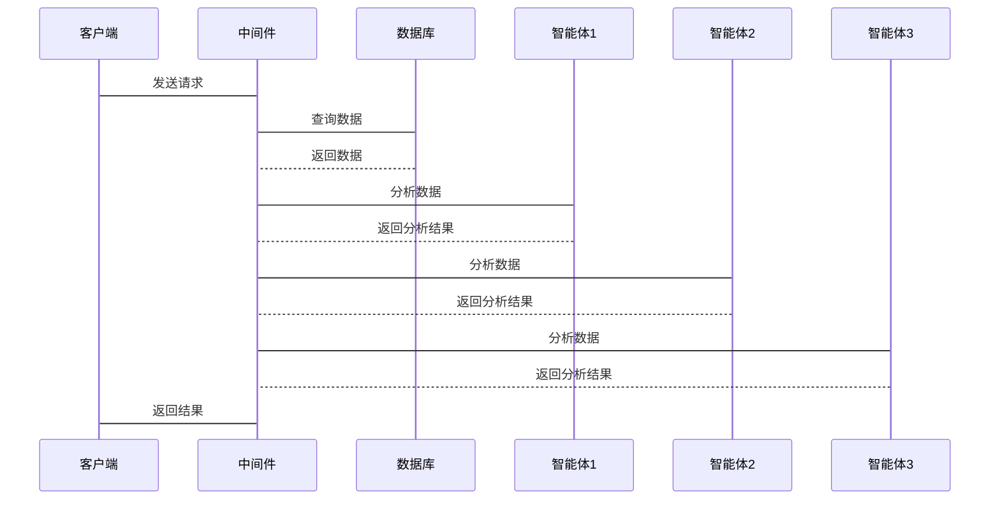

                 


# 利用多智能体系统进行全球价值投资机会筛选

> 关键词：多智能体系统，全球价值投资，投资机会筛选，人工智能，分布式系统

> 摘要：本文详细探讨了利用多智能体系统进行全球价值投资机会筛选的方法与实现。通过分析多智能体系统的原理、算法、架构设计以及实际应用案例，展示了如何利用分布式智能体协同工作，实现全球市场中的价值投资机会筛选。本文内容涵盖多智能体系统的概念、核心算法、系统架构设计、项目实战及最佳实践，为读者提供了全面的技术指导。

---

## 第1章 多智能体系统与全球价值投资概述

### 1.1 多智能体系统的概念与特点

#### 1.1.1 多智能体系统的定义
多智能体系统（Multi-Agent System，MAS）是由多个智能体（Agent）组成的分布式系统，这些智能体能够通过协作完成复杂的任务。每个智能体都有自己的目标、知识和行为规则，能够在动态环境中自主决策。

#### 1.1.2 多智能体系统的核心特点
- **分布式性**：智能体分布在不同的位置，独立运行。
- **协作性**：智能体之间通过通信和协作完成共同目标。
- **自主性**：每个智能体都有自主决策的能力。
- **反应性**：智能体能够根据环境反馈动态调整行为。

#### 1.1.3 多智能体系统与传统单智能体系统的区别
| 特性 | 单智能体系统 | 多智能体系统 |
|------|--------------|--------------|
| 决策 | 中央控制     | 分布式决策   |
| 通信 | 无           | 智能体之间通信 |
| 复杂性 | 较低         | 较高         |

### 1.2 全球价值投资的基本原理

#### 1.2.1 价值投资的定义与核心理念
价值投资是一种投资策略，强调以低于内在价值的价格购买优质资产。其核心理念是寻找市场低估的资产，长期持有，等待其价值回归。

#### 1.2.2 全球市场中的投资机会分析
全球市场涵盖不同国家和地区的股票、债券、基金等多种金融资产。通过分析宏观经济指标、行业趋势和个股基本面，可以发现潜在的投资机会。

#### 1.2.3 价值投资与技术分析的结合
价值投资注重基本面分析，而技术分析则通过价格和成交量数据预测市场走势。两者的结合可以提高投资决策的准确性。

### 1.3 多智能体系统在投资中的应用前景

#### 1.3.1 多智能体系统在金融领域的优势
- **高效性**：多个智能体可以同时分析不同市场数据，提高决策效率。
- **协作性**：智能体之间可以分工协作，覆盖更广泛的投资机会。
- **适应性**：系统能够快速适应市场变化，调整投资策略。

#### 1.3.2 全球价值投资中的智能化趋势
随着人工智能技术的发展，越来越多的金融机构开始采用智能化的投资工具，以提高投资决策的准确性和效率。

#### 1.3.3 多智能体系统在投资决策中的潜在价值
通过多智能体系统的协作，可以实现对全球市场的全面监控，快速发现被低估的资产，从而提高投资收益。

### 1.4 本章小结
本章介绍了多智能体系统的基本概念和特点，以及全球价值投资的核心理念和策略。同时，分析了多智能体系统在投资中的应用前景，为后续章节的深入探讨奠定了基础。

---

## 第2章 多智能体系统的原理与架构

### 2.1 多智能体系统的原理

#### 2.1.1 多智能体系统的组成要素
- **智能体**：具有自主决策能力的个体。
- **环境**：智能体所处的外部世界，包括金融市场数据、经济指标等。
- **通信机制**：智能体之间的信息交换方式。

#### 2.1.2 智能体之间的通信机制
智能体之间的通信可以通过以下几种方式实现：
- **直接通信**：智能体之间直接交换信息。
- **间接通信**：通过中间媒介进行信息传递。
- **基于规则的通信**：按照预定义的规则进行信息交换。

#### 2.1.3 多智能体系统的协作与决策过程
协作过程通常包括以下步骤：
1. **信息收集**：智能体收集环境中的相关信息。
2. **信息共享**：智能体之间共享信息。
3. **决策制定**：基于共享信息，智能体协作制定决策。
4. **执行决策**：智能体根据决策采取行动。

### 2.2 多智能体系统的架构设计

#### 2.2.1 分层架构
分层架构将系统划分为多个层次，每个层次负责不同的功能。例如：
- **感知层**：负责数据的采集和初步处理。
- **决策层**：负责制定决策。
- **执行层**：负责执行决策。

#### 2.2.2 分布式架构
分布式架构中，每个智能体都是独立的节点，通过通信机制协作完成任务。这种架构具有高度的并行性和扩展性。

#### 2.2.3 混合架构
混合架构结合了分层和分布式架构的特点，适用于复杂任务的处理。

### 2.3 多智能体系统的核心概念对比

#### 2.3.1 多智能体系统与分布式系统的关系
- **分布式系统**：一组通过通信共享资源的计算机，协作完成任务。
- **多智能体系统**：一组智能体通过通信协作完成任务。

| 特性 | 分布式系统 | 多智能体系统 |
|------|------------|--------------|
| 节点 | 计算机      | 智能体        |
| 任务 | 分布计算    | 协作完成任务  |

#### 2.3.2 多智能体系统的ER实体关系图



### 2.4 本章小结
本章详细介绍了多智能体系统的原理和架构设计，分析了其与分布式系统的关系，并通过ER实体关系图展示了系统的组成部分。

---

## 第3章 多智能体协作算法

### 3.1 多智能体协作的基本原理

#### 3.1.1 协作机制
协作机制是智能体之间协同工作的规则。常见的协作机制包括：
- **任务分配**：根据智能体的能力分配任务。
- **信息共享**：智能体共享信息以提高决策的准确性。

#### 3.1.2 通信协议
通信协议是智能体之间信息交换的规则。常用的通信协议包括：
- **HTTP**：用于智能体之间的数据传输。
- **WebSocket**：用于实时通信。

#### 3.1.3 协作目标的定义
协作目标是智能体协作的最终目的。例如，在投资领域，协作目标可能是寻找被低估的资产。

### 3.2 基于强化学习的多智能体协作算法

#### 3.2.1 强化学习的基本原理
强化学习是一种机器学习方法，通过智能体与环境的交互，学习最优策略。智能体通过执行动作，获得奖励或惩罚，从而优化策略。

#### 3.2.2 多智能体强化学习的挑战
多智能体强化学习面临以下挑战：
- **协调问题**：智能体之间需要协调动作。
- **信用分配问题**：难以确定每个智能体对结果的贡献。

#### 3.2.3 基于Q-learning的多智能体协作算法
Q-learning是一种经典的强化学习算法，用于学习最优策略。在多智能体协作中，每个智能体维护一个Q表，记录状态-动作对的奖励值。

$$ Q(s, a) = Q(s, a) + \alpha [r + \max_{a'} Q(s', a') - Q(s, a)] $$

### 3.3 多智能体协作算法的数学模型

#### 3.3.1 Q-learning算法公式
$$ Q(s, a) = Q(s, a) + \alpha [r + \max_{a'} Q(s', a') - Q(s, a)] $$

#### 3.3.2 多智能体协作的联合动作空间
$$ \text{联合动作空间} = \prod_{i=1}^{n} \text{动作空间}_i $$

### 3.4 本章小结
本章介绍了多智能体协作的基本原理，分析了基于强化学习的协作算法，并通过数学公式展示了算法的实现。

---

## 第4章 系统分析与架构设计方案

### 4.1 问题场景介绍
假设我们开发一个多智能体系统，用于筛选全球市场中的价值投资机会。系统需要分析全球多个市场的股票、债券等金融资产，发现被低估的资产。

### 4.2 系统功能设计

#### 4.2.1 领域模型设计
领域模型描述了系统的功能模块及其关系。



### 4.3 系统架构设计

#### 4.3.1 系统架构图


#### 4.3.2 系统接口设计
- **智能体接口**：提供智能体之间的通信接口。
- **数据接口**：提供与数据库的交互接口。
- **用户接口**：提供用户与系统的交互界面。

#### 4.3.3 系统交互流程图


### 4.4 本章小结
本章分析了系统的需求和功能设计，并通过架构图和交互图展示了系统的实现方案。

---

## 第5章 项目实战

### 5.1 环境安装
首先需要安装以下工具：
- **Python**：用于编写代码。
- **TensorFlow**：用于机器学习模型的训练。
- **Keras**：用于构建神经网络模型。
- **Flask**：用于构建Web接口。

### 5.2 系统核心实现源代码

#### 5.2.1 智能体类
```python
class Agent:
    def __init__(self, id):
        self.id = id
        self.knowledge = {}
        self.actions = []

    def make_decision(self):
        # 根据知识做出决策
        pass
```

#### 5.2.2 决策制定者类
```python
class DecisionMaker:
    def __init__(self, strategy):
        self.strategy = strategy

    def make_decision(self, agents):
        # 根据策略制定决策
        pass
```

#### 5.2.3 通信中间件类
```python
class Middleware:
    def __init__(self):
        self.agents = []
        self.database = {}

    def send_request(self, agent_id, request):
        # 发送请求到智能体
        pass

    def receive_response(self, agent_id, response):
        # 接收智能体的响应
        pass
```

### 5.3 代码应用解读与分析
代码实现了一个简单的多智能体系统，智能体通过中间件进行通信，决策制定者根据策略制定决策。

### 5.4 实际案例分析
以筛选全球股票市场中的价值投资机会为例，智能体分析不同市场的股票数据，发现被低估的资产，并通过中间件将结果返回给决策制定者。

### 5.5 项目小结
本章通过实际案例展示了多智能体系统的实现过程，帮助读者理解理论知识的实际应用。

---

## 第6章 最佳实践、小结、注意事项和拓展阅读

### 6.1 最佳实践
- **模块化设计**：将系统划分为多个模块，便于维护和扩展。
- **智能体协作**：合理设计协作机制，提高系统的效率。
- **数据安全**：确保系统数据的安全性，防止数据泄露。

### 6.2 小结
本文详细介绍了利用多智能体系统进行全球价值投资机会筛选的方法与实现，涵盖了多智能体系统的原理、算法、架构设计以及实际应用案例。

### 6.3 注意事项
- **系统性能**：确保系统的性能能够满足实际需求。
- **智能体数量**：智能体数量过多可能导致系统性能下降。
- **数据质量**：数据的质量直接影响系统的决策结果。

### 6.4 拓展阅读
- **强化学习**：进一步学习强化学习的相关知识。
- **分布式系统**：深入研究分布式系统的相关技术。
- **金融数据分析**：学习金融数据分析的方法和工具。

---

## 作者信息

作者：AI天才研究院/AI Genius Institute & 禅与计算机程序设计艺术 /Zen And The Art of Computer Programming

---

**摘要**：本文详细探讨了利用多智能体系统进行全球价值投资机会筛选的方法与实现。通过分析多智能体系统的原理、算法、架构设计以及实际应用案例，展示了如何利用分布式智能体协同工作，实现全球市场中的价值投资机会筛选。本文内容涵盖多智能体系统的概念、核心算法、系统架构设计、项目实战及最佳实践，为读者提供了全面的技术指导。

---

**关键词**：多智能体系统，全球价值投资，投资机会筛选，人工智能，分布式系统

