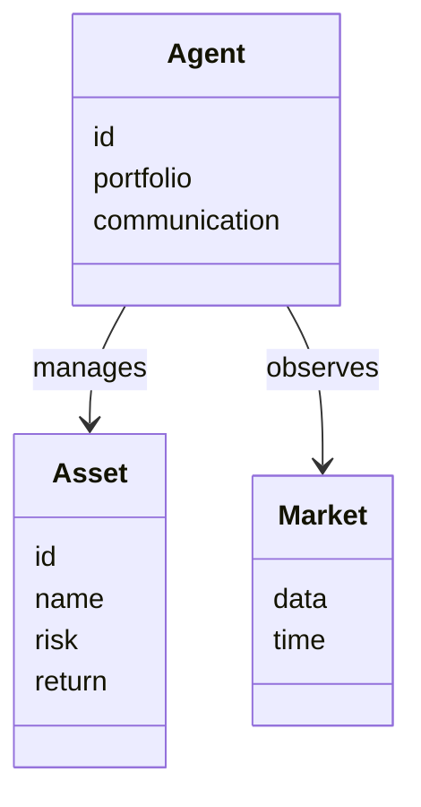
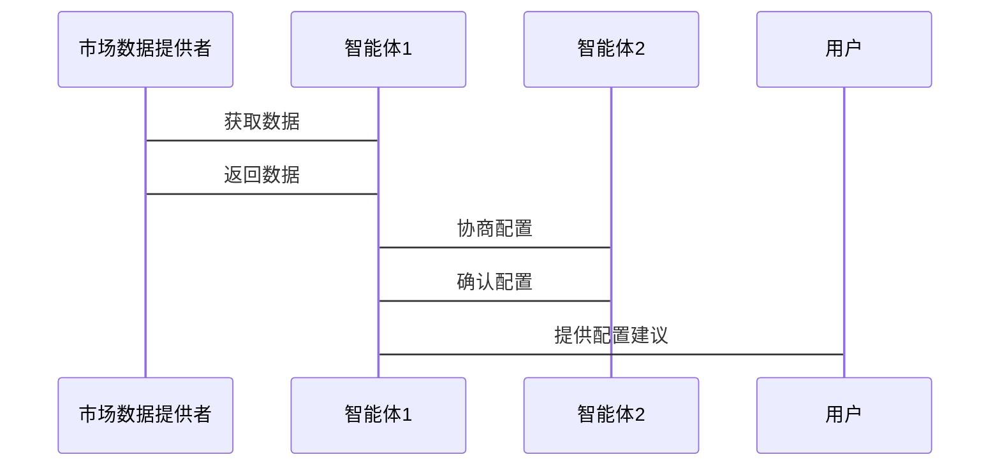

                 


# 利用多智能体系统进行全球资产配置：价值投资的国际化

> 关键词：多智能体系统，全球资产配置，价值投资，算法优化，分布式决策

> 摘要：随着全球化的深入，价值投资的国际化趋势日益明显，多智能体系统在其中扮演了重要角色。本文探讨了多智能体系统在资产配置中的应用，分析了其核心原理、优化算法、系统架构，并通过实战案例展示了如何实现基于多智能体的全球化资产配置。文章最后给出了最佳实践和未来研究方向。

---

## 第1章: 多智能体系统与价值投资的国际化

### 1.1 多智能体系统的定义与特点

#### 1.1.1 多智能体系统的定义
多智能体系统（Multi-Agent System, MAS）是由多个智能体（Agent）组成的分布式系统，每个智能体能够独立感知环境、做出决策并采取行动。智能体之间通过通信和协作，共同完成复杂的任务。

#### 1.1.2 多智能体系统的特征
- **分布式性**：智能体独立运行，不存在中心节点。
- **协作性**：智能体之间通过协作实现全局目标。
- **动态性**：系统环境和智能体状态动态变化。
- **自主性**：智能体具备自主决策能力。

#### 1.1.3 多智能体系统与传统单智能体系统的区别
传统的资产配置模型通常基于单智能体系统，依赖中心化的计算和决策。而多智能体系统通过分布式决策和协作，能够更好地应对复杂多变的全球市场环境。

### 1.2 价值投资的国际化趋势

#### 1.2.1 价值投资的基本概念
价值投资是一种投资策略，强调以低于内在价值的价格购买优质资产。其核心在于寻找市场低估的资产，并长期持有。

#### 1.2.2 全球化背景下价值投资的发展
随着全球经济一体化，投资者需要在全球范围内配置资产，以分散风险并抓住不同市场的投资机会。

#### 1.2.3 资产配置的国际化需求
全球化使得资产配置的复杂性增加，投资者需要考虑不同国家的经济政策、市场波动和资产特性。多智能体系统能够帮助投资者在全球范围内动态调整资产配置。

### 1.3 多智能体系统在资产配置中的应用前景

#### 1.3.1 资产配置的核心问题
资产配置需要考虑的风险收益平衡、资产流动性、市场波动性等因素。多智能体系统能够通过分布式计算和协作优化这些问题。

#### 1.3.2 多智能体系统在资产配置中的优势
- **分布式决策**：多个智能体分别负责不同资产类别的配置。
- **动态调整**：系统能够实时根据市场变化进行调整。
- **风险分散**：通过多智能体协作，降低单一资产带来的风险。

#### 1.3.3 应用中的挑战与机遇
- **挑战**：智能体之间的通信与协作效率、系统的实时性要求。
- **机遇**：通过技术创新提升系统性能，实现更优的资产配置。

---

## 第2章: 多智能体系统的原理与核心概念

### 2.1 多智能体系统的结构与组成

#### 2.1.1 智能体的定义与角色
智能体是多智能体系统的基本单元，负责特定任务的感知、决策和执行。在资产配置中，每个智能体可以代表一种资产类别或市场区域。

#### 2.1.2 多智能体系统的层次结构
- **感知层**：智能体感知市场数据。
- **决策层**：智能体基于感知数据做出决策。
- **执行层**：智能体执行决策并反馈结果。

#### 2.1.3 智能体之间的协作机制
智能体之间通过通信协议交换信息，共同完成资产配置任务。协作机制包括任务分配、信息共享和决策协调。

### 2.2 资产配置的核心要素

#### 2.2.1 资产类别与风险特征
不同资产类别（股票、债券、商品等）具有不同的风险收益特征。多智能体系统需要根据这些特征进行动态配置。

#### 2.2.2 资产分配的数学模型
资产配置通常基于现代投资组合理论（MPT），通过优化模型确定最优资产组合。

#### 2.2.3 资产配置的动态调整
市场环境变化需要实时调整资产配置。多智能体系统能够快速响应市场变化，实现动态优化。

### 2.3 多智能体系统与资产配置的结合

#### 2.3.1 多智能体系统的分布式决策
每个智能体负责特定资产类别的配置决策，通过协作实现全局优化。

#### 2.3.2 资产配置的多目标优化
多智能体系统能够同时优化多个目标，如风险最小化、收益最大化等。

#### 2.3.3 系统的实时反馈与调整
智能体能够实时接收市场反馈，快速调整配置策略。

---

## 第3章: 资产配置的数学模型与优化方法

### 3.1 现代投资组合理论

#### 3.1.1 均值-方差优化模型
现代投资组合理论的核心是通过优化资产的预期收益和风险，找到最优资产组合。数学模型如下：

$$ \text{目标：} \min \sigma^2 \quad \text{在约束条件下} $$

其中，$\sigma^2$表示投资组合的方差，表示风险。

#### 3.1.2 Markowitz有效前沿
Markowitz有效前沿描述了在给定风险水平下，能够获得的最大收益的资产组合。通过多智能体系统的协作，可以更高效地计算有效前沿。

#### 3.1.3 风险调整后的收益最大化
在多智能体系统中，每个智能体可以根据自身的风险承受能力，调整资产配置比例。

### 3.2 动态资产配置模型

#### 3.2.1 时间序列分析
动态资产配置需要考虑资产价格的时间序列特征，如趋势、周期性等。

#### 3.2.2 动态规划方法
动态规划是一种优化策略，适用于多阶段决策问题。在多智能体系统中，每个智能体可以使用动态规划方法进行局部优化。

---

## 第4章: 多智能体系统的算法实现

### 4.1 分布式优化算法

#### 4.1.1 分布式计算框架
多智能体系统需要高效的分布式计算框架，如分布式优化算法、异步更新等。

#### 4.1.2 并行计算与协作
通过并行计算和协作，多个智能体可以同时处理不同的资产类别，提高计算效率。

### 4.2 资产配置的多目标优化

#### 4.2.1 多目标优化算法
多目标优化算法如非支配排序遗传算法（NSGA），适用于多智能体系统中的多目标优化问题。

#### 4.2.2 贸易-off曲线
贸易-off曲线展示了在多目标优化中，不同目标之间的权衡关系。

### 4.3 系统实现与代码示例

#### 4.3.1 环境安装
需要安装的工具和库包括Python、NumPy、Pandas、Plotly等。

#### 4.3.2 核心代码实现
以下是一个基于多智能体系统的资产配置代码示例：

```python
import numpy as np
import pandas as pd

# 定义智能体类
class Agent:
    def __init__(self, assets):
        self.assets = assets
        self.portfolio = None

    def optimize(self, risk_aversion):
        # 假设这是一个简单的优化函数
        # 这里可以根据风险厌恶系数调整资产配置
        pass

# 初始化多个智能体
assets_list = ['股票', '债券', '商品']
agents = [Agent(assets) for assets in assets_list]

# 分布式优化过程
for agent in agents:
    agent.optimize(risk_aversion=0.5)

# 收敛检查与调整
# 这里需要实现一个收敛机制，确保所有智能体的决策一致
```

---

## 第5章: 系统架构与设计

### 5.1 问题场景介绍

#### 5.1.1 资产配置的复杂性
全球资产配置需要考虑多个市场、多种资产类别和动态的经济环境。

#### 5.1.2 系统需求
- 实时数据处理
- 分布式计算
- 高效通信

### 5.2 系统功能设计

#### 5.2.1 领域模型
使用mermaid图展示系统中的实体关系：



#### 5.2.2 系统架构设计
使用mermaid图展示系统架构：


#### 5.2.3 系统接口设计
系统接口包括数据接口、通信接口和用户接口，确保智能体之间的高效协作。

#### 5.2.4 系统交互流程
使用mermaid图展示系统交互流程：



---

## 第6章: 项目实战

### 6.1 环境安装

#### 6.1.1 安装Python
安装Python 3.8及以上版本。

#### 6.1.2 安装依赖库
安装NumPy、Pandas、Plotly等库：

```bash
pip install numpy pandas plotly
```

### 6.2 核心代码实现

#### 6.2.1 多智能体系统的实现
以下是多智能体系统的实现代码：

```python
import numpy as np
import pandas as pd
import plotly.express as px

class Agent:
    def __init__(self, market_data):
        self.market_data = market_data
        self.portfolio = None

    def update_portfolio(self, risk_aversion):
        # 简单的优化策略，假设市场数据为DataFrame
        returns = self.market_data['return']
        risks = self.market_data['risk']
        # 根据风险厌恶系数调整权重
        weights = np.exp(-risk_aversion * risks)
        weights /= weights.sum()
        self.portfolio = {'weights': weights, 'returns': returns}

def main():
    # 生成假想的市场数据
    market_data = pd.DataFrame({
        '资产': ['股票', '债券', '商品'],
        'return': [0.1, 0.05, 0.08],
        'risk': [0.2, 0.1, 0.15]
    })
    # 初始化智能体
    agent = Agent(market_data)
    # 更新投资组合
    agent.update_portfolio(risk_aversion=0.5)
    # 可视化结果
    weights = pd.DataFrame({
        '资产': ['股票', '债券', '商品'],
        '权重': agent.portfolio['weights']
    })
    fig = px.bar(weights, x='资产', y='权重')
    fig.show()

if __name__ == "__main__":
    main()
```

### 6.3 案例分析与解读

#### 6.3.1 案例分析
假设我们有三个资产类别：股票、债券和商品。通过多智能体系统的优化，找到最优的资产配置比例。

#### 6.3.2 可视化结果
使用Plotly将优化结果可视化，展示不同资产的权重和预期收益。

### 6.4 项目小结

---

## 第7章: 最佳实践与总结

### 7.1 最佳实践

#### 7.1.1 系统设计
确保系统架构的可扩展性和可维护性。

#### 7.1.2 算法优化
选择适合多智能体系统的优化算法，提高计算效率。

#### 7.1.3 数据管理
确保数据的实时性和准确性，采用高效的分布式数据管理方法。

### 7.2 小结

#### 7.2.1 核心观点回顾
多智能体系统通过分布式决策和协作优化，能够有效解决全球资产配置中的复杂问题。

#### 7.2.2 未来研究方向
- 更高效的分布式优化算法
- 更智能的协作机制
- 更实时的市场数据处理

### 7.3 注意事项

#### 7.3.1 系统的实时性要求
多智能体系统需要实时处理市场数据，确保决策的及时性。

#### 7.3.2 智能体的通信效率
智能体之间的通信需要高效，避免成为系统瓶颈。

#### 7.3.3 系统的可扩展性
系统需要能够适应更多的智能体和更复杂的资产配置任务。

### 7.4 拓展阅读

#### 7.4.1 推荐书籍
- 《多智能体系统的算法与实现》
- 《现代投资组合理论与实务》

#### 7.4.2 推荐论文
- 分布式优化算法在资产配置中的应用
- 多智能体系统的协作机制研究

---

## 作者：AI天才研究院 & 禅与计算机程序设计艺术

---

这篇文章系统地介绍了多智能体系统在价值投资国际化中的应用，从理论到实践，全面探讨了相关的核心概念、算法实现和系统设计。希望对读者在理解和应用多智能体系统进行全球资产配置方面有所帮助。

