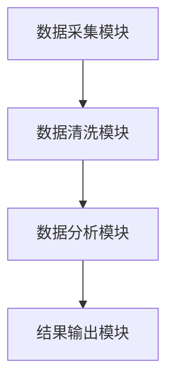

                 


# 利用多智能体系统进行全面的ESG因素分析

## 关键词：多智能体系统，ESG分析，环境因素，社会因素，治理因素，分布式计算，协作机制

## 摘要：  
随着全球对可持续发展的关注日益增加，企业和社会组织越来越依赖有效的ESG（环境、社会、治理）因素分析来评估和管理风险。传统的ESG分析方法往往依赖于人工判断和单一模型，难以应对数据复杂性高、分析维度多、实时性要求高等挑战。多智能体系统（Multi-Agent System, MAS）作为一种分布式、协作式的计算模型，能够有效解决这些问题。本文将深入探讨如何利用多智能体系统进行全面的ESG因素分析，包括系统设计、算法原理、应用场景和项目实现等方面，为读者提供清晰的思路和实践指导。

---

## 第1章：多智能体系统与ESG分析的背景介绍

### 1.1 多智能体系统的定义与特点  
多智能体系统由多个智能体组成，每个智能体具有自主性、反应性和协作性。其特点包括：  
1. **自主性**：智能体能够独立决策。  
2. **反应性**：智能体能实时感知环境并做出反应。  
3. **协作性**：智能体之间通过通信和协作完成共同目标。  
4. **分布式计算**：任务分布在多个智能体之间，避免单点故障。  

### 1.2 ESG因素分析的重要性  
ESG分析涉及环境、社会和治理三个维度，是企业风险管理、投资决策和可持续发展目标的重要工具。  
- **环境因素**：评估企业在资源使用、碳排放等方面的表现。  
- **社会因素**：关注企业在员工权益、社会责任等方面的表现。  
- **治理因素**：评估企业治理结构的透明度和有效性。  

### 1.3 多智能体系统在ESG分析中的结合意义  
传统的ESG分析依赖于人工判断和单一模型，难以应对数据复杂性和实时性要求。多智能体系统通过分布式计算和协作机制，能够高效处理多维度数据，提供更全面的分析结果。

---

## 第2章：多智能体系统的核心概念与原理

### 2.1 多智能体系统的结构与通信机制  
- **结构**：由多个智能体和环境组成，智能体之间通过通信模块进行交互。  
- **通信机制**：智能体之间通过共享信息或直接通信完成协作任务。  

### 2.2 多智能体系统的协作机制  
- **协作目标**：通过设定共同目标，确保智能体之间的协作。  
- **冲突解决**：在协作过程中，智能体可能因目标冲突而产生矛盾，需通过协商或优先级机制解决。  

### 2.3 多智能体系统的应用场景分析  
- **金融领域**：用于投资决策、风险评估。  
- **企业风险管理**：用于实时监控企业ESG表现。  
- **可持续发展目标**：用于制定和优化企业ESG战略。  

---

## 第3章：ESG因素分析的背景与框架

### 3.1 ESG因素的定义与分类  
- **环境因素(E)**：碳排放、能源使用、资源利用效率。  
- **社会因素(S)**：员工权益、社会责任、社区关系。  
- **治理因素(G)**：董事会结构、高管薪酬、企业透明度。  

### 3.2 ESG因素分析的重要性  
- **企业风险管理**：识别潜在风险，优化企业运营。  
- **投资决策**：帮助投资者评估企业的长期价值。  
- **可持续发展**：推动企业和社会的可持续发展。  

---

## 第4章：多智能体系统在ESG分析中的应用

### 4.1 多智能体系统的ESG数据处理流程  
1. **数据收集**：从多种数据源获取ESG相关数据。  
2. **数据清洗**：去除重复或错误数据，确保数据准确性。  
3. **数据分析**：通过算法评估企业的ESG表现。  
4. **结果输出**：生成分析报告或警报信号。  

### 4.2 基于多智能体系统的ESG分析框架  
- **智能体角色分配**：每个智能体负责特定任务，如数据清洗、风险评估等。  
- **协作流程**：智能体之间通过通信模块协同完成分析任务。  

---

## 第5章：多智能体系统的算法原理与实现

### 5.1 分布式计算与协作机制  
- **分布式计算**：任务分解到多个智能体，提高计算效率。  
- **协作机制**：智能体之间通过协商完成任务分配和结果整合。  

### 5.2 多智能体系统的数学模型  
- **收益函数**：$R(i) = \sum_{j} w_j \cdot s_j$，其中$w_j$为权重，$s_j$为指标得分。  
- **风险函数**：$Risk(i) = \sum_{k} f_k \cdot r_k$，其中$f_k$为风险因子，$r_k$为风险值。  

### 5.3 实现步骤  
1. **环境搭建**：安装所需库和工具。  
2. **智能体设计**：定义智能体的属性和行为。  
3. **算法实现**：编写分布式计算和协作逻辑。  
4. **测试与优化**：通过实际案例测试系统性能。  

---

## 第6章：系统架构设计与实现

### 6.1 系统功能设计  
- **数据采集模块**：从数据库或API获取ESG数据。  
- **分析模块**：对数据进行清洗、分析和评估。  
- **输出模块**：生成报告或警报信号。  

### 6.2 系统架构图  


### 6.3 接口设计与交互流程  
- **数据接口**：定义数据格式和通信协议。  
- **交互流程**：智能体之间通过接口进行数据传递和任务协作。  

---

## 第7章：项目实战与案例分析

### 7.1 项目背景  
假设我们为一家中型制造企业设计一个多智能体系统，用于实时监控和分析其ESG表现。  

### 7.2 核心代码实现  
```python
class Agent:
    def __init__(self, id):
        self.id = id
        self.data = {}
    
    def receive_data(self, data):
        self.data.update(data)
    
    def send_data(self, target, data):
        target.receive_data(data)
```

### 7.3 案例分析  
通过实际数据分析，验证多智能体系统在ESG分析中的优势。例如，识别企业在环境方面的潜在风险，并提出优化建议。  

### 7.4 项目总结  
总结项目实现过程中的经验教训，优化系统性能和功能。  

---

## 第8章：最佳实践与未来展望

### 8.1 最佳实践  
- **数据质量**：确保数据来源可靠，避免分析偏差。  
- **智能体协作**：合理分配任务，提高协作效率。  
- **系统优化**：定期更新算法和模型，适应新需求。  

### 8.2 未来展望  
多智能体系统在ESG分析中的应用前景广阔，未来可以通过引入更多智能体和更复杂的协作机制，进一步提升分析效率和准确性。

---

## 作者：AI天才研究院/AI Genius Institute & 禅与计算机程序设计艺术 /Zen And The Art of Computer Programming  

---

通过以上步骤，我们可以看到，多智能体系统为ESG因素分析提供了高效、灵活的解决方案。未来，随着技术的不断发展，多智能体系统在ESG分析中的应用将更加广泛和深入，为企业和社会创造更大的价值。

