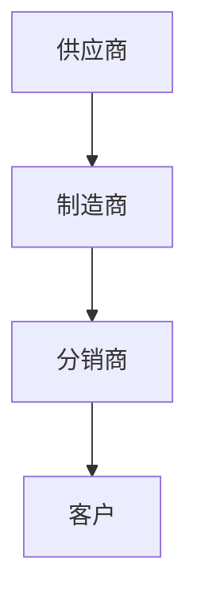
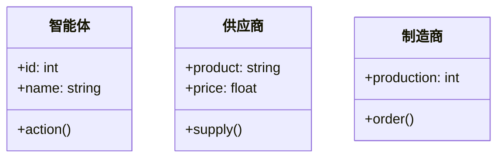
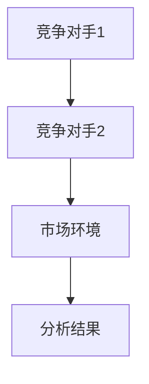
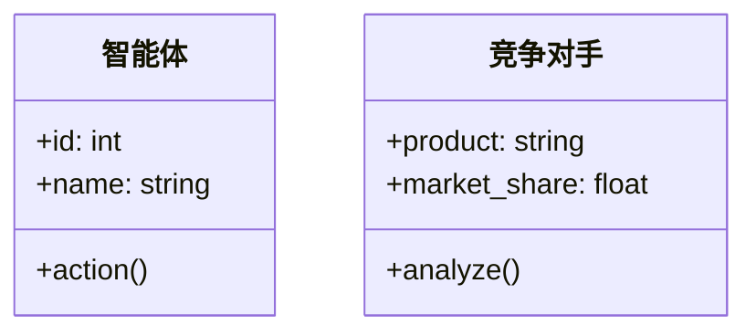
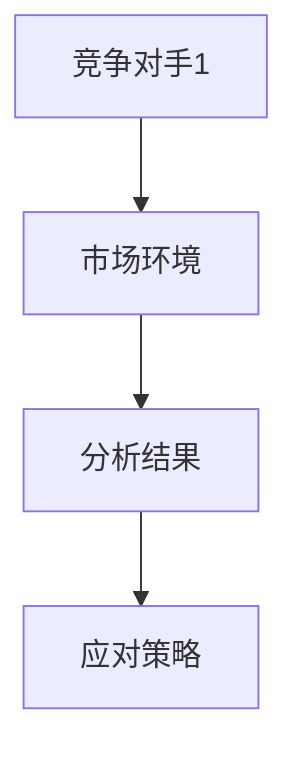

                 

# 利用多智能体系统进行全面的供应链和竞争对手分析

## 关键词：多智能体系统、供应链分析、竞争对手分析、分布式计算、协作算法

## 摘要：
本文深入探讨了多智能体系统在供应链和竞争对手分析中的应用，详细介绍了多智能体系统的基本概念、算法原理、系统架构以及实际应用案例。通过结合理论与实践，本文展示了如何利用多智能体系统实现供应链的高效管理和竞争对手的精准分析。

---

# 第一部分: 多智能体系统与供应链分析概述

## 第1章: 多智能体系统概述

### 1.1 多智能体系统的基本概念

#### 1.1.1 多智能体系统的定义
多智能体系统（Multi-Agent System, MAS）是由多个智能体（Agent）组成的系统，这些智能体能够通过协作完成复杂任务。智能体是具有感知、决策和行动能力的实体。

#### 1.1.2 多智能体系统的特征
- **自主性**：智能体能够自主决策。
- **反应性**：能够实时感知环境并做出反应。
- **协作性**：多个智能体协同工作，完成共同目标。
- **分布式性**：智能体分布在不同的位置，通过通信协作。

#### 1.1.3 多智能体系统与传统单智能体系统的区别
| 特性         | 单智能体系统      | 多智能体系统      |
|--------------|-------------------|-------------------|
| 结构         | 单一结构         | 分布式结构       |
| 协作         | 无需协作         | 需要协作         |
| 信息处理     | 中心化           | 分散化           |

### 1.2 多智能体系统的应用场景

#### 1.2.1 供应链管理中的多智能体系统
供应链中的多智能体可以分别代表供应商、制造商、分销商和客户。

#### 1.2.2 竞争对手分析中的多智能体系统
竞争对手分析中的多智能体可以代表市场分析、竞争对手行为分析和战略制定。

#### 1.2.3 其他领域中的多智能体系统应用
如交通管理、分布式计算等。

### 1.3 多智能体系统的优缺点

#### 1.3.1 优点
- **高效性**：通过分布式计算提高效率。
- **灵活性**：适应复杂环境的变化。
- **可扩展性**：易于扩展。

#### 1.3.2 缺点
- **复杂性**：协作和通信增加复杂性。
- **安全性**：通信可能存在安全隐患。

#### 1.3.3 适用场景分析
适用于需要多方协作且环境动态变化的场景。

### 1.4 本章小结
本章介绍了多智能体系统的基本概念、应用场景及其优缺点。

---

## 第2章: 供应链分析的多智能体建模

### 2.1 供应链的基本概念

#### 2.1.1 供应链的定义
供应链是连接供应商到客户的链条，包括生产、运输、存储等环节。

#### 2.1.2 供应链的主要组成部分
- 供应商
- 制造商
- 分销商
- 客户

#### 2.1.3 供应链的运作流程
从原材料采购到产品交付的全过程。

### 2.2 多智能体系统在供应链中的应用

#### 2.2.1 供应链中的多智能体角色
- 供应商智能体
- 制造商智能体
- 分销商智能体
- 客户智能体

#### 2.2.2 多智能体系统在供应链中的协作机制
通过信息共享和协同决策优化供应链效率。

#### 2.2.3 多智能体系统在供应链中的信息流
信息在各智能体之间实时传递，确保供应链各环节协调运作。

### 2.3 多智能体系统的供应链建模

#### 2.3.1 供应链的实体关系图

#### 2.3.2 供应链的类图

#### 2.3.3 供应链的流程图

### 2.4 本章小结
本章详细介绍了供应链的基本概念以及多智能体系统在供应链建模中的应用。

---

## 第3章: 竞争对手分析的多智能体建模

### 3.1 竞争对手分析的基本概念

#### 3.1.1 竞争对手分析的定义
分析竞争对手的市场行为、策略和产品，以制定应对策略。

#### 3.1.2 竞争对手分析的主要方法
包括SWOT分析、市场份额分析等。

#### 3.1.3 竞争对手分析的流程
收集数据、分析数据、制定策略。

### 3.2 多智能体系统在竞争对手分析中的应用

#### 3.2.1 竞争对手分析中的多智能体角色
- 市场分析智能体
- 行为分析智能体
- 战略制定智能体

#### 3.2.2 多智能体系统在竞争对手分析中的协作机制
通过信息共享和协作分析，实时监控竞争对手动态。

#### 3.2.3 多智能体系统在竞争对手分析中的信息流
信息在各智能体之间实时传递，确保分析的准确性和及时性。

### 3.3 多智能体系统的竞争对手建模

#### 3.3.1 竞争对手的实体关系图

#### 3.3.2 竞争对手的类图

#### 3.3.3 竞争对手的流程图

### 3.4 本章小结
本章详细介绍了竞争对手分析的基本概念以及多智能体系统在竞争对手建模中的应用。

---

## 第4章: 多智能体系统的算法原理

### 4.1 多智能体系统的算法概述

#### 4.1.1 分布式计算的基本原理
分布式计算将任务分解成多个部分，由不同的智能体协作完成。

#### 4.1.2 协作算法的基本原理
通过智能体之间的协作完成复杂任务。

#### 4.1.3 信息交换算法的基本原理
智能体之间通过信息交换实现协同。

### 4.2 多智能体系统的协作算法

#### 4.2.1 协作算法的分类
- 基于规则的协作算法
- 基于状态的协作算法
- 基于目标的协作算法

#### 4.2.2 协作算法的实现步骤
1. 定义协作目标
2. 确定协作规则
3. 实现协作逻辑

#### 4.2.3 协作算法的优缺点
- 优点：高效、灵活
- 缺点：复杂、难调试

### 4.3 多智能体系统的信息交换算法

#### 4.3.1 信息交换算法的分类
- 基于消息传递的信息交换
- 基于数据共享的信息交换

#### 4.3.2 信息交换算法的实现步骤
1. 确定通信协议
2. 设计信息格式
3. 实现通信机制

#### 4.3.3 信息交换算法的优缺点
- 优点：实时性强
- 缺点：通信开销大

### 4.4 本章小结
本章详细介绍了多智能体系统的算法原理，包括协作算法和信息交换算法。

---

## 第5章: 多智能体系统的数学模型与公式

### 5.1 多智能体系统的数学模型

#### 5.1.1 分布式计算的数学模型
$$C = \sum_{i=1}^{n} C_i$$
其中，$C$是总成本，$C_i$是各智能体的成本。

#### 5.1.2 协作算法的数学模型
$$P = \prod_{i=1}^{n} P_i$$
其中，$P$是总性能，$P_i$是各智能体的性能。

#### 5.1.3 信息交换算法的数学模型
$$I = \sum_{i=1}^{n} I_i$$
其中，$I$是总信息量，$I_i$是各智能体的信息量。

### 5.2 多智能体系统的公式推导

#### 5.2.1 分布式计算的公式推导
$$C = \sum_{i=1}^{n} C_i = \sum_{i=1}^{n} (a_i + b_i)$$
其中，$a_i$是智能体i的固定成本，$b_i$是可变成本。

#### 5.2.2 协作算法的公式推导
$$P = \prod_{i=1}^{n} P_i = \prod_{i=1}^{n} (p_i + \epsilon_i)$$
其中，$p_i$是智能体i的性能，$\epsilon_i$是改进部分。

#### 5.2.3 信息交换算法的公式
$$I = \sum_{i=1}^{n} I_i = \sum_{i=1}^{n} \frac{d_i}{t_i}$$
其中，$d_i$是智能体i的信息量，$t_i$是传输时间。

### 5.3 本章小结
本章通过数学模型和公式推导，详细介绍了多智能体系统的协作机制。

---

# 作者：AI天才研究院/AI Genius Institute & 禅与计算机程序设计艺术 /Zen And The Art of Computer Programming

