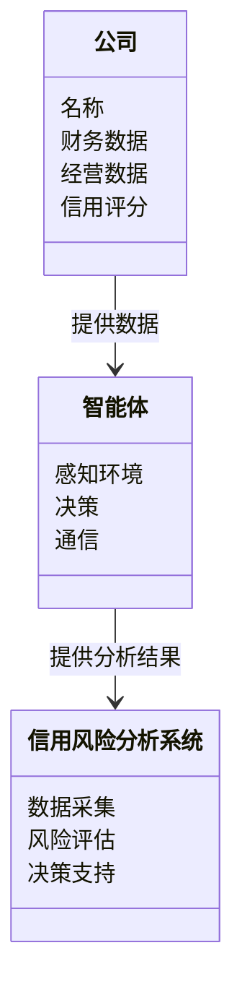
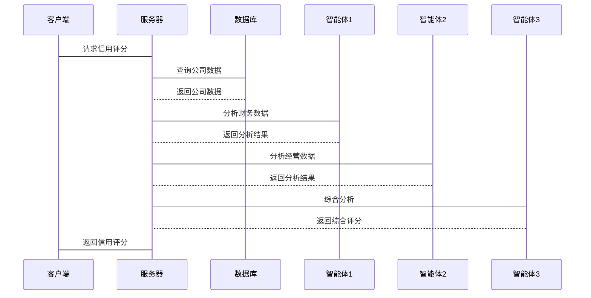

                 


# 利用多智能体系统进行全面的公司信用风险分析

## 关键词：多智能体系统、信用风险分析、算法原理、系统架构、项目实战

## 摘要：  
本文深入探讨了多智能体系统在公司信用风险分析中的应用，从背景、核心概念到算法实现，再到系统架构设计和项目实战，全面解析了如何利用多智能体系统进行高效的信用风险分析。通过详细的步骤讲解和实际案例分析，展示了多智能体系统在信用风险分析中的优势和实际应用价值。

---

## 第一部分：多智能体系统与信用风险分析的背景介绍

### 第1章：多智能体系统概述

#### 1.1 多智能体系统的定义与特点
多智能体系统（Multi-Agent System, MAS）是由多个智能体组成的分布式系统，这些智能体能够自主决策、协作完成任务。  
- **定义**：多智能体系统是指由多个智能体组成的分布式系统，每个智能体都有一定的自主性，能够感知环境、做出决策并与其他智能体协作完成任务。  
- **特点**：  
  - **自主性**：智能体能够自主决策，无需外部干预。  
  - **反应性**：智能体能够实时感知环境变化并做出反应。  
  - **协作性**：多个智能体能够通过通信和协作完成复杂任务。  
  - **分布式性**：智能体分布在不同的位置，通过网络进行通信。  

#### 1.2 信用风险分析的定义与重要性
信用风险分析是评估公司在信贷交易中可能面临的风险的过程。  
- **定义**：信用风险分析是通过分析公司的财务状况、市场环境和经营状况，评估公司在信贷交易中违约的可能性。  
- **重要性**：  
  - 信用风险分析是金融决策的重要依据，能够帮助金融机构降低风险，提高资金安全性。  
  - 信用风险分析能够帮助公司优化财务结构，提高经营效率。  

### 第2章：多智能体系统在信用风险分析中的应用背景
- **传统信用风险分析的局限性**：  
  - 数据获取的局限性：传统方法主要依赖财务数据，无法充分利用其他信息。  
  - 模型复杂性不足：传统模型难以处理多维度、复杂的数据。  
  - 多维度分析的缺失：传统方法难以全面考虑市场、客户和操作等多个维度的风险。  
- **多智能体系统的优势**：  
  - 分布式计算能力：多智能体系统能够分布处理大量数据，提高计算效率。  
  - 多维度数据处理：多智能体系统能够同时处理多个维度的数据，全面分析信用风险。  
  - 自适应性与实时性：多智能体系统能够实时感知环境变化，快速调整分析策略。  

---

## 第二部分：多智能体系统与信用风险分析的核心概念与联系

### 第3章：多智能体系统的原理与模型

#### 3.1 多智能体系统的原理
多智能体系统的原理主要包括分布式计算、协作与通信以及学习与自适应。  
- **分布式计算**：多智能体系统通过分布式计算，能够高效处理大量数据。  
- **协作与通信**：智能体之间通过通信协作，共同完成任务。  
- **学习与自适应**：智能体能够通过学习不断优化自身的决策能力。  

#### 3.2 多智能体系统的模型
多智能体系统的模型包括BDI模型、组织模型和协作模型。  
- **BDI模型**：基于信念、愿望和意图的模型，能够帮助智能体做出决策。  
- **组织模型**：通过组织结构和角色分配，明确智能体的职责。  
- **协作模型**：通过协作协议和通信机制，确保智能体之间的协作。  

### 第4章：信用风险分析的模型与方法

#### 4.1 信用评分模型
信用评分模型是信用风险分析的重要工具。  
- **线性回归模型**：通过线性回归模型，能够预测公司的信用评分。  
- **逻辑回归模型**：通过逻辑回归模型，能够预测公司违约的概率。  
- **风险评分卡**：通过评分卡，能够量化公司的信用风险。  

#### 4.2 信用风险的分类
信用风险可以分为客户信用风险、市场信用风险和操作信用风险。  
- **客户信用风险**：客户在信贷交易中违约的可能性。  
- **市场信用风险**：市场波动导致的信用风险。  
- **操作信用风险**：操作失误导致的信用风险。  

---

## 第三部分：算法原理与数学模型

### 第5章：多智能体协作算法

#### 5.1 多智能体协作的基本原理
多智能体协作的基本原理包括分布式计算、通信协议和协作任务分配。  
- **分布式计算流程**：智能体通过分布式计算，分别处理数据，然后汇总结果。  
- **通信协议**：智能体之间通过通信协议，进行信息交换和协作。  
- **协作任务分配**：通过任务分配算法，合理分配协作任务。  

#### 5.2 算法实现
以下是多智能体协作算法的实现步骤：  
1. 初始化智能体。  
2. 分配任务。  
3. 智能体协作完成任务。  
4. 汇总结果。  

### 第6章：信用评分模型的数学公式

#### 6.1 线性回归模型
线性回归模型是信用评分模型的基础。  
- 模型公式：$$ y = \beta_0 + \beta_1x_1 + \beta_2x_2 + ... + \beta_nx_n $$  
- 举例说明：假设我们有一个公司的财务数据，可以通过线性回归模型预测其信用评分。

#### 6.2 逻辑回归模型
逻辑回归模型是用于分类的模型。  
- 模型公式：$$ P(y=1|x) = \frac{e^{\beta_0 + \beta_1x_1 + ... + \beta_nx_n}}{1 + e^{\beta_0 + \beta_1x_1 + ... + \beta_nx_n}} $$  
- 举例说明：假设我们有一个公司的财务数据，可以通过逻辑回归模型预测其违约概率。

---

## 第四部分：系统分析与架构设计方案

### 第7章：问题场景介绍
- **问题场景**：公司需要进行信用风险分析，但传统方法难以满足需求。  
- **项目介绍**：利用多智能体系统，进行全面的信用风险分析。

### 第8章：系统功能设计

#### 8.1 领域模型
以下是领域模型的Mermaid类图：  


### 第9章：系统架构设计

#### 9.1 系统架构图
以下是系统架构图的Mermaid架构图：  


### 第10章：系统接口设计

#### 10.1 系统接口
以下是系统接口的Mermaid序列图：  


---

## 第五部分：项目实战

### 第11章：环境安装
- **Python安装**：安装Python 3.8及以上版本。  
- **库安装**：安装NumPy、Pandas、Scikit-learn等库。  

### 第12章：系统核心实现

#### 12.1 系统核心实现
以下是系统的核心实现代码：  
```python
import numpy as np
from sklearn.linear_model import LinearRegression

# 示例数据
X = np.array([[1], [2], [3], [4], [5]])
y = np.array([2, 4, 5, 4, 5])

# 训练模型
model = LinearRegression()
model.fit(X, y)

# 预测
print(model.predict(np.array([[6]])))
```

---

## 第六部分：总结与展望

### 第13章：总结
多智能体系统在信用风险分析中的应用具有显著优势，能够提高分析效率和准确性。通过多智能体系统的协作，能够全面分析信用风险，为金融机构和公司提供有力支持。

### 第14章：展望
未来，随着人工智能技术的发展，多智能体系统在信用风险分析中的应用将更加广泛。通过不断优化算法和系统架构，信用风险分析将更加智能化和高效化。

---

## 作者：AI天才研究院 & 禅与计算机程序设计艺术

---

通过本文的详细讲解，读者可以深入了解多智能体系统在信用风险分析中的应用，掌握相关算法和系统设计方法，并能够实际操作项目，提升信用风险分析的能力。

