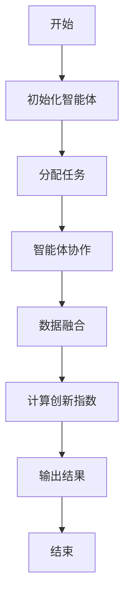
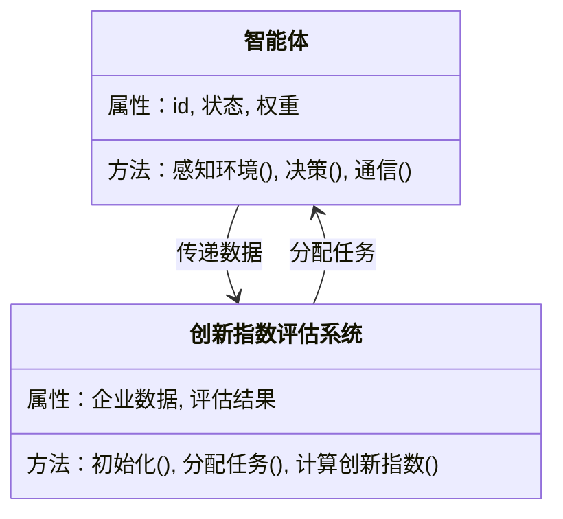

                 


# 利用多智能体系统进行全面的公司创新指数评估

> 关键词：多智能体系统、创新指数评估、分布式计算、协作学习、企业创新

> 摘要：本文详细探讨了利用多智能体系统进行公司创新指数评估的方法，从理论基础到实际应用，结合数学模型和算法原理，展示了如何通过多智能体系统的协作机制来实现对企业创新能力的全面评估。本文还提供了实际案例分析和系统架构设计，帮助读者理解并应用这一创新方法。

---

## 第1章: 多智能体系统与公司创新指数评估概述

### 1.1 多智能体系统的基本概念

#### 1.1.1 多智能体系统的定义
多智能体系统（Multi-Agent System, MAS）是由多个智能体（Agent）组成的分布式系统，这些智能体通过协作完成特定任务。每个智能体都有一定的自主性，能够感知环境、做出决策并与其他智能体进行通信和协作。

#### 1.1.2 多智能体系统的特征
- **自主性**：智能体能够自主决策。
- **反应性**：能够实时感知环境并做出反应。
- **协作性**：智能体之间可以协作完成任务。
- **分布性**：智能体分布在不同的位置，通过通信进行协作。

#### 1.1.3 多智能体系统的应用领域
- 机器人协作
- 智能交通系统
- 金融交易
- 企业创新评估

### 1.2 公司创新指数评估的背景与意义

#### 1.2.1 创新指数评估的定义
创新指数评估是通过对企业的创新能力、研发投入、知识产权、市场表现等多方面进行量化评估，以衡量企业创新能力的指标。

#### 1.2.2 创新指数评估的重要性
- 企业战略决策的重要依据。
- 为企业提供改进创新管理的方向。
- 为投资者提供评估企业价值的参考。

#### 1.2.3 利用多智能体系统进行创新指数评估的优势
- **分布式计算**：多智能体系统能够分布式处理数据，提高计算效率。
- **协作学习**：多个智能体可以从不同角度分析数据，提高评估的全面性。
- **动态适应**：智能体能够实时调整评估策略，适应变化的环境。

### 1.3 本章小结
本章介绍了多智能体系统的定义、特征及其应用领域，并详细阐述了创新指数评估的背景与意义，最后探讨了利用多智能体系统进行创新指数评估的优势。

---

## 第2章: 多智能体系统的核心概念与原理

### 2.1 多智能体系统的组成结构

#### 2.1.1 智能体的定义与分类
- **智能体**：能够感知环境、做出决策并采取行动的实体。
- **分类**：
  - **反应式智能体**：基于当前感知做出反应。
  - **认知式智能体**：具有推理和规划能力。

#### 2.1.2 多智能体系统的层次结构
- **物理层**：智能体与环境交互的物理载体。
- **逻辑层**：智能体的逻辑推理和决策过程。
- **通信层**：智能体之间的通信机制。

#### 2.1.3 多智能体系统中的通信机制
- **直接通信**：智能体之间直接交换信息。
- **间接通信**：通过中间媒介进行信息传递。
- **广播通信**：一个智能体向所有其他智能体发送信息。

### 2.2 多智能体系统的协作机制

#### 2.2.1 分布式计算与协作
- **分布式计算**：任务分解到多个智能体，分别处理后汇总结果。
- **协作协议**：智能体之间通过协议进行任务分配和结果共享。

#### 2.2.2 协作协议与规则
- **任务分配**：根据智能体的能力分配任务。
- **冲突解决**：当多个智能体争夺同一任务时，通过协商或优先级规则解决冲突。

#### 2.2.3 协作中的冲突解决
- **协商机制**：智能体通过协商达成一致。
- **仲裁机制**：由第三方仲裁解决冲突。

### 2.3 多智能体系统的创新指数评估模型

#### 2.3.1 创新指数的评估维度
- **研发投入**：企业的研发支出占总收入的比例。
- **知识产权**：企业的专利数量和质量。
- **市场表现**：企业的产品创新对市场的影响。
- **团队能力**：企业的创新能力与团队能力。

#### 2.3.2 多智能体系统在创新指数评估中的角色
- **数据采集智能体**：负责采集企业的创新相关数据。
- **分析智能体**：对数据进行分析，生成评估结果。
- **协作智能体**：协调其他智能体的工作，确保评估过程顺利进行。

#### 2.3.3 多智能体系统与创新指数评估的结合
- **数据融合**：多个智能体从不同角度采集数据，进行融合。
- **分布式计算**：利用多智能体的分布式计算能力，提高评估效率。

### 2.4 本章小结
本章详细探讨了多智能体系统的组成结构和协作机制，并分析了多智能体系统在创新指数评估中的应用。

---

## 第3章: 创新指数评估的数学模型与算法原理

### 3.1 创新指数评估的数学模型

#### 3.1.1 创新指数的构成要素
- **研发投入权重**：$w_1$
- **知识产权权重**：$w_2$
- **市场表现权重**：$w_3$
- **团队能力权重**：$w_4$

#### 3.1.2 创新指数的权重分配
- **权重计算方法**：基于专家评分或数据统计。
- **权重分配公式**：
$$
w_i = \frac{\sum_{j=1}^{n} s_{ij}}{\sum_{i=1}^{n} \sum_{j=1}^{n} s_{ij}}
$$
其中，$s_{ij}$ 是第i个维度的第j个评分。

#### 3.1.3 创新指数的计算公式
$$
创新指数 = \sum_{i=1}^{4} w_i x_i
$$
其中，$x_i$ 是第i个维度的得分。

### 3.2 多智能体系统的协作算法

#### 3.2.1 分布式计算算法
- **任务分配**：将评估任务分解为多个子任务，分配给不同的智能体。
- **数据汇总**：智能体完成子任务后，将结果汇总到主智能体。
- **结果计算**：主智能体根据汇总的数据，计算最终的创新指数。

#### 3.2.2 协作学习算法
- **分布式学习**：多个智能体分别学习一部分数据，然后共享学习成果。
- **协作推理**：智能体之间通过协作推理，提高评估的准确性。

#### 3.2.3 数据融合算法
- **加权融合**：根据各智能体的权重，对数据进行加权融合。
$$
融合结果 = \sum_{i=1}^{n} w_i x_i
$$
- **投票融合**：多个智能体投票决定最终结果。

### 3.3 算法实现的流程图



### 3.4 本章小结
本章详细推导了创新指数评估的数学模型，并介绍了多智能体系统的协作算法及其流程图。

---

## 第4章: 系统架构与设计

### 4.1 系统应用场景分析

#### 4.1.1 创新指数评估的场景
- 企业内部创新管理
- 投资者评估企业价值
- 政府政策制定参考

### 4.2 系统功能设计

#### 4.2.1 领域模型


#### 4.2.2 系统架构设计
```mermaid
graph TD
    A[创新指数评估系统] --> B[数据采集智能体]
    A --> C[分析智能体]
    A --> D[协作智能体]
    B --> C : 传递数据
    C --> D : 传递数据
```

### 4.3 系统接口设计

#### 4.3.1 智能体接口
- `init()`: 初始化智能体。
- `perceive()`: 感知环境。
- `decide()`: 做出决策。
- `communicate()`: 与其他智能体通信。

#### 4.3.2 评估系统接口
- `start_assessment()`: 开始评估。
- `allocate_task()`: 分配任务。
- `calculate_index()`: 计算创新指数。
- `output_result()`: 输出结果。

### 4.4 本章小结
本章详细设计了创新指数评估系统的架构，并展示了系统的功能模块和接口设计。

---

## 第5章: 项目实战

### 5.1 环境配置

#### 5.1.1 系统环境
- 操作系统：Linux/Windows/MacOS
- 开发工具：Python/Java/JavaScript
- 库依赖：numpy, pandas, matplotlib

### 5.2 核心代码实现

#### 5.2.1 智能体类
```python
class Agent:
    def __init__(self, id):
        self.id = id
        self.state = "idle"
        self.weight = 0.25

    def perceive(self, data):
        pass

    def decide(self):
        pass

    def communicate(self, agent):
        pass
```

#### 5.2.2 评估系统类
```python
class InnovationIndexSystem:
    def __init__(self):
        self.agents = []
        self.data = {}

    def add_agent(self, agent):
        self.agents.append(agent)

    def allocate_task(self, task):
        for agent in self.agents:
            agent.decide(task)

    def calculate_index(self):
        total = 0
        for agent in self.agents:
            total += agent.weight * agent.perceive(self.data)
        return total
```

#### 5.2.3 实际案例分析
假设我们要评估一家科技公司的创新指数，我们创建四个智能体，分别负责研发投入、知识产权、市场表现和团队能力的评估。

### 5.3 代码应用解读与分析

#### 5.3.1 环境配置
```bash
pip install numpy pandas matplotlib
```

#### 5.3.2 代码实现
```python
# 初始化系统
system = InnovationIndexSystem()
agent1 = Agent(1)
agent2 = Agent(2)
agent3 = Agent(3)
agent4 = Agent(4)
system.add_agent(agent1)
system.add_agent(agent2)
system.add_agent(agent3)
system.add_agent(agent4)

# 分配任务
system.allocate_task("创新指数评估")

# 计算创新指数
index = system.calculate_index()
print("创新指数为：", index)
```

### 5.4 项目小结
本章通过实际案例展示了如何利用多智能体系统进行创新指数评估，详细解读了代码实现和系统运行过程。

---

## 第6章: 最佳实践与总结

### 6.1 最佳实践

#### 6.1.1 系统设计
- 确保智能体之间的通信高效可靠。
- 合理分配任务，避免智能体过载。

#### 6.1.2 算法优化
- 使用分布式计算优化算法，提高计算效率。
- 采用自适应算法，动态调整权重。

### 6.2 小结
通过本文的探讨，我们可以看到，利用多智能体系统进行公司创新指数评估是一种高效、可靠的解决方案。多智能体系统的协作机制和分布式计算能力，能够显著提高评估的准确性和效率。

### 6.3 注意事项
- 确保系统安全，防止数据泄露。
- 定期维护系统，更新智能体的算法和权重。

### 6.4 拓展阅读
- 多智能体系统的分布式计算
- 协作学习在创新指数评估中的应用
- 大数据分析与创新指数评估

---

## 作者：AI天才研究院/AI Genius Institute & 禅与计算机程序设计艺术 /Zen And The Art of Computer Programming

---

以上就是《利用多智能体系统进行全面的公司创新指数评估》的完整目录大纲和内容。通过本文的探讨，我们可以深入理解如何利用多智能体系统进行公司创新指数评估，并为实际应用提供了详细的指导和参考。

