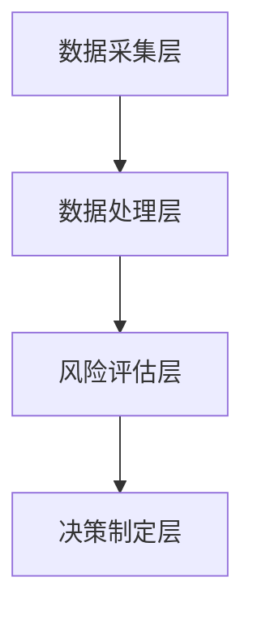
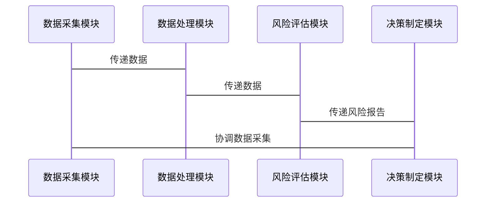

                 


# 利用多智能体系统进行全面的公司声誉风险分析

> 关键词：多智能体系统，公司声誉，风险分析，分布式计算，协作算法

> 摘要：本文详细探讨了如何利用多智能体系统进行公司声誉风险分析，从基本概念到算法实现，再到系统架构设计，层层深入，提供了一个全面的解决方案。

---

# 第一章：多智能体系统与公司声誉风险分析概述

## 1.1 多智能体系统的基本概念
### 1.1.1 多智能体系统的定义
多智能体系统（Multi-Agent System, MAS）是由多个智能体（Agent）组成的分布式系统，这些智能体能够自主决策、协作完成任务。

### 1.1.2 多智能体系统的特征
- **自主性**：智能体能够自主决策。
- **反应性**：能够感知环境并实时响应。
- **协作性**：多个智能体之间可以协作完成任务。
- **分布式**：系统中的智能体是分布式的，不存在中心控制节点。

### 1.1.3 多智能体系统与传统单智能体系统的区别
| 特性          | 单智能体系统                 | 多智能体系统                 |
|---------------|-----------------------------|-----------------------------|
| 控制方式       | 集中的控制中心               | 分布式的自主智能体             |
| 任务处理       | 单一智能体完成所有任务       | 多个智能体协作完成任务         |
| 灵活性         | 较低                       | 较高                       |

## 1.2 公司声誉风险分析的背景与重要性
### 1.2.1 公司声誉的定义与影响
公司声誉是企业在市场中的形象和信誉，直接影响客户信任度和市场价值。

### 1.2.2 声誉风险的来源与表现
- **负面新闻**：媒体报道的负面信息。
- **客户投诉**：客户对产品或服务的不满。
- **内部问题**：公司内部管理问题被曝光。

### 1.2.3 声誉风险管理的重要性
- **保护企业形象**：及时发现并处理声誉风险，避免对企业形象造成损害。
- **维护客户关系**：通过声誉风险管理，提升客户满意度和忠诚度。
- **降低经济损失**：声誉受损可能导致直接的经济损失。

## 1.3 多智能体系统在声誉风险分析中的应用前景
### 1.3.1 多智能体系统的优势
- **分布式数据处理**：能够高效处理来自不同渠道的海量数据。
- **协作能力强**：多个智能体可以协作完成复杂任务。
- **实时响应**：能够实时感知并处理声誉风险。

### 1.3.2 声誉风险分析的复杂性与挑战
- **数据多样性**：声誉风险数据来源广泛，类型多样。
- **动态变化**：声誉风险具有动态性，需要实时监控和处理。
- **决策复杂性**：需要综合考虑多个因素，制定合理的应对策略。

### 1.3.3 多智能体系统在声誉风险分析中的潜在价值
- **高效处理海量数据**：通过分布式计算，快速处理来自社交媒体、新闻网站等渠道的海量数据。
- **实时监控**：通过多智能体系统的实时感知能力，及时发现潜在的声誉风险。
- **智能协作**：多个智能体协作，综合分析不同来源的数据，提供全面的声誉风险评估。

## 1.4 本章小结
本章介绍了多智能体系统的基本概念和特征，分析了公司声誉风险分析的背景和重要性，并探讨了多智能体系统在声誉风险分析中的应用前景和潜在价值。

---

# 第二章：多智能体系统的原理与架构

## 2.1 多智能体系统的组成与结构
### 2.1.1 智能体的定义与分类
- **智能体**：能够感知环境并自主决策的实体。
- **分类**：根据智能体的智能水平，可以分为简单反射智能体和复杂推理智能体。

### 2.1.2 多智能体系统的层次结构
多智能体系统的层次结构通常包括以下层次：
1. **物理层**：硬件设备和物理环境。
2. **数据层**：数据的采集、存储和管理。
3. **算法层**：智能体的算法实现，包括感知、决策和行动。
4. **应用层**：具体的业务应用，如声誉风险分析。

### 2.1.3 智能体之间的通信与协作
智能体之间的通信可以通过以下方式进行：
- **直接通信**：智能体之间直接交换信息。
- **间接通信**：通过中间媒介进行信息传递。

---

## 2.2 多智能体系统的协调与决策机制
### 2.2.1 分布式决策的基本概念
分布式决策是指多个智能体在没有中心控制的情况下，通过协作完成决策过程。

### 2.2.2 协作式推理与规划
协作式推理与规划是多智能体系统中智能体之间通过共享信息和知识，共同完成推理和规划的过程。

### 2.2.3 冲突检测与解决
在多智能体系统中，智能体之间的冲突是不可避免的，需要通过冲突检测和解决机制来处理。

---

## 2.3 多智能体系统的通信协议与接口设计
### 2.3.1 智能体间通信协议的选择
选择合适的通信协议是多智能体系统设计的重要环节，常用的通信协议包括HTTP、WebSocket等。

### 2.3.2 标准化接口的设计原则
标准化接口设计原则包括：
1. **简洁性**：接口设计应尽量简洁。
2. **一致性**：接口设计应保持一致性。
3. **可扩展性**：接口设计应具有可扩展性。

### 2.3.3 通信效率的优化方法
通信效率的优化方法包括：
- **减少数据传输量**：通过数据压缩等技术减少数据传输量。
- **优化通信协议**：选择高效的通信协议。

---

## 2.4 本章小结
本章详细讲解了多智能体系统的组成与结构，分析了多智能体系统的协调与决策机制，并探讨了通信协议与接口设计的优化方法。

---

# 第三章：多智能体系统在声誉风险分析中的应用

## 3.1 声誉风险分析的多智能体建模
### 3.1.1 领域模型的构建方法
声誉风险分析的领域模型构建方法包括：
1. **数据采集**：从各种渠道采集声誉相关数据。
2. **数据预处理**：对采集的数据进行清洗和转换。
3. **模型构建**：根据数据构建声誉风险分析模型。

### 3.1.2 领域模型的属性与关系
声誉风险分析的领域模型通常包括以下属性：
- **数据来源**：数据的来源渠道。
- **数据类型**：数据的类型，如文本、图像等。
- **风险级别**：风险的严重程度。

### 3.1.3 领域模型的验证与优化
领域模型的验证与优化包括：
- **验证**：通过实际数据验证模型的准确性。
- **优化**：根据验证结果优化模型的性能。

---

## 3.2 多智能体系统的声誉风险分析模型
### 3.2.1 多智能体系统的声誉风险分析框架
多智能体系统的声誉风险分析框架包括：
1. **数据采集智能体**：负责采集声誉相关数据。
2. **数据处理智能体**：负责对采集的数据进行预处理。
3. **风险评估智能体**：负责对预处理后的数据进行风险评估。
4. **决策智能体**：负责根据风险评估结果制定应对策略。

### 3.2.2 智能体的角色与责任分配
在多智能体系统的声誉风险分析中，智能体的角色与责任分配如下：
- **数据采集智能体**：负责从社交媒体、新闻网站等渠道采集声誉相关数据。
- **数据处理智能体**：负责对采集的数据进行清洗、转换和存储。
- **风险评估智能体**：负责对处理后的数据进行风险评估，生成风险报告。
- **决策智能体**：负责根据风险报告制定应对策略，并协调其他智能体执行策略。

### 3.2.3 智能体之间的协作机制
智能体之间的协作机制包括：
- **信息共享**：智能体之间共享数据和信息。
- **任务分配**：根据任务需求分配智能体的角色和任务。
- **协作优化**：通过协作优化算法提高协作效率。

---

## 3.3 声誉风险分析的多智能体模型实现
### 3.3.1 声誉风险分析模型的实现步骤
声誉风险分析模型的实现步骤包括：
1. **数据采集**：从各种渠道采集声誉相关数据。
2. **数据预处理**：对采集的数据进行清洗和转换。
3. **模型训练**：根据预处理后的数据训练声誉风险分析模型。
4. **风险评估**：使用训练好的模型对实时数据进行风险评估。
5. **决策制定**：根据风险评估结果制定应对策略。

### 3.3.2 声誉风险分析模型的关键技术
声誉风险分析模型的关键技术包括：
- **自然语言处理**：用于处理文本数据，提取关键词和情感倾向。
- **机器学习**：用于训练风险评估模型，实现自动化的风险预测。
- **分布式计算**：用于处理海量数据，提高计算效率。

### 3.3.3 声誉风险分析模型的案例分析
以某公司为例，假设该公司希望利用多智能体系统进行声誉风险分析。具体实现步骤如下：
1. **数据采集**：从社交媒体、新闻网站等渠道采集该公司的声誉相关数据。
2. **数据预处理**：对采集的数据进行清洗和转换，提取关键词和情感倾向。
3. **模型训练**：使用机器学习算法训练声誉风险分析模型，实现对声誉风险的自动预测。
4. **风险评估**：实时监控公司的声誉，根据模型预测结果生成风险报告。
5. **决策制定**：根据风险报告制定应对策略，例如及时发布澄清声明，采取危机公关措施等。

---

## 3.4 本章小结
本章详细讲解了多智能体系统在声誉风险分析中的应用，包括多智能体系统的建模方法、智能体的角色与责任分配，以及多智能体系统的实现步骤和关键技术。

---

# 第四章：多智能体系统的算法与数学模型

## 4.1 分布式计算与协作算法
### 4.1.1 分布式计算的基本原理
分布式计算是指在多个计算节点上进行计算，通过协作完成任务。

### 4.1.2 协作算法的分类与特点
协作算法的分类包括：
- **同步协作算法**：所有智能体同时进行协作。
- **异步协作算法**：智能体之间可以异步进行协作。

### 4.1.3 协作算法的实现步骤
协作算法的实现步骤包括：
1. **任务分解**：将任务分解为多个子任务。
2. **任务分配**：将子任务分配给不同的智能体。
3. **协作执行**：智能体协作完成子任务。
4. **结果整合**：将各个子任务的结果整合起来，得到最终结果。

---

## 4.2 多智能体系统的通信与协调算法
### 4.2.1 通信协议的选择与设计
通信协议的选择与设计需要考虑系统的实时性、可靠性和安全性。

### 4.2.2 协调算法的实现方法
协调算法的实现方法包括：
- **基于规则的协调方法**：通过预定义的规则进行协调。
- **基于市场的协调方法**：通过市场机制进行协调。

### 4.2.3 算法的效率与优化
算法的效率与优化需要考虑系统的负载均衡和资源利用率。

---

## 4.3 声誉风险分析的多智能体算法实现
### 4.3.1 声誉风险分析算法的设计
声誉风险分析算法的设计需要结合多智能体系统的协作算法和通信协议。

### 4.3.2 算法实现的步骤与流程
声誉风险分析算法的实现步骤包括：
1. **数据采集**：从各种渠道采集声誉相关数据。
2. **数据预处理**：对采集的数据进行清洗和转换。
3. **模型训练**：使用机器学习算法训练声誉风险分析模型。
4. **风险评估**：实时监控声誉数据，根据模型预测结果生成风险报告。
5. **决策制定**：根据风险报告制定应对策略，并协调智能体执行策略。

### 4.3.3 算法实现的案例分析
以某公司为例，假设该公司希望利用多智能体系统进行声誉风险分析。具体实现步骤如下：
1. **数据采集**：从社交媒体、新闻网站等渠道采集该公司的声誉相关数据。
2. **数据预处理**：对采集的数据进行清洗和转换，提取关键词和情感倾向。
3. **模型训练**：使用机器学习算法训练声誉风险分析模型，实现对声誉风险的自动预测。
4. **风险评估**：实时监控公司的声誉，根据模型预测结果生成风险报告。
5. **决策制定**：根据风险报告制定应对策略，例如及时发布澄清声明，采取危机公关措施等。

---

## 4.4 本章小结
本章详细讲解了多智能体系统的算法与数学模型，包括分布式计算与协作算法、通信与协调算法，以及声誉风险分析的多智能体算法实现。

---

# 第五章：系统分析与架构设计

## 5.1 问题场景介绍
### 5.1.1 问题背景与目标
某公司希望利用多智能体系统进行声誉风险分析，目标是实时监控公司声誉，及时发现并处理声誉风险。

### 5.1.2 问题分析与需求提取
- **问题分析**：公司声誉受到多种因素的影响，需要实时监控和分析。
- **需求提取**：需要一个高效的系统，能够实时采集、处理和分析声誉相关数据，提供实时的风险评估和应对策略。

### 5.1.3 问题解决的总体思路
利用多智能体系统进行声誉风险分析，通过分布式计算和协作算法，实现高效的数据处理和风险评估。

---

## 5.2 系统功能设计
### 5.2.1 系统功能模块划分
系统功能模块包括：
1. **数据采集模块**：负责采集声誉相关数据。
2. **数据处理模块**：负责对采集的数据进行预处理。
3. **风险评估模块**：负责对预处理后的数据进行风险评估。
4. **决策制定模块**：负责根据风险评估结果制定应对策略。

### 5.2.2 每个功能模块的详细设计
- **数据采集模块**：从社交媒体、新闻网站等渠道采集声誉相关数据。
- **数据处理模块**：对采集的数据进行清洗、转换和存储。
- **风险评估模块**：使用机器学习算法对数据进行风险评估，生成风险报告。
- **决策制定模块**：根据风险报告制定应对策略，并协调其他模块执行策略。

### 5.2.3 功能模块之间的关系与交互
功能模块之间的关系与交互如下：
1. 数据采集模块将数据传递给数据处理模块。
2. 数据处理模块将处理后的数据传递给风险评估模块。
3. 风险评估模块将风险报告传递给决策制定模块。
4. 决策制定模块协调其他模块执行应对策略。

---

## 5.3 系统架构设计
### 5.3.1 系统架构的选择与设计
系统架构设计采用分层架构，包括数据采集层、数据处理层、风险评估层和决策制定层。

### 5.3.2 系统架构图（使用Mermaid）


### 5.3.3 系统接口设计
系统接口设计包括：
- **数据采集接口**：用于数据采集模块与数据处理模块之间的数据传递。
- **风险评估接口**：用于风险评估模块与决策制定模块之间的数据传递。

### 5.3.4 系统交互序列图（使用Mermaid）


---

## 5.4 本章小结
本章详细讲解了系统分析与架构设计，包括问题场景介绍、系统功能设计、系统架构设计、系统接口设计和系统交互序列图。

---

# 第六章：项目实战

## 6.1 环境安装与配置
### 6.1.1 系统环境要求
- **操作系统**：Linux/Windows/MacOS
- **编程语言**：Python 3.6+
- **依赖库**：numpy, pandas, scikit-learn, Flask

### 6.1.2 安装依赖库
```bash
pip install numpy pandas scikit-learn Flask
```

---

## 6.2 系统核心实现
### 6.2.1 数据采集模块实现
```python
import requests

def collect_data(company):
    # 从社交媒体和新闻网站采集声誉相关数据
    pass

# 示例代码
def collect_data(company):
    url = f"https://api.example.com/{company}"
    response = requests.get(url)
    data = response.json()
    return data
```

### 6.2.2 数据处理模块实现
```python
import pandas as pd

def preprocess_data(data):
    # 对数据进行清洗和转换
    pass

# 示例代码
def preprocess_data(data):
    df = pd.DataFrame(data)
    df = df.dropna()
    return df
```

### 6.2.3 风险评估模块实现
```python
from sklearn import svm

def train_model(train_data, labels):
    # 训练机器学习模型
    pass

# 示例代码
def train_model(train_data, labels):
    model = svm.SVC()
    model.fit(train_data, labels)
    return model

def predict_risk(model, test_data):
    return model.predict(test_data)
```

### 6.2.4 决策制定模块实现
```python
def制定决策(model_prediction):
    # 根据模型预测结果制定应对策略
    pass

# 示例代码
def制定决策(prediction):
    if prediction == 'high':
        return "发布澄清声明"
    elif prediction == 'medium':
        return "内部处理"
    else:
        return "无需处理"
```

---

## 6.3 项目实战案例分析
以某公司为例，假设该公司希望利用多智能体系统进行声誉风险分析。具体实现步骤如下：
1. **数据采集**：从社交媒体、新闻网站等渠道采集该公司的声誉相关数据。
2. **数据预处理**：对采集的数据进行清洗和转换，提取关键词和情感倾向。
3. **模型训练**：使用机器学习算法训练声誉风险分析模型，实现对声誉风险的自动预测。
4. **风险评估**：实时监控公司的声誉，根据模型预测结果生成风险报告。
5. **决策制定**：根据风险报告制定应对策略，例如及时发布澄清声明，采取危机公关措施等。

---

## 6.4 本章小结
本章通过具体的项目实战，详细讲解了多智能体系统在声誉风险分析中的实现步骤和关键技术，包括环境安装与配置、系统核心实现和项目实战案例分析。

---

# 第七章：最佳实践与注意事项

## 7.1 最佳实践
### 7.1.1 数据采集
- **数据来源多样性**：从多个渠道采集数据，提高数据的全面性。
- **数据质量控制**：通过数据清洗和转换，提高数据的准确性。

### 7.1.2 模型优化
- **模型选择**：选择适合任务的机器学习算法，提高模型的预测精度。
- **模型调优**：通过参数调优，提高模型的性能。

### 7.1.3 系统优化
- **负载均衡**：通过负载均衡技术，提高系统的处理能力。
- **资源优化**：合理分配系统资源，提高资源利用率。

---

## 7.2 小结
通过最佳实践，可以提高多智能体系统在声誉风险分析中的效果和效率。

---

## 7.3 注意事项
- **数据隐私**：在数据采集和处理过程中，需要注意数据隐私和合规性。
- **系统稳定性**：确保系统的稳定性和可靠性，避免因系统故障导致数据丢失或分析结果错误。
- **模型更新**：定期更新模型，保持模型的预测精度和适应性。

---

## 7.4 拓展阅读
- **推荐书籍**：
  - 《多智能体系统》
  - 《机器学习实战》
- **推荐论文**：
  - “Multi-Agent Systems for Risk Analysis”
  - “Distributed Computing in Multi-Agent Systems”

---

# 作者：AI天才研究院 & 禅与计算机程序设计艺术

---

**附录：代码示例**
```python
import requests
import pandas as pd
from sklearn import svm

def collect_data(company):
    url = f"https://api.example.com/{company}"
    response = requests.get(url)
    data = response.json()
    return data

def preprocess_data(data):
    df = pd.DataFrame(data)
    df = df.dropna()
    return df

def train_model(train_data, labels):
    model = svm.SVC()
    model.fit(train_data, labels)
    return model

def predict_risk(model, test_data):
    return model.predict(test_data)

def制定决策(prediction):
    if prediction == 'high':
        return "发布澄清声明"
    elif prediction == 'medium':
        return "内部处理"
    else:
        return "无需处理"
```

---

**感谢您的阅读！**

