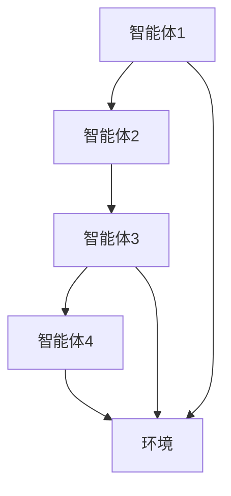
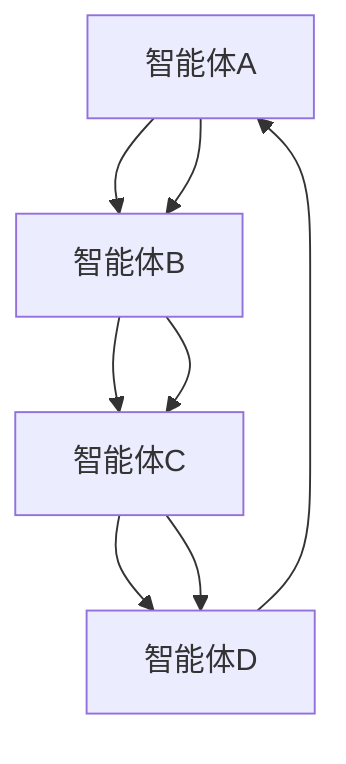
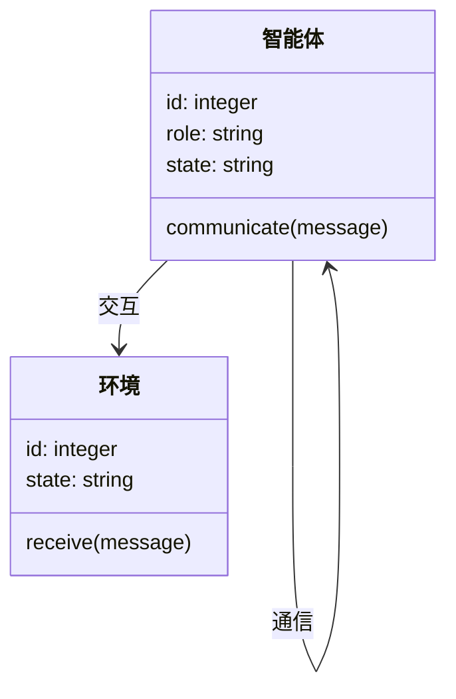
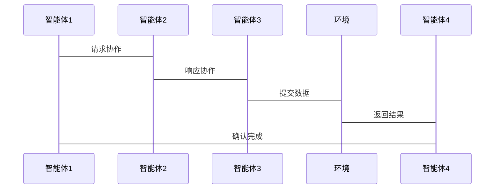

                 


# 利用多智能体系统进行全面的公司战略执行力分析

## 关键词：多智能体系统，战略执行力分析，分布式计算，共识算法，企业战略管理

## 摘要：  
本文探讨了如何利用多智能体系统（Multi-Agent System，MAS）进行全面的公司战略执行力分析。通过结合人工智能、分布式计算和企业战略管理的理论与实践，本文提出了一种基于多智能体系统的战略执行力分析框架。文章详细分析了多智能体系统的原理、战略执行力分析的方法论，以及如何通过算法和系统架构设计来实现这一目标。通过具体案例和数学模型，本文展示了如何利用多智能体系统的优势，帮助企业提升战略执行效率和效果。  

---

## 第1章：多智能体系统概述  

### 1.1 多智能体系统的基本概念  

#### 1.1.1 多智能体系统的定义  
多智能体系统（Multi-Agent System，MAS）是由多个智能体（Agent）组成的分布式系统，这些智能体通过协作和通信完成特定任务。智能体是具有感知、推理、规划和执行能力的实体，能够独立决策并与其他智能体或环境交互。  

#### 1.1.2 多智能体系统的特征  
| 特征                | 描述                                                                 |
|---------------------|----------------------------------------------------------------------|
| 分布式性             | 智能体分布在网络中，具有独立性。                                       |
| 协作性               | 智能体之间通过协作完成共同目标。                                       |
| 反应性               | 智能体能够感知环境并实时调整行为。                                     |
| 自主性               | 智能体在没有外部干预的情况下自主决策。                                   |

#### 1.1.3 多智能体系统与传统单体系统的主要区别  
| 对比项             | 单体系统                                   | 多智能体系统                             |
|--------------------|------------------------------------------|------------------------------------------|
| 系统结构           | 单一中心节点，集中式处理。               | 分布式结构，多个智能体协作完成任务。     |
| 可扩展性           | 扩展性有限，难以处理大规模任务。           | 高可扩展性，适合处理复杂和大规模任务。     |
| 响应速度           | 响应速度依赖中心节点的处理能力。           | 响应速度快，多个智能体并行处理。           |

---

### 1.2 公司战略执行力分析的背景与意义  

#### 1.2.1 战略执行力的概念  
战略执行力是指企业在实现战略目标的过程中，将战略规划转化为具体行动的能力。它涉及企业内部资源的分配、团队的协作以及对外部环境的适应能力。  

#### 1.2.2 战略执行力分析的重要性  
- 通过分析战略执行力，企业可以识别执行过程中的瓶颈和问题。  
- 优化资源配置，提高执行效率。  
- 提前预判潜在风险，制定应对策略。  

#### 1.2.3 多智能体系统在战略执行力分析中的优势  
多智能体系统能够模拟企业内部的组织结构和协作流程，通过智能体之间的交互和协作，实时分析战略执行的动态过程，提供数据支持和决策建议。  

---

### 1.3 本章小结  
本章介绍了多智能体系统的基本概念和特征，并探讨了其在公司战略执行力分析中的应用背景和优势。通过对比单体系统和多智能体系统的特点，可以看出多智能体系统在处理复杂企业战略问题时的独特价值。

---

## 第2章：多智能体系统的核心原理  

### 2.1 多智能体系统的结构与通信机制  

#### 2.1.1 多智能体系统的组成结构  
多智能体系统的组成结构可以用以下的Mermaid图表示：



#### 2.1.2 智能体之间的通信方式  
智能体之间的通信方式可以分为以下几种：  
- **直接通信**：智能体之间直接交换信息。  
- **间接通信**：通过中间媒介（如消息队列或共享数据库）进行通信。  
- **发布-订阅模式**：智能体发布信息，其他智能体订阅感兴趣的信息。  

#### 2.1.3 分布式计算与协作机制  
分布式计算是多智能体系统的核心机制，通过将任务分解到多个智能体，利用并行计算提高效率。协作机制则确保智能体之间的任务分配和协同工作。  

---

### 2.2 多智能体系统的协作与协调  

#### 2.2.1 协作机制的定义与分类  
协作机制是智能体之间为实现共同目标而采取的策略和规则。常见的协作机制包括：  
- **基于规则的协作**：通过预定义规则进行协作。  
- **基于意图的协作**：智能体根据意图动态调整协作方式。  
- **基于市场的协作**：智能体通过市场机制进行资源分配和任务协作。  

#### 2.2.2 协调问题的解决方法  
协调问题是指智能体在协作过程中可能出现的冲突和不一致。解决方法包括：  
- **冲突检测与解决**：通过检测冲突并制定解决方案。  
- **协商机制**：智能体通过协商达成一致。  
- **优先级排序**：根据任务优先级进行资源分配。  

#### 2.2.3 共识算法在多智能体系统中的应用  
共识算法是多智能体系统中确保智能体之间达成一致的重要工具。常见的共识算法包括：  
- **PBFT（ Practical Byzantine Fault Tolerance）**  
- **RAFT**  
- **EOS.IO**  

以下是PBFT算法的Mermaid流程图：



---

### 2.3 本章小结  
本章详细介绍了多智能体系统的结构、通信机制和协作与协调机制。通过分析协作机制和共识算法，可以看出多智能体系统在实现高效协作和一致性方面的重要作用。

---

## 第3章：公司战略执行力分析的方法论  

### 3.1 战略执行力分析的核心要素  

#### 3.1.1 战略目标的分解与执行  
战略目标的分解是战略执行力分析的第一步，通常采用层次化的方法。例如，企业战略目标可以分解为部门目标、团队目标和个人目标。  

#### 3.1.2 执行过程中的关键指标  
关键指标（KPI）是衡量战略执行力的重要工具。常见的KPI包括：  
- **时间指标**：任务完成时间。  
- **质量指标**：任务完成质量。  
- **成本指标**：任务执行成本。  

#### 3.1.3 执行结果的评估标准  
评估标准通常包括：  
- **达成度**：战略目标的实现程度。  
- **效率**：资源利用效率。  
- **效果**：战略目标的实际影响。  

---

### 3.2 多智能体系统在战略执行力分析中的应用框架  

#### 3.2.1 分层分析框架  
分层分析框架将战略执行力分析划分为多个层次，包括战略层、执行层和操作层。  

#### 3.2.2 多维度评估模型  
多维度评估模型可以从多个维度（如时间、质量、成本）对战略执行力进行综合评估。  

#### 3.2.3 数据驱动的分析方法  
数据驱动的分析方法通过收集和分析企业内部数据，利用大数据技术进行预测和优化。  

---

### 3.3 本章小结  
本章从战略执行力分析的核心要素出发，提出了多智能体系统在战略执行力分析中的应用框架。通过分层分析和多维度评估，企业可以更全面地了解战略执行情况，并制定有效的优化策略。

---

## 第4章：多智能体系统协作算法  

### 4.1 分布式计算与协作算法  

#### 4.1.1 分布式计算的基本原理  
分布式计算通过将任务分解到多个节点，利用并行计算提高效率。  

#### 4.1.2 协作算法的实现步骤  
协作算法的实现步骤包括：  
1. 任务分解。  
2. 任务分配。  
3. 任务执行。  
4. 结果汇总。  

#### 4.1.3 算法的收敛性分析  
算法的收敛性是指算法在有限步内达到一致或稳定状态的能力。  

---

### 4.2 共识算法在多智能体系统中的应用  

#### 4.2.1 共识算法的定义与分类  
共识算法是多智能体系统中确保智能体之间达成一致的重要工具。  

#### 4.2.2 常见共识算法（如PBFT、RAFT）的实现原理  
PBFT算法的实现原理如下：  
```python
def pbft共识算法():
    for 每个智能体 in 智能体列表:
        if 智能体处于主节点:
            提交事务
        else:
            作为从节点，验证事务
```

#### 4.2.3 共识算法在战略执行力分析中的应用案例  
以下是PBFT算法的实现示例：


---

### 4.3 本章小结  
本章详细介绍了多智能体系统的协作算法，包括分布式计算和共识算法的实现原理及应用案例。通过这些算法，企业可以更高效地实现战略目标的分解与执行。

---

## 第5章：战略执行力分析的数学模型与公式  

### 5.1 战略目标分解的数学模型  
战略目标分解的数学模型可以用以下公式表示：

$$目标权重 = \sum_{i=1}^{n} w_i \cdot 目标_i$$

其中，$w_i$ 是目标 $i$ 的权重，$\sum w_i = 1$。  

---

### 5.2 执行效率的优化模型  
执行效率的优化模型可以用以下公式表示：

$$效率 = \frac{任务完成量}{资源消耗}$$

---

### 5.3 战略目标实现的概率模型  
战略目标实现的概率可以用以下公式表示：

$$P(目标实现) = \prod_{i=1}^{n} P(目标_i实现)$$

---

### 5.4 本章小结  
本章通过数学模型和公式，详细分析了战略执行力分析的核心要素和优化方法。这些模型为企业提供了一种量化分析的工具。

---

## 第6章：系统架构设计与实现  

### 6.1 问题场景介绍  
本章以一个典型的公司战略执行力分析问题为例，设计了一个基于多智能体系统的解决方案。  

### 6.2 系统功能设计  

#### 6.2.1 领域模型（Mermaid类图）  
以下是领域模型的类图：



---

### 6.3 系统架构设计  

#### 6.3.1 系统架构图（Mermaid架构图）  
以下是系统架构图：


---

### 6.4 系统接口设计  

#### 6.4.1 接口交互流程（Mermaid序列图）  
以下是接口交互流程：



---

### 6.5 本章小结  
本章通过系统架构设计和接口设计，展示了如何将多智能体系统应用于公司战略执行力分析。通过Mermaid图和类图，明确了系统的结构和功能。

---

## 第7章：项目实战与案例分析  

### 7.1 环境安装与配置  
本项目需要以下环境：  
- Python 3.8+  
- Mermaid工具  
- 消息队列（如RabbitMQ）  

---

### 7.2 系统核心实现  

#### 7.2.1 智能体通信模块  
以下是智能体通信模块的实现代码：

```python
import json
import pika

class Agent:
    def __init__(self, name):
        self.name = name
        self.connection = pika.BlockingConnection(pika.ConnectionParameters('localhost'))
        self.channel = self.connection.channel()
        self.channel.queue_declare(queue=f'{self.name}_queue')

    def send_message(self, message):
        self.channel.basic_publish(exchange='', routing_key=f'{self.name}_queue', body=json.dumps(message))

    def receive_message(self):
        def callback(ch, method, properties, body):
            print(f"{self.name} 收到消息：{json.loads(body)}")
        self.channel.basic_consume(queue=f'{self.name}_queue', on_message_callback=callback, auto_ack=True)
        self.channel.start_consuming()
```

---

### 7.3 案例分析与解读  
通过上述代码实现的智能体通信模块，可以应用于企业内部团队之间的协作。例如，市场部门和销售部门可以通过智能体通信模块实时交换信息，提高协作效率。  

---

### 7.4 本章小结  
本章通过具体的项目实战，展示了如何利用多智能体系统实现公司战略执行力分析。通过代码实现和案例分析，读者可以更好地理解多智能体系统在实际应用中的价值。

---

## 第8章：总结与展望  

### 8.1 本章总结  
本文通过多智能体系统的理论与实践，提出了一种基于多智能体系统的公司战略执行力分析方法。通过数学模型、算法设计和系统架构的分析，本文展示了如何利用多智能体系统的优势，提高战略执行效率。  

---

### 8.2 未来展望  
未来，随着人工智能和大数据技术的不断发展，多智能体系统在公司战略执行力分析中的应用将更加广泛。研究者可以进一步优化算法，提升系统的实时性和准确性。

---

## 作者：AI天才研究院/AI Genius Institute & 禅与计算机程序设计艺术 /Zen And The Art of Computer Programming

