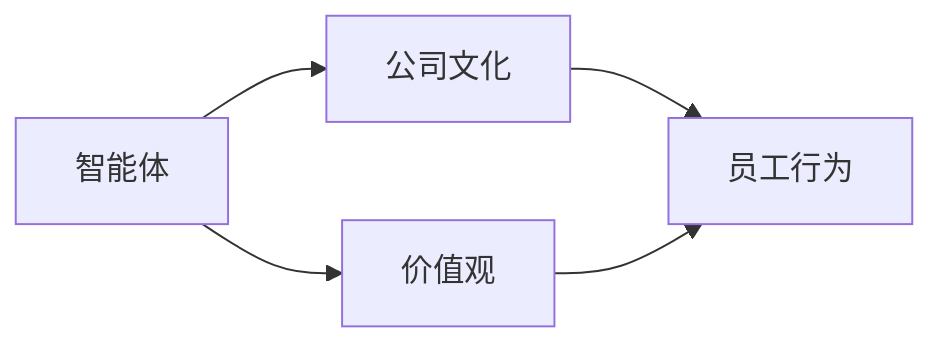
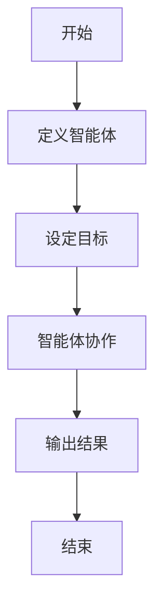
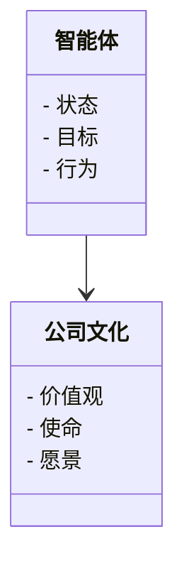
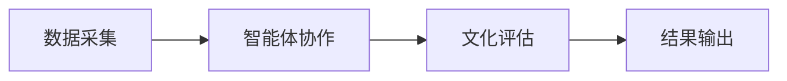
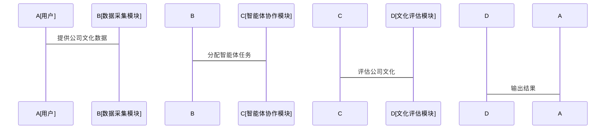

                 


# 利用多智能体系统进行全面的公司文化和价值观分析

## 关键词：多智能体系统, 公司文化, 价值观分析, 系统架构, 算法原理, 数学模型

## 摘要：本文详细探讨了如何利用多智能体系统对公司的文化和价值观进行全面分析。通过分析多智能体系统的原理和公司文化的定义，构建了基于多智能体系统的文化分析框架，并详细阐述了算法原理、数学模型以及系统架构设计。最后，通过实际案例分析和代码实现，展示了多智能体系统在公司文化分析中的应用和优势。

---

## 第一部分: 多智能体系统与公司文化概述

### 第1章: 多智能体系统概述

#### 1.1 多智能体系统的基本概念
- **1.1.1 多智能体系统的定义**
  多智能体系统（Multi-Agent System，MAS）是由多个相互作用的智能体组成的系统，这些智能体能够通过协作或竞争完成复杂任务。
  
- **1.1.2 多智能体系统的特征**
  - 独立性：每个智能体都有自己的目标和行为。
  - 协作性：智能体之间可以协作完成任务。
  - 反应性：智能体能够感知环境并做出反应。
  - 分布性：智能体分布在不同的空间或时间维度上。

- **1.1.3 多智能体系统与单智能体系统的区别**
  - 单智能体系统：由单一智能体完成任务，决策集中。
  - 多智能体系统：多个智能体协作，决策分散。

#### 1.2 公司文化与价值观的定义
- **1.2.1 公司文化的内涵**
  公司文化是组织内部共享的价值观、信仰、态度和行为方式的总和，反映了公司的独特个性和管理风格。

- **1.2.2 价值观的核心要素**
  - 企业使命：公司的存在目的。
  - 企业愿景：公司未来的目标。
  - 核心价值观：公司的基本信念和行为准则。

- **1.2.3 公司文化与价值观的关系**
  公司文化是企业价值观的外在表现，而价值观是公司文化的内核。

#### 1.3 多智能体系统在公司文化分析中的意义
- **1.3.1 多智能体系统的优势**
  - 分布式分析：能够从多个角度分析公司文化。
  - 动态性：能够实时跟踪文化变化。
  - 多维度评估：可以同时评估多个文化维度。

- **1.3.2 公司文化分析的复杂性**
  公司文化涉及组织结构、员工行为、管理风格等多个方面，具有复杂性和动态性。

- **1.3.3 多智能体系统与公司文化分析的结合**
  通过多智能体系统，可以模拟公司内部的互动关系，分析文化对员工行为的影响，从而帮助企业优化文化管理。

---

### 第2章: 多智能体系统的核心概念与联系

#### 2.1 多智能体系统的原理
- **2.1.1 智能体的属性与行为**
  - 属性：智能体具有状态、目标和能力。
  - 行为：智能体根据感知做出决策并执行动作。

- **2.1.2 智能体之间的关系**
  - 协作：智能体之间可以通过协作完成共同目标。
  - 竞争：智能体之间可以竞争有限资源。

- **2.1.3 多智能体系统的动态性**
  系统的状态会随着智能体的互动而不断变化。

#### 2.2 公司文化与价值观的分析模型
- **2.2.1 公司文化的层次结构**
  - 表层文化：包括公司标志、标语等。
  - 中层文化：包括规章制度、工作流程。
  - 深层文化：包括核心价值观、企业精神。

- **2.2.2 价值观的评估指标**
  - 一致性：价值观是否统一。
  - 可行性：价值观是否可操作。
  - 适应性：价值观是否适应环境变化。

- **2.2.3 多智能体系统的文化分析框架**
  通过智能体的互动，模拟公司内部的文化传播和变化过程。

#### 2.3 核心概念对比表
| 概念 | 特性 |
|------|------|
| 智能体 | 独立性、协作性、反应性 |
| 公司文化 | 价值观、使命、愿景 |

#### 2.4 实体关系图


---

## 第三部分: 算法原理与数学模型

### 第3章: 多智能体系统在公司文化分析中的算法原理

#### 3.1 算法概述
- **3.1.1 多智能体系统的核心算法**
  - 分布式计算：智能体之间通过分布式计算完成任务。
  - 协作算法：智能体之间通过协作完成共同目标。

- **3.1.2 算法的实现步骤**
  1. 初始化智能体。
  2. 设定目标。
  3. 智能体协作完成任务。
  4. 输出结果。

- **3.1.3 算法的优化方法**
  - 增强学习：智能体通过经验改进策略。
  - 分布式优化：优化算法在分布式环境中实现。

#### 3.2 算法流程图


#### 3.3 算法实现代码
```python
def multi_agent_system():
    agents = initialize_agents()
    target = define_target()
    while not achieve_target(target, agents):
        for agent in agents:
            update_agent(agent)
    return agents
```

### 第4章: 数学模型与公式

#### 4.1 公司文化评估模型
$$文化评估 = \sum_{i=1}^{n} (v_i \times w_i)$$
其中，\(v_i\) 是价值观的得分，\(w_i\) 是权重。

#### 4.2 价值观影响分析
$$影响度 = \frac{\sum_{j=1}^{m} (v_j \times f_j)}{总权重}$$
其中，\(f_j\) 是影响因素。

---

## 第四部分: 系统分析与架构设计

### 第5章: 系统分析与架构设计方案

#### 5.1 系统功能设计
- **功能模块**：
  - 数据采集模块：采集公司文化数据。
  - 智能体协作模块：模拟智能体之间的协作。
  - 文化评估模块：评估公司文化。

- **领域模型**：


#### 5.2 系统架构设计


#### 5.3 系统接口设计
- **输入接口**：接收公司文化数据。
- **输出接口**：输出文化评估结果。

#### 5.4 系统交互流程图


---

## 第五部分: 项目实战

### 第6章: 项目实战

#### 6.1 环境安装
- **工具安装**：
  - 安装Python和相关库（如numpy、pandas、matplotlib）。
  - 安装Mermaid CLI工具。

#### 6.2 系统核心实现源代码
```python
class Agent:
    def __init__(self, state, target):
        self.state = state
        self.target = target

    def update(self):
        # 更新智能体状态
        pass

def initialize_agents():
    # 初始化智能体
    pass

def define_target():
    # 设定目标
    pass

def achieve_target(target, agents):
    # 判断是否达成目标
    pass
```

#### 6.3 代码应用解读与分析
- **代码功能**：
  - 初始化智能体。
  - 设定目标。
  - 智能体协作完成任务。
  - 输出结果。

#### 6.4 实际案例分析
- **案例背景**：
  某公司希望通过多智能体系统分析其文化，优化管理。

- **案例分析**：
  通过模拟智能体之间的协作，发现公司文化中的问题，并提出优化建议。

#### 6.5 项目小结
- **项目总结**：
  通过项目实战，验证了多智能体系统在公司文化分析中的有效性。

---

## 第六部分: 最佳实践与扩展

### 第7章: 最佳实践

#### 7.1 最佳实践
- **数据质量**：确保输入数据的准确性和完整性。
- **模型优化**：根据实际情况优化算法和模型。
- **系统维护**：定期更新模型和数据。

#### 7.2 小结
通过本文的介绍，读者可以全面了解多智能体系统在公司文化和价值观分析中的应用。

#### 7.3 注意事项
- 确保智能体之间的协作机制合理。
- 定期监控系统运行状态。
- 注意数据隐私和安全问题。

#### 7.4 拓展阅读
- 推荐阅读《Multi-Agent Systems》和《Corporate Culture Analysis》。

---

## 作者：AI天才研究院/AI Genius Institute & 禅与计算机程序设计艺术 /Zen And The Art of Computer Programming

