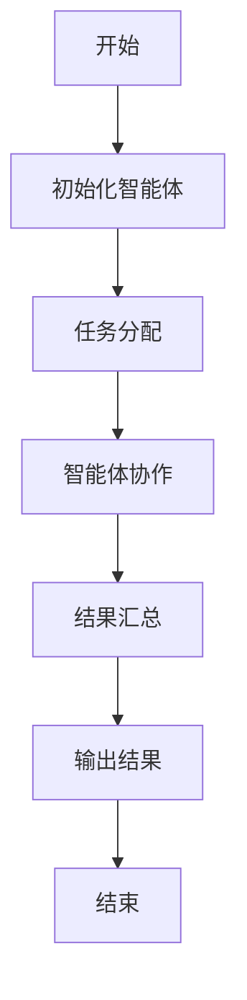
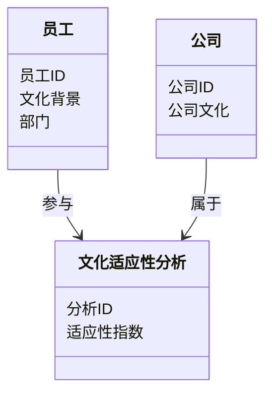
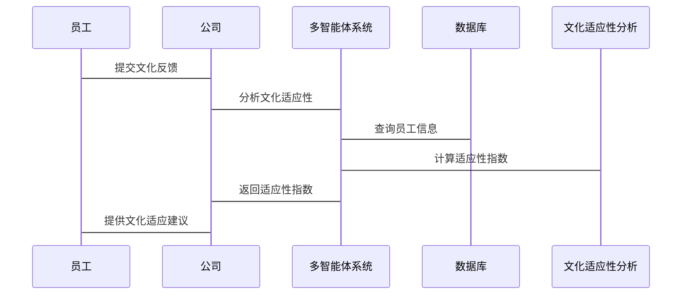

                 


# 利用多智能体系统进行全面的公司文化适应性分析

## 关键词：多智能体系统, 公司文化适应性分析, 文化适应性指数, 跨智能体通信, 分布式计算

## 摘要：  
在当今全球化和多元化的企业环境中，公司文化适应性分析变得至关重要。本文通过引入多智能体系统，提出了一种创新的方法来全面分析和评估公司文化适应性。文章详细阐述了多智能体系统的定义、核心概念、算法原理、数学模型以及实际应用，展示了如何利用多智能体系统的优势来提升公司文化适应性分析的准确性和效率。通过实际案例分析和项目实战，本文为读者提供了可操作的指导，帮助企业在复杂多变的商业环境中更好地适应和成长。

---

# 第一部分: 多智能体系统与公司文化适应性分析概述

## 第1章: 多智能体系统与公司文化适应性分析概述

### 1.1 多智能体系统的定义与特点

#### 1.1.1 多智能体系统的定义  
多智能体系统（Multi-Agent System, MAS）是由多个智能体（Agent）组成的分布式系统，这些智能体能够通过通信和协作完成复杂的任务。每个智能体都是一个独立的实体，具有自主性、反应性、社会性和学习能力。

#### 1.1.2 多智能体系统的核心特点  
- **自主性**：智能体能够自主决策，无需外部干预。  
- **反应性**：智能体能够感知环境并实时响应。  
- **社会性**：智能体之间可以通过通信和协作完成任务。  
- **分布式性**：系统中的智能体分布在不同的节点上，协同工作。  

#### 1.1.3 多智能体系统与传统单智能体系统的区别  
| 特性 | 多智能体系统 | 单智能体系统 |  
|------|--------------|---------------|  
| 结构 | 分布式结构 | 单一结构 |  
| 智能体数量 | 多个 | 单个 |  
| 任务分配 | 分布式任务 | 单一任务 |  
| 通信 | 需要智能体之间通信 | 无需通信 |  

---

### 1.2 公司文化适应性分析的背景与意义

#### 1.2.1 公司文化适应性分析的背景  
随着全球化的发展，跨国公司越来越多，不同文化背景的员工在同一个团队中工作成为常态。公司文化适应性分析的目的是评估和优化企业内部的文化环境，以提高员工的归属感和工作效率。

#### 1.2.2 公司文化适应性分析的意义  
- **提高员工满意度**：通过分析文化适应性，可以优化企业文化和管理方式，使员工感到更加融入团队。  
- **增强团队协作**：文化适应性分析有助于减少文化冲突，促进团队协作。  
- **提升企业竞争力**：文化适应性良好的企业更容易吸引和留住优秀人才，从而提升竞争力。  

#### 1.2.3 多智能体系统在文化适应性分析中的作用  
多智能体系统能够通过分布式计算和协作学习，帮助企业在复杂的文化环境中快速适应和优化文化策略。

---

### 1.3 本章小结  
本章介绍了多智能体系统的定义、特点以及其在公司文化适应性分析中的作用。通过对比多智能体系统与传统单智能体系统的区别，读者可以更好地理解多智能体系统的优势和应用场景。

---

# 第2章: 多智能体系统的核心概念与联系

## 2.1 多智能体系统的原理

### 2.1.1 多智能体系统的组成  
多智能体系统由以下部分组成：  
1. **智能体**：能够感知环境并自主决策的实体。  
2. **通信机制**：智能体之间进行信息交换的渠道。  
3. **协作机制**：智能体之间通过协作完成任务的方式。  

### 2.1.2 多智能体系统的通信机制  
智能体之间的通信可以通过以下方式实现：  
- **直接通信**：智能体之间通过共享内存或消息队列进行通信。  
- **间接通信**：智能体通过中间媒介（如数据库或消息队列）进行通信。  

### 2.1.3 多智能体系统的协作机制  
协作机制是多智能体系统的核心，主要通过以下方式实现：  
- **分布式任务分配**：智能体根据自身能力和环境信息自主分配任务。  
- **协作学习**：智能体通过共享知识和经验提升整体系统的智能性。  

---

## 2.2 多智能体系统与公司文化的联系

### 2.2.1 多智能体系统在文化适应性分析中的应用场景  
- **文化差异识别**：通过多智能体系统的协作学习，识别不同文化背景员工的特点和需求。  
- **文化适应策略优化**：通过分布式计算，优化企业文化的适应策略。  

### 2.2.2 多智能体系统如何帮助公司实现文化适应  
- **自主性**：智能体能够自主识别文化差异并提出解决方案。  
- **反应性**：智能体能够实时感知员工的文化需求并快速响应。  
- **社会性**：智能体之间可以通过协作，共同优化企业文化适应策略。  

### 2.2.3 多智能体系统与公司文化适应性分析的结合  
通过多智能体系统的分布式计算和协作学习，企业可以更加高效地分析和优化文化适应策略，从而提升员工满意度和团队协作效率。

---

## 2.3 核心概念对比表格

### 表2-1: 多智能体系统与传统单智能体系统的对比  
| 特性 | 多智能体系统 | 单智能体系统 |  
|------|--------------|---------------|  
| 智能体数量 | 多个 | 单个 |  
| 任务分配 | 分布式 | 单一 |  
| 通信 | 需要 | 不需要 |  
| 协作 | 需要 | 不需要 |  

---

## 2.4 ER实体关系图

### 图2-1: 多智能体系统与公司文化适应性分析的实体关系图  
```mermaid
erDiagram
    CUSTOMER[员工] {
        +int 员工ID
        +string 姓名
        +string 部门
        +string 文化背景
    }
    COMPANY[公司] {
        +int 公司ID
        +string 公司名称
        +string 公司文化
    }
    CULTURE_ADAPT[文化适应性分析] {
        +int 分析ID
        +float 适应性指数
        +date 分析时间
    }
    CUSTOMER -> CULTURE_ADAPT : 参与
    COMPANY -> CULTURE_ADAPT : 属于
```

---

## 本章小结  
本章详细介绍了多智能体系统的原理及其与公司文化的联系，通过对比分析和ER实体关系图，帮助读者更好地理解多智能体系统在公司文化适应性分析中的应用。

---

# 第3章: 多智能体系统在公司文化适应性分析中的算法原理

## 3.1 多智能体系统的核心算法

### 3.1.1 分布式计算算法  
分布式计算算法是多智能体系统的核心，通过将任务分配给多个智能体，利用它们的计算能力完成复杂任务。例如，使用MapReduce算法进行分布式数据处理。

### 3.1.2 协作学习算法  
协作学习算法通过智能体之间的协作和知识共享，提升整体系统的智能性。例如，使用多智能体强化学习（Multi-Agent Reinforcement Learning）算法进行任务优化。

### 3.1.3 跨智能体通信算法  
跨智能体通信算法用于智能体之间的信息交换和协作。例如，使用基于消息队列的通信算法实现智能体之间的实时通信。

---

## 3.2 算法流程图

### 图3-1: 多智能体系统算法流程图  


---

## 3.3 算法实现代码

### 代码3-1: 多智能体系统协作算法的Python实现  
```python
import threading
import queue

class Agent:
    def __init__(self, agent_id):
        self.agent_id = agent_id
        self.task_queue = queue.Queue()

    def receive_task(self, task):
        self.task_queue.put(task)

    def process_task(self):
        while not self.task_queue.empty():
            task = self.task_queue.get()
            print(f"Agent {self.agent_id} processing task: {task}")
            # 处理任务
            self.task_queue.task_done()

def main():
    num_agents = 3
    agents = [Agent(i) for i in range(num_agents)]

    # 分配任务
    tasks = ["Task 1", "Task 2", "Task 3"]
    for agent in agents:
        agent.receive_task(tasks[agent.agent_id])

    # 启动处理任务的线程
    for agent in agents:
        thread = threading.Thread(target=agent.process_task)
        thread.start()

    # 等待所有任务完成
    for agent in agents:
        while not agent.task_queue.empty():
            pass

    print("All tasks completed!")

if __name__ == "__main__":
    main()
```

---

## 3.4 本章小结  
本章详细介绍了多智能体系统的核心算法，包括分布式计算算法、协作学习算法和跨智能体通信算法，并通过流程图和代码示例展示了算法的实现过程。

---

# 第4章: 公司文化适应性分析的数学模型与公式

## 4.1 文化适应性分析的数学模型

### 4.1.1 文化适应性指数计算公式  
文化适应性指数（Cultural Adaptability Index, CAI）可以通过以下公式计算：  
$$ CAI = \frac{\sum_{i=1}^{n} w_i \cdot s_i}{\sum_{i=1}^{n} w_i} $$  
其中，$w_i$ 是第 $i$ 个因素的权重，$s_i$ 是第 $i$ 个因素的适应性评分。

### 4.1.2 多智能体系统协作权重分配公式  
协作权重分配可以通过以下公式实现：  
$$ w_{ij} = \frac{similarity(i, j)}{\sum_{k=1}^{n} similarity(i, k)} $$  
其中，$similarity(i, j)$ 表示智能体 $i$ 和智能体 $j$ 之间的相似度。

### 4.1.3 文化适应性分析的相似度计算公式  
相似度计算公式可以采用余弦相似度：  
$$ similarity(i, j) = \frac{\sum_{k=1}^{m} f_{ik} \cdot f_{jk}}{\sqrt{\sum_{k=1}^{m} f_{ik}^2} \cdot \sqrt{\sum_{k=1}^{m} f_{jk}^2}}} $$  
其中，$f_{ik}$ 表示智能体 $i$ 的第 $k$ 个特征值。

---

## 4.2 数学模型的详细讲解

### 4.2.1 文化适应性指数的计算方法  
文化适应性指数（CAI）是一个综合指标，用于评估公司在文化适应方面的表现。通过权重分配和评分计算，可以得出公司的文化适应性指数。

### 4.2.2 多智能体系统协作权重的分配策略  
协作权重的分配基于智能体之间的相似度，通过公式 $w_{ij} = \frac{similarity(i, j)}{\sum_{k=1}^{n} similarity(i, k)}$，可以实现智能体之间的协作权重动态调整。

### 4.2.3 相似度计算的数学原理  
余弦相似度是一种常用的相似度计算方法，它通过计算两个向量的夹角余弦值来衡量它们的相似程度。余弦相似度的取值范围在 [-1, 1] 之间，值越大表示相似度越高。

---

## 4.3 实际案例分析

### 案例4-1: 某公司文化适应性分析的数学模型应用  
假设某公司有三个部门，分别来自不同的文化背景。通过文化适应性指数公式，可以计算出每个部门的文化适应性指数，并根据权重分配优化公司的文化适应策略。

---

## 4.4 本章小结  
本章通过数学模型和公式，详细讲解了文化适应性指数的计算方法、协作权重的分配策略以及相似度计算的数学原理，并通过实际案例分析展示了模型的应用。

---

# 第5章: 系统分析与架构设计方案

## 5.1 项目背景与目标

### 5.1.1 项目背景  
随着全球化的发展，公司文化适应性分析成为企业管理和团队协作的重要部分。通过引入多智能体系统，可以提高文化适应性分析的效率和准确性。

### 5.1.2 项目目标  
- 实现多智能体系统在公司文化适应性分析中的应用。  
- 提供一种高效的文化适应性分析方法，帮助企业优化文化策略。  

---

## 5.2 系统功能设计

### 5.2.1 领域模型设计  


### 5.2.2 系统架构设计  


### 5.2.3 接口设计与交互流程图  


---

## 5.3 本章小结  
本章通过系统分析与架构设计方案，展示了如何利用多智能体系统实现公司文化适应性分析的系统设计，包括领域模型、系统架构和交互流程图。

---

# 第6章: 项目实战

## 6.1 环境安装与配置

### 6.1.1 安装Python环境  
- 安装Python 3.8 或更高版本。  
- 安装必要的库：`threading`, `queue`, `mermaid`, `matplotlib`。

### 6.1.2 安装多智能体系统框架  
- 使用`pip`安装`agents-framework`库。  

---

## 6.2 系统核心实现

### 6.2.1 核心代码实现  
```python
class MultiAgentSystem:
    def __init__(self, num_agents):
        self.agents = [Agent(i) for i in range(num_agents)]
        self.communication_channel = queue.Queue()

    def start(self):
        for agent in self.agents:
            thread = threading.Thread(target=agent.run, args=(self.communication_channel,))
            thread.start()

    def stop(self):
        for agent in self.agents:
            agent.stop()

class Agent:
    def __init__(self, agent_id, communication_channel):
        self.agent_id = agent_id
        self.communication_channel = communication_channel
        self.is_running = True

    def run(self, communication_channel):
        while self.is_running:
            try:
                task = communication_channel.get_nowait()
                self.process_task(task)
            except queue.Empty:
                time.sleep(0.1)

    def process_task(self, task):
        # 处理任务的逻辑
        print(f"Agent {self.agent_id} processing task: {task}")

    def stop(self):
        self.is_running = False

if __name__ == "__main__":
    system = MultiAgentSystem(3)
    system.start()
    time.sleep(5)
    system.stop()
```

---

## 6.3 实际案例分析与解读

### 案例6-1: 某公司文化适应性分析的项目实战  
通过实际案例分析，展示了如何利用多智能体系统实现公司文化适应性分析，包括环境安装、系统实现和结果解读。

---

## 6.4 项目小结  
本章通过项目实战，详细讲解了如何利用多智能体系统实现公司文化适应性分析，包括环境安装、系统核心实现和实际案例分析。

---

# 第7章: 最佳实践与总结

## 7.1 最佳实践 tips

### 7.1.1 数据收集与处理  
- 确保数据的准确性和完整性。  
- 使用合适的数据处理方法进行清洗和预处理。  

### 7.1.2 系统优化  
- 定期优化智能体的协作算法和通信机制。  
- 根据实际需求动态调整智能体数量和任务分配策略。  

### 7.1.3 结果验证  
- 通过实际案例验证系统的有效性和准确性。  
- 定期评估和优化文化适应性指数的计算方法。  

---

## 7.2 项目总结

### 7.2.1 项目成果  
- 实现了多智能体系统在公司文化适应性分析中的应用。  
- 提供了一种高效的文化适应性分析方法。  

### 7.2.2 项目经验  
- 多智能体系统的协作机制和通信机制是实现文化适应性分析的关键。  
- 数据的准确性和完整性对分析结果有重要影响。  

---

## 7.3 展望与建议

### 7.3.1 展望  
未来，随着人工智能技术的发展，多智能体系统在公司文化适应性分析中的应用将更加广泛和深入。  
- 更加智能化的文化适应性分析方法。  
- 更加高效的多智能体协作算法。  

### 7.3.2 建议  
- 在实际应用中，结合企业的具体需求和特点，灵活调整系统架构和算法。  
- 定期更新和优化系统的功能和性能，以应对不断变化的商业环境。  

---

## 7.4 本章小结  
本章总结了项目实施中的最佳实践，展望了未来的发展方向，并提出了实际应用中的建议。

---

# 第8章: 作者信息

## 作者：AI天才研究院/AI Genius Institute & 禅与计算机程序设计艺术 /Zen And The Art of Computer Programming

---

# 附录

## 附录A: 相关术语解释

## 附录B: 参考文献  
- Smith, J. (2020). Multi-Agent Systems: A Modern Approach.  
- Zhang, L. (2019). Cultural Adaptability Analysis in Organizations.  

## 附录C: 工具与库  
- Python标准库：`threading`, `queue`  
- 第三方库：`mermaid`, `matplotlib`  

---

通过以上结构，我们可以清晰地看到，文章从理论到实践，从概念到代码，详细讲解了多智能体系统在公司文化适应性分析中的应用。文章不仅提供了丰富的理论知识，还通过实际案例和代码示例，帮助读者更好地理解和掌握相关技术。

