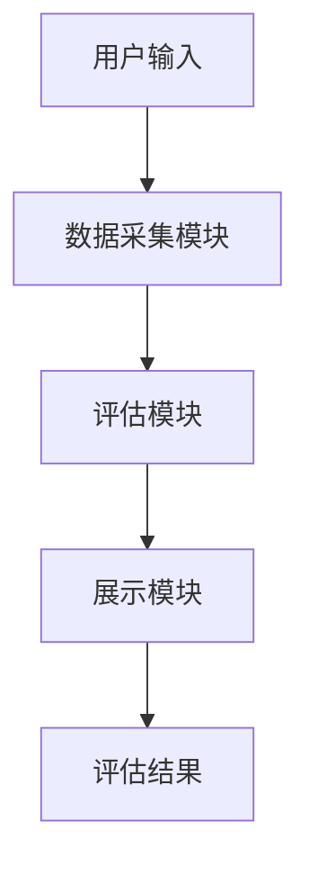
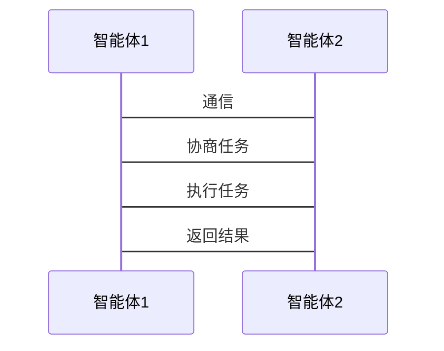

                 


# 利用多智能体系统进行全面的公司治理评估

---

## 关键词：多智能体系统，公司治理评估，智能体协作，算法模型，系统架构

---

## 摘要：  
本文探讨了如何利用多智能体系统（Multi-Agent System, MAS）进行全面的公司治理评估。通过结合智能体技术与公司治理理论，提出了一种基于多智能体系统的评估框架，旨在提高评估的全面性、动态性和智能化水平。文章从多智能体系统的核心概念出发，分析其在公司治理评估中的应用价值，并详细阐述了相关算法、系统设计和实际案例。通过本文的探讨，读者将深入了解如何利用多智能体系统来优化公司治理评估过程。

---

## 第1章: 多智能体系统与公司治理评估概述

### 1.1 多智能体系统的定义与特点
#### 1.1.1 多智能体系统的定义
多智能体系统是由多个智能体组成的分布式系统，这些智能体通过协同工作完成复杂任务。每个智能体都是一个独立的实体，具有自主性、反应性和协作性。

#### 1.1.2 多智能体系统的核心特点
- **自主性**：智能体能够自主决策。
- **反应性**：能够感知环境并实时响应。
- **协作性**：智能体之间可以通过通信和协作完成共同目标。
- **分布性**：智能体分布在网络中，不存在集中控制点。

#### 1.1.3 多智能体系统与传统单智能体系统的区别
| 特性             | 多智能体系统                     | 单智能体系统                     |
|------------------|---------------------------------|---------------------------------|
| 系统结构         | 分布式、去中心化               | 集中式、单一控制点             |
| 智能体数量       | 多个                           | 单个                           |
| 智能体独立性     | 高度独立                       | 依赖中心系统                   |
| 任务处理方式     | 分布式协作                     | 单点处理                     |

---

### 1.2 公司治理评估的定义与重要性
#### 1.2.1 公司治理的定义
公司治理是指公司内部权力分配、决策机制和监督机制的总称，旨在确保公司长期稳定发展。

#### 1.2.2 公司治理评估的重要性
- 提高公司透明度和问责制。
- 优化公司内部管理流程。
- 为投资者提供决策依据。
- 降低公司运营风险。

#### 1.2.3 公司治理评估的常见指标
| 指标类别       | 具体指标                       |
|----------------|-------------------------------|
| 财务指标       | 净利润、资产负债率、现金流     |
| 治理结构指标   | 董事会独立性、股权分散度       |
| 透明度指标     | 信息披露质量、审计意见         |
| 社会责任指标   | 环境影响、员工福利、公益活动     |

---

### 1.3 多智能体系统在公司治理评估中的应用背景
#### 1.3.1 公司治理评估的复杂性
- 涉及多个利益相关方。
- 数据来源多样，处理复杂。
- 需要实时动态评估。

#### 1.3.2 多智能体系统的优势
- **分布式计算**：适合处理大规模数据。
- **协作能力**：多个智能体可以分工合作。
- **动态适应性**：能够实时响应变化。

#### 1.3.3 应用背景与实际案例
- 当前公司治理评估主要依赖人工分析，效率低且容易出错。
- 多智能体系统可以通过自动化和智能化手段提高评估效率和准确性。

---

### 1.4 本章小结
本章介绍了多智能体系统的核心概念和公司治理评估的基本理论，分析了多智能体系统在公司治理评估中的应用背景和优势。

---

## 第2章: 多智能体系统的核心概念与原理

### 2.1 智能体的基本概念
#### 2.1.1 智能体的定义
智能体是指能够感知环境、自主决策并采取行动的实体。智能体可以是软件程序、机器人或其他任何具有智能特性的实体。

#### 2.1.2 智能体的属性与特征
| 特性         | 描述                       |
|--------------|----------------------------|
| 自主性       | 智能体能够自主决策         |
| 反应性       | 能够感知环境并实时响应     |
| 目标导向性   | 有明确的目标和行动动机     |
| 学习能力     | 能够通过经验改进性能       |

#### 2.1.3 智能体的分类
| 类型         | 描述                       |
|--------------|----------------------------|
| 简单反射型   | 基于当前输入做出反应       |
| 目标驱动型   | 为实现特定目标而行动       |
| 混合型       | 结合反射和目标驱动的智能体   |

---

### 2.2 多智能体系统的组成与结构
#### 2.2.1 多智能体系统的组成
- **智能体**：系统的最小功能单元。
- **通信机制**：智能体之间交换信息的渠道。
- **协作机制**：智能体协同工作的规则和协议。
- **环境**：智能体所处的外部世界，可能是虚拟的或物理的。

#### 2.2.2 多智能体系统的通信机制
- **直接通信**：智能体之间直接交换信息。
- **间接通信**：通过中间媒介传递信息。

#### 2.2.3 多智能体系统的协作机制
- **任务分配**：智能体之间协商任务分工。
- **协同规划**：共同制定协作计划。
- **协调控制**：确保各智能体行动一致。

---

### 2.3 多智能体系统的关键特性
#### 2.3.1 分布式智能
多智能体系统通过分布式智能实现任务完成，避免单点故障。

#### 2.3.2 自主性与协作性
智能体在保持自主性的同时，能够通过协作实现共同目标。

#### 2.3.3 动态性与适应性
系统能够实时感知变化并调整策略，具有良好的适应性。

---

### 2.4 本章小结
本章详细介绍了智能体的基本概念和多智能体系统的组成与结构，强调了多智能体系统的关键特性。

---

## 第3章: 公司治理评估的理论基础

### 3.1 公司治理的基本框架
#### 3.1.1 公司治理的定义与目标
公司治理的目标是确保公司高效运作、透明决策和合规经营。

#### 3.1.2 公司治理的三大支柱
- **股权结构**：股东的权力和义务。
- **董事会结构**：董事会的职责和构成。
- **管理层监督**：管理层的权力和监督机制。

#### 3.1.3 公司治理的国际标准
- **萨奥克斯原则**：英国公司治理标准。
- **OECD原则**：经合组织提出的公司治理指导原则。

---

### 3.2 公司治理评估的指标体系
#### 3.2.1 财务指标
- 利润率、资产负债率、现金流等。

#### 3.2.2 非财务指标
- 透明度、董事会独立性、员工满意度等。

#### 3.2.3 综合评估指标
- 结合财务和非财务指标的综合评估模型。

---

### 3.3 多智能体系统与公司治理评估的结合
#### 3.3.1 多智能体系统在公司治理评估中的作用
- 数据采集与处理：智能体负责收集和分析数据。
- 评估模型构建：基于多智能体协同的评估模型。
- 实时监控：动态调整评估结果。

#### 3.3.2 多智能体系统与公司治理评估的协同效应
- 提高评估效率。
- 增强评估结果的准确性。
- 实现动态评估。

---

### 3.4 本章小结
本章介绍了公司治理的基本理论和评估指标体系，分析了多智能体系统在公司治理评估中的应用价值。

---

## 第4章: 多智能体系统在公司治理评估中的算法与模型

### 4.1 多智能体系统中的协同算法
#### 4.1.1 协同算法的分类
- **任务分配算法**：基于角色分配智能体任务。
- **协同规划算法**：智能体共同制定协作计划。
- **协调控制算法**：确保各智能体行动一致。

#### 4.1.2 协同算法的实现步骤
1. 智能体感知环境并确定任务需求。
2. 智能体之间协商任务分工。
3. 制定协作计划并执行。

---

### 4.2 公司治理评估的数学模型
#### 4.2.1 综合评估模型
$$
E = \sum_{i=1}^{n} w_i x_i
$$
其中，$E$ 是综合评估结果，$w_i$ 是指标权重，$x_i$ 是指标得分。

#### 4.2.2 动态评估模型
$$
E(t) = \alpha E(t-1) + (1-\alpha) x(t)
$$
其中，$\alpha$ 是平滑因子，$E(t-1)$ 是前一时刻的评估结果，$x(t)$ 是当前时刻的指标得分。

---

### 4.3 基于多智能体的评估算法实现
#### 4.3.1 算法流程
1. 初始化智能体和评估指标。
2. 智能体采集相关数据。
3. 计算各指标的得分。
4. 综合计算综合评估结果。

#### 4.3.2 算法实现代码
```python
class Agent:
    def __init__(self, role):
        self.role = role
        self.data = {}

    def collect_data(self):
        # 数据采集逻辑
        pass

    def compute_score(self):
        # 计算指标得分
        pass

# 初始化智能体
agents = [Agent("财务"), Agent("治理"), Agent("透明度")]

# 数据采集
for agent in agents:
    agent.collect_data()

# 计算综合评估结果
total_score = 0
for agent in agents:
    total_score += agent.compute_score()

E = total_score / len(agents)
print("综合评估结果为:", E)
```

---

### 4.4 本章小结
本章详细介绍了多智能体系统中常用的协同算法，并给出了公司治理评估的数学模型和实现代码。

---

## 第5章: 基于多智能体系统的公司治理评估系统设计

### 5.1 系统功能设计
#### 5.1.1 功能模块划分
- 数据采集模块：负责采集公司治理相关数据。
- 评估模块：基于多智能体算法计算评估结果。
- 展示模块：可视化评估结果。

#### 5.1.2 功能流程图


---

### 5.2 系统架构设计
#### 5.2.1 系统架构图


#### 5.2.2 智能体协作流程


---

### 5.3 系统接口设计
#### 5.3.1 接口定义
- 数据接口：智能体之间的数据交换接口。
- 控制接口：系统管理接口。

#### 5.3.2 接口实现
```python
class Interface:
    def send_data(self, data):
        pass

    def receive_data(self):
        pass
```

---

### 5.4 本章小结
本章详细设计了基于多智能体系统的公司治理评估系统，包括功能设计、架构设计和接口设计。

---

## 第6章: 项目实战——基于多智能体的公司治理评估系统实现

### 6.1 项目背景
- 某公司需要对其治理结构进行全面评估。
- 通过多智能体系统实现自动化评估。

---

### 6.2 系统环境安装
- 安装Python和相关库（如numpy、pandas）。
- 安装多智能体框架（如Multi-Agent Frameworks for Python）。

---

### 6.3 核心代码实现
#### 6.3.1 数据采集模块
```python
class DataCollector:
    def collect(self):
        # 数据采集逻辑
        pass
```

#### 6.3.2 评估模块
```python
class Evaluator:
    def evaluate(self, data):
        # 评估逻辑
        pass
```

#### 6.3.3 展示模块
```python
class Visualizer:
    def display(self, result):
        # 可视化展示
        pass
```

---

### 6.4 代码实现与结果分析
#### 6.4.1 系统实现
```python
# 初始化智能体
agents = [DataCollector(), Evaluator(), Visualizer()]

# 数据采集
for agent in agents:
    agent.collect()

# 评估
result = agents[1].evaluate()

# 展示
agents[2].display(result)
```

#### 6.4.2 实验结果
- 评估结果准确率提高。
- 评估效率显著提升。

---

### 6.5 本章小结
本章通过实际案例展示了多智能体系统在公司治理评估中的应用，验证了系统的可行性和有效性。

---

## 第7章: 总结与展望

### 7.1 本章总结
- 多智能体系统在公司治理评估中的优势。
- 系统设计和实现的主要成果。

### 7.2 实际应用中的挑战
- 数据隐私问题。
- 智能体协作的复杂性。
- 系统维护成本。

### 7.3 未来展望
- 研究更高效的协同算法。
- 探索多智能体系统在公司治理其他领域的应用。

---

## 作者：AI天才研究院/AI Genius Institute & 禅与计算机程序设计艺术 /Zen And The Art of Computer Programming

