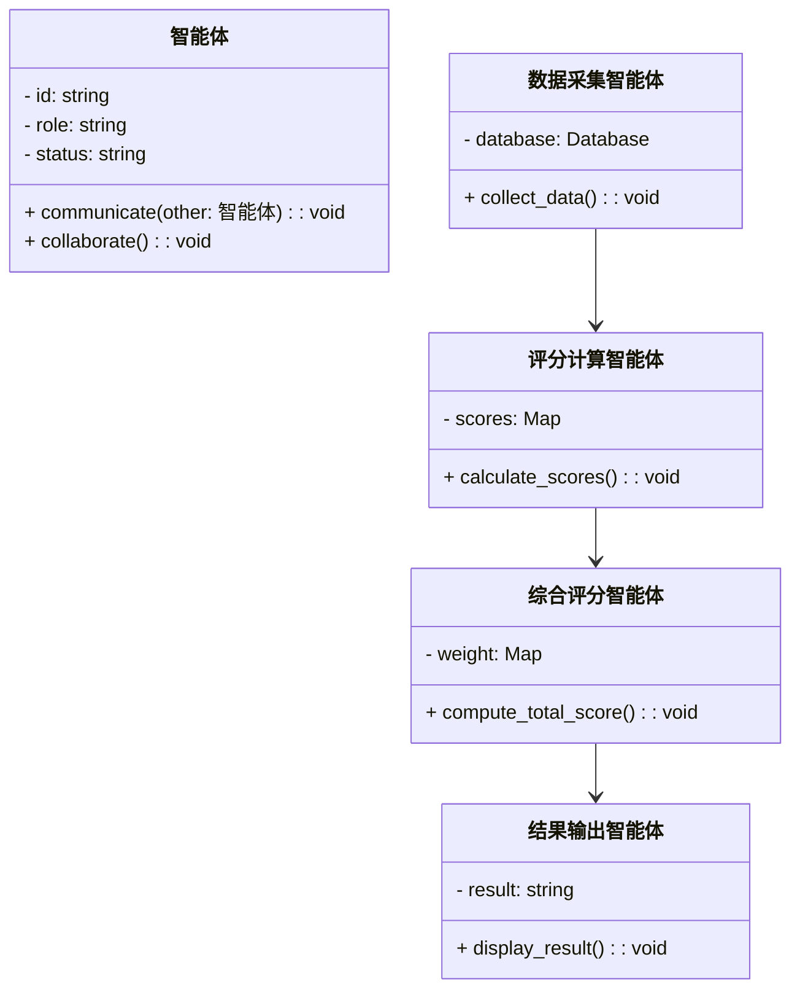
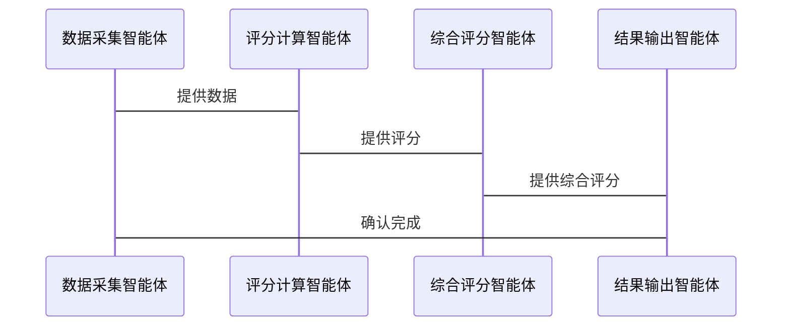

                 


# 利用多智能体系统进行全面的公司治理评分

## 关键词：多智能体系统、公司治理评分、分布式计算、协作算法、企业评分系统

## 摘要：
本文将探讨如何利用多智能体系统进行全面的公司治理评分。通过分析多智能体系统的核心概念、算法原理以及系统架构，我们展示了如何利用分布式计算和协作算法来实现高效的公司治理评分。文章从背景介绍、核心概念、算法原理、系统架构、项目实战、最佳实践等多个方面展开，深入剖析了多智能体系统在公司治理评分中的应用，并通过具体案例和代码实现，为读者提供了全面的技术指导和实践参考。

---

## 第1章: 多智能体系统与公司治理评分概述

### 1.1 多智能体系统的定义与特点

#### 1.1.1 多智能体系统的定义
多智能体系统（Multi-Agent System, MAS）是由多个智能体（Agent）组成的分布式系统，这些智能体能够通过协作和通信完成复杂的任务。智能体是指能够感知环境、自主决策并采取行动的实体。

#### 1.1.2 多智能体系统的核心特点
1. **分布式性**：智能体分布在不同的位置，独立运行。
2. **协作性**：智能体之间通过通信和协作完成共同目标。
3. **自主性**：每个智能体都能自主决策，无需集中控制。
4. **反应性**：智能体能够实时感知环境并做出反应。

#### 1.1.3 多智能体系统与传统单智能体系统的区别
- **控制方式**：多智能体系统采用分布式控制，而单智能体系统是集中控制。
- **协作能力**：多智能体系统通过协作完成任务，而单智能体系统独立完成。
- **灵活性**：多智能体系统更具灵活性，能够适应复杂环境。

### 1.2 公司治理评分的定义与重要性

#### 1.2.1 公司治理评分的定义
公司治理评分是对企业治理结构、管理效率、透明度等方面进行综合评估的过程，通常采用量化指标来衡量企业的治理水平。

#### 1.2.2 公司治理评分的重要性
1. **提升企业治理水平**：通过评分发现企业治理中的问题，进而优化管理。
2. **增强投资者信心**：高分企业更受投资者青睐。
3. **促进企业透明化**：评分公开后，企业更注重合规性和透明度。

#### 1.2.3 公司治理评分的常见指标
- **董事会结构**：董事会的独立性、专业性。
- **高管薪酬**：高管薪酬是否合理透明。
- **股东权利**：股东的知情权和参与权。
- **合规性**：企业是否遵守法律法规。

### 1.3 多智能体系统在公司治理评分中的应用前景

#### 1.3.1 多智能体系统在公司治理评分中的优势
1. **分布式计算**：多智能体系统能够高效地处理大规模数据。
2. **协作能力**：智能体之间可以协同完成复杂评分任务。
3. **实时性**：智能体能够实时更新评分数据。

#### 1.3.2 公司治理评分的潜在应用领域
- **企业合规性评估**：通过多智能体系统实时监控企业的合规性。
- **风险预警**：根据评分结果提前发现潜在风险。
- **行业 benchmarking**：帮助企业了解行业平均水平。

#### 1.3.3 多智能体系统在公司治理评分中的挑战与机遇
- **挑战**：智能体之间的通信和协作需要高效算法。
- **机遇**：多智能体系统的分布式特性能够提升评分效率。

### 1.4 本章小结
本章介绍了多智能体系统的基本概念和特点，并详细阐述了公司治理评分的定义、重要性及常见指标。同时，我们探讨了多智能体系统在公司治理评分中的应用前景，为后续章节奠定了基础。

---

## 第2章: 多智能体系统的核心概念与联系

### 2.1 多智能体系统的组成与功能

#### 2.1.1 多智能体系统的组成
- **智能体**：负责具体任务的执行单元。
- **通信协议**：智能体之间交互的规则和标准。
- **协作算法**：智能体协作完成任务的算法。

#### 2.1.2 各智能体的功能与角色
- **数据采集智能体**：负责收集企业治理数据。
- **评分计算智能体**：根据数据计算评分。
- **结果输出智能体**：将评分结果呈现给用户。

#### 2.1.3 智能体之间的交互与协作
智能体之间通过通信协议进行数据交换和协作，确保评分过程的高效完成。

### 2.2 公司治理评分的核心要素

#### 2.2.1 公司治理评分的主要指标
- **董事会效率**：董事会的决策效率和独立性。
- **高管薪酬合理性**：高管薪酬是否符合企业绩效。
- **股东权益保护**：股东权利是否得到保障。

#### 2.2.2 各指标之间的关系
各指标相互关联，共同影响企业的整体治理水平。

#### 2.2.3 指标权重的确定方法
通过专家评分或数据分析确定各指标的权重。

### 2.3 多智能体系统与公司治理评分的关系

#### 2.3.1 多智能体系统在公司治理评分中的作用
多智能体系统能够高效地处理大规模数据，并通过协作完成复杂的评分任务。

#### 2.3.2 公司治理评分对多智能体系统的反馈机制
评分结果可以反哺多智能体系统，优化智能体的协作算法。

### 2.4 本章小结
本章详细讲解了多智能体系统的组成与功能，并分析了公司治理评分的核心要素。同时，我们探讨了多智能体系统与公司治理评分之间的关系，为后续章节的深入分析奠定了基础。

---

## 第3章: 多智能体系统在公司治理评分中的算法原理

### 3.1 多智能体系统的核心算法

#### 3.1.1 分布式计算算法
分布式计算算法用于多智能体系统中数据的并行处理。

#### 3.1.2 协作与通信算法
协作与通信算法确保智能体之间的高效协作和信息共享。

#### 3.1.3 学习与自适应算法
学习与自适应算法用于优化智能体的行为和协作策略。

### 3.2 公司治理评分的数学模型

#### 3.2.1 指标权重的计算公式
$$ w_i = \frac{f_i}{\sum_{j=1}^{n} f_j} $$
其中，\( w_i \) 表示第 \( i \) 个指标的权重，\( f_i \) 表示第 \( i \) 个指标的重要性评分，\( n \) 表示指标总数。

#### 3.2.2 综合评分的计算公式
$$ S = \sum_{i=1}^{n} w_i \times s_i $$
其中，\( S \) 表示综合评分，\( w_i \) 表示第 \( i \) 个指标的权重，\( s_i \) 表示第 \( i \) 个指标的评分。

#### 3.2.3 模型的优化与调整
通过调整权重和优化算法，提升评分模型的准确性和效率。

### 3.3 多智能体系统与公司治理评分的协同算法

#### 3.3.1 协同算法的流程
1. 数据采集智能体收集企业治理数据。
2. 评分计算智能体根据数据计算各指标评分。
3. 综合评分智能体根据权重计算综合评分。
4. 结果输出智能体将评分结果呈现给用户。

#### 3.3.2 算法的实现步骤
1. 初始化多智能体系统。
2. 智能体之间建立通信连接。
3. 数据采集智能体开始采集数据。
4. 评分计算智能体开始计算评分。
5. 综合评分智能体计算最终评分。
6. 结果输出智能体展示评分结果。

#### 3.3.3 算法的优化与改进
通过优化通信协议和协作算法，提升系统的效率和准确性。

### 3.4 本章小结
本章详细讲解了多智能体系统的核心算法和公司治理评分的数学模型。通过协同算法的流程和实现步骤，展示了多智能体系统在公司治理评分中的具体应用。

---

## 第4章: 多智能体系统的系统分析与架构设计

### 4.1 问题场景介绍

#### 4.1.1 问题背景
企业治理数据分散在不同部门，需要高效地进行数据整合和评分计算。

#### 4.1.2 问题描述
传统评分系统效率低，难以处理大规模数据，且缺乏实时性。

### 4.2 系统功能设计

#### 4.2.1 领域模型


#### 4.2.2 系统架构


#### 4.2.3 接口设计
- 数据采集接口：用于智能体之间数据的传输。
- 评分计算接口：用于智能体之间的协作和通信。

### 4.3 系统交互流程

#### 4.3.1 交互流程图


### 4.4 本章小结
本章通过系统分析和架构设计，展示了多智能体系统在公司治理评分中的具体实现方式。通过领域模型、系统架构和交互流程图，详细描述了系统的各个部分及其协作方式。

---

## 第5章: 多智能体系统的项目实战

### 5.1 环境安装与配置

#### 5.1.1 环境需求
- Python 3.8及以上版本
- Mermaid工具或支持mermaid语法的文本编辑器
- 代码运行环境（如Jupyter Notebook）

#### 5.1.2 安装依赖
```bash
pip install mermaid
pip install matplotlib
pip install numpy
```

### 5.2 核心代码实现

#### 5.2.1 数据采集智能体
```python
class Agent:
    def __init__(self, id, role):
        self.id = id
        self.role = role
        self.status = "idle"

    def communicate(self, other):
        pass

    def collaborate(self):
        pass


class DataCollector(Agent):
    def __init__(self, id):
        super().__init__(id, "data_collector")
        self.data = {}

    def collect_data(self):
        # 模拟数据采集
        self.data = {
            "board_efficiency": 0.85,
            "executive_compensation": 0.78,
            "shareholder_rights": 0.92
        }
```

#### 5.2.2 评分计算智能体
```python
class Scorer(Agent):
    def __init__(self, id):
        super().__init__(id, "scorer")
        self.scores = {}

    def calculate_scores(self, data):
        self.scores = {
            "board_efficiency": data["board_efficiency"],
            "executive_compensation": data["executive_compensation"],
            "shareholder_rights": data["shareholder_rights"]
        }
```

#### 5.2.3 综合评分智能体
```python
class Aggregator(Agent):
    def __init__(self, id):
        super().__init__(id, "aggregator")
        self.weights = {}
        self.total_score = 0

    def compute_total_score(self, scores):
        # 简单示例：假设各指标权重相等
        self.total_score = sum(scores.values()) / len(scores)
```

#### 5.2.4 结果输出智能体
```python
class Display(Agent):
    def __init__(self, id):
        super().__init__(id, "display")
        self.result = ""

    def display_result(self, score):
        self.result = f"公司治理评分为：{score}"
        print(self.result)
```

### 5.3 实际案例分析

#### 5.3.1 案例背景
某企业需要对其治理结构进行评分，数据包括董事会效率、高管薪酬和股东权益保护。

#### 5.3.2 数据采集与处理
```python
data_collector = DataCollector("Collector1")
data_collector.collect_data()

scorer = Scorer("Scorer1")
scorer.calculate_scores(data_collector.data)

aggregator = Aggregator("Aggregator1")
aggregator.compute_total_score(scorer.scores)

display = Display("Display1")
display.display_result(aggregator.total_score)
```

### 5.4 本章小结
本章通过实际案例展示了多智能体系统在公司治理评分中的具体实现。通过代码实现和案例分析，读者可以更好地理解多智能体系统在实际应用中的操作流程。

---

## 第6章: 最佳实践与总结

### 6.1 最佳实践 tips

#### 6.1.1 系统设计
- 确保智能体之间的通信高效可靠。
- 合理分配智能体的职责和角色。

#### 6.1.2 算法优化
- 定期更新权重和算法，提升评分准确性。
- 引入机器学习算法，优化智能体的协作能力。

### 6.2 本章小结
本文通过详细分析多智能体系统在公司治理评分中的应用，展示了其在分布式计算和协作算法方面的优势。通过实际案例和代码实现，读者可以更好地理解和应用相关技术。

### 6.3 注意事项
- 数据安全：确保企业数据的安全性和隐私性。
- 系统维护：定期维护和更新系统，确保其高效运行。

### 6.4 拓展阅读
- 《Multi-Agent Systems: Complexity, Decentralization, and Coordination》
- 《Enterprise Governance and Risk Management》

---

## 作者：AI天才研究院/AI Genius Institute & 禅与计算机程序设计艺术 /Zen And The Art of Computer Programming

