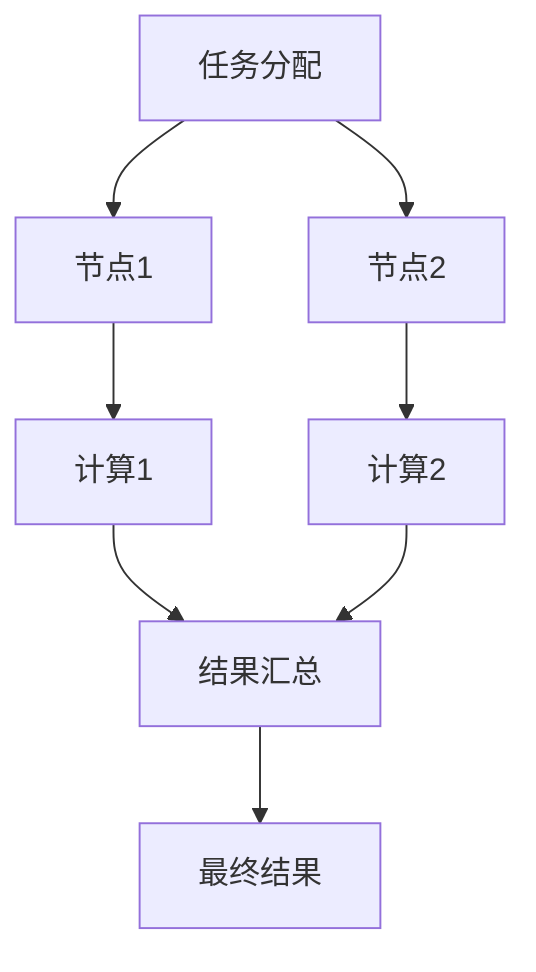
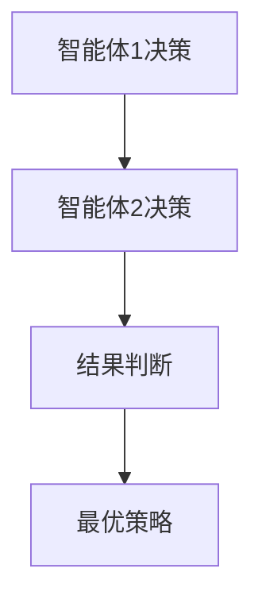
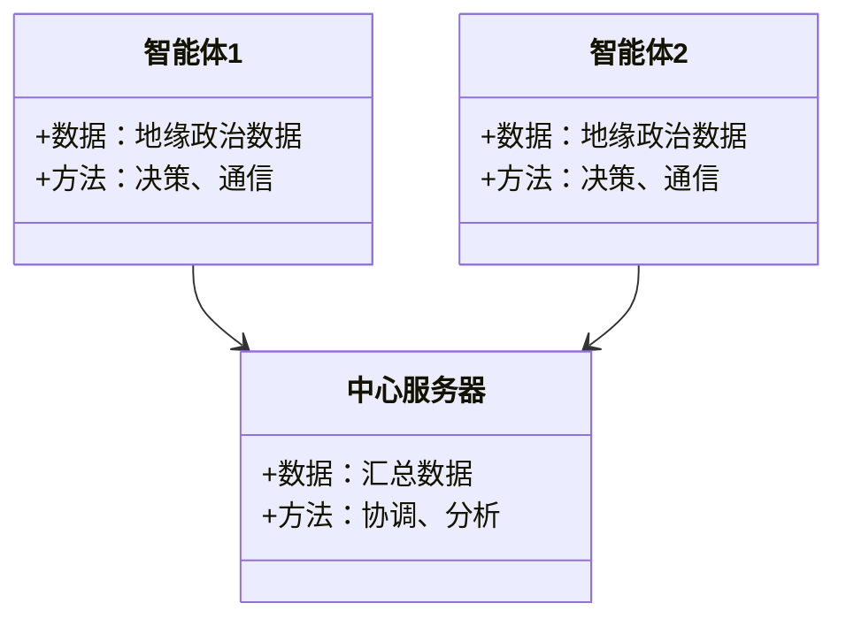

                 


# 利用多智能体系统进行全面的地缘政治风险分析

**关键词：** 多智能体系统、地缘政治风险分析、算法、系统架构、项目实战

**摘要：**  
随着全球化的深入和国际关系的复杂化，地缘政治风险分析的重要性日益凸显。传统的单一智能体方法在处理复杂、动态的地缘政治问题时显得力不从心。多智能体系统（Multi-Agent Systems, MAS）通过多个智能体的协同工作，能够更全面、更动态地分析地缘政治风险。本文将从基础概念、算法原理、系统架构到项目实战，逐步深入探讨如何利用多智能体系统进行全面的地缘政治风险分析。

---

# 第一部分: 多智能体系统与地缘政治风险分析基础

## 第1章: 多智能体系统概述

### 1.1 多智能体系统的基本概念

#### 1.1.1 多智能体系统的定义  
多智能体系统（Multi-Agent Systems, MAS）是由多个智能体（Agent）组成的分布式系统，这些智能体能够通过感知环境、自主决策、协作或竞争来完成特定任务。多智能体系统的核心在于智能体之间的交互与协同。

#### 1.1.2 多智能体系统的特征  
- **自主性（Autonomy）：** 每个智能体能够自主决策，无需外部干预。  
- **反应性（Reactivity）：** 智能体能够实时感知环境并做出反应。  
- **协作性（Collaboration）：** 智能体之间可以通过通信和协作完成复杂任务。  
- **分布式性（Distributiveness）：** 系统由多个分散的智能体组成，不存在中心控制点。  

#### 1.1.3 多智能体系统与单智能体系统的主要区别  
| 特性             | 单智能体系统              | 多智能体系统              |
|------------------|--------------------------|--------------------------|
| 决策中心化       | 是                       | 否                       |
| 系统复杂性       | 较低                     | 较高                     |
| 应用场景         | 单一任务                 | 复杂任务                 |

### 1.2 多智能体系统的分类与应用

#### 1.2.1 分布式多智能体系统  
分布式多智能体系统中，智能体之间通过通信协议进行交互，通常用于大规模、复杂环境中的任务。例如，交通管理系统中，多个智能体协同优化交通流量。

#### 1.2.2 集中式多智能体系统  
集中式多智能体系统中，存在一个中心控制节点，协调其他智能体的行动。例如，电商平台中的库存管理系统。

#### 1.2.3 多智能体系统的典型应用领域  
- **分布式计算**  
- **博弈论模型**  
- **协同学习**  

---

## 第2章: 地缘政治风险分析的基本概念

### 2.1 地缘政治风险的定义与分类

#### 2.1.1 地缘政治风险的定义  
地缘政治风险是指由于国家间的政治、经济、军事等因素变化而可能引发的风险，例如战争、贸易争端、资源争夺等。

#### 2.1.2 地缘政治风险的主要分类  
- **经济风险**：如贸易制裁、经济衰退。  
- **政治风险**：如政权更迭、政策变动。  
- **军事风险**：如战争、军事冲突。  
- **社会风险**：如社会动荡、民族矛盾。  

#### 2.1.3 地缘政治风险的评估方法  
- **定量分析**：通过数据建模进行风险预测。  
- **定性分析**：通过专家判断进行风险评估。  
- **混合分析**：结合定量和定性方法。  

### 2.2 地缘政治风险分析的关键要素

#### 2.2.1 数据源  
- **公开数据**：如新闻报道、政府文件。  
- **内部数据**：如企业内部报告。  

#### 2.2.2 分析模型  
- **博弈论模型**：模拟国家间的互动。  
- **网络分析**：分析国家间的依赖关系。  

---

# 第二部分: 多智能体系统与地缘政治风险分析的结合

## 第3章: 多智能体系统与地缘政治风险分析的结合

### 3.1 多智能体系统在地缘政治风险分析中的优势

#### 3.1.1 高度动态性  
地缘政治环境复杂多变，多智能体系统能够实时感知和适应环境变化。

#### 3.1.2 分布式决策  
多智能体系统通过分布式决策避免单一中心的脆弱性。

### 3.2 多智能体系统在地缘政治风险分析中的挑战

#### 3.2.1 智能体之间的通信与协调  
复杂环境下的智能体交互需要高效且安全的通信机制。

#### 3.2.2 智能体的自主性与可控性  
如何在保证智能体自主性的同时，确保系统目标的实现是一个难题。

### 3.3 应用案例分析

#### 3.3.1 贸易争端模拟  
通过多智能体系统模拟不同国家在贸易争端中的行为，预测可能的冲突和解决方案。

#### 3.3.2 资源争夺预测  
利用多智能体系统分析各国在资源争夺中的策略和可能的后果。

---

# 第三部分: 多智能体系统地缘政治风险分析的算法与实现

## 第4章: 多智能体系统的算法原理

### 4.1 分布式计算算法

#### 4.1.1 分布式计算的定义  
分布式计算是指在多台计算机之间分配计算任务，利用并行计算提高效率。

#### 4.1.2 分布式计算的流程图  


#### 4.1.3 分布式计算的数学模型  
$$\text{任务分配} = \sum_{i=1}^{n} \frac{1}{n}$$

### 4.2 博弈论模型

#### 4.2.1 博弈论的基本概念  
博弈论是研究个体在策略互动中的行为的数学理论。

#### 4.2.2 博弈论模型的流程图  


#### 4.2.3 博弈论模型的数学公式  
$$\text{纳什均衡} = \arg \max_{i} \sum_{j=1}^{n} a_{ij}$$

---

## 第5章: 系统架构与实现

### 5.1 系统架构设计

#### 5.1.1 问题场景介绍  
分析一个地区的地缘政治风险，模拟不同国家的行为。

#### 5.1.2 系统功能设计  
- 数据采集模块：收集地缘政治数据。  
- 智能体交互模块：智能体之间的通信与协作。  
- 风险评估模块：基于多智能体交互结果进行风险评估。  

#### 5.1.3 系统架构图  


### 5.2 接口设计与交互流程

#### 5.2.1 接口设计  
- 智能体通信接口：定义智能体之间的通信协议。  
- 数据采集接口：定义数据获取的方式和格式。  

#### 5.2.2 交互流程图  
```mermaid
sequenceDiagram
    智能体1 ->> 中心服务器：发送数据
    中心服务器 ->> 智能体2：请求协作
    智能体2 ->> 中心服务器：返回结果
    中心服务器 ->> 智能体1：更新状态
```

---

## 第6章: 项目实战

### 6.1 环境配置

#### 6.1.1 系统需求  
- 操作系统：Linux/Windows  
- 开发工具：Python、Django  
- 第三方库：Django-Rest-Framework、Docker  

### 6.2 核心代码实现

#### 6.2.1 数据采集模块  
```python
import requests

def fetch_data(url):
    response = requests.get(url)
    return response.json()
```

#### 6.2.2 智能体交互模块  
```python
class Agent:
    def __init__(self, id):
        self.id = id
        self.data = None
    
    def communicate(self, other_agent):
        self.data = other_agent.data
```

#### 6.2.3 风险评估模块  
```python
def assess_risk(agents):
    for agent in agents:
        print(f"Agent {agent.id} has data: {agent.data}")
```

### 6.3 实际案例分析

#### 6.3.1 案例背景  
分析中东地区的地缘政治风险，模拟各国在能源争夺中的行为。

#### 6.3.2 案例分析  
通过多智能体系统模拟沙特、伊朗、俄罗斯的行为，预测可能的冲突和解决方案。

---

## 第7章: 总结与展望

### 7.1 总结  
多智能体系统通过分布式计算和智能体协作，为地缘政治风险分析提供了新的思路。本文详细探讨了多智能体系统的算法、架构和实现，展示了其在地缘政治风险分析中的潜力。

### 7.2 未来展望  
未来，多智能体系统在地缘政治风险分析中的应用将更加广泛。可能的发展方向包括：  
- 更高效的智能体通信协议。  
- 更复杂的博弈论模型。  
- 更智能的自主学习算法。  

### 7.3 最佳实践  
- 在实际应用中，需确保智能体之间的通信安全。  
- 数据来源的多样性和准确性是关键。  
- 系统的可扩展性设计需优先考虑。  

---

**作者：AI天才研究院/AI Genius Institute & 禅与计算机程序设计艺术 /Zen And The Art of Computer Programming**

---

这篇文章通过系统地介绍多智能体系统的基本概念、算法原理、系统架构和项目实战，全面探讨了如何利用多智能体系统进行全面的地缘政治风险分析。从理论到实践，帮助读者理解多智能体系统在地缘政治风险分析中的重要性和应用潜力。

