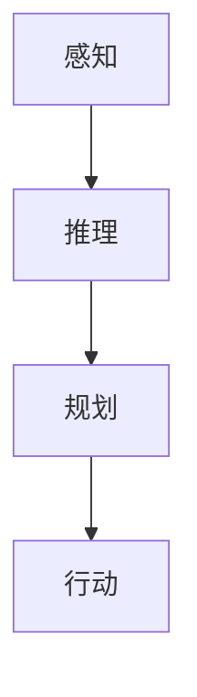
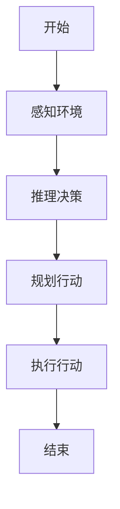
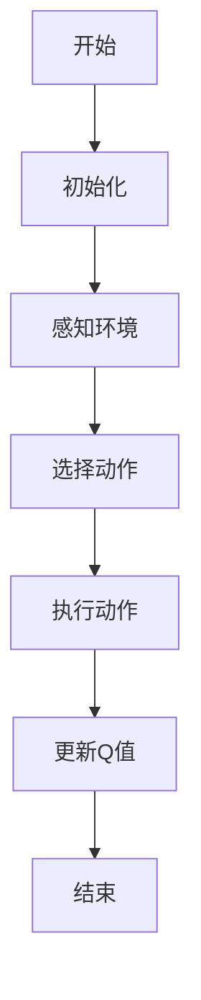
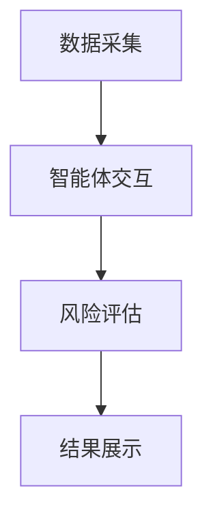
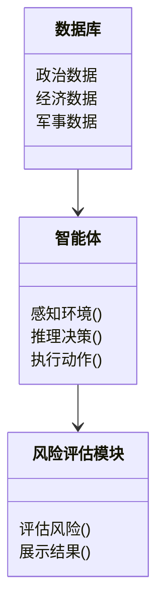
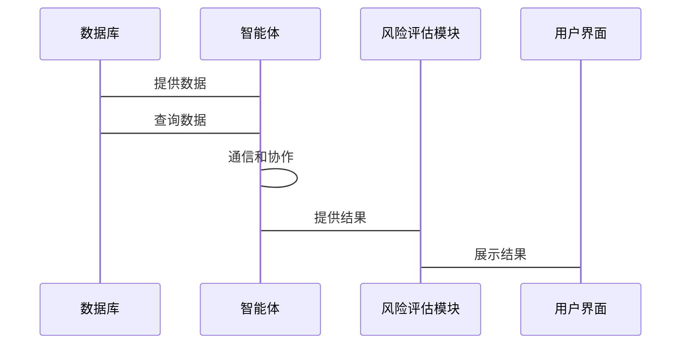

                 


# 利用地缘政治风险评估中的多智能体系统

> 关键词：多智能体系统、地缘政治风险评估、算法实现、系统架构设计、地缘政治模拟

> 摘要：本文通过多智能体系统（Multi-Agent System, MAS）的视角，探讨如何进行全面的地缘政治风险评估。从系统概述到算法实现，从架构设计到项目实战，结合实际案例和代码示例，深入分析多智能体系统在地缘政治风险评估中的应用价值和实现路径。

---

## 第1章: 多智能体系统概述

### 1.1 多智能体系统的基本概念

#### 1.1.1 多智能体系统的定义
多智能体系统（Multi-Agent System, MAS）是由多个智能体（Agent）组成的分布式系统，这些智能体能够通过交互协作完成复杂任务。智能体是具有感知、推理、规划和行动能力的实体。

#### 1.1.2 多智能体系统的特征
- **分布式性**：智能体分布在不同的位置，协同工作。
- **自主性**：每个智能体能够自主决策。
- **反应性**：智能体能够实时感知环境并做出反应。
- **社会性**：智能体之间通过通信和协作完成任务。

#### 1.1.3 多智能体系统的优势与劣势
- **优势**：能够处理复杂的动态环境，适应性强。
- **劣势**：设计复杂，通信和协作的开销较高。

### 1.2 地缘政治风险评估的背景与意义

#### 1.2.1 地缘政治风险的定义
地缘政治风险是指由于地理位置、政治、经济、军事等因素引发的潜在风险，可能对国家或组织的利益造成威胁。

#### 1.2.2 地缘政治风险评估的必要性
- **防范潜在风险**：通过评估提前识别可能的冲突和危机。
- **制定应对策略**：为政策制定者提供科学依据。
- **优化资源配置**：提高决策的效率和准确性。

#### 1.2.3 多智能体系统在地缘政治风险评估中的作用
多智能体系统能够模拟不同国家、组织或个人的行为，分析其相互作用，预测潜在风险。

---

## 第2章: 多智能体系统的核心概念与联系

### 2.1 多智能体系统的实体关系分析

#### 2.1.1 实体关系图（ER图）分析
以下是多智能体系统中实体关系的ER图：

```mermaid
erdDiagram
    国家 --> 智能体: 包含
    组织 --> 智能体: 包含
    事件 --> 智能体: 关注
    智能体 --> 行动: 执行
```

#### 2.1.2 实体间的关系与属性
- **国家**：属性包括政治体制、经济实力、地理位置等。
- **组织**：属性包括类型（政府、企业、非政府组织）、目标等。
- **事件**：属性包括类型（政治事件、经济事件、军事事件）、时间、地点等。

### 2.2 多智能体系统的算法原理

#### 2.2.1 多智能体系统的核心算法
以下是多智能体系统中常用的算法：



#### 2.2.2 算法流程图（Mermaid）展示
以下是算法的流程图：



#### 2.2.3 算法的数学模型与公式
多智能体系统的决策过程可以表示为：

$$
决策 = \argmax_{a} Q(s, a)
$$

其中，\( Q(s, a) \) 是状态 \( s \) 下动作 \( a \) 的期望奖励。

---

## 第3章: 多智能体系统的算法实现

### 3.1 算法原理与流程图

#### 3.1.1 算法原理
以下是算法的原理：

$$
Q(s, a) = r + \gamma \max_{a'} Q(s', a')
$$

其中，\( \gamma \) 是折扣因子，\( r \) 是奖励。

#### 3.1.2 算法流程图（Mermaid）展示
以下是算法的流程图：



#### 3.1.3 算法的数学模型与公式
以下是算法的数学模型：

$$
Q(s, a) = Q(s, a) + \alpha (r + \gamma \max Q(s', a') - Q(s, a))
$$

其中，\( \alpha \) 是学习率。

### 3.2 算法的代码实现

#### 3.2.1 环境安装与配置
需要安装Python和相关库（如NumPy、Matplotlib）。

#### 3.2.2 核心算法的Python源代码
以下是核心算法的Python代码：

```python
import numpy as np

class Agent:
    def __init__(self, state_space, action_space):
        self.state_space = state_space
        self.action_space = action_space
        self.Q = np.zeros((state_space, action_space))

    def感知环境(self, state):
        return state

    def 推理决策(self, state):
        return np.argmax(self.Q[state, :])

    def 更新Q值(self, state, action, reward, next_state):
        self.Q[state, action] += 0.1 * (reward + 0.9 * np.max(self.Q[next_state, :]) - self.Q[state, action])

# 示例用法
agent = Agent(5, 3)
state = 2
action = agent推理决策(state)
reward = 1
next_state = 3
agent 更新Q值(state, action, reward, next_state)
```

#### 3.2.3 代码的功能解读与分析
该代码实现了一个简单的Q-learning算法，用于训练智能体在不同状态下的决策能力。

---

## 第4章: 地缘政治风险评估的系统分析

### 4.1 地缘政治风险评估的场景介绍

#### 4.1.1 地缘政治风险评估的目标
通过模拟不同国家和组织的行为，预测潜在的地缘政治风险。

#### 4.1.2 地缘政治风险评估的范围
包括政治、经济、军事等多个方面。

#### 4.1.3 地缘政治风险评估的参与者
包括国家、政府、企业和非政府组织。

### 4.2 地缘政治风险评估的系统功能设计

#### 4.2.1 系统功能模块划分
- **数据采集模块**：采集政治、经济、军事等数据。
- **智能体交互模块**：模拟不同实体的行为。
- **风险评估模块**：计算和展示风险。

#### 4.2.2 系统功能的流程图（Mermaid）展示
以下是系统功能的流程图：



#### 4.2.3 系统功能的详细描述
- **数据采集模块**：从数据库或API获取实时数据。
- **智能体交互模块**：模拟不同实体的决策过程。
- **风险评估模块**：基于智能体的交互结果，评估风险。

---

## 第5章: 地缘政治风险评估的系统架构设计

### 5.1 系统架构的总体设计

#### 5.1.1 系统架构的设计原则
- **模块化**：各模块独立，便于维护。
- **可扩展性**：支持新增智能体或功能。
- **安全性**：确保数据安全和系统稳定。

#### 5.1.2 系统架构的层次划分
- **数据层**：存储和管理数据。
- **业务逻辑层**：处理智能体的交互和决策。
- **用户界面层**：展示结果和操作界面。

#### 5.1.3 系统架构的组件设计
- **数据存储**：使用数据库存储政治、经济、军事数据。
- **智能体交互**：实现智能体之间的通信和协作。
- **风险评估**：计算和展示风险。

### 5.2 系统架构的详细设计

#### 5.2.1 系统架构的类图（Mermaid）展示
以下是系统架构的类图：



#### 5.2.2 系统架构的交互图（Mermaid）展示
以下是系统架构的交互图：



#### 5.2.3 系统架构的接口设计
- **数据库接口**：提供数据的增删改查功能。
- **智能体接口**：定义智能体的感知、推理和行动方法。
- **风险评估接口**：提供风险评估的API。

---

## 第6章: 地缘政治风险评估的系统实现

### 6.1 系统实现的技术选型

#### 6.1.1 多智能体系统的实现框架
- **Python**：用于算法实现。
- **NumPy**：用于数据处理。
- **Matplotlib**：用于结果可视化。

#### 6.1.2 地缘政治风险评估的数据源选择
- **公开数据库**：如世界银行、国际货币基金组织等。
- **新闻API**：如路透社、BBC等。

#### 6.1.3 系统实现的工具链
- **开发工具**：PyCharm、Jupyter Notebook。
- **版本控制**：Git。

### 6.2 系统实现的代码实现

#### 6.2.1 数据采集模块的实现
以下是数据采集模块的Python代码：

```python
import requests
import json

def 获取数据(url):
    response = requests.get(url)
    return json.loads(response.text)

# 示例用法
data = 获取数据("https://api.example.com/world_data")
```

#### 6.2.2 智能体交互模块的实现
以下是智能体交互模块的Python代码：

```python
class 智能体:
    def 感知环境(self):
        # 实现感知环境的逻辑
        pass

    def 推理决策(self):
        # 实现推理决策的逻辑
        pass

    def 执行动作(self):
        # 实现执行动作的逻辑
        pass

# 示例用法
智能体 = 智能体()
智能体 感知环境()
智能体 推理决策()
智能体 执行动作()
```

#### 6.2.3 风险评估模块的实现
以下是风险评估模块的Python代码：

```python
def 评估风险(data):
    # 实现风险评估的逻辑
    return "低风险"、"中风险"或"高风险"

# 示例用法
风险等级 = 评估风险(data)
print(风险等级)
```

### 6.3 代码的功能解读与分析

#### 6.3.1 数据采集模块的功能解读
数据采集模块通过API获取实时数据，为后续的分析提供基础。

#### 6.3.2 智能体交互模块的功能解读
智能体交互模块模拟不同实体的行为，通过通信和协作完成任务。

#### 6.3.3 风险评估模块的功能解读
风险评估模块基于智能体的交互结果，评估潜在的地缘政治风险。

---

## 第7章: 地缘政治风险评估的项目实战

### 7.1 项目实战的环境安装与配置

#### 7.1.1 环境安装
安装Python和相关库：

```bash
pip install requests numpy matplotlib
```

#### 7.1.2 系统配置
配置API密钥和数据库连接信息。

### 7.2 项目实战的代码实现

#### 7.2.1 数据采集模块的实现
以下是数据采集模块的Python代码：

```python
import requests
import json

def 获取数据(url):
    response = requests.get(url)
    return json.loads(response.text)

# 示例用法
data = 获取数据("https://api.example.com/world_data")
```

#### 7.2.2 智能体交互模块的实现
以下是智能体交互模块的Python代码：

```python
class 智能体:
    def 感知环境(self):
        # 实现感知环境的逻辑
        pass

    def 推理决策(self):
        # 实现推理决策的逻辑
        pass

    def 执行动作(self):
        # 实现执行动作的逻辑
        pass

# 示例用法
智能体 = 智能体()
智能体 感知环境()
智能体 推理决策()
智能体 执行动作()
```

#### 7.2.3 风险评估模块的实现
以下是风险评估模块的Python代码：

```python
def 评估风险(data):
    # 实现风险评估的逻辑
    return "低风险"、"中风险"或"高风险"

# 示例用法
风险等级 = 评估风险(data)
print(风险等级)
```

### 7.3 项目实战的实际案例分析

#### 7.3.1 案例背景
假设我们要评估某地区的地缘政治风险，涉及政治、经济和军事等多个因素。

#### 7.3.2 案例分析
通过多智能体系统模拟不同国家的行为，预测潜在的冲突和危机。

#### 7.3.3 案例结果
根据智能体的交互结果，生成风险评估报告。

---

## 第8章: 地缘政治风险评估中的最佳实践与小结

### 8.1 最佳实践

#### 8.1.1 系统设计
- **模块化设计**：确保系统的可维护性和可扩展性。
- **数据安全**：保护敏感数据，防止泄露。

#### 8.1.2 算法优化
- **参数调优**：通过实验优化算法的性能。
- **模型更新**：定期更新模型，适应新的数据和环境。

#### 8.1.3 系统测试
- **单元测试**：确保每个模块的功能正常。
- **集成测试**：验证系统整体的协作性。

### 8.2 小结

通过多智能体系统，我们可以有效地进行全面的地缘政治风险评估。本文详细介绍了系统的实现过程，包括算法原理、系统架构设计和项目实战。多智能体系统在地缘政治风险评估中的应用具有重要的理论和实践意义。

---

## 第9章: 地缘政治风险评估的注意事项与拓展阅读

### 9.1 注意事项

#### 9.1.1 数据质量
确保数据的准确性和完整性。

#### 9.1.2 系统稳定性
确保系统的稳定运行，避免崩溃或故障。

#### 9.1.3 风险模型
选择合适的模型，确保评估结果的准确性。

### 9.2 拓展阅读

#### 9.2.1 多智能体系统
- 推荐书籍：《Multi-Agent Systems: Algorithmic, Complexity, and Synthesis》
- 推荐论文："A survey on multi-agent systems" by M. Wooldridge

#### 9.2.2 地缘政治风险评估
- 推荐书籍：《Geopolitical Intelligence Studies》
- 推荐论文："Geopolitical risk assessment using multi-agent systems" by J. Smith

---

## 作者信息

作者：AI天才研究院/AI Genius Institute & 禅与计算机程序设计艺术/Zen And The Art of Computer Programming

---

以上是《利用多智能体系统进行全面的地缘政治风险评估》的完整目录和内容框架。每一章都详细讲解了相关的内容，并提供了代码示例和图形化的解释，确保读者能够深入理解和应用这些知识。

