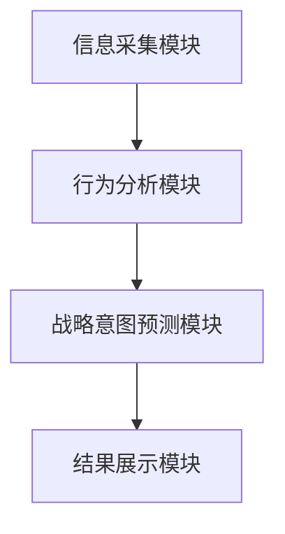
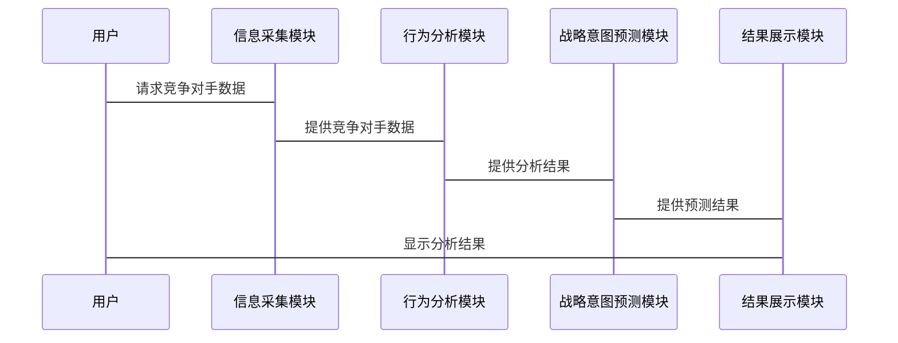

                 


# 利用多智能体系统进行全面的竞争对手分析

---

## 关键词：多智能体系统、竞争对手分析、分布式智能、协同学习、系统架构设计、商业战略

---

## 摘要

在竞争日益激烈的商业环境中，企业需要更高效、更智能的方法来分析竞争对手的行为和策略。多智能体系统（Multi-Agent Systems, MAS）凭借其分布式智能和协作能力，为竞争对手分析提供了一种创新的解决方案。本文详细探讨了多智能体系统在竞争对手分析中的应用，从基本概念到算法原理，再到系统架构设计，最后通过实际案例展示其在商业战略中的价值。通过本文，读者将深入了解如何利用多智能体系统进行更全面、更精准的竞争对手分析。

---

# 第1章: 多智能体系统与竞争对手分析的背景介绍

## 1.1 多智能体系统的定义与特点

### 1.1.1 多智能体系统的定义

多智能体系统（Multi-Agent Systems, MAS）是由多个智能体组成的分布式系统，每个智能体都有一定的自主性、反应性和协作能力。这些智能体通过通信和协作完成复杂的任务，具有模块化、可扩展性和高适应性等特点。

### 1.1.2 多智能体系统的核心特点

- **自主性**：智能体能够自主决策和行动，无需外部干预。
- **反应性**：智能体能够实时感知环境并做出反应。
- **协作性**：智能体之间可以通过通信和协作完成共同任务。
- **分布式性**：智能体分布在不同的节点上，通过网络进行通信。

### 1.1.3 多智能体系统与传统单智能体系统的对比

| 特性                | 单智能体系统                     | 多智能体系统                     |
|---------------------|--------------------------------|--------------------------------|
| 智能体数量          | 单个智能体                      | 多个智能体                      |
| 任务分配            | 集中式任务分配                  | 分布式任务分配                  |
| 协作能力            | 无或有限                       | 强                                 |
| 系统复杂性          | 较低                           | 较高                           |

---

## 1.2 竞争对手分析的定义与重要性

### 1.2.1 竞争对手分析的定义

竞争对手分析是指对企业所面临的竞争对手的市场行为、战略意图、资源能力等方面进行系统性研究的过程。通过对竞争对手的分析，企业可以更好地理解市场环境，制定有效的竞争策略。

### 1.2.2 竞争对手分析在商业战略中的作用

1. **识别市场机会**：通过分析竞争对手的市场行为，发现市场中的空白点和机会。
2. **制定竞争策略**：根据竞争对手的策略调整自身策略，提高市场竞争力。
3. **预测竞争对手行为**：通过分析竞争对手的历史行为和市场反应，预测其未来的可能行为。

### 1.2.3 竞争对手分析的挑战与复杂性

1. **数据获取难度**：竞争对手的信息往往不公开，获取难度大。
2. **信息更新频繁**：市场环境变化快，竞争对手的行为也不断调整。
3. **分析复杂性**：竞争对手分析需要综合考虑多个因素，分析过程复杂。

---

## 1.3 多智能体系统在竞争对手分析中的应用

### 1.3.1 多智能体系统与竞争对手分析的结合

多智能体系统通过分布式计算和协同学习，能够实时分析竞争对手的行为数据，提供动态的市场洞察。例如，多个智能体分别负责收集、分析和预测竞争对手的信息，通过协作得出综合的分析结果。

### 1.3.2 多智能体系统在竞争对手分析中的优势

1. **高效性**：多智能体系统的分布式计算能力能够快速处理大量数据。
2. **准确性**：通过多个智能体的协同分析，提高分析结果的准确性。
3. **灵活性**：智能体可以根据环境变化动态调整任务和策略。

---

# 第2章: 多智能体系统与竞争对手分析的核心概念

## 2.1 多智能体系统的核心原理

### 2.1.1 分布式智能的基本概念

分布式智能是指智能分布在多个智能体中，通过协作完成任务。与传统的集中式智能不同，分布式智能能够更好地适应复杂和动态的环境。

### 2.1.2 多智能体系统中的通信与协作

智能体之间的通信是通过消息传递机制实现的，协作则是通过任务分配和协同学习完成的。例如，智能体A可以向智能体B请求数据，智能体B根据自身数据进行分析后，将结果反馈给智能体A。

### 2.1.3 多智能体系统中的任务分配与协调

任务分配是通过智能体之间的协商完成的，协调则是通过制定任务优先级和资源分配规则实现的。例如，任务分配智能体可以根据当前任务的紧急性和重要性，动态调整智能体的任务分配。

---

## 2.2 竞争对手分析的核心要素

### 2.2.1 竞争对手的市场行为分析

市场行为包括竞争对手的产品策略、定价策略、广告策略等。通过分析这些行为，可以了解竞争对手的市场定位和战略意图。

### 2.2.2 竞争对手的战略意图分析

战略意图是指竞争对手的长期目标和战略方向。通过分析竞争对手的历史行为和市场反应，可以推测其未来的行为趋势。

### 2.2.3 竞争对手的资源与能力分析

资源包括竞争对手的财务状况、技术实力、人力资源等，能力包括其市场反应能力、创新能力等。通过分析这些资源和能力，可以评估竞争对手的核心竞争力。

---

## 2.3 多智能体系统与竞争对手分析的结合模型

### 2.3.1 多智能体系统的模块化设计

多智能体系统可以分为多个模块，每个模块负责特定的任务。例如，信息采集模块负责收集竞争对手的数据，分析模块负责处理数据，预测模块负责生成预测结果。

### 2.3.2 竞争对手分析的层次结构

竞争对手分析可以分为多个层次，例如微观层面的竞争对手行为分析、中观层面的战略意图分析和宏观层面的市场环境分析。多智能体系统可以根据层次结构分配任务，提高分析效率。

### 2.3.3 多智能体系统与竞争对手分析的交互机制

智能体之间的交互机制包括数据交换、任务分配和协同学习。例如，信息采集智能体可以将收集到的数据传递给分析智能体，分析智能体根据数据生成分析结果后，将结果传递给预测智能体，预测智能体根据分析结果生成预测报告。

---

# 第3章: 多智能体系统与竞争对手分析的算法原理

## 3.1 分布式计算与多智能体系统

### 3.1.1 分布式计算的基本概念

分布式计算是指在多个计算节点上进行计算的过程，通过分布式计算可以提高计算效率和系统的容错性。

### 3.1.2 多智能体系统中的分布式计算模型

多智能体系统的分布式计算模型可以分为集中式和分布式两种。集中式模型中，有一个中心节点负责任务分配和数据汇总；分布式模型中，智能体在不同的节点上独立运行，通过通信协议交换数据。

### 3.1.3 分布式计算在竞争对手分析中的应用

在竞争对手分析中，分布式计算可以用于数据的并行处理和分析。例如，多个智能体分别处理不同的数据集，然后将结果汇总，生成综合的分析报告。

---

## 3.2 协同学习与多智能体系统

### 3.2.1 协同学习的基本原理

协同学习是指多个智能体通过协作学习共同完成任务。协同学习可以提高智能体的学习效率和准确性。

### 3.2.2 多智能体系统中的协同学习机制

协同学习机制包括知识共享、任务分配和协作推理。知识共享是指智能体之间共享已有的知识和数据，任务分配是指根据智能体的能力和当前任务的需求，分配任务给合适的智能体，协作推理是指智能体通过协作推理得出共同的结果。

### 3.2.3 协同学习在竞争对手分析中的应用

在竞争对手分析中，协同学习可以用于多个智能体共同分析竞争对手的不同方面，例如一个智能体负责分析竞争对手的市场行为，另一个智能体负责分析竞争对手的战略意图，通过协同学习，智能体可以整合各自的结果，生成更全面的分析报告。

---

## 3.3 竞争对手分析的数学模型与公式

### 3.3.1 竞争对手分析的基本数学模型

竞争对手分析的基本数学模型可以表示为：

$$
\text{预测结果} = f(\text{竞争对手行为}, \text{市场环境}, \text{历史数据})
$$

其中，$f$ 是一个多变量函数，用于预测竞争对手的下一步行动。

### 3.3.2 竞争对手分析的公式推导

通过分析竞争对手的历史数据，可以建立一个预测模型，例如：

$$
\hat{y} = \beta_0 + \beta_1x_1 + \beta_2x_2 + \ldots + \beta_nx_n
$$

其中，$\hat{y}$ 是预测结果，$x_i$ 是竞争对手的特征变量，$\beta_i$ 是模型的参数。

### 3.3.3 竞争对手分析的数学模型实现

通过Python代码实现竞争对手分析的数学模型，例如：

```python
import numpy as np
from sklearn.linear_model import LinearRegression

# 数据准备
X = np.array([[1, 2], [3, 4], [5, 6]])
y = np.array([7, 8, 9])

# 建立模型
model = LinearRegression()
model.fit(X, y)

# 预测结果
print(model.predict([[2, 3]]))
```

---

# 第4章: 多智能体系统与竞争对手分析的系统架构设计

## 4.1 系统功能设计

### 4.1.1 竞争对手信息采集模块

竞争对手信息采集模块负责从多个数据源（如公开资料、行业报告、社交媒体等）采集竞争对手的信息，例如竞争对手的产品信息、市场份额、销售数据等。

### 4.1.2 竞争对手行为分析模块

行为分析模块负责对采集到的竞争对手数据进行分析，识别竞争对手的市场行为，例如价格变化、广告投放、产品更新等。

### 4.1.3 竞争对手战略意图预测模块

战略意图预测模块基于竞争对手的历史行为和市场环境，预测竞争对手的未来战略意图，例如可能推出的新产品、市场扩张计划等。

---

## 4.2 系统架构设计

### 4.2.1 系统功能模块

系统功能模块包括信息采集模块、行为分析模块、战略意图预测模块和结果展示模块。

### 4.2.2 系统架构图



---

## 4.3 系统接口设计

### 4.3.1 数据接口

数据接口用于与外部数据源交互，例如从数据库中获取竞争对手的数据，或者通过API接口获取实时数据。

### 4.3.2 算法接口

算法接口用于多智能体系统的协同学习和分布式计算，例如智能体之间的任务分配和数据共享。

### 4.3.3 用户接口

用户接口用于用户与系统的交互，例如用户可以通过图形界面查看竞争对手的分析结果，或者设置系统的参数。

---

## 4.4 系统交互流程图



---

# 第5章: 多智能体系统与竞争对手分析的项目实战

## 5.1 环境安装

### 5.1.1 安装Python

安装Python可以从官方网站下载并安装，推荐使用最新版本。

### 5.1.2 安装多智能体系统框架

安装多智能体系统框架，例如强化学习库（如OpenAI Gym）和其他必要的库：

```bash
pip install numpy
pip install pandas
pip install matplotlib
pip install scikit-learn
```

---

## 5.2 核心代码实现

### 5.2.1 多智能体系统核心代码

以下是多智能体系统的核心代码示例：

```python
import numpy as np
import pandas as pd

class Agent:
    def __init__(self, role):
        self.role = role
        self.data = []
    
    def collect_data(self, competitor_data):
        self.data.append(competitor_data)
    
    def analyze(self):
        return pd.DataFrame(self.data)

# 初始化多个智能体
agents = [Agent("collector"), Agent("analyzer"), Agent("predictor")]

# 数据采集
competitor_data = {"name": "Competitor A", "price": 100, "sales": 500}
agents[0].collect_data(competitor_data)

# 数据分析
analysis_result = agents[1].analyze()
print(analysis_result)
```

### 5.2.2 竞争对手分析的具体实现

以下是一个具体的竞争对手分析代码示例：

```python
import numpy as np
from sklearn.linear_model import LinearRegression

# 数据准备
X = np.array([[1, 2], [3, 4], [5, 6]])
y = np.array([7, 8, 9])

# 建立模型
model = LinearRegression()
model.fit(X, y)

# 预测结果
print(model.predict([[2, 3]]))
```

---

## 5.3 案例分析与详细解读

### 5.3.1 案例背景

假设我们是一家科技公司，竞争对手是另一家科技公司。我们需要分析竞争对手的新产品发布计划、市场份额变化和市场反应。

### 5.3.2 数据采集

通过网络爬虫和公开报告，采集竞争对手的产品信息、销售数据和市场份额数据。

### 5.3.3 数据分析

利用多智能体系统对采集到的数据进行分析，识别竞争对手的市场行为和战略意图。

### 5.3.4 预测结果

通过模型预测，竞争对手可能在接下来的季度推出新产品，并计划在特定市场进行扩张。

---

## 5.4 系统实现细节

### 5.4.1 信息采集模块实现

信息采集模块通过网络爬虫和API接口获取竞争对手的数据，例如：

```python
import requests

url = "https://api.example.com/competitor"
response = requests.get(url)
data = response.json()
print(data)
```

### 5.4.2 行为分析模块实现

行为分析模块对采集到的数据进行分析，识别竞争对手的市场行为，例如：

```python
from sklearn.cluster import KMeans

# 数据准备
X = np.array([[1, 2], [3, 4], [5, 6]])
y = np.array([7, 8, 9])

# 建立模型
model = KMeans(n_clusters=2)
model.fit(X)

# 预测结果
print(model.predict([[2, 3]]))
```

### 5.4.3 战略意图预测模块实现

战略意图预测模块基于历史数据和市场环境，预测竞争对手的未来行为，例如：

```python
from sklearn.tree import DecisionTreeRegressor

# 数据准备
X = np.array([[1, 2], [3, 4], [5, 6]])
y = np.array([7, 8, 9])

# 建立模型
model = DecisionTreeRegressor()
model.fit(X, y)

# 预测结果
print(model.predict([[2, 3]]))
```

---

## 5.5 项目小结

通过多智能体系统的应用，我们能够更高效、更准确地分析竞争对手的行为和战略意图，从而制定更有效的竞争策略。

---

# 第6章: 多智能体系统与竞争对手分析的最佳实践

## 6.1 小结

通过本文的介绍，我们了解了多智能体系统在竞争对手分析中的应用，从系统设计到算法实现，再到项目实战，全面探讨了多智能体系统的潜力和优势。

---

## 6.2 注意事项

在实际应用中，需要注意以下几点：

1. **数据隐私**：竞争对手的数据往往涉及商业机密，需要确保数据的安全性和隐私性。
2. **系统安全**：多智能体系统的通信和协作需要确保系统的安全性，防止数据泄露和系统攻击。
3. **算法可解释性**：多智能体系统的算法需要具有可解释性，以便在出现问题时能够进行调试和优化。
4. **系统的可扩展性**：随着市场竞争的加剧，系统的可扩展性变得越来越重要，需要能够适应更多的数据和更复杂的任务。

---

## 6.3 拓展阅读

1. **《Multi-Agent Systems: Complexity and Cognitive Science》**：这本书详细介绍了多智能体系统的理论和应用。
2. **《Competitive Intelligence and Competitive Analysis》**：这本书提供了竞争对手分析的理论和实践方法。
3. **《Distributed Computing: Principles and Models》**：这本书介绍了分布式计算的基本原理和模型。

---

# 结语

多智能体系统为竞争对手分析提供了一种全新的思路和方法，通过分布式计算和协同学习，能够更高效、更准确地分析竞争对手的行为和战略意图。未来，随着人工智能和大数据技术的不断发展，多智能体系统在竞争对手分析中的应用将更加广泛和深入。

---

# 作者：AI天才研究院 & 禅与计算机程序设计艺术

---

