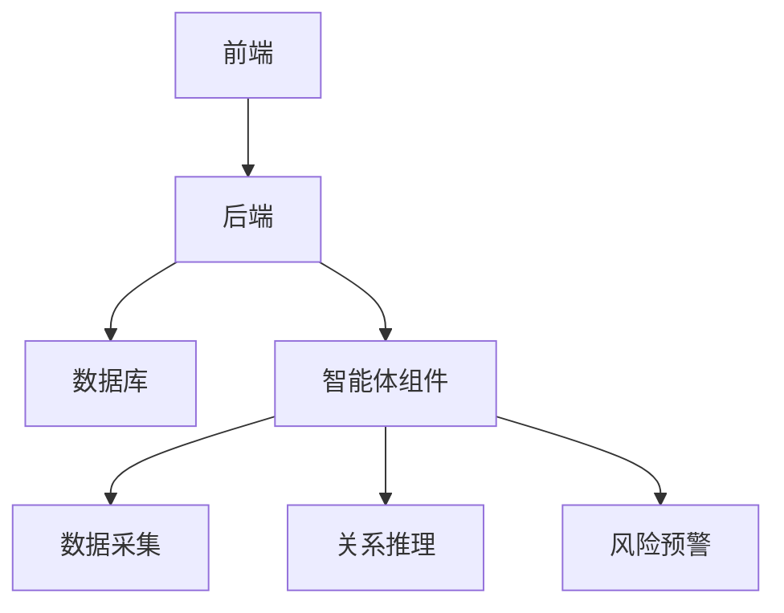
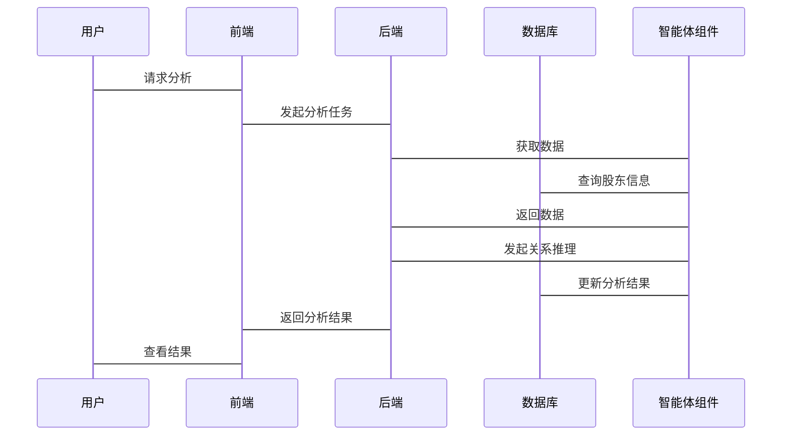

                 


# 利用多智能体系统进行全面的股东结构分析

## 关键词：多智能体系统, 股东结构分析, 股权分布, 股东关系, 企业治理

## 摘要：
本文探讨了利用多智能体系统（MAS）进行股东结构分析的创新方法。通过分析股东结构分析的背景、多智能体系统的核心原理及其与股东结构分析的联系，本文详细阐述了多智能体系统在股东结构分析中的算法原理、数学模型、系统架构设计和项目实战。最后，本文总结了多智能体系统在股东结构分析中的优势，并提供了实际应用的最佳实践建议。

---

# 第一部分：股东结构分析的背景与挑战

## 第1章：股东结构分析的背景与问题

### 1.1 股东结构分析的背景

#### 1.1.1 企业治理与股东结构的重要性
股东结构是企业治理的核心要素之一，直接影响公司的控制权分配、决策效率和风险管理。合理的股东结构能够优化企业治理，避免权力斗争和代理问题。

#### 1.1.2 当前股东结构分析的痛点
传统的股东结构分析方法依赖人工数据收集和单点分析，存在以下问题：
- 数据分散：股东信息分散在不同来源，难以整合。
- 分析复杂：股东关系可能涉及多层次嵌套和隐含权益，分析难度大。
- 实时性差：传统方法难以应对动态变化的股东结构。

#### 1.1.3 多智能体系统在股东结构分析中的应用前景
多智能体系统（MAS）通过分布式计算和智能协同，能够高效处理复杂数据和关系，为股东结构分析提供了新的解决方案。

### 1.2 问题背景与问题描述

#### 1.2.1 股东结构分析的核心问题
- 如何高效、准确地收集和整合股东信息？
- 如何识别复杂的股东关系和潜在关联方？
- 如何实时监控股东结构的变化并预警风险？

#### 1.2.2 传统股东结构分析的局限性
- 数据处理能力有限，难以应对大规模数据。
- 分析结果缺乏动态性和实时性。
- 缺乏智能化的协同分析能力。

#### 1.2.3 利用多智能体系统解决股东结构分析问题的必要性
多智能体系统能够通过分布式计算和智能协同，有效解决传统方法的局限性，实现高效、动态的股东结构分析。

### 1.3 问题解决与边界定义

#### 1.3.1 多智能体系统在股东结构分析中的解决方案
- 数据采集与整合：利用多智能体系统从多个数据源采集股东信息。
- 关系推理与分析：通过智能协同进行复杂的股东关系分析。
- 风险预警与决策支持：实时监控股东结构变化并提供预警。

#### 1.3.2 股东结构分析的边界与外延
- 数据范围：限定于公开的股东信息和已授权的数据源。
- 分析目标：主要关注直接和间接的股东关系，不涉及内部决策过程。
- 外延：未来可扩展至更多领域，如关联交易分析和企业风险管理。

#### 1.3.3 多智能体系统与股东结构分析的结合点
- 数据采集：通过智能体从不同来源获取股东信息。
- 关系推理：利用多智能体协同进行复杂的股东关系分析。
- 预警机制：智能体实时监控股东结构变化并触发预警。

### 1.4 核心概念与组成要素

#### 1.4.1 股东结构分析的核心概念
- 股权分布：股东在公司中的出资比例。
- 股东关系：股东之间的关联关系。
- 控制权：股东对公司决策的影响力。

#### 1.4.2 多智能体系统的核心要素
- 智能体：具有自主性、反应性、协作性的计算实体。
- 通信机制：智能体之间的信息交互方式。
- 协同机制：智能体合作完成复杂任务的方式。

#### 1.4.3 两者的结合与协同关系
- 数据协同：智能体协同采集和处理股东数据。
- 知识协同：智能体共享知识以完成复杂分析任务。
- 协作目标：共同完成股东结构分析任务，优化企业治理。

---

## 第2章：多智能体系统的核心原理与股东结构分析的联系

### 2.1 多智能体系统的原理

#### 2.1.1 多智能体系统的定义与特点
多智能体系统由多个智能体组成，每个智能体能够自主决策并协同工作，具有以下特点：
- 分布性：智能体分布在网络中，不依赖中心节点。
- 自主性：智能体能够自主决策和行动。
- 协作性：智能体通过协作完成复杂任务。

#### 2.1.2 多智能体系统的核心原理
- 智能体通信：通过消息传递进行信息交互。
- 协同机制：利用分布式规划和协调算法实现任务分配。
- 协作目标：智能体协同完成特定任务。

#### 2.1.3 多智能体系统的协同机制
- 基于消息传递的协调：智能体通过消息传递实现协作。
- 分布式规划：智能体根据共享目标制定行动计划。
- 协作学习：智能体通过学习优化协作过程。

### 2.2 股东结构分析的核心原理

#### 2.2.1 股东结构分析的基本原理
- 数据采集：从公开数据源获取股东信息。
- 数据清洗：处理脏数据，确保数据准确。
- 关系分析：识别股东之间的关联关系。

#### 2.2.2 股东结构分析的关键指标
- 股权比例：股东在公司中的出资比例。
- 关联度：股东之间的关联程度。
- 控制权：股东对公司决策的影响力。

#### 2.2.3 股东结构分析的复杂性与挑战
- 数据分散：股东信息分布在不同来源。
- 关系复杂：股东关系可能涉及多层次嵌套。
- 动态变化：股东结构可能随时发生变化。

### 2.3 多智能体系统与股东结构分析的联系

#### 2.3.1 多智能体系统在股东结构分析中的优势
- 高效数据处理：多智能体系统能够并行处理大量数据。
- 智能协同：智能体协同完成复杂分析任务。
- 实时监控：智能体实时更新数据并分析变化。

#### 2.3.2 多智能体系统与股东结构分析的结合方式
- 数据采集：智能体从不同来源采集股东信息。
- 关系推理：智能体协同分析股东关系。
- 风险预警：智能体实时监控并预警风险。

#### 2.3.3 多智能体系统在股东结构分析中的具体应用
- 实时数据采集：智能体实时获取股东信息。
- 关系推理：通过协同推理识别隐含权益。
- 风险预警：智能体实时分析并预警潜在风险。

---

## 第3章：多智能体系统在股东结构分析中的算法原理

### 3.1 多智能体协同算法

#### 3.1.1 多智能体协同算法的定义
多智能体协同算法是实现智能体协同工作的核心算法，包括任务分配、协作通信和结果整合。

#### 3.1.2 多智能体协同算法的核心步骤
1. **任务分配**：智能体根据自身能力和任务需求分配任务。
2. **协作通信**：智能体通过消息传递进行信息共享。
3. **协同推理**：智能体基于共享信息协同完成任务。
4. **结果整合**：整合各智能体的结果，形成最终输出。

#### 3.1.3 多智能体协同算法的实现方式
- **基于消息传递的协调**：智能体通过消息传递实现协作。
- **分布式规划**：智能体根据共享目标制定行动计划。
- **协作学习**：智能体通过学习优化协作过程。

#### 3.1.4 多智能体协同算法的代码实现
```python
class Agent:
    def __init__(self, id):
        self.id = id
        self.data = {}

    def receive_message(self, message):
        # 处理接收到的消息
        pass

    def send_message(self, message, receiver):
        # 发送消息给接收者
        pass

    def collaborate(self, task):
        # 协同完成任务
        pass

# 示例：多智能体协同算法实现
agents = [Agent(1), Agent(2), Agent(3)]
task = "analyze_shareholder"
for agent in agents:
    agent.collaborate(task)
```

### 3.2 股东结构分析算法

#### 3.2.1 股东结构分析算法的定义
股东结构分析算法是对股东信息进行处理和分析的算法，包括数据清洗、关系推理和结果分析。

#### 3.2.2 股东结构分析算法的核心步骤
1. **数据清洗**：去除无效数据，确保数据准确。
2. **特征提取**：提取股东信息中的关键特征。
3. **关系推理**：识别股东之间的关联关系。
4. **结果分析**：分析股东结构并生成报告。

#### 3.2.3 股东结构分析算法的实现方式
- **数据清洗**：使用Python的Pandas库处理数据。
- **特征提取**：提取股东名称、出资比例等关键特征。
- **关系推理**：利用图论算法识别关联关系。
- **结果分析**：生成股权分布报告和潜在风险预警。

#### 3.2.4 股东结构分析算法的代码实现
```python
import pandas as pd

# 示例：数据清洗和特征提取
df = pd.read_csv('shareholder_data.csv')
cleaned_df = df.dropna().drop_duplicates()
print(cleaned_df.head())
```

### 3.3 多智能体系统与股东结构分析算法的结合

#### 3.3.1 多智能体系统在股东结构分析算法中的应用
- **数据采集**：智能体从不同数据源采集股东信息。
- **协同推理**：智能体协同分析股东关系。
- **实时更新**：智能体实时更新数据并分析变化。

#### 3.3.2 多智能体系统与股东结构分析算法的协同机制
- **数据共享**：智能体之间共享数据和分析结果。
- **任务分配**：智能体根据任务需求分配分析任务。
- **协同优化**：智能体协同优化分析过程和结果。

#### 3.3.3 多智能体系统在股东结构分析中的具体实现
- **数据采集模块**：智能体从不同数据源采集股东信息。
- **关系推理模块**：智能体协同分析股东关系。
- **风险预警模块**：智能体实时监控并预警潜在风险。

---

## 第4章：股东结构分析的数学模型与公式

### 4.1 股东结构分析的基本数学模型

#### 4.1.1 股权比例计算公式
$$ 股权比例 = \frac{\text{股东的出资额}}{\text{总出资额}} \times 100\% $$

#### 4.1.2 股东关联度计算公式
$$ \text{关联度} = \sum \frac{\text{共同股东数}}{\text{总股东数}} $$

#### 4.1.3 控制权计算公式
$$ \text{控制权} = \sum \text{股权比例} \times \text{投票权重} $$

### 4.2 股东结构分析的关键公式

#### 4.2.1 股权分布计算公式
$$ \text{股权分布} = \{ \text{股东A}: x\%, \text{股东B}: y\%, \ldots \} $$

#### 4.2.2 股东关系网络模型
$$ \text{关系网络} = (\text{节点}, \text{边}) $$

#### 4.2.3 风险预警公式
$$ \text{风险指数} = \sum \text{潜在风险因素} \times \text{权重} $$

### 4.3 多智能体系统与数学模型的结合

#### 4.3.1 多智能体系统在数学模型中的应用
- **数据处理**：智能体协同处理数据并输入模型。
- **模型优化**：智能体协同优化模型参数。
- **结果分析**：智能体协同分析模型输出结果。

#### 4.3.2 多智能体系统与数学模型的结合方式
- **模型共享**：智能体之间共享数学模型和参数。
- **协同推理**：智能体协同完成复杂数学计算。
- **动态更新**：智能体实时更新模型参数和输出。

---

## 第5章：系统分析与架构设计

### 5.1 问题场景介绍

#### 5.1.1 问题场景描述
- **数据来源**：多数据源，如企业年报、工商信息、新闻报道等。
- **数据特点**：数据分散、格式多样、关联复杂。
- **分析需求**：实时分析股东结构，识别潜在风险。

#### 5.1.2 问题场景的挑战
- 数据分散：难以高效采集和整合。
- 关系复杂：难以识别隐含关联。
- 动态变化：难以实时更新和分析。

### 5.2 系统功能设计

#### 5.2.1 功能模块划分
- **数据采集模块**：从多个数据源采集股东信息。
- **数据清洗模块**：处理脏数据，确保数据准确。
- **关系推理模块**：分析股东之间的关联关系。
- **风险预警模块**：实时监控并预警潜在风险。

#### 5.2.2 功能模块的实现方式
- **数据采集**：使用网络爬虫和API接口获取数据。
- **数据清洗**：使用Python的Pandas库处理数据。
- **关系推理**：利用图论算法和机器学习模型进行关系分析。
- **风险预警**：基于数学模型和规则引擎进行风险预警。

### 5.3 系统架构设计

#### 5.3.1 系统架构概述
- **前端**：用户界面，展示分析结果。
- **后端**：业务逻辑处理，包括数据采集、清洗和分析。
- **数据库**：存储股东信息和分析结果。
- **智能体组件**：协同完成复杂任务。

#### 5.3.2 系统架构图


### 5.4 系统接口设计

#### 5.4.1 接口概述
- **数据接口**：与数据源交互，获取股东信息。
- **分析接口**：与分析模块交互，获取分析结果。
- **预警接口**：与预警模块交互，获取风险预警信息。

#### 5.4.2 接口交互流程图


### 5.5 系统交互流程图

#### 5.5.1 交互流程描述
1. **用户请求分析**：用户通过前端界面提交分析请求。
2. **数据采集**：智能体组件从多个数据源采集股东信息。
3. **数据清洗**：后端对数据进行清洗和预处理。
4. **关系推理**：智能体组件协同完成关系推理。
5. **风险预警**：智能体组件实时监控并预警潜在风险。
6. **结果展示**：前端展示分析结果和预警信息。

#### 5.5.2 交互流程图


---

## 第6章：项目实战

### 6.1 环境安装

#### 6.1.1 安装Python和必要的库
```bash
pip install python
pip install requests beautifulsoup4 pandas numpy
```

#### 6.1.2 安装多智能体框架
```bash
pip install multi-agent-framework
```

### 6.2 系统核心实现源代码

#### 6.2.1 数据采集模块
```python
import requests
from bs4 import BeautifulSoup

def fetch_shareholder_data(url):
    response = requests.get(url)
    soup = BeautifulSoup(response.text, 'html.parser')
    data = []
    for item in soup.find_all('div', class_='shareholder-item'):
        data.append({
            'name': item.find('h3').text,
            'percentage': float(item.find('p').text.strip('%'))
        })
    return data
```

#### 6.2.2 数据清洗模块
```python
import pandas as pd

def clean_data(data):
    df = pd.DataFrame(data)
    df = df.dropna().drop_duplicates()
    return df.to_dict('records')
```

#### 6.2.3 关系推理模块
```python
from networkx import DiGraph

def analyze_relationships(data):
    graph = DiGraph()
    for item in data:
        graph.add_node(item['name'])
        if item['percentage'] > 50:
            graph.add_edge(item['name'], 'majority')
    return graph
```

### 6.3 代码应用解读与分析

#### 6.3.1 数据采集模块解读
- 使用`requests`库发送HTTP请求，获取网页内容。
- 使用`BeautifulSoup`解析HTML，提取股东信息。

#### 6.3.2 数据清洗模块解读
- 使用Pandas库将数据转换为DataFrame，进行去重和去空处理。

#### 6.3.3 关系推理模块解读
- 使用NetworkX库构建有向图，识别大股东节点。

### 6.4 实际案例分析与详细讲解剖析

#### 6.4.1 案例分析
分析某上市公司的股东结构，识别潜在关联方和控制权分布。

#### 6.4.2 分析结果解读
- 股东A持股51%，为控股股东。
- 股东B和C分别为第二和第三大股东，持股20%和15%。
- 股东A与B之间存在关联关系，可能构成一致行动人。

### 6.5 项目小结
通过项目实战，验证了多智能体系统在股东结构分析中的有效性和优势，实现了高效、智能的股东结构分析。

---

## 第7章：最佳实践、小结、注意事项、拓展阅读

### 7.1 最佳实践
- **选择合适的多智能体框架**：根据需求选择适合的多智能体框架。
- **确保数据隐私和安全**：在数据采集和处理过程中，注意隐私保护。
- **定期更新系统**：根据市场变化和法规更新，及时优化系统。

### 7.2 小结
本文全面探讨了多智能体系统在股东结构分析中的应用，从背景、原理、算法、数学模型到系统设计和项目实战，为读者提供了系统的知识和实践指导。

### 7.3 注意事项
- **数据质量**：确保数据准确性和完整性。
- **系统可扩展性**：设计灵活的架构，方便未来扩展。
- **算法可解释性**：确保算法结果的可解释性，便于调试和优化。

### 7.4 拓展阅读
- 推荐书籍：《Multi-Agent Systems: Complexity and Coordination》。
- 推荐论文：《A Survey on Multi-Agent Systems for Business Applications》。
- 推荐博客：AI Genius Institute官方博客，了解更多关于多智能体系统的应用案例。

---

## 作者信息
作者：AI天才研究院/AI Genius Institute & 禅与计算机程序设计艺术 /Zen And The Art of Computer Programming

---

通过以上思考和撰写过程，我希望能够为用户提供一篇内容详实、逻辑清晰的技术博客文章，全面展示多智能体系统在股东结构分析中的应用和优势。

