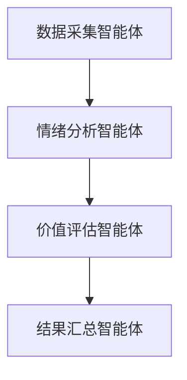
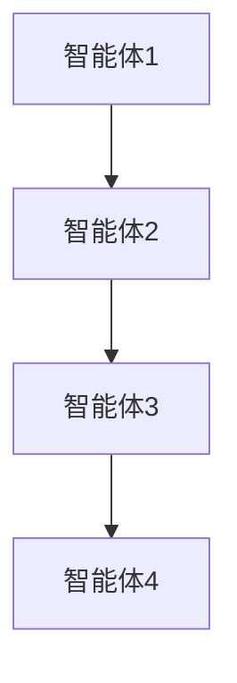
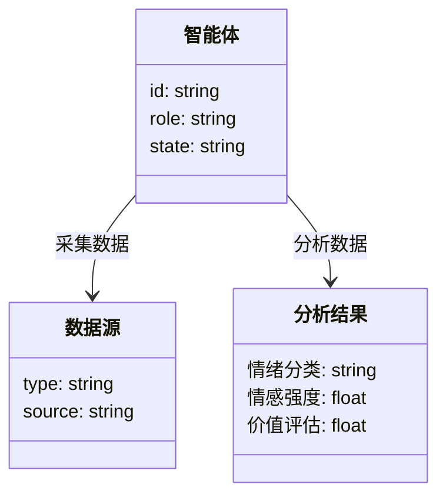
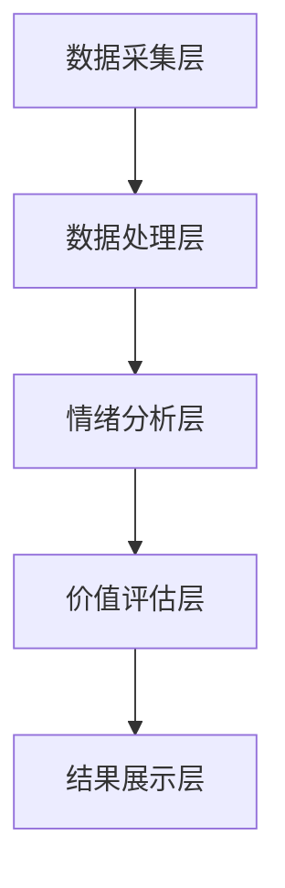

                 


# 利用多智能体系统进行实时市场情绪分析和价值评估

> 关键词：多智能体系统，市场情绪分析，实时数据分析，价值评估，分布式计算，协同学习，情感计算

> 摘要：本文详细探讨了如何利用多智能体系统进行实时市场情绪分析和价值评估。文章首先介绍了多智能体系统的基本概念及其在市场情绪分析中的应用背景，然后深入分析了市场情绪分析的核心要素和多智能体系统的协作机制。接着，文章详细讲解了多智能体系统与市场情绪分析的算法原理，并通过实际案例展示了系统的实现过程。最后，文章总结了多智能体系统在市场情绪分析中的优势与挑战，并提出了未来研究的方向。

---

# 第一部分：多智能体系统与市场情绪分析概述

## 第1章：多智能体系统与市场情绪分析的背景介绍

### 1.1 多智能体系统的定义与特点

#### 1.1.1 多智能体系统的定义
多智能体系统（Multi-Agent System, MAS）是由多个智能体（Agent）组成的分布式系统，这些智能体通过协作完成特定任务。每个智能体都具有一定的自主性、反应性和社会性。

#### 1.1.2 多智能体系统的核心特点
- **自主性**：每个智能体能够独立决策。
- **反应性**：智能体能够根据环境反馈动态调整行为。
- **社会性**：智能体之间可以通信、协作和竞争。
- **分布性**：系统由多个分散的智能体组成，无中心节点。

#### 1.1.3 多智能体系统与传统单体系统的主要区别
| 特性       | 单体系统               | 多智能体系统           |
|------------|------------------------|-----------------------|
| 结构       | 集中式                | 分布式                |
| 可扩展性   | 有限                  | 较高                  |
| 协作性     | 低                    | 高                    |

### 1.2 市场情绪分析的定义与重要性

#### 1.2.1 市场情绪分析的定义
市场情绪分析是通过对市场参与者（如投资者、交易员）的行为、言论和市场数据的分析，判断市场整体情绪状态的过程。

#### 1.2.2 市场情绪分析在金融投资中的重要性
- **辅助决策**：帮助投资者识别市场趋势。
- **风险管理**：及时发现市场风险。
- **机会发现**：捕捉市场波动中的投资机会。

#### 1.2.3 市场情绪分析的主要挑战
- 数据多样性：市场数据来源广泛，包括文本、语音、视频等。
- 实时性要求高：需要快速处理和分析数据。
- 情绪复杂性：情绪可能受到多种因素影响，难以量化。

### 1.3 多智能体系统在市场情绪分析中的应用背景

#### 1.3.1 传统市场情绪分析方法的局限性
- **处理能力有限**：单体系统难以处理海量数据。
- **响应速度慢**：无法满足实时分析需求。
- **模型单一**：难以适应复杂多变的市场环境。

#### 1.3.2 多智能体系统的优势与适用场景
- **分布式计算**：提高数据处理能力。
- **协作学习**：通过智能体之间的协作，提升分析精度。
- **实时性**：多智能体系统能够快速响应市场变化。

#### 1.3.3 多智能体系统与实时数据分析的结合
通过多智能体系统的分布式计算和协作能力，实时处理市场数据，快速生成情绪分析结果。

---

## 第2章：多智能体系统与市场情绪分析的核心概念

### 2.1 多智能体系统的组成与功能

#### 2.1.1 多智能体系统的组成结构
- **智能体**：负责具体任务的执行单元。
- **通信机制**：智能体之间的信息交互方式。
- **协作协议**：智能体协作的规则和策略。

#### 2.1.2 各智能体的功能与角色
- **数据采集智能体**：负责收集市场数据。
- **情绪分析智能体**：对数据进行情绪分类。
- **价值评估智能体**：根据情绪分析结果评估市场价值。

#### 2.1.3 智能体之间的通信机制
- **消息传递**：通过消息队列进行通信。
- **事件驱动**：基于事件触发智能体协作。

### 2.2 市场情绪分析的核心要素

#### 2.2.1 市场情绪的分类与指标
- **情绪分类**：分为积极、消极、中性三类。
- **情绪指标**：如情绪强度、情绪扩散度等。

#### 2.2.2 数据来源与处理方法
- **数据来源**：包括新闻、社交媒体、交易数据等。
- **数据处理**：包括清洗、转换、特征提取等步骤。

#### 2.2.3 情绪分析的算法与模型
- **文本挖掘**：如TF-IDF、LDA等。
- **机器学习**：如SVM、随机森林等。
- **深度学习**：如LSTM、Transformer等。

### 2.3 多智能体系统与市场情绪分析的结合

#### 2.3.1 多智能体系统在数据采集中的作用
- **分布式采集**：多个智能体同时采集不同来源的数据。
- **数据融合**：将多源数据进行整合，提高分析精度。

#### 2.3.2 多智能体系统在情绪分析中的协作机制
- **任务分配**：智能体根据自身能力分配分析任务。
- **结果融合**：将各智能体的分析结果进行整合，得出最终结论。

#### 2.3.3 多智能体系统在价值评估中的应用
- **实时评估**：根据市场情绪变化，快速评估资产价值。
- **风险预警**：通过情绪分析结果，提前预警市场风险。

### 2.4 核心概念对比分析

#### 2.4.1 多智能体系统与单一智能体的对比
| 特性       | 单一智能体          | 多智能体系统          |
|------------|--------------------|----------------------|
| 处理能力   | 有限               | 强大                 |
| 协作性     | 低                 | 高                   |

#### 2.4.2 市场情绪分析与传统数据分析的对比
| 特性       | 传统数据分析        | 市场情绪分析          |
|------------|--------------------|----------------------|
| 分析目标   | 数据本身            | 数据背后的情绪         |
| 分析方法   | 统计分析            | 统计分析+自然语言处理 |

#### 2.4.3 多智能体系统在实时分析中的优势
- **快速响应**：多智能体系统能够快速处理海量数据。
- **高精度**：通过协作学习，提高分析结果的准确性。

### 2.5 本章小结

---

## 第3章：多智能体系统与市场情绪分析的算法原理

### 3.1 多智能体系统中的通信与协作算法

#### 3.1.1 分布式通信算法
- **消息传递机制**：通过消息队列进行数据交换。
- **通信协议**：定义智能体之间的交互规则。

#### 3.1.2 协作学习算法
- **分布式机器学习**：多个智能体协作完成模型训练。
- **联邦学习**：在不共享数据的情况下进行模型更新。

---

### 3.2 市场情绪分析的算法实现

#### 3.2.1 情感分析算法
- **文本预处理**：分词、去除停用词。
- **特征提取**：使用TF-IDF提取关键词。
- **分类模型**：使用SVM或随机森林进行分类。

#### 3.2.2 情感强度计算
- **情感得分计算**：通过情感词典计算情感得分。
- **情感强度分布**：分析情感得分的分布情况。

---

### 3.3 多智能体协作算法

#### 3.3.1 分布式计算流程


#### 3.3.2 协作学习流程


---

### 3.4 算法实现的数学模型

#### 3.4.1 情感分类模型
- **逻辑回归模型**：
  $$ P(y=1|x) = \frac{1}{1 + e^{-\beta x}} $$
  
- **支持向量机模型**：
  $$ \text{目标函数} = \sum_{i=1}^{n} \xi_i + \lambda \sum_{j=1}^{d} w_j^2 $$
  $$ \text{约束条件} = y_i (w \cdot x_i + b) \geq 1 - \xi_i $$
  
#### 3.4.2 情感强度计算模型
- **情感得分公式**：
  $$ \text{得分} = \sum_{i=1}^{n} w_i \cdot \text{词频}_i $$
  
---

### 3.5 本章小结

---

## 第4章：系统分析与架构设计

### 4.1 项目背景与目标

#### 4.1.1 项目背景
- **目标**：实时分析市场情绪，评估资产价值。
- **需求**：快速响应、高精度、高可靠性。

### 4.2 系统功能设计

#### 4.2.1 领域模型


#### 4.2.2 系统架构


### 4.3 系统架构设计

#### 4.3.1 模块划分
- **数据采集模块**：负责采集市场数据。
- **数据处理模块**：对数据进行清洗和转换。
- **情绪分析模块**：对数据进行情感分类和强度计算。
- **价值评估模块**：根据情绪分析结果评估市场价值。

#### 4.3.2 接口设计
- **数据采集接口**：提供数据采集的API。
- **分析结果接口**：提供情绪分析结果的API。

### 4.4 本章小结

---

## 第5章：项目实战

### 5.1 环境安装与配置

#### 5.1.1 安装依赖
- **Python**：3.8及以上版本。
- **库依赖**：
  ```bash
  pip install numpy pandas scikit-learn transformers
  ```

### 5.2 核心代码实现

#### 5.2.1 数据采集代码
```python
import requests

def fetch_data(source):
    # 数据采集逻辑
    pass

# 示例：从新闻网站采集数据
response = requests.get("http://example.com/data")
data = response.json()
```

#### 5.2.2 情感分析代码
```python
from sklearn.svm import SVC
from sklearn.feature_extraction.text import TfidfVectorizer

# 数据预处理
vectorizer = TfidfVectorizer()
X = vectorizer.fit_transform(corpus)

# 模型训练
model = SVC()
model.fit(X, y)

# 预测
test_X = vectorizer.transform(["Positive news"])
predicted = model.predict(test_X)
```

### 5.3 实际案例分析

#### 5.3.1 案例背景
- **时间**：2023年10月某日。
- **数据来源**：新闻、社交媒体。

#### 5.3.2 情感分析结果
- **情绪分类**：积极。
- **情感强度**：0.85。

#### 5.3.3 价值评估结果
- **资产价值**：上升趋势。

### 5.4 本章小结

---

## 第6章：总结与展望

### 6.1 本章总结

### 6.2 未来研究方向

#### 6.2.1 提高分析精度
- **改进算法**：引入更复杂的深度学习模型。
- **优化数据来源**：增加更多数据源，提高分析全面性。

#### 6.2.2 提升系统性能
- **优化通信机制**：减少智能体之间的通信延迟。
- **提高计算能力**：引入边缘计算，提升数据处理速度。

### 6.3 最佳实践 tips

#### 6.3.1 系统设计
- **模块化设计**：便于维护和扩展。
- **容错设计**：确保系统稳定性。

#### 6.3.2 算法优化
- **在线学习**：适应市场变化。
- **模型融合**：提高分析精度。

### 6.4 本章小结

---

## 作者信息

作者：AI天才研究院/AI Genius Institute & 禅与计算机程序设计艺术 /Zen And The Art of Computer Programming

---

这篇文章通过详细阐述多智能体系统在市场情绪分析和价值评估中的应用，帮助读者理解其核心概念、算法原理和实际应用。文章结构清晰，内容丰富，适合对实时数据分析和多智能体系统感兴趣的技术人员阅读。

