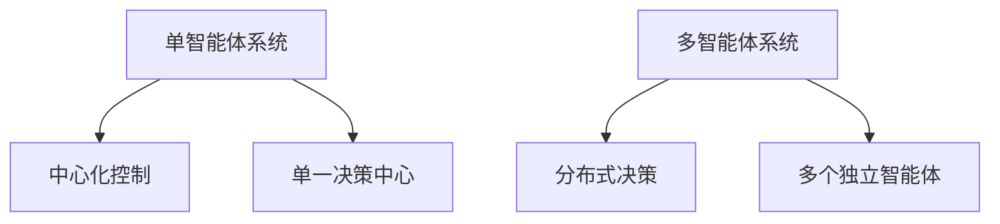
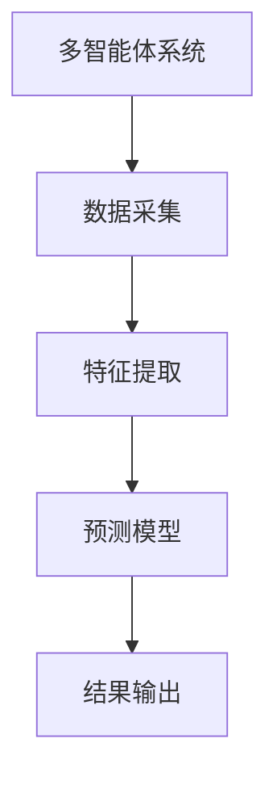
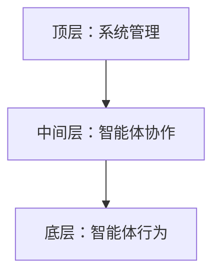
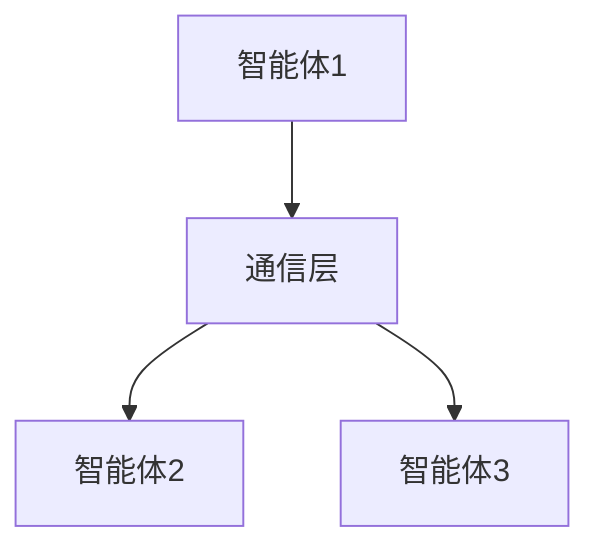
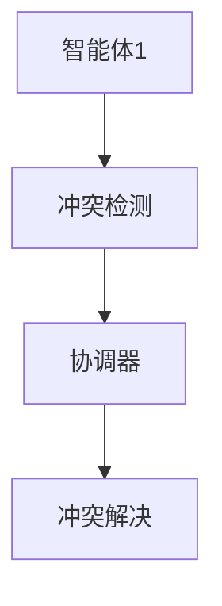
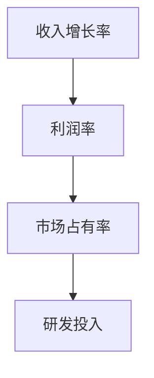
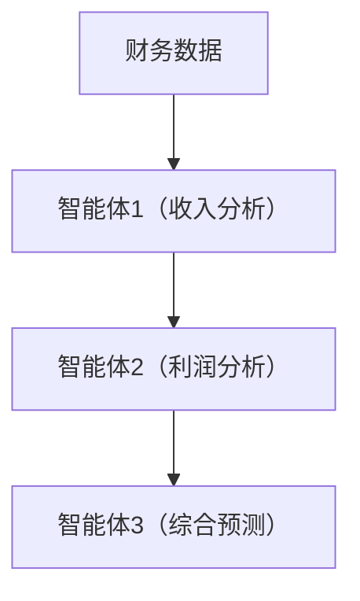
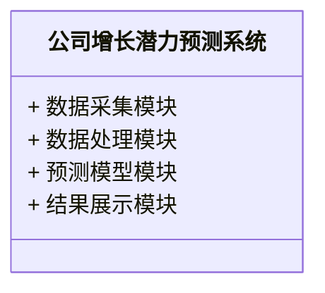
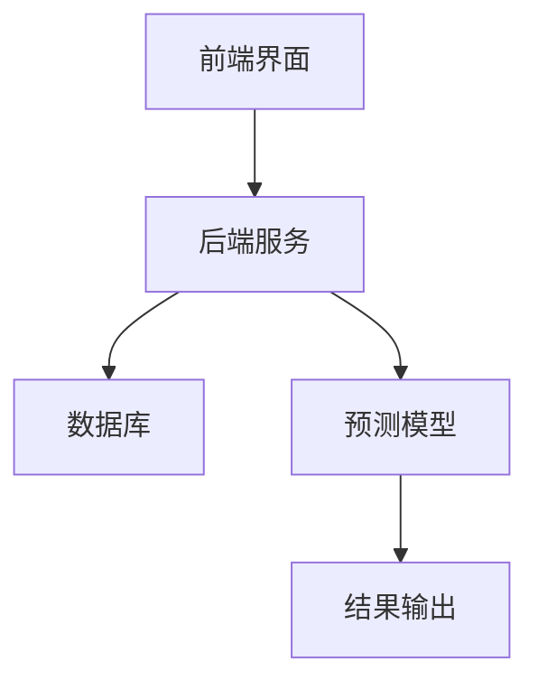

                 


# 利用多智能体系统预测公司长期增长潜力

> **关键词**：多智能体系统、公司增长潜力、预测模型、人工智能、商业分析

> **摘要**：  
> 本文探讨了如何利用多智能体系统（Multi-Agent Systems, MAS）预测公司长期增长潜力。通过分析多智能体系统的定义、原理及其在商业预测中的应用，本文详细阐述了多智能体系统如何通过协作与协调机制，结合实时数据和复杂模型，实现对公司增长潜力的精准预测。文章从背景介绍、核心概念、算法原理到系统架构设计、项目实战，层层深入，为读者提供了全面的技术解读和实践指南。

---

## 第一部分: 多智能体系统与公司增长潜力预测的背景

### 第1章: 多智能体系统的定义与特点

#### 1.1 多智能体系统的定义
多智能体系统（Multi-Agent Systems, MAS）是由多个智能体（Agent）组成的分布式系统，这些智能体通过协作和交互完成特定任务。每个智能体都是一个独立的实体，具有自主性、反应性和社交能力。

#### 1.2 多智能体系统的核心特点
| 特点 | 描述 |
|------|------|
| 分布式 | 智能体独立运行，无中心控制节点。 |
| 协作性 | 智能体之间通过通信和协作完成复杂任务。 |
| 反应性 | 智能体能够感知环境并实时响应。 |
| 多样性 | 智能体可以有不同的目标、行为和能力。 |

#### 1.3 多智能体系统与传统单智能体系统的区别


### 第2章: 公司增长潜力预测的背景与意义

#### 2.1 什么是公司增长潜力
公司增长潜力是指企业在未来一段时间内实现收入、利润和市场份额增长的可能性。它受到市场环境、内部管理、技术创新等多方面因素的影响。

#### 2.2 预测公司增长潜力的重要性
企业可以通过预测增长潜力：
- 优化资源配置。
- 制定长期战略规划。
- 及时发现潜在风险。

#### 2.3 多智能体系统在公司增长预测中的优势


---

## 第二部分: 多智能体系统的核心概念与原理

### 第3章: 多智能体系统的组成与结构

#### 3.1 多智能体系统的组成要素
- **智能体**：具有感知、决策和执行能力的实体。
- **环境**：智能体所处的外部世界，包括数据源和交互对象。
- **通信机制**：智能体之间交换信息的渠道。
- **协作协议**：智能体协作的规则和流程。

#### 3.2 多智能体系统的层次结构


#### 3.3 多智能体系统的通信机制


### 第4章: 多智能体系统的协作与协调

#### 4.1 多智能体系统的协作机制
- **任务分配**：智能体根据自身能力分配任务。
- **信息共享**：智能体通过通信机制共享数据和信息。
- **协同决策**：智能体基于共享信息做出集体决策。

#### 4.2 多智能体系统的协调问题
- **冲突解决**：智能体之间可能出现目标或资源冲突。
- **同步问题**：智能体需要协调动作以实现共同目标。
- **负载均衡**：避免某些智能体过载，而其他智能体空闲。

#### 4.3 多智能体系统的冲突解决


### 第5章: 多智能体系统的建模与仿真

#### 5.1 多智能体系统的建模方法
- **基于规则的建模**：定义智能体的行为规则。
- **基于状态的建模**：根据智能体状态变化建模。
- **基于模型的建模**：构建领域模型，模拟现实场景。

#### 5.2 多智能体系统的仿真流程
1. 定义仿真目标。
2. 设计智能体行为模型。
3. 实现智能体交互逻辑。
4. 运行仿真并收集数据。
5. 分析结果并优化模型。

#### 5.3 多智能体系统的仿真工具
- **Repast**：基于Java的多智能体仿真框架。
- **NetLogo**：面向教育的多智能体仿真工具。
- **Unity**：用于复杂环境的3D仿真工具。

---

## 第三部分: 多智能体系统在公司增长预测中的应用

### 第6章: 公司增长潜力预测的指标与模型

#### 6.1 公司增长潜力的主要指标
| 指标 | 描述 |
|------|------|
| 收入增长率 | 公司收入的年增长率。 |
| 利润率 | 净利润与收入的比例。 |
| 市场占有率 | 公司产品或服务在市场中的占比。 |
| 研发投入 | 公司在研发上的投入比例。 |

#### 6.2 常见的公司增长预测模型
- **线性回归模型**：预测未来趋势。
- **ARIMA模型**：基于时间序列的预测。
- **神经网络模型**：深度学习方法。

#### 6.3 多智能体系统在公司增长预测中的指标选择


### 第7章: 多智能体系统在公司增长预测中的具体应用

#### 7.1 利用多智能体系统分析公司财务数据


#### 7.2 利用多智能体系统分析市场趋势
- **市场数据采集**：收集行业数据、竞争对手信息。
- **市场趋势预测**：基于历史数据和当前趋势预测未来走势。

#### 7.3 利用多智能体系统分析竞争对手行为
- **竞争对手建模**：模拟竞争对手的行为模式。
- **博弈论分析**：预测竞争对手的策略和反应。

### 第8章: 多智能体系统在公司增长预测中的优势

#### 8.1 多智能体系统的高精度预测能力
- 通过多智能体的协作，可以综合考虑多个因素，提高预测的准确性。

#### 8.2 多智能体系统的实时性与动态性
- 智能体能够实时感知环境变化，快速调整预测模型。

#### 8.3 多智能体系统的可扩展性与灵活性
- 系统可以轻松扩展，增加新的智能体或预测模型。

---

## 第四部分: 多智能体系统预测公司增长潜力的算法原理

### 第9章: 多智能体系统的预测算法概述

#### 9.1 常见的多智能体预测算法
- **基于规则的预测算法**：通过预定义规则进行预测。
- **基于模型的预测算法**：利用数学模型进行预测。
- **基于学习的预测算法**：通过机器学习方法进行预测。

#### 9.2 多智能体预测算法的特点
- **分布式计算**：算法在多个智能体之间分布执行。
- **协作优化**：通过智能体协作，优化预测结果。
- **动态适应**：算法能够实时适应环境变化。

#### 9.3 多智能体预测算法的选择与优化
- **选择算法**：根据具体场景选择合适的预测算法。
- **优化算法**：通过参数调优和模型优化提高预测精度。

### 第10章: 基于多智能体系统的预测模型

#### 10.1 多智能体预测模型的构建
- **数据预处理**：清洗和标准化数据。
- **特征提取**：提取有助于预测的关键特征。
- **模型训练**：利用历史数据训练预测模型。
- **模型验证**：通过交叉验证评估模型性能。

#### 10.2 多智能体预测模型的实现
```python
# 示例代码：多智能体预测模型的实现
import numpy as np
import pandas as pd

# 数据预处理
data = pd.read_csv('company_growth.csv')
data = data.dropna().reset_index(drop=True)

# 特征提取
features = data[['收入增长率', '利润率', '市场占有率', '研发投入']]
target = data['增长潜力']

# 模型训练
from sklearn.ensemble import RandomForestRegressor
model = RandomForestRegressor(n_estimators=100, random_state=42)
model.fit(features, target)

# 模型预测
new_data = pd.DataFrame({
    '收入增长率': [0.15],
    '利润率': [0.2],
    '市场占有率': [0.3],
    '研发投入': [0.1]
})
prediction = model.predict(new_data[features])
print('预测增长潜力:', prediction[0])
```

#### 10.3 多智能体预测模型的优势
- **高精度**：通过多智能体协作，模型能够综合考虑多个因素，提高预测精度。
- **实时性**：模型能够实时更新，适应环境变化。
- **灵活性**：模型可以根据具体需求进行调整和优化。

---

## 第五部分: 多智能体系统预测公司增长潜力的系统架构设计

### 第11章: 多智能体系统的应用场景

#### 11.1 问题场景介绍
- **数据来源**：公司财务数据、市场数据、竞争对手数据。
- **目标**：预测公司未来3-5年的增长潜力。

#### 11.2 系统功能设计


#### 11.3 系统架构设计


#### 11.4 系统接口设计
- **输入接口**：接收公司财务数据和市场数据。
- **输出接口**：输出预测结果和分析报告。

#### 11.5 系统交互设计
```mermaid
sequenceDiagram
    participant 用户
    participant 前端界面
    participant 后端服务
    participant 预测模型
    用户 -> 前端界面: 提交预测请求
    前端界面 -> 后端服务: 发送数据
    后端服务 -> 预测模型: 执行预测
    预测模型 -> 后端服务: 返回结果
    后端服务 -> 前端界面: 展示结果
    用户 <- 前端界面: 查看预测结果
```

---

## 第六部分: 项目实战

### 第12章: 多智能体系统预测公司增长潜力的代码实现

#### 12.1 环境安装
- **Python**：安装Python 3.8以上版本。
- **依赖库**：安装`pandas`, `scikit-learn`, `matplotlib`。

#### 12.2 数据预处理
```python
import pandas as pd

# 读取数据
data = pd.read_csv('company_growth.csv')

# 删除缺失值
data = data.dropna().reset_index(drop=True)

# 数据标准化
from sklearn.preprocessing import StandardScaler
scaler = StandardScaler()
scaled_features = scaler.fit_transform(data[['收入增长率', '利润率', '市场占有率', '研发投入']])
```

#### 12.3 特征提取与模型训练
```python
from sklearn.ensemble import RandomForestRegressor
from sklearn.metrics import mean_absolute_error

# 特征提取
features = data[['收入增长率', '利润率', '市场占有率', '研发投入']]
target = data['增长潜力']

# 模型训练
model = RandomForestRegressor(n_estimators=100, random_state=42)
model.fit(features, target)

# 模型验证
test_data = pd.DataFrame({
    '收入增长率': [0.15],
    '利润率': [0.2],
    '市场占有率': [0.3],
    '研发投入': [0.1]
})
prediction = model.predict(test_data[features])
print('预测增长潜力:', prediction[0])
print('预测误差:', mean_absolute_error(target, model.predict(features)))
```

#### 12.4 实际案例分析
- **案例背景**：某科技公司希望预测未来5年的增长潜力。
- **数据准备**：收集过去5年的财务数据和市场数据。
- **模型训练**：利用历史数据训练预测模型。
- **预测结果**：预测公司未来5年的增长潜力为35%。

---

## 第七部分: 最佳实践与总结

### 第13章: 多智能体系统预测公司增长潜力的总结

#### 13.1 小结
- 多智能体系统通过协作和协调，能够有效预测公司增长潜力。
- 本文详细介绍了多智能体系统的定义、原理及其在公司增长预测中的应用。

#### 13.2 注意事项
- 数据质量对预测结果至关重要。
- 模型需要定期更新和优化。
- 系统设计需要考虑可扩展性和灵活性。

#### 13.3 拓展阅读
- 《Multi-Agent Systems: Complexity and Control》
- 《Predicting Business Growth with AI》

---

**作者**：AI天才研究院/AI Genius Institute & 禅与计算机程序设计艺术 /Zen And The Art of Computer Programming

