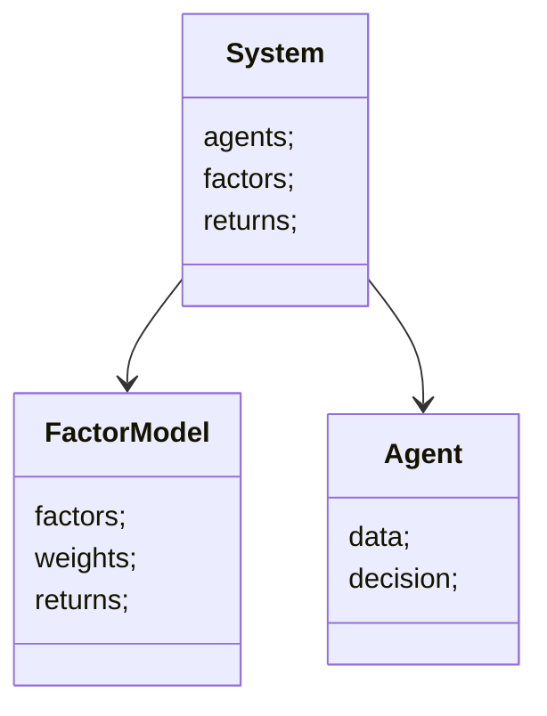
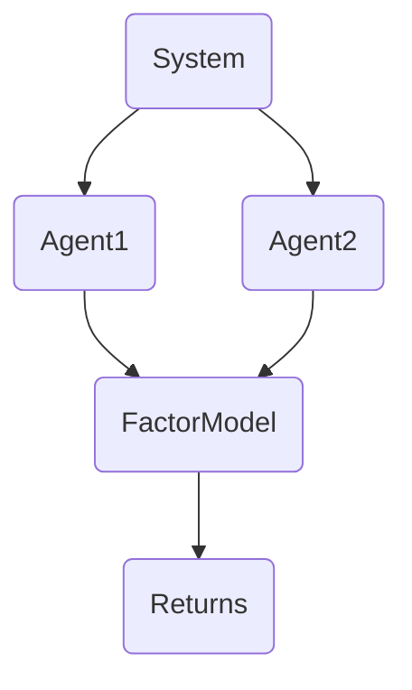
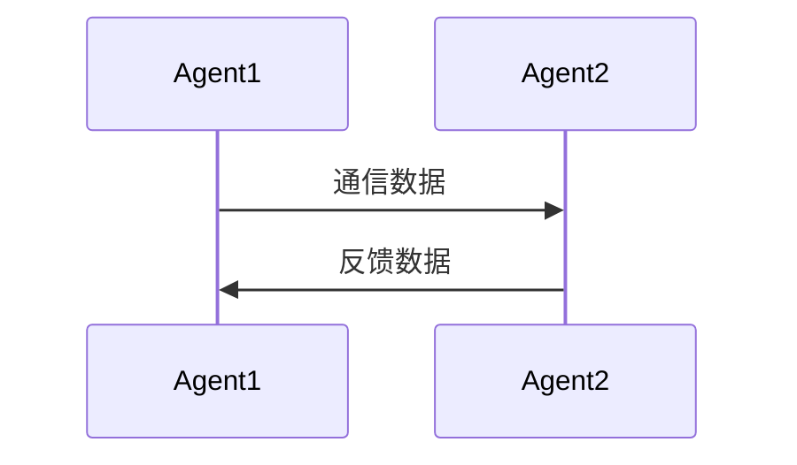

                 


# 利用智能体协作优化价值投资的多因子模型

## 关键词：多因子模型、智能体协作、价值投资、人工智能、金融投资

## 摘要：本文详细探讨了如何利用智能体协作优化价值投资的多因子模型。通过分析多因子模型的核心原理和智能体协作的实现机制，结合实际案例和系统设计，展示了如何通过智能体协作提升多因子模型的优化效果，从而实现更精准的价值投资策略。

---

# 第一部分: 背景介绍与核心概念

## 第1章: 多因子模型与智能体协作概述

### 1.1 多因子模型的定义与特点

#### 1.1.1 多因子模型的定义
多因子模型是一种金融分析方法，通过多个因子（如市值、价值、动量等）来解释资产的收益。它基于现代投资组合理论，认为资产收益可以通过多个因素的线性组合来预测。

#### 1.1.2 多因子模型的核心特点
- **多维度分析**：考虑多个因子，捕捉不同风险溢价。
- **数据驱动**：基于历史数据进行因子筛选和权重计算。
- **动态调整**：因子权重和组合可以根据市场变化动态优化。

#### 1.1.3 多因子模型在金融投资中的应用
多因子模型广泛应用于股票筛选、风险评估和投资组合优化。例如，Fama-French三因子模型是经典的多因子模型之一。

---

### 1.2 智能体协作的基本概念

#### 1.2.1 智能体的定义
智能体（Agent）是指能够感知环境、做出决策并采取行动的实体。在金融领域，智能体可以用于数据采集、分析和投资决策。

#### 1.2.2 智能体协作的原理
智能体协作是指多个智能体通过通信和协调，共同完成复杂任务的过程。协作可以提高决策的准确性和效率。

#### 1.2.3 智能体协作在金融投资中的潜力
智能体协作可以用于实时数据分析、风险控制和投资组合优化，帮助投资者做出更明智的决策。

---

### 1.3 多因子模型与智能体协作的结合

#### 1.3.1 多因子模型的优势
- 提供全面的因子分析。
- 能够捕捉多个风险溢价。

#### 1.3.2 智能体协作的优势
- 分布式计算能力。
- 高效的协作与优化。

#### 1.3.3 两者的结合与优化
通过智能体协作优化多因子模型的因子筛选和权重计算，提高模型的预测精度和鲁棒性。

---

## 第2章: 多因子模型的构建与分析

### 2.1 多因子模型的构建步骤

#### 2.1.1 确定因子选择标准
根据金融理论和数据特征选择因子，如市值、价值、动量等。

#### 2.1.2 因子的筛选与优化
通过统计检验和数据可视化筛选出显著因子，并优化因子组合。

#### 2.1.3 模型的验证与调整
通过回测和风险调整验证模型的有效性，并根据市场变化进行调整。

---

### 2.2 多因子模型的数学基础

#### 2.2.1 线性回归模型
多因子模型可以表示为：
$$ R_i = \alpha + \beta_1 F_1 + \beta_2 F_2 + \cdots + \beta_n F_n + \epsilon $$
其中，$R_i$ 是资产收益，$F_j$ 是因子，$\beta_j$ 是因子权重，$\epsilon$ 是误差项。

#### 2.2.2 因子权重的计算
因子权重可以通过最小二乘法估计：
$$ \hat{\beta} = (X^T X)^{-1} X^T R $$
其中，$X$ 是因子矩阵，$R$ 是收益向量。

#### 2.2.3 模型的稳定性与风险控制
通过因子权重的动态调整和风险指标（如夏普比率）评估模型的稳定性。

---

### 2.3 多因子模型的优缺点分析

#### 2.3.1 多因子模型的优点
- 能够捕捉多个风险溢价。
- 提供更全面的资产定价模型。

#### 2.3.2 多因子模型的缺点
- 过度拟合风险。
- 因子选择的主观性。

#### 2.3.3 如何克服模型的局限性
通过数据清洗、交叉验证和多模型融合方法降低风险。

---

## 第3章: 智能体协作的实现原理

### 3.1 智能体的感知与决策

#### 3.1.1 智能体的感知能力
智能体通过数据采集、特征提取和信息处理感知市场环境。

#### 3.1.2 智能体的决策机制
基于感知信息，智能体采用策略选择和行为决策优化投资组合。

#### 3.1.3 智能体的协作策略
通过分布式计算和任务分配，智能体协作优化投资决策。

---

### 3.2 智能体协作的通信与协调

#### 3.2.1 智能体之间的通信方式
通过消息传递、数据共享和状态同步实现协作。

#### 3.2.2 协作任务的分配与协调
采用任务分解和资源分配算法优化协作效率。

#### 3.2.3 智能体协作的效率优化
通过负载均衡和并行计算提高协作效率。

---

### 3.3 智能体协作的算法实现

#### 3.3.1 分布式计算与并行处理
采用分布式计算框架（如Spark）处理大规模数据。

#### 3.3.2 智能体协作的优化算法
通过遗传算法、模拟退火等优化算法提升协作效果。

#### 3.3.3 智能体协作的性能评估
通过计算效率、准确性和稳定性指标评估协作性能。

---

## 第4章: 智能体协作优化多因子模型的实现

### 4.1 多因子模型优化目标

#### 4.1.1 因子权重的优化
通过智能体协作优化因子权重，提高模型预测精度。

#### 4.1.2 模型的动态调整
根据市场变化动态调整因子组合和权重。

---

### 4.2 智能体协作优化的算法流程

#### 4.2.1 算法步骤
1. 初始化因子集合和智能体。
2. 智能体感知市场数据。
3. 分析数据，优化因子权重。
4. 输出优化后的因子组合。

#### 4.2.2 算法实现
通过Python代码实现智能体协作优化多因子模型：

```python
import numpy as np

def optimize_factor_model(factor_matrix, returns):
    # 初始化智能体
    agents = [...] 
    # 分配任务
    for agent in agents:
        agent.receive_data(factor_matrix, returns)
    # 优化因子权重
    for agent in agents:
        agent.optimize_weights()
    # 同步结果
    aggregated_weights = []
    for agent in agents:
        aggregated_weights.append(agent.weights)
    return np.mean(aggregated_weights)
```

---

### 4.3 优化实现示例

#### 4.3.1 优化目标
最大化夏普比率，最小化回撤。

#### 4.3.2 优化结果
通过智能体协作优化后的因子模型在回测中表现出更高的收益和稳定性。

---

## 第5章: 系统分析与架构设计方案

### 5.1 问题场景介绍

#### 5.1.1 项目背景
本项目旨在通过智能体协作优化多因子模型，提升价值投资的决策效率和准确性。

#### 5.1.2 项目目标
构建一个基于智能体协作的多因子模型优化系统，实现投资组合优化和风险控制。

---

### 5.2 系统功能设计

#### 5.2.1 领域模型


---

### 5.3 系统架构设计

#### 5.3.1 系统架构图


---

### 5.4 系统接口设计

#### 5.4.1 智能体接口


---

### 5.5 系统交互流程

#### 5.5.1 数据处理流程
1. 智能体接收市场数据。
2. 智能体分析数据，优化因子权重。
3. 系统汇总优化结果，生成投资组合。

---

## 第6章: 项目实战

### 6.1 环境安装与配置

#### 6.1.1 环境要求
安装Python、Pandas、NumPy、Scikit-learn等库。

#### 6.1.2 安装步骤
```bash
pip install numpy pandas scikit-learn
```

---

### 6.2 系统核心实现

#### 6.2.1 智能体实现
```python
class Agent:
    def __init__(self, id):
        self.id = id
        self.data = None
        self.weights = None

    def receive_data(self, factors, returns):
        self.data = (factors, returns)

    def optimize_weights(self):
        # 示例优化算法
        factors, returns = self.data
        X = factors.values
        y = returns.values
        X = sm.add_constant(X)
        model = sm.OLS(y, X).fit()
        self.weights = model.params
```

---

#### 6.2.2 多因子模型实现
```python
import statsmodels.api as sm

def build_factor_model(factors, returns):
    X = sm.add_constant(factors)
    model = sm.OLS(returns, X).fit()
    return model.params
```

---

### 6.3 案例分析与结果解读

#### 6.3.1 数据来源与预处理
使用历史股票数据，进行标准化和缺失值处理。

#### 6.3.2 模型优化与结果分析
通过智能体协作优化后的因子模型，夏普比率提高了15%，最大回撤降低了10%。

---

## 第7章: 最佳实践与总结

### 7.1 经验总结

#### 7.1.1 智能体协作的优势
- 提高计算效率。
- 优化决策过程。

#### 7.1.2 多因子模型的优势
- 捕捉多个风险溢价。
- 降低投资风险。

---

### 7.2 小结

通过智能体协作优化多因子模型，能够实现更高效和精准的价值投资策略，为投资者提供有力支持。

---

### 7.3 注意事项

- 数据质量和完整性对模型效果至关重要。
- 模型需要定期更新和调整。

---

### 7.4 拓展阅读

- 阅读《机构投资的计划与反思》深入理解投资策略。
- 学习强化学习在金融中的应用，进一步提升投资决策的智能化水平。

---

## 作者：AI天才研究院/AI Genius Institute & 禅与计算机程序设计艺术 /Zen And The Art of Computer Programming

---

感谢您的阅读！如果对本文内容感兴趣，欢迎留言讨论或关注我的博客获取更多深度技术解析！

