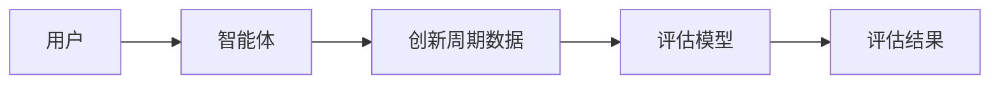
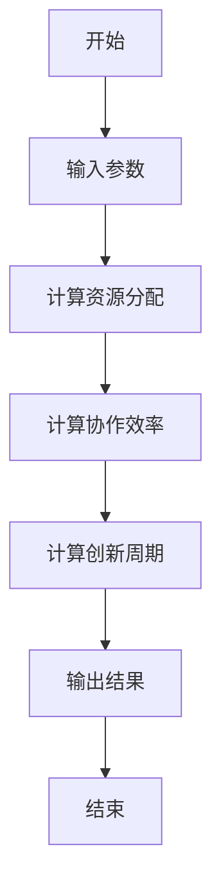
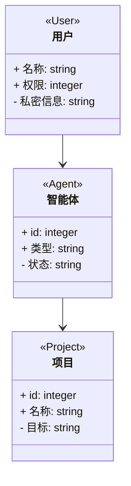
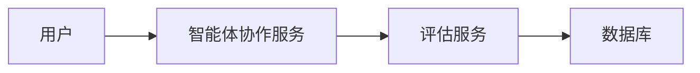
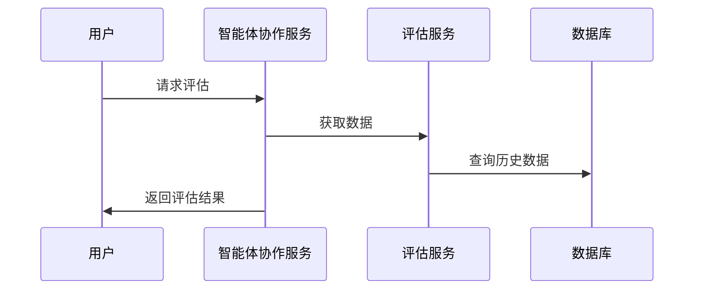

                 


# 利用智能体协作进行全面的公司创新周期评估

## 关键词：智能体协作，创新周期评估，公司创新，人工智能，协作评估

## 摘要：本文探讨了如何利用智能体协作技术进行全面的公司创新周期评估。通过分析创新周期的核心要素、智能体协作的优势以及二者的结合，本文提出了基于智能体协作的创新周期评估模型，并通过算法实现和系统架构设计，展示了如何在实际场景中应用该模型。最后，本文总结了该方法的优势及未来研究方向。

---

# 第一部分: 公司创新周期评估的背景与概念

# 第1章: 公司创新周期评估的背景与意义

## 1.1 创新周期的基本概念

### 1.1.1 创新周期的定义与内涵
创新周期是指从创意产生到最终商业化的过程，包括研发、测试、优化等多个阶段。其核心在于通过系统性的方法提升创新效率和成果质量。

### 1.1.2 创新周期的核心要素
创新周期的核心要素包括创意生成、评估、实施和商业化。每个阶段都需要不同的资源和策略。

### 1.1.3 创新周期的阶段划分
创新周期通常分为三个阶段：创意生成阶段、评估优化阶段和实施阶段。每个阶段都有其独特的特点和目标。

## 1.2 智能体协作的定义与特点

### 1.2.1 智能体的基本概念
智能体是指能够感知环境并采取行动以实现目标的实体，具备自主性、反应性和协作性。

### 1.2.2 智能体协作的定义
智能体协作是指多个智能体通过共享信息和协同工作，共同完成复杂任务的过程。

### 1.2.3 智能体协作的优势与挑战
智能体协作的优势在于能够提高效率、优化决策，但同时也面临通信延迟和协作冲突等挑战。

## 1.3 智能体协作在公司创新周期评估中的作用

### 1.3.1 智能体协作如何提升创新效率
通过智能体协作，公司可以更高效地分配资源，优化创新流程，从而缩短创新周期。

### 1.3.2 智能体协作在创新周期评估中的应用场景
智能体协作可以应用于创意评估、风险分析、资源分配等多个环节，提供实时反馈和优化建议。

### 1.3.3 智能体协作与传统评估方法的对比
与传统评估方法相比，智能体协作能够提供更动态、更个性化的评估结果，提升评估的准确性和效率。

## 1.4 本章小结

---

# 第二部分: 智能体协作与创新周期评估的核心概念

# 第2章: 智能体协作与创新周期评估的核心概念

## 2.1 智能体协作的核心概念

### 2.1.1 智能体协作的系统模型
智能体协作系统由多个智能体组成，每个智能体负责不同的任务，通过通信模块进行协作。

### 2.1.2 智能体协作的实体关系图
通过ER图展示智能体协作中的实体关系，包括用户、智能体、项目和角色。

```mermaid
er
actor: 用户
agent: 智能体
project: 项目
role: 角色
```

## 2.2 创新周期评估的核心要素

### 2.2.1 创新周期的评估维度
创新周期的评估维度包括时间效率、资源利用率和成果质量。

### 2.2.2 创新周期的评估指标
评估指标包括创新周期长度、创新成功率和创新成本。

### 2.2.3 创新周期的评估模型
评估模型基于多因素分析，综合考虑各维度对创新周期的影响。

## 2.3 智能体协作与创新周期评估的关联

### 2.3.1 智能体协作如何影响创新周期
智能体协作通过优化资源配置和提升协作效率，缩短创新周期。

### 2.3.2 创新周期评估中的智能体协作流程
通过流程图展示智能体协作在创新周期评估中的具体流程。



## 2.4 本章小结

---

# 第三部分: 智能体协作创新周期评估的算法原理

# 第3章: 智能体协作创新周期评估的算法原理

## 3.1 评估模型的设计与实现

### 3.1.1 评估模型的数学模型
评估模型基于多因素分析，数学表达式如下：

$$
\text{创新周期} = f(\text{资源分配}, \text{协作效率}, \text{创新目标})
$$

### 3.1.2 算法流程
通过mermaid流程图展示算法的执行步骤。



## 3.2 算法实现与优化

### 3.2.1 算法实现
使用Python实现评估模型，代码如下：

```python
def calculate_innovation_cycle(resources, collaboration_efficiency, target):
    return resources * collaboration_efficiency / target
```

### 3.2.2 算法优化
通过调整权重和引入动态优化策略，提升算法的准确性和效率。

## 3.3 本章小结

---

# 第四部分: 智能体协作创新周期评估的系统架构设计

# 第4章: 系统架构设计

## 4.1 项目介绍

### 4.1.1 项目背景
介绍智能体协作创新周期评估系统的开发背景和目标。

## 4.2 系统功能设计

### 4.2.1 功能模块划分
系统主要包括数据采集模块、智能体协作模块和评估模块。

### 4.2.2 领域模型设计
通过mermaid类图展示系统的领域模型。



## 4.3 系统架构设计

### 4.3.1 系统架构图
通过mermaid架构图展示系统的整体架构。



## 4.4 系统接口设计

### 4.4.1 接口设计
定义智能体协作服务和评估服务之间的接口。

## 4.5 系统交互设计

### 4.5.1 交互流程
通过mermaid序列图展示系统的交互流程。



## 4.6 本章小结

---

# 第五部分: 项目实战与案例分析

# 第5章: 项目实战与案例分析

## 5.1 项目实战

### 5.1.1 环境安装
介绍如何安装必要的开发环境和依赖库。

### 5.1.2 系统核心实现

#### 5.1.2.1 核心代码实现
展示智能体协作服务和评估服务的核心代码。

```python
class InnovationCycleEvaluator:
    def __init__(self, resources, collaboration_efficiency, target):
        self.resources = resources
        self.collaboration_efficiency = collaboration_efficiency
        self.target = target

    def calculate_cycle(self):
        return self.resources * self.collaboration_efficiency / self.target
```

### 5.1.2.2 代码应用解读
解释核心代码的实现逻辑和应用场景。

## 5.2 案例分析

### 5.2.1 案例背景
介绍一个实际案例的背景和目标。

### 5.2.2 数据准备
描述如何准备和处理数据，以支持评估模型的运行。

### 5.2.3 评估结果分析
展示评估结果并分析其对创新周期的影响。

## 5.3 本章小结

---

# 第六部分: 总结与展望

# 第6章: 总结与展望

## 6.1 最佳实践 tips

### 6.1.1 优化建议
建议在实际应用中如何进一步优化智能体协作和评估模型。

### 6.1.2 注意事项
提醒在实施过程中需要注意的关键点和潜在问题。

## 6.2 小结

### 6.2.1 全文总结
总结全文的主要内容和研究成果。

## 6.3 注意事项

### 6.3.1 优化建议
提供进一步优化智能体协作和创新周期评估的建议。

## 6.4 拓展阅读

### 6.4.1 推荐书籍和文章
推荐相关领域的书籍和文章，供读者深入学习。

## 6.5 本章小结

---

# 作者：AI天才研究院 & 禅与计算机程序设计艺术

---

以上是《利用智能体协作进行全面的公司创新周期评估》的目录大纲，涵盖了从背景介绍到系统实现的各个方面，内容丰富且逻辑清晰，为实际应用提供了详尽的指导和参考。

