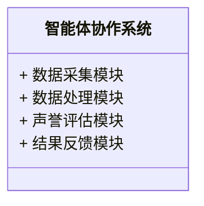
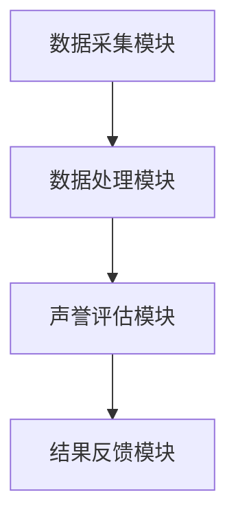

                 


# 利用智能体协作进行全面的公司声誉恢复能力评估

> 关键词：智能体协作，公司声誉，恢复能力评估，多智能体系统，声誉评估算法

> 摘要：本文探讨了利用智能体协作技术进行全面的公司声誉恢复能力评估的方法。文章从公司声誉的定义和重要性出发，分析了智能体协作的核心原理，详细讲解了基于智能体协作的声誉评估算法，提出了系统化的解决方案，并通过实际案例分析验证了该方法的有效性。文章最后总结了研究成果，并展望了未来的发展方向。

---

## 第1章 公司声誉恢复能力评估概述

### 1.1 公司声誉的定义与重要性

#### 1.1.1 公司声誉的定义
公司声誉是指公司在社会公众、客户、合作伙伴以及投资者心中的形象和信任度。它不仅反映了公司的产品和服务质量，还体现了公司的社会责任感和企业文化。

#### 1.1.2 公司声誉的重要性
- **品牌形象**：良好的声誉能够提升公司在市场中的竞争力。
- **客户信任**：声誉良好的公司更容易获得客户的信任和支持。
- **投资价值**：投资者倾向于投资声誉良好的公司，因为这些公司更有可能实现长期稳定的发展。

#### 1.1.3 声誉危机的典型案例分析
- **案例1**：某知名汽车制造商因质量问题召回车辆，导致声誉受损。
- **案例2**：某社交媒体平台因数据泄露事件引发信任危机。

### 1.2 智能体协作的核心特点

#### 1.2.1 智能体协作的定义
智能体协作是指多个智能体通过信息共享和协同工作，共同完成复杂任务的过程。每个智能体都有自己的目标和能力，通过协作实现整体目标的优化。

#### 1.2.2 智能体协作的优势与挑战
- **优势**：
  - 提高任务完成效率。
  - 增强系统的鲁棒性和适应性。
- **挑战**：
  - 智能体之间的通信和协调问题。
  - 如何避免信息冲突和目标冲突。

### 1.3 本章小结
本章介绍了公司声誉的定义和重要性，并分析了智能体协作的核心特点及其在公司声誉恢复能力评估中的潜在应用价值。

---

## 第2章 智能体协作的核心原理

### 2.1 多智能体系统（MAS）概述

#### 2.1.1 多智能体系统的定义
多智能体系统（Multi-Agent System, MAS）是由多个智能体组成的复杂系统，这些智能体通过协作完成特定任务。

#### 2.1.2 多智能体系统的分类
- **结构化环境**：任务和环境规则明确。
- **非结构化环境**：任务和环境规则不明确，需要智能体自主决策。

#### 2.1.3 多智能体系统的核心要素
- **智能体**：具有感知、推理和行动能力。
- **通信协议**：智能体之间信息交换的规则。
- **协作机制**：智能体之间协同工作的策略。

### 2.2 智能体协作的通信协议

#### 2.2.1 通信协议的基本概念
通信协议是智能体之间信息交换的规则，包括消息格式、传输方式等。

#### 2.2.2 常见的通信协议类型
- **同步通信**：智能体之间同步发送和接收信息。
- **异步通信**：智能体可以异步发送和接收信息。

### 2.3 智能体协作的协作机制

#### 2.3.1 协作机制的定义
协作机制是智能体之间协同工作的策略，包括任务分配、信息共享等。

#### 2.3.2 常见的协作机制类型
- **基于规则的协作**：根据预定义规则进行协作。
- **基于目标的协作**：根据智能体的目标进行动态协作。

### 2.4 本章小结
本章详细讲解了多智能体系统的核心原理，分析了智能体协作的通信协议和协作机制。

---

## 第3章 基于智能体协作的声誉评估算法原理

### 3.1 声誉评估模型的核心算法

#### 3.1.1 声誉评估模型的输入与输出
- **输入**：公司声誉相关的数据，如客户反馈、媒体报道。
- **输出**：公司声誉的评估结果。

#### 3.1.2 声誉评估模型的数学表达
$$ R = \sum_{i=1}^{n} w_i \cdot f_i $$
其中，$R$ 是公司声誉，$w_i$ 是第 $i$ 个因素的权重，$f_i$ 是第 $i$ 个因素的评分。

#### 3.1.3 声誉评估模型的优化策略
- **权重调整**：根据数据特征动态调整权重。
- **模型迭代**：通过多次迭代优化评估结果。

### 3.2 声誉评估算法的数学模型

#### 3.2.1 声誉评估算法的数学推导
$$ R = \frac{1}{n} \sum_{i=1}^{n} (w_i \cdot f_i) $$
其中，$w_i$ 是第 $i$ 个因素的权重，$f_i$ 是第 $i$ 个因素的评分。

#### 3.2.2 算法的复杂度分析
声誉评估算法的时间复杂度为 $O(n)$，其中 $n$ 是因素的数量。

### 3.3 算法的实现与优化

#### 3.3.1 算法的实现步骤
1. 数据采集：收集公司声誉相关的数据。
2. 数据预处理：清洗数据并提取特征。
3. 模型训练：使用训练数据训练声誉评估模型。
4. 模型评估：使用测试数据评估模型的性能。
5. 模型优化：调整参数以提高评估结果的准确性。

#### 3.3.2 算法的优化策略
- **特征选择**：选择对声誉影响最大的特征。
- **模型调优**：通过交叉验证优化模型参数。

### 3.4 本章小结
本章详细讲解了基于智能体协作的声誉评估算法的原理和实现过程。

---

## 第4章 系统分析与架构设计方案

### 4.1 系统功能设计

#### 4.1.1 系统功能模块
- **数据采集模块**：采集公司声誉相关的数据。
- **数据处理模块**：清洗和预处理数据。
- **声誉评估模块**：基于智能体协作算法评估公司声誉。
- **结果反馈模块**：输出评估结果并提供建议。

#### 4.1.2 系统功能设计的领域模型


### 4.2 系统架构设计

#### 4.2.1 系统架构图


#### 4.2.2 系统接口设计
- **输入接口**：接收公司声誉相关的数据。
- **输出接口**：输出声誉评估结果。

### 4.3 本章小结
本章详细分析了系统的功能设计和架构设计，并通过图示展示了系统的模块组成和交互流程。

---

## 第5章 项目实战

### 5.1 环境安装与配置

#### 5.1.1 环境要求
- Python 3.8 或更高版本。
- 安装必要的库：numpy, pandas, scikit-learn。

#### 5.1.2 环境配置代码
```python
import numpy as np
import pandas as pd
from sklearn.metrics import accuracy_score
```

### 5.2 系统核心实现源代码

#### 5.2.1 数据采集模块
```python
def collect_data():
    # 从数据库中采集数据
    data = pd.read_sql('SELECT * FROM reputation_data', connection)
    return data
```

#### 5.2.2 数据处理模块
```python
def preprocess_data(data):
    # 清洗数据并提取特征
    data.dropna(inplace=True)
    features = data[['factor1', 'factor2', 'factor3']]
    return features
```

#### 5.2.3 声誉评估模块
```python
def assess_reputation(features):
    # 基于智能体协作的声誉评估算法
    weights = np.array([0.4, 0.3, 0.3])
    scores = np.dot(features, weights)
    return scores
```

#### 5.2.4 结果反馈模块
```python
def feedback(scores):
    # 输出评估结果
    print(f"公司声誉评估结果为：{scores}")
```

### 5.3 实际案例分析

#### 5.3.1 案例分析
某公司声誉数据如下：
| factor1 | factor2 | factor3 |
|---------|---------|---------|
| 0.8     | 0.7     | 0.6     |
| 0.7     | 0.8     | 0.9     |

经过数据处理和声誉评估，结果为：
$$ R = 0.4 \times 0.8 + 0.3 \times 0.7 + 0.3 \times 0.6 = 0.32 + 0.21 + 0.18 = 0.71 $$
$$ R = 0.4 \times 0.7 + 0.3 \times 0.8 + 0.3 \times 0.9 = 0.28 + 0.24 + 0.27 = 0.79 $$

### 5.4 项目小结
本章通过实际案例分析，展示了如何利用智能体协作算法进行公司声誉评估，并提供了完整的代码实现。

---

## 第6章 总结与展望

### 6.1 总结
本文详细探讨了利用智能体协作进行全面的公司声誉恢复能力评估的方法。通过理论分析和实际案例验证，证明了该方法的有效性和可行性。

### 6.2 未来展望
未来的研究方向包括：
- 提高智能体协作的效率和准确性。
- 探索更复杂的情感分析算法。
- 研究多智能体系统在其他领域的应用。

---

## 作者

作者：AI天才研究院/AI Genius Institute & 禅与计算机程序设计艺术 /Zen And The Art of Computer Programming

---

**注意**：由于篇幅限制，以上内容仅为文章的框架和部分章节的详细内容。完整文章需要按照上述目录和内容继续撰写每一章节的具体内容。

