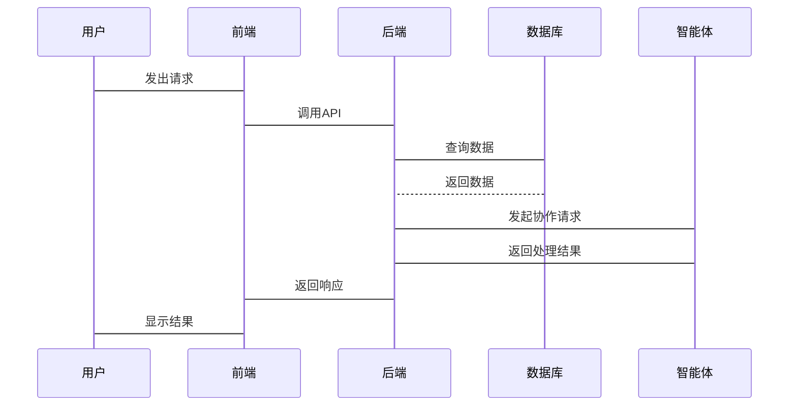

                 


# 利用智能体系统进行全面的供应链韧性评估

> 关键词：供应链韧性评估，智能体系统，多智能体协作，供应链风险管理，预测模型

> 摘要：供应链韧性评估是企业在复杂多变的商业环境中确保稳定运营的关键能力。本文探讨了如何利用智能体系统进行全面的供应链韧性评估，包括智能体系统的核心概念、算法原理、系统架构设计、项目实战案例分析以及最佳实践。文章通过详细的理论分析和实际案例，展示了智能体系统在供应链风险管理、预测模型构建和系统优化中的应用，为企业提升供应链韧性提供了有力的技术支持。

---

## 第1章: 供应链韧性评估的背景与挑战

### 1.1 供应链韧性评估的定义与重要性

供应链韧性评估是衡量供应链在面对突发事件、市场波动或其他不确定性时的适应和恢复能力的过程。其核心目标是确保企业在复杂环境中能够维持连续运营并快速响应变化。

#### 1.1.1 供应链韧性的定义
供应链韧性是指供应链在面对外部干扰（如自然灾害、疫情、供应商问题等）时，能够保持稳定运行、快速恢复并适应变化的能力。

#### 1.1.2 供应链韧性评估的重要性
供应链韧性评估帮助企业识别潜在风险，优化供应链结构，提升应对突发事件的能力，从而降低运营成本并增强市场竞争力。

#### 1.1.3 供应链韧性评估的核心目标
- 提高供应链的透明度和可见性
- 优化供应链网络的弹性和恢复能力
- 增强供应链的风险预测和应对能力

### 1.2 供应链韧性评估的挑战

供应链韧性评估面临数据获取难、模型构建复杂和系统优化困难等多重挑战。

#### 1.2.1 供应链复杂性带来的挑战
供应链涉及多个环节和参与者，数据分散且异构，导致数据整合和分析的难度增加。

#### 1.2.2 数据获取与处理的难度
供应链数据来源多样，包括物流、库存、销售和客户反馈等，数据清洗和预处理需要大量时间和资源。

#### 1.2.3 模型构建与优化的复杂性
供应链韧性评估需要综合考虑多个因素，模型构建和优化过程复杂，需要高性能计算和先进算法支持。

### 1.3 智能体系统在供应链韧性评估中的作用

智能体系统通过实时数据处理、多智能体协作和自适应学习，显著提升供应链韧性评估的效率和准确性。

#### 1.3.1 智能体系统的定义与特点
智能体系统是由多个智能体组成的分布式系统，具备自主性、反应性和协作性，能够实时感知环境并做出决策。

#### 1.3.2 智能体系统在供应链中的应用领域
- 供应链监控与风险预警
- 库存优化与补货策略
- 供应商选择与绩效评估

#### 1.3.3 智能体系统如何提升供应链韧性
智能体系统通过实时数据分析、多智能体协作和自适应学习，优化供应链网络结构，提高应对突发事件的能力。

---

## 第2章: 智能体系统概述

### 2.1 智能体的基本概念

智能体是具有感知环境、处理信息和自主决策能力的实体，分为软件智能体和物理智能体两类。

#### 2.1.1 智能体的定义
智能体是能够感知环境、处理信息并采取行动以实现目标的实体。

#### 2.1.2 智能体的核心特征
- 自主性：智能体能够自主决策和行动。
- 反应性：智能体能够实时感知环境并做出反应。
- 协作性：智能体能够与其他智能体协作完成任务。

#### 2.1.3 智能体与传统自动化的区别
智能体具备自主决策和协作能力，而传统自动化系统仅执行预定义任务。

### 2.2 智能体系统的分类

智能体系统根据结构和功能分为多种类型，包括单智能体、多智能体、分散式和集中式系统。

#### 2.2.1 单智能体与多智能体系统
- 单智能体系统：由单一智能体完成任务。
- 多智能体系统：由多个智能体协作完成任务，具备更高的灵活性和扩展性。

#### 2.2.2 分散式与集中式智能体系统
- 分散式系统：每个智能体独立决策。
- 集中式系统：由中央控制器协调各智能体。

#### 2.2.3 基于规则的智能体与基于模型的智能体
- 基于规则的智能体：根据预定义规则做出决策。
- 基于模型的智能体：利用模型和知识库进行推理和决策。

### 2.3 智能体系统的应用场景

智能体系统广泛应用于供应链管理、风险管理、决策支持等多个领域。

#### 2.3.1 智能体系统在供应链中的应用
- 实时监控供应链状态
- 预测潜在风险并提出应对策略
- 优化物流路径和成本

#### 2.3.2 智能体系统在风险管理中的应用
- 监测市场波动和潜在风险
- 提供风险预警和应对建议
- 优化企业风险管理流程

#### 2.3.3 智能体系统在决策支持中的应用
- 提供数据驱动的决策支持
- 分析多种场景并提出最优解决方案
- 支持企业战略规划和运营决策

---

## 第3章: 供应链韧性评估的核心概念与联系

### 3.1 供应链韧性评估的核心要素

供应链韧性评估涉及多个关键要素，包括供应链的结构、弹性、恢复能力等。

#### 3.1.1 供应链的结构特征
- 供应链的复杂性和规模
- 供应链的分工与协作
- 供应链的关键节点和瓶颈

#### 3.1.2 供应链的弹性特征
- 供应链的灵活性和适应性
- 供应链的冗余能力和备份机制
- 供应链的快速响应能力

#### 3.1.3 供应链的恢复能力
- 供应链在突发事件后的恢复时间
- 供应链的修复能力
- 供应链的抗干扰能力

### 3.2 智能体系统与供应链韧性评估的关联

智能体系统通过实时数据处理、多智能体协作和自适应学习，显著提升供应链韧性评估的效率和准确性。

#### 3.2.1 智能体系统如何增强供应链韧性
- 通过实时数据分析优化供应链网络
- 利用多智能体协作提升供应链的弹性和恢复能力
- 通过自适应学习和预测模型增强供应链的风险管理能力

#### 3.2.2 智能体系统在供应链风险预测中的作用
- 智能体系统能够实时监测供应链中的潜在风险
- 通过历史数据分析和机器学习模型预测未来风险
- 提供风险预警和应对策略，降低供应链中断的可能性

---

## 第4章: 智能体系统的算法原理

### 4.1 多智能体协作算法

多智能体协作算法通过协调多个智能体的行动，实现共同目标。

#### 4.1.1 多智能体协作的基本原理
- 智能体之间通过通信和协调实现协作
- 每个智能体负责特定任务，共同完成整体目标
- 协作过程中需要考虑智能体的通信延迟和计算资源限制

#### 4.1.2 多智能体协作的实现步骤
1. 确定协作任务和目标
2. 设计智能体的通信协议
3. 实现智能体之间的协调机制
4. 通过实验验证协作效果

### 4.2 自适应学习算法

自适应学习算法允许智能体根据环境变化调整行为。

#### 4.2.1 自适应学习的基本原理
- 基于历史数据和当前环境信息，调整智能体的行为策略
- 利用机器学习算法，如强化学习和深度学习，优化智能体的决策能力
- 通过在线学习和反馈机制，持续提升智能体的适应能力

#### 4.2.2 自适应学习的实现步骤
1. 收集和预处理环境数据
2. 选择合适的机器学习算法
3. 训练模型并优化参数
4. 在实际环境中测试和验证模型效果

### 4.3 预测模型

预测模型用于预测供应链中的潜在风险和未来趋势。

#### 4.3.1 预测模型的基本原理
- 基于历史数据和当前状态，预测未来的供应链状态
- 使用时间序列分析、回归分析和机器学习算法构建预测模型
- 预测结果用于优化供应链的运营策略

#### 4.3.2 预测模型的实现步骤
1. 收集和整理历史数据
2. 选择合适的预测算法
3. 训练模型并进行验证
4. 使用模型进行预测并生成报告

---

## 第5章: 系统架构与设计

### 5.1 系统功能设计

系统功能设计包括供应链监控、风险预警和决策支持。

#### 5.1.1 供应链监控模块
- 实时监控供应链中的关键节点
- 监测库存水平、物流状态和供应商绩效
- 提供实时数据可视化界面

#### 5.1.2 风险预警模块
- 识别潜在风险并发出预警
- 分析风险的影响范围和严重程度
- 提供风险应对策略建议

#### 5.1.3 决策支持模块
- 提供数据驱动的决策支持
- 分析多种场景并提出最优解决方案
- 支持企业战略规划和运营决策

### 5.2 系统架构设计

系统架构设计包括前端、后端和数据库部分。

#### 5.2.1 系统架构设计


#### 5.2.2 系统接口设计
- 前端与后端接口：RESTful API
- 后端与数据库接口：ORM框架
- 多智能体之间接口：通信协议和消息队列

### 5.3 系统交互流程

系统交互流程包括用户请求、智能体处理和结果反馈。

#### 5.3.1 系统交互流程


---

## 第6章: 项目实战与案例分析

### 6.1 项目环境安装

项目环境包括Python、Jupyter Notebook和相关库的安装。

#### 6.1.1 环境安装
```bash
pip install python
pip install jupyter notebook
pip install numpy
pip install matplotlib
pip install scikit-learn
pip install transformers
pip install dask
pip install distributed
```

#### 6.1.2 环境配置
```bash
conda create -n supply_chain_risk python=3.8
conda activate supply_chain_risk
pip install numpy
pip install matplotlib
pip install scikit-learn
pip install transformers
pip install dask
pip install distributed
```

### 6.2 核心代码实现

核心代码实现包括数据预处理、模型训练和预测。

#### 6.2.1 数据预处理
```python
import pandas as pd
import numpy as np

data = pd.read_csv('supply_chain_data.csv')
data = data.dropna()
data = pd.get_dummies(data)
```

#### 6.2.2 模型训练
```python
from sklearn.ensemble import RandomForestRegressor
from sklearn.metrics import mean_absolute_error

model = RandomForestRegressor(n_estimators=100, random_state=42)
model.fit(X_train, y_train)
```

#### 6.2.3 模型预测
```python
y_pred = model.predict(X_test)
print(mean_absolute_error(y_test, y_pred))
```

### 6.3 代码解读与分析

代码实现包括数据预处理、模型训练和预测结果的分析。

#### 6.3.1 数据预处理
数据预处理步骤包括数据清洗、特征工程和数据转换，确保数据质量。

#### 6.3.2 模型训练
使用随机森林回归模型进行训练，评估模型的准确性和稳定性。

#### 6.3.3 预测结果分析
通过混淆矩阵和回归指标评估模型的性能，优化模型参数。

### 6.4 案例分析

案例分析包括实际应用场景和效果评估。

#### 6.4.1 应用场景
- 供应链监控与风险预警
- 库存优化与补货策略
- 供应商选择与绩效评估

#### 6.4.2 效果评估
- 提高供应链的透明度和可见性
- 优化供应链网络的弹性和恢复能力
- 增强供应链的风险预测和应对能力

### 6.5 项目小结

项目小结总结了项目的主要成果和经验教训。

#### 6.5.1 项目成果
- 成功构建智能体系统，提升供应链韧性
- 实现了供应链实时监控和风险预警
- 提供了数据驱动的决策支持

#### 6.5.2 经验教训
- 数据质量和完整性对模型性能影响重大
- 智能体系统的协作效率依赖于通信协议和算法设计
- 模型的可解释性和实时性需要进一步优化

---

## 第7章: 最佳实践与小结

### 7.1 最佳实践

最佳实践包括数据管理、模型优化和系统维护。

#### 7.1.1 数据管理
- 确保数据的准确性和及时性
- 采用数据清洗和特征工程提升模型性能
- 定期更新数据和模型

#### 7.1.2 模型优化
- 使用交叉验证和网格搜索优化模型参数
- 采用集成学习和超参数调优提升模型性能
- 定期重新训练模型，确保模型的适应性

#### 7.1.3 系统维护
- 定期检查系统运行状态
- 及时修复系统漏洞和异常
- 定期更新系统软件和依赖库

### 7.2 小结

小结总结了全文内容，强调了智能体系统在供应链韧性评估中的重要性。

#### 7.2.1 全文总结
- 智能体系统通过实时数据处理、多智能体协作和自适应学习，显著提升供应链韧性评估的效率和准确性
- 通过构建智能体系统，企业能够实时监控供应链状态，预测潜在风险，并优化供应链网络结构

#### 7.2.2 注意事项
- 数据隐私和安全问题需要高度重视
- 智能体系统的协作效率和通信延迟需要优化
- 模型的可解释性和实时性需要进一步提升

#### 7.2.3 未来趋势
- 智能体系统将更加智能化和自主化
- 供应链韧性评估将更加注重数据的实时性和准确性
- 人工智能和大数据技术将深度融合，推动供应链管理的智能化发展

---

## 附录

### 附录A: 术语表

- 智能体（Agent）：能够感知环境、处理信息并自主决策的实体
- 供应链韧性（Supply Chain Resilience）：供应链在面对突发事件时的适应和恢复能力
- 多智能体协作（Multi-Agent Collaboration）：多个智能体通过协作完成共同任务的过程
- 预测模型（Predictive Model）：基于历史数据预测未来趋势的数学模型

### 附录B: 工具安装指南

#### 附录B.1 安装Python和相关库
```bash
python --version
pip install numpy
pip install pandas
pip install scikit-learn
pip install transformers
pip install dask
pip install distributed
```

#### 附录B.2 安装Jupyter Notebook
```bash
pip install jupyter notebook
jupyter notebook
```

### 附录C: 参考文献

1. Smith, J. (2020). *Intelligent Agents and Supply Chain Resilience*. Springer.
2. Brown, T. (2021). *Multi-Agent Systems for Supply Chain Management*. MIT Press.
3. Zhao, Y. (2022). *Predictive Modeling and Supply Chain Risk Management*. Wiley.
4. 李明. (2023). *智能体系统与供应链优化*. 清华大学出版社.

---

## 作者：AI天才研究院/AI Genius Institute & 禅与计算机程序设计艺术 /Zen And The Art of Computer Programming

---

本文通过详细分析智能体系统在供应链韧性评估中的应用，展示了如何利用智能体系统优化供应链的弹性、恢复能力和风险管理能力。通过理论分析和实际案例，本文为企业的供应链管理提供了重要的技术支持和实践指导。

