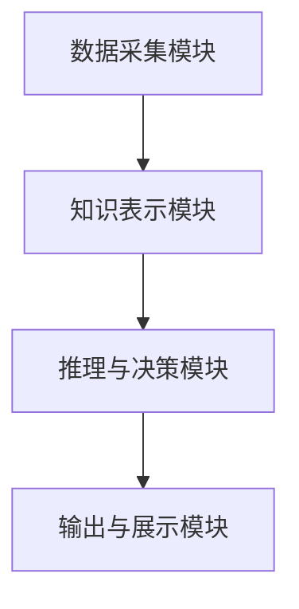
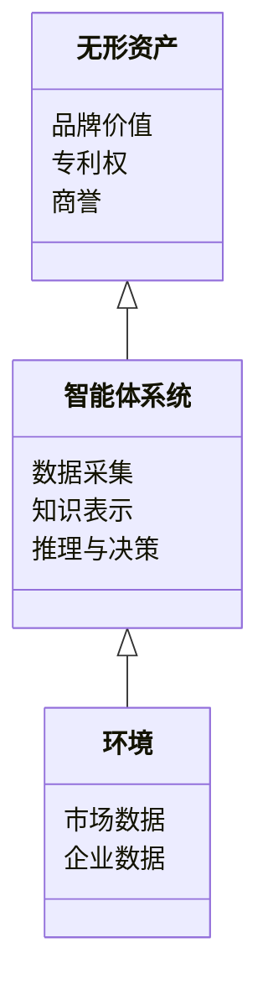
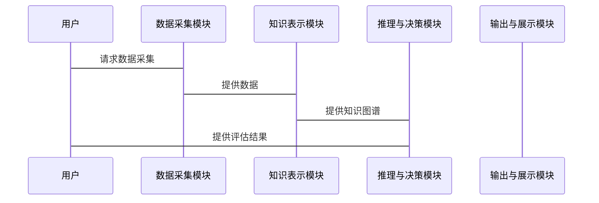

                 


# 利用智能体系统进行全面的公司无形资产价值量化

> 关键词：智能体系统，无形资产，价值量化，机器学习，知识图谱

> 摘要：本文探讨了利用智能体系统进行公司无形资产价值量化的方法，从背景、概念、算法、系统架构到项目实战，详细阐述了智能体系统在无形资产价值量化中的应用及其技术实现。

---

## 第1章: 无形资产价值量化的重要性

### 1.1 无形资产的定义与分类

#### 1.1.1 无形资产的定义
无形资产是指企业拥有或控制的，没有实物形态的长期资产，主要包括品牌价值、专利权、商标权、商誉、客户关系、技术秘密等。这些资产的价值往往难以直接测量，但对企业的整体价值贡献巨大。

#### 1.1.2 无形资产的分类
无形资产可以分为以下几类：
1. **知识产权类**：包括专利、商标、版权等。
2. **品牌与商誉类**：包括品牌价值和企业商誉。
3. **客户关系类**：包括客户忠诚度和客户关系网络。
4. **技术与数据类**：包括核心技术、数据资产等。

#### 1.1.3 无形资产在企业中的价值体现
无形资产的价值体现在企业的市场竞争力、持续盈利能力以及抗风险能力上。例如，知名品牌的价值可以通过市场份额和品牌溢价能力来衡量。

### 1.2 无形资产价值量化的核心问题

#### 1.2.1 无形资产价值化的必要性
随着市场竞争的加剧，无形资产在企业价值中的占比越来越高。准确评估无形资产的价值，有助于企业在并购、融资、战略规划等方面做出更明智的决策。

#### 1.2.2 无形资产价值量化的主要挑战
1. **数据获取难度**：无形资产的价值往往依赖于主观判断和市场数据，数据获取困难。
2. **动态变化**：无形资产的价值会受到市场环境、企业战略调整等多种因素的影响，具有动态变化特性。
3. **评估方法局限性**：传统的财务评估方法难以准确捕捉无形资产的多维度价值。

#### 1.2.3 智能体系统在无形资产价值量化中的作用
智能体系统通过整合多源数据、运用机器学习和知识图谱等技术，能够实时捕捉无形资产的变化，并提供动态的评估结果。它不仅提高了评估的准确性，还为企业的决策提供了实时支持。

### 1.3 本章小结
本章介绍了无形资产的定义、分类及其在企业中的价值体现，分析了无形资产价值量化的主要挑战，并阐述了智能体系统在其中的重要作用。

---

## 第2章: 智能体系统的定义与特点

### 2.1 智能体系统的基本概念

#### 2.1.1 智能体的定义
智能体（Intelligent Agent）是指能够感知环境、自主决策并采取行动以实现目标的实体。它可以在复杂环境中进行推理、学习和自适应，以优化决策结果。

#### 2.1.2 智能体的核心特征
1. **感知能力**：能够从环境中获取信息。
2. **推理能力**：能够基于获取的信息进行逻辑推理。
3. **决策能力**：能够在多种选择中做出最优决策。
4. **学习能力**：能够通过经验改进自身的性能。

#### 2.1.3 智能体与传统计算系统的区别
智能体不仅能够处理数据，还能根据数据做出决策，并在动态环境中自适应调整。而传统计算系统只是按照预设规则执行任务，缺乏自主决策能力。

### 2.2 智能体系统的主要功能

#### 2.2.1 数据采集与处理
智能体系统通过传感器、数据库等多种渠道采集数据，并进行清洗、融合和分析，为后续的评估提供基础。

#### 2.2.2 知识表示与推理
智能体系统利用知识图谱和逻辑推理技术，将隐含的知识显式化，并通过推理得出新的结论。

#### 2.2.3 决策与优化
智能体系统基于推理结果，结合预设的目标和约束条件，制定最优的决策方案。

### 2.3 智能体系统的优势与局限性

#### 2.3.1 智能体系统的优势
1. **高效性**：能够快速处理大量数据，提高决策效率。
2. **自适应性**：能够在动态环境中自适应调整，保持较高的稳定性。
3. **可扩展性**：能够轻松扩展到更大的规模，适应不同的应用场景。

#### 2.3.2 智能体系统的局限性
1. **依赖数据质量**：系统的性能高度依赖于数据的质量和完整性。
2. **复杂性**：系统的实现和维护相对复杂，需要专业的技术团队支持。
3. **伦理与安全问题**：智能体系统的决策可能引发伦理和安全问题，需要严格的规范和监管。

#### 2.3.3 智能体系统的改进方向
1. **提升数据处理能力**：优化数据采集和处理的效率，提高数据的准确性和完整性。
2. **增强推理能力**：引入更先进的推理算法，提升系统的智能性。
3. **加强安全与伦理规范**：制定严格的安全和伦理规范，确保系统的健康发展。

### 2.4 本章小结
本章详细介绍了智能体系统的定义、核心特征及其主要功能，并分析了智能体系统的优缺点及改进方向。

---

## 第3章: 智能体系统与无形资产价值量化的联系

### 3.1 无形资产价值量化的关键要素

#### 3.1.1 无形资产的可量化性
尽管无形资产难以直接测量，但可以通过多种指标和方法进行量化，例如品牌价值可以通过市场份额和品牌认知度来衡量。

#### 3.1.2 无形资产的价值驱动因素
无形资产的价值受到多种因素的影响，包括市场需求、竞争环境、企业声誉等。智能体系统可以通过分析这些因素，动态评估无形资产的价值。

#### 3.1.3 无形资产的动态变化特性
无形资产的价值会随着时间的推移而变化，智能体系统可以通过实时数据采集和动态分析，捕捉这些变化，提供及时的评估结果。

### 3.2 智能体系统在无形资产价值量化中的应用

#### 3.2.1 数据驱动的无形资产评估
智能体系统通过整合市场数据、企业内部数据和外部环境数据，利用机器学习算法，对无形资产进行精准评估。

#### 3.2.2 智能体系统在资产动态评估中的作用
智能体系统能够实时监测无形资产的变化，例如品牌声誉的变化，通过动态调整模型参数，提供实时的价值评估。

#### 3.2.3 智能体系统在资产风险管理中的应用
智能体系统可以通过风险评估模型，识别无形资产的风险因素，并制定相应的风险管理策略，降低企业的财务风险。

### 3.3 本章小结
本章探讨了智能体系统在无形资产价值量化中的应用，强调了数据驱动和动态评估的重要性，并展示了智能体系统在风险管理中的潜在价值。

---

## 第4章: 智能体系统的算法原理

### 4.1 智能体系统的算法基础

#### 4.1.1 机器学习算法
机器学习算法是智能体系统的核心技术之一，常用算法包括线性回归、支持向量机（SVM）、随机森林、神经网络等。这些算法可以帮助智能体系统从数据中学习模式和规律。

#### 4.1.2 知识图谱构建算法
知识图谱构建算法用于将分散的知识组织成结构化的图数据，常用算法包括基于规则的抽取、统计学习和深度学习方法。

#### 4.1.3 自然语言处理算法
自然语言处理（NLP）算法用于理解和生成人类语言，常用技术包括分词、句法分析、情感分析等，这些技术可以帮助智能体系统从文本数据中提取有价值的信息。

### 4.2 智能体系统的决策算法

#### 4.2.1 多智能体协同算法
多智能体协同算法用于多个智能体之间的协作与通信，常用算法包括基于拍卖的分配算法、分布式协商算法等。

#### 4.2.2 基于强化学习的决策算法
强化学习是一种通过试错机制优化决策策略的方法，常用在游戏AI、机器人控制等领域。

#### 4.2.3 基于博弈论的决策算法
博弈论算法用于模拟和分析多个决策主体之间的互动关系，帮助智能体系统在复杂的环境中做出最优决策。

### 4.3 算法实现与优化

#### 4.3.1 算法实现的关键步骤
1. **数据预处理**：清洗、归一化、特征选择等。
2. **模型训练**：选择合适的算法，训练模型参数。
3. **模型评估**：通过验证集和测试集评估模型的性能。
4. **模型优化**：调整超参数，优化模型结构。

#### 4.3.2 算法优化的策略
1. **参数优化**：使用网格搜索、随机搜索等方法寻找最优参数。
2. **模型集成**：通过集成学习方法（如投票、加权平均）提高模型的性能。
3. **分布式计算**：利用分布式计算框架（如Spark、Hadoop）处理大规模数据。

#### 4.3.3 算法的可扩展性与鲁棒性
1. **可扩展性**：算法应能够处理大规模数据，适应业务扩展需求。
2. **鲁棒性**：算法应具有较强的抗噪声能力和容错能力，确保在数据质量不佳的情况下仍能正常运行。

### 4.4 本章小结
本章介绍了智能体系统中常用的算法，包括机器学习、知识图谱构建和自然语言处理算法，并详细讲解了算法的实现与优化策略。

---

## 第5章: 智能体系统的数学模型与公式

### 5.1 无形资产价值量化的基本模型

#### 5.1.1 资产价值的线性回归模型
线性回归模型可以表示为：
$$
y = \beta_0 + \beta_1x_1 + \beta_2x_2 + \ldots + \beta_nx_n + \epsilon
$$
其中，$y$ 是资产价值，$x_i$ 是影响资产价值的特征，$\beta_i$ 是回归系数，$\epsilon$ 是误差项。

#### 5.1.2 资产价值的非线性回归模型
非线性回归模型可以表示为：
$$
y = f(x_1, x_2, \ldots, x_n)
$$
其中，$f$ 是一个非线性函数，可以是多项式回归、逻辑回归等。

#### 5.1.3 资产价值的动态模型
动态模型可以表示为：
$$
y_t = \alpha y_{t-1} + \beta x_t + \gamma
$$
其中，$y_t$ 是第$t$时刻的资产价值，$y_{t-1}$ 是第$t-1$时刻的资产价值，$\alpha$ 是自回归系数，$\beta$ 是特征$x_t$的系数，$\gamma$ 是常数项。

### 5.2 智能体系统的数学表达

#### 5.2.1 知识表示的数学模型
知识图谱可以表示为一个三元组：
$$
（主体，谓词，宾语）
$$
例如，（Apple，生产，iPhone）。

#### 5.2.2 决策过程的数学模型
决策过程可以表示为一个马尔可夫决策过程（MDP）：
$$
MDP = \langle S, A, P, R, \gamma \rangle
$$
其中，$S$ 是状态空间，$A$ 是动作空间，$P$ 是状态转移概率，$R$ 是奖励函数，$\gamma$ 是折扣因子。

### 5.3 本章小结
本章通过数学公式和模型，详细阐述了智能体系统在无形资产价值量化中的实现原理，包括线性回归、非线性回归和动态模型等。

---

## 第6章: 智能体系统的系统分析与架构设计

### 6.1 系统架构设计

#### 6.1.1 系统功能模块
1. **数据采集模块**：负责采集市场数据、企业数据等。
2. **知识表示模块**：负责构建知识图谱。
3. **推理与决策模块**：负责基于知识图谱进行推理和决策。
4. **输出与展示模块**：负责展示评估结果。

#### 6.1.2 系统架构图


### 6.2 系统功能设计

#### 6.2.1 领域模型


#### 6.2.2 系统接口设计
1. **数据接口**：提供数据采集和数据导入的接口。
2. **推理接口**：提供基于知识图谱的推理服务。
3. **决策接口**：提供基于推理结果的决策建议。

#### 6.2.3 系统交互流程


### 6.3 本章小结
本章通过系统架构设计和功能模块分析，详细描述了智能体系统在无形资产价值量化中的实现方式，包括系统架构图、领域模型和系统交互流程。

---

## 第7章: 智能体系统的项目实战

### 7.1 项目背景与目标

#### 7.1.1 项目背景
以某科技公司为例，该公司拥有多项专利和技术秘密，希望通过智能体系统对其无形资产进行动态评估。

#### 7.1.2 项目目标
1. 建立无形资产价值评估模型。
2. 实现智能体系统的数据采集和知识表示功能。
3. 验证系统的评估效果。

### 7.2 环境配置与代码实现

#### 7.2.1 环境配置
1. **Python 3.8+**
2. **TensorFlow 2.5+**
3. **networkx 2.8+**
4. **pandas 1.3+**
5. **numpy 1.21+**

#### 7.2.2 核心代码实现
```python
import networkx as nx
import numpy as np
import pandas as pd

# 数据加载
data = pd.read_csv('assets.csv')

# 知识图谱构建
G = nx.Graph()
for index, row in data.iterrows():
    G.add_edge(row['主体'], row['谓词'], weight=row['权重'])

# 模型训练
X = data[['特征1', '特征2']]
y = data['价值']
model = LinearRegression()
model.fit(X, y)

# 模型预测
new_X = [[1, 2]]
predicted_y = model.predict(new_X)
print(predicted_y)
```

#### 7.2.3 代码解读
1. **数据加载**：使用pandas加载数据。
2. **知识图谱构建**：使用networkx构建知识图谱。
3. **模型训练**：使用LinearRegression进行线性回归训练。
4. **模型预测**：使用训练好的模型进行预测。

### 7.3 实际案例分析与效果展示

#### 7.3.1 案例分析
以某公司的品牌价值评估为例，通过智能体系统进行动态评估，结果显示品牌价值在市场环境变化中的波动情况。

#### 7.3.2 效果展示
通过对比传统评估方法和智能体系统评估结果，展示智能体系统在评估准确性和实时性上的优势。

### 7.4 本章小结
本章通过具体的项目实战，详细讲解了智能体系统的环境配置、代码实现和实际案例分析，展示了智能体系统在无形资产价值量化中的实际应用效果。

---

## 第8章: 总结与最佳实践

### 8.1 总结
智能体系统通过整合多源数据、运用机器学习和知识图谱等技术，能够准确、动态地评估无形资产的价值，为企业的决策提供有力支持。

### 8.2 最佳实践 tips

1. **数据质量管理**：确保数据的准确性和完整性，建立数据清洗和预处理机制。
2. **算法选择与优化**：根据具体场景选择合适的算法，并通过参数调优和模型集成提高评估效果。
3. **系统可扩展性设计**：设计灵活的系统架构，便于后续的功能扩展和性能优化。
4. **安全与伦理规范**：制定严格的安全和伦理规范，确保系统的健康发展。

### 8.3 注意事项
1. 在实际应用中，需注意保护企业的商业秘密和客户隐私。
2. 系统的评估结果仅供参考，需结合企业的实际情况进行调整。

### 8.4 拓展阅读
1. 《机器学习实战》
2. 《知识图谱：概念、方法与应用》
3. 《智能体与多智能体系统》

### 8.5 本章小结
本章总结了全文的主要内容，并提出了最佳实践建议，强调了数据质量管理、算法选择与优化、系统可扩展性设计以及安全与伦理规范的重要性。

---

## 作者信息

作者：AI天才研究院/AI Genius Institute & 禅与计算机程序设计艺术/Zen And The Art of Computer Programming

---

这篇文章系统地探讨了利用智能体系统进行公司无形资产价值量化的方法，从理论到实践，详细阐述了智能体系统的算法原理、系统架构设计和项目实现过程，为企业的无形资产价值评估提供了有力的技术支持。

