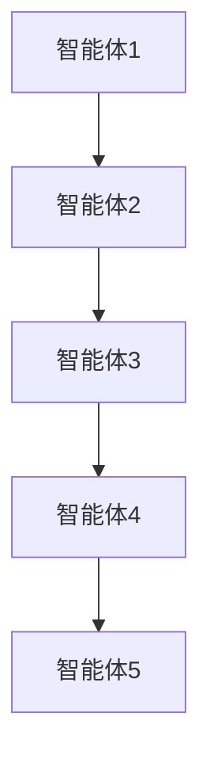
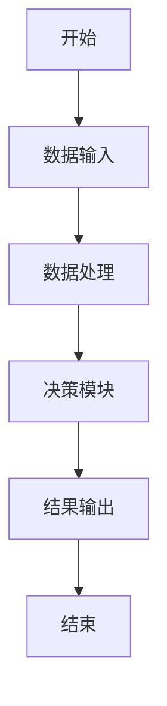
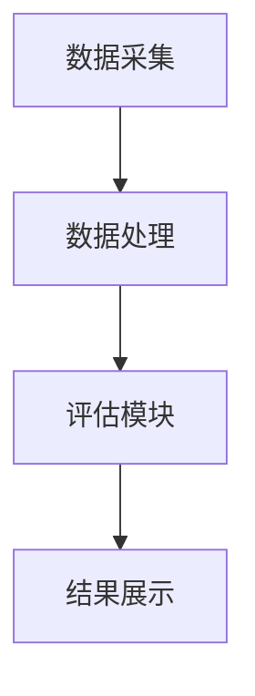
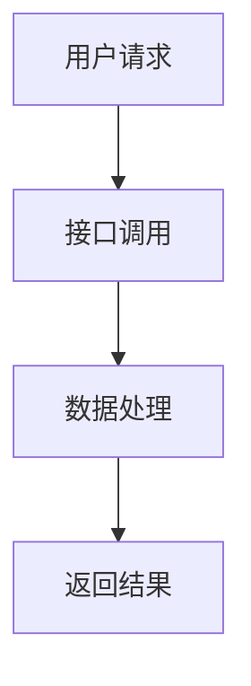
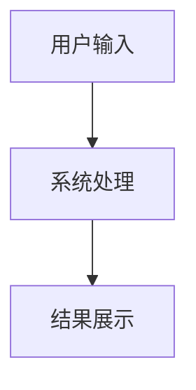

                 


# 利用智能体系统进行全面的公司知识产权价值评估

> 关键词：智能体系统, 知识产权价值评估, 多智能体协作, 知识产权评估模型, 智能体算法

> 摘要：  
> 本文详细探讨了利用智能体系统进行全面的公司知识产权价值评估的方法和实现方案。从知识产权的基本概念到智能体系统的算法原理，再到系统的架构设计和实际应用案例，系统地介绍了如何通过智能体系统来提升知识产权评估的效率和准确性。文章结合理论分析和实际操作，为读者提供了一套完整的知识产权价值评估解决方案。

---

## 第一章: 知识产权价值评估的背景与挑战

### 1.1 知识产权的基本概念

#### 1.1.1 知识产权的定义与范围
知识产权（Intellectual Property，IP）是指人们通过智力劳动创造的成果，主要包括专利、商标、版权、商业秘密等。知识产权的核心价值在于其独特性和创造性，能够为企业带来竞争优势。

#### 1.1.2 知识产权的重要性与价值体现
知识产权是企业的重要资产，其价值体现在以下几个方面：
1. **市场竞争力**：知识产权能够保护企业的创新成果，防止竞争对手的模仿。
2. **经济价值**：知识产权可以通过许可、转让等方式为企业带来直接收益。
3. **品牌价值**：商标和品牌相关的知识产权能够提升企业的市场形象和品牌价值。

#### 1.1.3 知识产权在企业中的战略地位
知识产权不仅是企业的一项资产，更是企业核心竞争力的体现。通过有效的知识产权管理，企业可以最大化知识产权的价值，提升市场地位和盈利能力。

### 1.2 知识产权价值评估的传统方法

#### 1.2.1 传统评估方法概述
传统的知识产权价值评估方法主要包括市场法、成本法和收益法。这些方法基于财务指标和市场数据，对知识产权的价值进行估算。

#### 1.2.2 传统评估方法的局限性
传统的知识产权价值评估方法存在以下问题：
1. **主观性**：评估结果依赖于评估人员的经验和判断，缺乏客观性。
2. **数据依赖性**：需要大量历史数据支持，但在实际操作中，数据获取困难。
3. **动态性不足**：知识产权的价值受市场环境、技术发展等动态因素影响，传统方法难以实时反映这些变化。

#### 1.2.3 智能体系统的优势与必要性
智能体系统（Intelligent Agent System）通过集成人工智能、大数据分析和自动化技术，能够实时动态地评估知识产权的价值。其优势包括：
1. **高效性**：智能体系统能够快速处理大量数据，提高评估效率。
2. **准确性**：通过机器学习算法，智能体系统能够更准确地预测知识产权的价值。
3. **适应性**：智能体系统能够实时响应市场变化，动态调整评估策略。

### 1.3 智能体系统的基本概念

#### 1.3.1 智能体的定义与特征
智能体（Intelligent Agent）是一种具有感知、决策和执行能力的实体。其主要特征包括：
1. **自主性**：智能体能够自主决策，无需外部干预。
2. **反应性**：智能体能够实时感知环境变化并做出反应。
3. **学习能力**：智能体能够通过学习优化自身的决策能力。

#### 1.3.2 智能体与传统评估方法的区别
智能体系统与传统评估方法的主要区别在于：
1. **数据处理能力**：智能体系统能够处理非结构化数据，而传统方法主要依赖结构化数据。
2. **动态适应性**：智能体系统能够实时调整评估策略，而传统方法较为静态。
3. **技术手段**：智能体系统结合了人工智能和大数据技术，而传统方法主要依赖统计分析。

#### 1.3.3 智能体系统在知识产权评估中的应用前景
随着人工智能技术的不断发展，智能体系统在知识产权评估中的应用前景广阔。其能够帮助企业更准确、更高效地评估知识产权的价值，为企业制定知识产权战略提供有力支持。

### 1.4 本章小结
本章主要介绍了知识产权的基本概念、传统评估方法的局限性以及智能体系统的优势与必要性。通过对比分析，明确了智能体系统在知识产权评估中的重要地位和应用前景。

---

## 第二章: 智能体系统的核心概念与原理

### 2.1 智能体系统的核心原理

#### 2.1.1 智能体系统的定义与分类
智能体系统是一种由多个智能体组成的系统，通过协作完成特定任务。根据智能体的类型和功能，可以将智能体系统分为以下几类：
1. **基于规则的智能体**：通过预设的规则进行决策。
2. **基于学习的智能体**：通过机器学习算法优化决策能力。
3. **混合型智能体**：结合规则和学习的智能体。

#### 2.1.2 智能体系统的组成与功能
智能体系统主要由以下几个部分组成：
1. **感知模块**：负责收集环境数据。
2. **决策模块**：基于感知数据做出决策。
3. **执行模块**：执行决策并输出结果。

#### 2.1.3 智能体系统的协作机制
多智能体系统的协作机制是通过通信和协调实现的。协作机制主要包括以下几种：
1. **分布式协作**：智能体之间通过分布式通信进行协作。
2. **集中式协作**：由一个中心智能体协调其他智能体的协作。
3. **混合式协作**：结合分布式和集中式协作的优点。

### 2.2 智能体系统的算法原理

#### 2.2.1 基于规则的智能体算法
基于规则的智能体算法是一种简单且易于实现的算法。其核心思想是通过预设的规则对环境数据进行处理，并做出决策。

**代码实现示例：**
```python
def rule_based_agent(data):
    if data['value'] > 10:
        return 'high'
    elif data['value'] > 5:
        return 'medium'
    else:
        return 'low'
```

#### 2.2.2 基于学习的智能体算法
基于学习的智能体算法通过机器学习模型优化决策能力。常用的算法包括支持向量机（SVM）、随机森林（Random Forest）和神经网络等。

**代码实现示例：**
```python
from sklearn.svm import SVC

# 训练模型
model = SVC()
model.fit(X, y)

# 预测结果
def learning_based_agent(data):
    return model.predict(data)
```

#### 2.2.3 智能体系统的协作机制
多智能体系统的协作机制可以通过以下流程图表示：



### 2.3 智能体系统的数学模型

#### 2.3.1 智能体系统的数学表达式
智能体系统的数学模型可以通过以下公式表示：
$$
\text{value} = \sum_{i=1}^{n} w_i \cdot x_i
$$
其中，\( w_i \) 表示第 \( i \) 个因素的权重，\( x_i \) 表示第 \( i \) 个因素的值。

#### 2.3.2 智能体系统的算法流程图
以下是一个智能体系统的算法流程图：



### 2.4 本章小结
本章主要介绍了智能体系统的核心原理、算法和数学模型。通过对比分析，明确了智能体系统在知识产权评估中的技术优势。

---

## 第三章: 智能体系统在知识产权价值评估中的应用

### 3.1 知识产权价值评估的系统需求

#### 3.1.1 评估目标与范围
知识产权价值评估的目标是通过智能体系统，对企业拥有的知识产权进行价值量化。评估范围包括专利、商标、版权等。

#### 3.1.2 系统功能需求
知识产权价值评估系统需要具备以下功能：
1. **数据采集**：收集知识产权相关的数据。
2. **数据处理**：对数据进行清洗和预处理。
3. **价值评估**：基于智能体算法对知识产权进行价值评估。
4. **结果输出**：输出评估结果。

#### 3.1.3 系统性能需求
系统性能需求包括：
1. **处理速度**：能够快速处理大量数据。
2. **准确性**：评估结果准确可靠。
3. **可扩展性**：系统能够适应数据规模的变化。

### 3.2 知识产权价值评估的系统架构

#### 3.2.1 系统架构设计概述
知识产权价值评估系统的架构设计包括数据层、业务逻辑层和用户界面层。

#### 3.2.2 系统功能模块划分
系统功能模块包括：
1. **数据采集模块**：负责采集知识产权数据。
2. **数据处理模块**：对数据进行清洗和预处理。
3. **评估模块**：基于智能体算法进行评估。
4. **结果展示模块**：输出评估结果。

#### 3.2.3 系统架构的优缺点分析
以下是系统架构的优缺点对比：

| 优点                | 缺点                |
|---------------------|---------------------|
| 高扩展性             | 开发复杂性较高       |
| 高可维护性           | 对硬件要求较高       |
| 高准确性             | 开发成本较高         |

### 3.3 知识产权价值评估的系统架构设计

#### 3.3.1 系统架构设计
以下是系统架构的Mermaid图：



#### 3.3.2 系统功能模块
以下是系统功能模块的Mermaid图：


### 3.4 知识产权价值评估的接口设计

#### 3.4.1 接口设计概述
系统需要设计一个RESTful API接口，用于接收数据和返回评估结果。

#### 3.4.2 接口设计
以下是接口设计的Mermaid图：



### 3.5 知识产权价值评估的交互设计

#### 3.5.1 交互设计概述
系统需要设计一个友好的用户界面，方便用户进行数据输入和结果查看。

#### 3.5.2 交互设计
以下是交互设计的Mermaid图：



### 3.6 本章小结
本章主要介绍了知识产权价值评估的系统需求、架构设计和接口设计。通过详细的分析和图示，明确了系统的实现方案。

---

## 第四章: 智能体系统在知识产权价值评估中的实现

### 4.1 环境安装与配置

#### 4.1.1 环境要求
系统运行环境要求：
1. Python 3.8及以上版本。
2. 安装必要的库：scikit-learn、pandas、numpy。

#### 4.1.2 系统安装
以下是系统安装的步骤：
1. 安装Python。
2. 安装必要的库：
   ```bash
   pip install scikit-learn pandas numpy
   ```

### 4.2 系统核心实现

#### 4.2.1 数据预处理
数据预处理包括数据清洗和特征提取。

**代码实现示例：**
```python
import pandas as pd

data = pd.read_csv('ip_data.csv')
data = data.dropna()
```

#### 4.2.2 智能体算法实现
以下是基于学习的智能体算法实现：

```python
from sklearn.svm import SVC

# 数据预处理
data = pd.read_csv('ip_data.csv')
X = data[['feature1', 'feature2']]
y = data['label']

# 训练模型
model = SVC()
model.fit(X, y)

# 评估函数
def evaluate(agent, test_data):
    return agent(test_data)
```

#### 4.2.3 结果展示
以下是结果展示的代码：

```python
# 可视化结果
import matplotlib.pyplot as plt

results = evaluate(model, test_data)
plt.plot(results)
plt.show()
```

### 4.3 实际案例分析

#### 4.3.1 案例背景
假设我们有一个专利数据集，包含专利的特征和其市场价值。

#### 4.3.2 数据处理与分析
以下是数据处理与分析的代码：

```python
import pandas as pd

data = pd.read_csv('patents.csv')
data.head()
```

#### 4.3.3 智能体系统评估
以下是智能体系统评估的代码：

```python
from sklearn.svm import SVC

model = SVC()
model.fit(X, y)

# 预测结果
test_data = data.sample(10)
predictions = model.predict(test_data[['feature1', 'feature2']])
```

#### 4.3.4 评估结果分析
通过对预测结果与实际值的对比，验证智能体系统的评估准确性。

### 4.4 本章小结
本章通过实际案例分析，详细介绍了智能体系统在知识产权价值评估中的实现过程。通过代码实现和结果分析，验证了智能体系统的有效性。

---

## 第五章: 智能体系统在知识产权价值评估中的最佳实践

### 5.1 数据质量的重要性
数据质量是影响智能体系统评估结果的重要因素。高质量的数据能够提高评估的准确性。

### 5.2 模型调优技巧
通过交叉验证和网格搜索等方法，优化模型的参数，提高评估精度。

### 5.3 系统的可扩展性
为了应对数据规模的增加，系统需要具备良好的可扩展性，可以通过分布式计算和并行处理实现。

### 5.4 注意事项
在实际应用中，需要注意以下几点：
1. 数据隐私保护。
2. 系统的实时性和稳定性。
3. 模型的可解释性。

### 5.5 拓展阅读
推荐读者阅读以下书籍和论文：
1. 《机器学习实战》。
2. 《智能体系统与应用》。

### 5.6 本章小结
本章总结了智能体系统在知识产权价值评估中的最佳实践，包括数据质量、模型调优和系统扩展性等方面。

---

## 第六章: 总结与展望

### 6.1 本文总结
本文详细探讨了智能体系统在知识产权价值评估中的应用，从背景到实现，系统地介绍了相关技术和方法。

### 6.2 未来展望
随着人工智能技术的不断发展，智能体系统在知识产权价值评估中的应用前景广阔。未来的研究方向包括：
1. 更加智能化的评估算法。
2. 更加高效的数据处理方法。
3. 更加个性化的评估模型。

---

## 作者信息

作者：AI天才研究院/AI Genius Institute & 禅与计算机程序设计艺术/Zen And The Art of Computer Programming

---

以上是整篇文章的详细目录和内容概览，您可以根据实际需求进行调整和补充。

