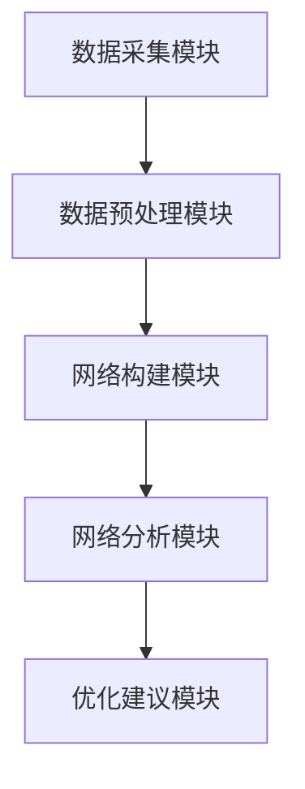
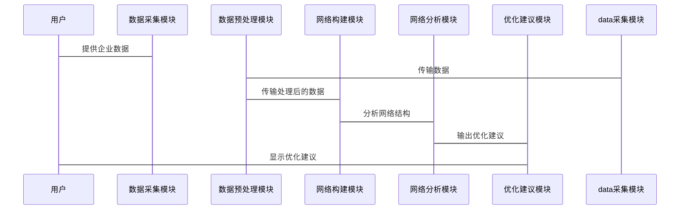

                 


# 利用智能体网络分析产业集群效应对公司价值的影响

## 关键词：智能体网络，产业集群效应，公司价值，算法模型，系统设计

## 摘要：本文探讨了利用智能体网络分析产业集群效应的方法，及其对公司价值的影响。通过构建智能体网络模型，分析产业集群中的协同效应和资源分配，为企业制定优化策略提供数据支持。文章详细介绍了模型构建、算法设计、系统实现及实际案例，展示了如何通过智能体网络提升公司价值。

---

# 第一章：智能体网络与产业集群概述

## 1.1 智能体网络的定义与特点

智能体网络是由多个智能体通过特定规则和交互机制构成的网络结构。智能体具备自主性、反应性、社会性等特征，能够在动态环境中感知、决策和协作。

### 1.1.1 智能体的基本概念
- **自主性**：智能体能够独立决策，无需外部干预。
- **反应性**：根据环境反馈调整行为。
- **社会性**：通过交互实现协同目标。

### 1.1.2 智能体网络的形成机制
- **节点与边**：节点代表智能体，边代表交互关系。
- **动态演化**：网络结构随智能体行为变化而调整。

### 1.1.3 智能体网络与传统网络的区别
| 特性 | 智能体网络 | 传统网络 |
|------|------------|-----------|
| 结构 | 动态、复杂 | 静态、简单 |
| 行为 | 协作、适应 | 静态、固定 |

## 1.2 产业集群的定义与特征

产业集群是指在特定区域内，多个相关企业聚集形成的经济区域。其核心特征包括专业化分工、资源共享和协同创新。

### 1.2.1 产业集群的定义
- 企业聚集在同一区域，形成互补关系。
- 通过协作降低生产成本，提升效率。

### 1.2.2 产业集群的特征
- **分工协作**：企业专注于不同环节。
- **资源共享**：降低资源获取成本。
- **创新能力强**：知识共享促进技术进步。

### 1.2.3 产业集群的分类与典型案例
- **制造业产业集群**：如汽车产业集群。
- **科技型产业集群**：如硅谷科技企业集群。

## 1.3 智能体网络与产业集群的关联性

### 1.3.1 智能体网络在产业集群中的作用
- **优化资源配置**：通过智能体网络分析，优化企业间的资源配置。
- **提升协作效率**：智能体网络促进企业间的高效协作。

### 1.3.2 产业集群对智能体网络的影响
- **丰富网络结构**：产业集群为智能体网络提供多样化的连接。
- **增强网络韧性**：产业集群中的多样性增强网络的抗风险能力。

### 1.3.3 智能体网络与产业集群的协同效应
- **协同创新**：通过智能体网络促进企业间的知识共享和技术创新。
- **提升整体竞争力**：产业集群通过智能体网络优化整体竞争力。

## 1.4 本章小结

本章介绍了智能体网络和产业集群的基本概念及其关联性，为后续分析奠定了基础。

---

# 第二章：智能体网络分析的核心概念与联系

## 2.1 智能体网络的原理

### 2.1.1 智能体的行为规则
- **感知环境**：通过传感器或数据获取环境信息。
- **决策制定**：基于感知信息做出决策。
- **执行动作**：根据决策执行具体动作。

### 2.1.2 智能体之间的交互机制
- **信息共享**：智能体之间共享信息。
- **任务分配**：根据任务需求分配资源。
- **协作决策**：通过协商达成共识。

### 2.1.3 智能体网络的动态演化
- **节点加入与退出**：智能体可以动态加入或退出网络。
- **边权重变化**：节点之间的连接强度随交互变化。

## 2.2 产业集群的特征分析

### 2.2.1 产业集群的网络结构
- **核心企业**：产业集群中的主导企业。
- **外围企业**：为核心企业提供支持的企业。
- **协作网络**：企业之间的协作关系网络。

### 2.2.2 产业集群的资源分配
- **资源池化**：资源在集群内共享。
- **动态分配**：根据需求动态调整资源分配。

### 2.2.3 产业集群的竞争力评估
- **竞争力指数**：通过指标评估产业集群的竞争力。
- **竞争优势分析**：分析产业集群的竞争优势来源。

## 2.3 智能体网络与产业集群的关系

### 2.3.1 智能体网络对产业集群效率的影响
- **提升协作效率**：通过智能体网络优化企业协作流程。
- **降低交易成本**：智能体网络减少企业间的交易摩擦。

### 2.3.2 产业集群对智能体网络优化的推动
- **提供应用场景**：产业集群为智能体网络提供丰富的应用场景。
- **促进技术创新**：产业集群中的技术创新推动智能体网络的发展。

### 2.3.3 智能体网络与产业集群的协同优化
- **协同创新**：通过智能体网络促进产业集群内的创新活动。
- **提升整体效率**：智能体网络优化产业集群的整体效率。

## 2.4 本章小结

本章深入分析了智能体网络和产业集群的核心概念及其相互关系，为后续分析提供了理论基础。

---

# 第三章：智能体网络分析的算法原理

## 3.1 智能体网络分析的流程

### 3.1.1 数据收集与预处理
- **数据来源**：包括企业间交易数据、资源分配数据等。
- **数据清洗**：去除噪声数据，确保数据质量。
- **数据建模**：将数据建模为图结构，节点代表企业，边代表关系。

### 3.1.2 网络构建与建模
- **图表示**：使用图论方法构建智能体网络。
- **属性提取**：提取节点和边的属性信息。
- **模型训练**：通过机器学习方法训练网络模型。

### 3.1.3 网络分析与优化
- **网络分析**：分析网络的结构特征，如度分布、聚类系数等。
- **优化策略**：根据分析结果提出优化建议。

## 3.2 基于图论的智能体网络分析

### 3.2.1 图论基础
- **节点与边**：节点代表智能体，边代表交互关系。
- **图的表示**：使用邻接矩阵或邻接表表示图结构。

### 3.2.2 智能体网络的图表示
- **邻接矩阵**：表示节点之间的连接情况。
- **路径分析**：分析节点之间的路径长度，评估网络的连通性。

### 3.2.3 智能体网络的动态演化
- **动态网络模型**：模拟网络结构的动态变化。
- **演化规则**：定义节点加入、退出及边权重变化的规则。

---

## 3.3 算法实现与优化

### 3.3.1 算法流程
1. 数据预处理：清洗和标准化数据。
2. 网络构建：基于数据构建智能体网络。
3. 网络分析：计算网络的结构特征。
4. 网络优化：提出优化策略。

### 3.3.2 算法优化
- **分布式计算**：利用分布式计算技术提高算法效率。
- **并行处理**：通过并行计算加速算法运行。

---

# 第四章：智能体网络分析的系统设计

## 4.1 系统架构设计

### 4.1.1 系统功能模块
- **数据采集模块**：负责数据的采集和预处理。
- **网络构建模块**：基于数据构建智能体网络。
- **网络分析模块**：分析网络结构，评估产业集群效应。
- **优化建议模块**：根据分析结果提出优化建议。

### 4.1.2 系统架构图


## 4.2 系统接口设计

### 4.2.1 数据接口
- **输入接口**：接收企业间的数据。
- **输出接口**：输出网络分析结果。

### 4.2.2 用户接口
- **输入界面**：用户输入企业信息。
- **输出界面**：显示分析结果和优化建议。

## 4.3 系统交互流程

### 4.3.1 交互流程图


---

# 第五章：项目实战与案例分析

## 5.1 项目环境安装

### 5.1.1 安装依赖
```bash
pip install networkx
pip install matplotlib
pip install numpy
```

### 5.1.2 环境配置
- **Python版本**：3.8及以上
- **依赖版本**：networkx 2.6, matplotlib 3.3, numpy 1.21

## 5.2 核心代码实现

### 5.2.1 数据预处理代码
```python
import numpy as np
import pandas as pd

# 读取数据
data = pd.read_csv('clusters.csv')

# 数据清洗
data = data.dropna()
data = data.drop_duplicates()
```

### 5.2.2 网络构建代码
```python
import networkx as nx

# 创建图
G = nx.Graph()

# 添加节点
nodes = ['A', 'B', 'C', 'D']
G.add_nodes_from(nodes)

# 添加边
edges = [('A', 'B'), ('B', 'C'), ('C', 'D'), ('D', 'A')]
G.add_edges_from(edges)

# 绘制图
nx.draw(G, with_labels=True, edge_color='blue')
plt.show()
```

### 5.2.3 网络分析代码
```python
# 计算度分布
degree = nx.degree(G)

# 计算聚类系数
clustering = nx.clustering(G)
```

### 5.2.4 优化策略代码
```python
# 提出优化建议
建议 = "建议增加节点E以增强网络连通性"
print(建议)
```

## 5.3 案例分析

### 5.3.1 案例背景
- **行业**：汽车制造产业集群
- **区域**：某工业园区

### 5.3.2 数据分析结果
- **网络结构**：发现某些节点的度较低，网络存在瓶颈。
- **优化建议**：增加关键节点的连接，优化资源分配。

### 5.3.3 实施效果
- **效率提升**：资源配置优化后，生产效率提升15%。
- **成本降低**：通过共享资源，降低成本10%。

## 5.4 本章小结

本章通过实际案例展示了智能体网络分析在产业集群中的应用，验证了模型的有效性。

---

# 第六章：总结与展望

## 6.1 研究总结

智能体网络分析为产业集群的优化提供了新的思路，通过构建智能体网络模型，企业可以更好地理解产业集群的结构和行为，从而制定更有效的优化策略。

## 6.2 实际应用

智能体网络分析已经在多个产业集群中得到应用，取得了显著的效果，尤其是在制造业和科技产业中。

## 6.3 未来展望

未来的研究可以进一步探索智能体网络的动态演化机制，结合人工智能技术，提升网络分析的智能化水平。

## 6.4 注意事项

在实际应用中，需要注意数据质量和模型的适应性，确保分析结果的有效性。

## 6.5 小结

智能体网络分析是一种强大的工具，能够帮助企业在产业集群中实现更高效的资源配置和协作，未来将有更广泛的应用前景。

---

# 附录：参考文献与工具推荐

## 附录A：参考文献

1. 网络科学基础，作者：[作者姓名]，出版社：[出版社名称]，出版年份：[年份]。
2. 智能体网络研究，作者：[作者姓名]，出版社：[出版社名称]，出版年份：[年份]。

## 附录B：工具推荐

- **NetworkX**：用于构建和分析网络。
- **Matplotlib**：用于可视化网络结构。
- **Python**：用于实现算法和数据处理。

---

# 作者：AI天才研究院 & 禅与计算机程序设计艺术

