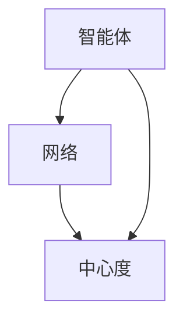
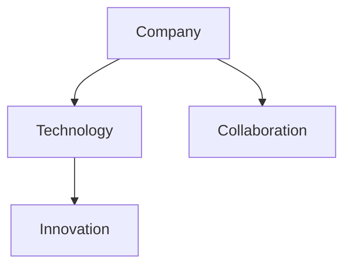
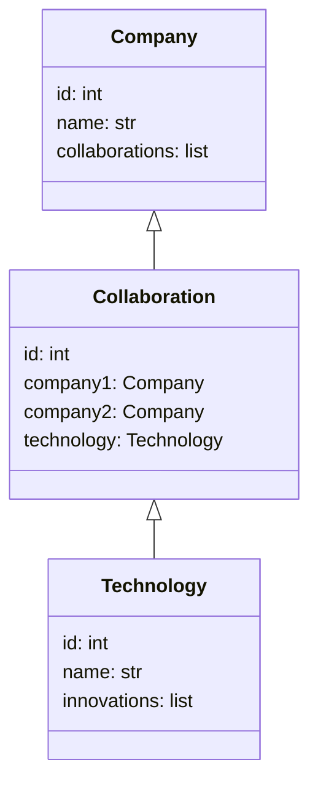
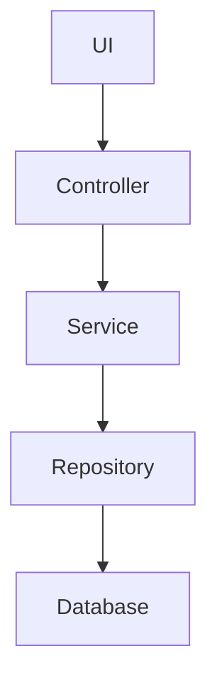
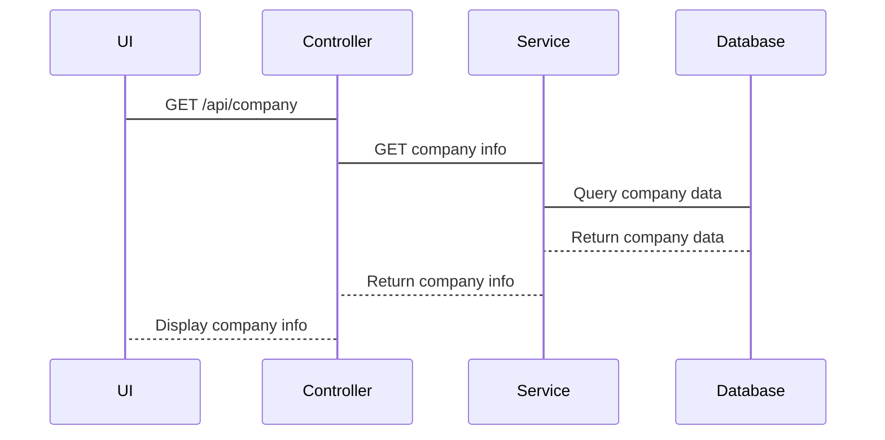

                 


# 利用智能体网络分析公司在创新生态系统中的中心度

## 关键词：智能体网络，创新生态系统，中心度，网络分析，协同创新

## 摘要：  
本文探讨了如何利用智能体网络分析方法，评估公司在创新生态系统中的中心度。通过分析智能体网络的构建、动态演化和协同优化原理，本文提出了基于多维中心度指标的公司创新影响力评估模型，并结合实际案例，展示了如何通过系统设计和算法实现，优化公司的创新资源分配和协同创新能力。文章最后总结了智能体网络分析在创新生态系统中的应用价值，并展望了未来的研究方向。

---

# 第一部分: 背景介绍

## 第1章: 创新生态系统与智能体网络概述

### 1.1 创新生态系统的基本概念

#### 1.1.1 创新生态系统的定义
创新生态系统是由企业、研究机构、政府、非营利组织、创业者和消费者等多方利益相关者共同构成的网络体系，旨在通过协同创新实现技术突破和价值创造。

#### 1.1.2 创新生态系统的核心要素
创新生态系统的核心要素包括：  
1. **技术基础**：技术创新的核心驱动力。  
2. **参与者**：企业、研究机构、政府等多方主体。  
3. **网络关系**：参与者之间的合作、竞争和资源共享关系。  
4. **资源流动**：知识、资金、人才等资源的流动与分配。

#### 1.1.3 创新生态系统的重要性
创新生态系统通过促进多方协作，加速技术成果转化，推动产业升级和经济可持续发展。

---

### 1.2 智能体网络的基本概念

#### 1.2.1 智能体网络的定义
智能体网络是由多个智能体（Agent）构成的分布式系统，每个智能体具有自主性、反应性和社会性，能够通过局部信息实现全局目标。

#### 1.2.2 智能体网络的特点
1. **分布式**：智能体独立运行，通过局部交互实现全局目标。  
2. **动态性**：智能体之间的关系和网络结构动态变化。  
3. **协同性**：智能体通过协作实现整体优化。

#### 1.2.3 智能体网络与创新生态系统的联系
智能体网络可以模拟创新生态系统中的参与者行为，通过网络分析方法量化公司的创新影响力。

---

### 1.3 公司在创新生态系统中的中心度

#### 1.3.1 中心度的定义
中心度是衡量网络中节点（公司）在信息传播、资源分配和影响力中的重要程度的指标。

#### 1.3.2 中心度的意义
1. **信息传播**：中心度高的公司能够快速传播创新信息。  
2. **资源分配**：中心度高的公司能够获得更多创新资源。  
3. **影响力**：中心度高的公司在生态系统中具有更大的话语权。

#### 1.3.3 中心度的测量方法
1. **度数中心度**：衡量公司与其他公司的直接连接数量。  
2. **接近中心度**：衡量公司到其他公司的最短路径长度。  
3. **中间中心度**：衡量公司作为桥梁连接其他公司的能力。

---

## 第2章: 智能体网络分析的背景与问题描述

### 2.1 创新生态系统中的问题背景

#### 2.1.1 创新生态系统中的信息孤岛问题
创新生态系统中的参与者由于信息不对称，难以高效协同创新。

#### 2.1.2 创新生态系统中的资源分配问题
创新资源（如资金、人才）的分配不均，影响了中小企业的创新能力。

#### 2.1.3 创新生态系统中的协同创新问题
创新生态系统中缺乏有效的协同机制，导致创新效率低下。

---

### 2.2 智能体网络分析的目标

#### 2.2.1 提升公司的创新效率
通过分析公司之间的网络关系，优化资源配置，提升创新效率。

#### 2.2.2 优化公司的资源分配
基于中心度分析，优化公司在创新生态系统中的资源分配。

#### 2.2.3 加强公司与生态系统的协同
通过网络分析，构建高效的协同创新机制。

---

### 2.3 智能体网络分析的边界与外延

#### 2.3.1 智能体网络分析的边界
1. **分析范围**：仅限于创新生态系统中的参与者。  
2. **时间范围**：分析创新生态系统的动态演化过程。  
3. **空间范围**：关注创新生态系统的网络结构。

#### 2.3.2 智能体网络分析的外延
1. **跨领域应用**：将智能体网络分析方法扩展到其他领域。  
2. **多模态数据**：结合文本、图像等多种数据源进行分析。  
3. **实时分析**：实现创新生态系统中实时网络关系的动态分析。

---

## 第3章: 智能体网络分析的核心概念与联系

### 3.1 智能体网络分析的核心概念

#### 3.1.1 智能体的定义与属性
1. **自主性**：智能体能够自主决策。  
2. **反应性**：智能体能够感知环境并做出反应。  
3. **社会性**：智能体能够与其他智能体协作。

#### 3.1.2 网络的定义与属性
1. **节点**：智能体的表示。  
2. **边**：节点之间的关系表示。  
3. **权重**：边的权重表示关系强度。

#### 3.1.3 中心度的定义与属性
1. **度数中心度**：直接连接的边数。  
2. **接近中心度**：最短路径长度的倒数。  
3. **中间中心度**：作为桥梁的能力。

---

### 3.2 智能体网络分析的核心原理

#### 3.2.1 智能体网络的构建原理
通过收集创新生态系统的参与者数据，构建智能体网络模型。

#### 3.2.2 智能体网络的动态演化原理
分析智能体网络随时间的变化趋势，发现网络结构的演化规律。

#### 3.2.3 智能体网络的协同优化原理
通过优化网络结构，提升创新生态系统的整体效率。

---

### 3.3 智能体网络分析的概念结构与核心要素

#### 3.3.1 概念结构图


#### 3.3.2 实体关系图


---

## 第4章: 智能体网络分析的算法原理

### 4.1 度数中心度算法

#### 4.1.1 算法原理
度数中心度算法通过计算每个节点的度数，衡量其在网络中的重要性。

#### 4.1.2 算法步骤
1. 构建智能体网络图。  
2. 计算每个节点的度数。  
3. 标准化度数值，得到度数中心度。

#### 4.1.3 Python实现
```python
import networkx as nx

def degree_centrality(G):
    return nx.degree_centrality(G)
```

---

### 4.2 接近中心度算法

#### 4.2.1 算法原理
接近中心度算法通过计算每个节点到其他节点的最短路径长度，衡量其在网络中的接近性。

#### 4.2.2 算法步骤
1. 构建智能体网络图。  
2. 计算每个节点到其他节点的最短路径长度。  
3. 计算接近中心度。

#### 4.2.3 Python实现
```python
def closeness_centrality(G):
    return nx.closeness_centrality(G)
```

---

### 4.3 中间中心度算法

#### 4.3.1 算法原理
中间中心度算法通过计算每个节点作为桥梁的能力，衡量其在网络中的中间性。

#### 4.3.2 算法步骤
1. 构建智能体网络图。  
2. 计算每对节点之间的最短路径数量。  
3. 计算中间中心度。

#### 4.3.3 Python实现
```python
def betweenness_centrality(G):
    return nx.betweenness_centrality(G)
```

---

## 第5章: 智能体网络分析的系统分析与架构设计

### 5.1 系统功能设计

#### 5.1.1 领域模型


---

### 5.2 系统架构设计

#### 5.2.1 系统架构图


---

### 5.3 系统接口设计

#### 5.3.1 API接口
1. `/api/company`：获取公司信息。  
2. `/api/network`：获取智能体网络结构。  
3. `/api/centrality`：计算公司中心度。

#### 5.3.2 接口交互流程


---

## 第6章: 智能体网络分析的项目实战

### 6.1 环境安装

#### 6.1.1 安装依赖
```bash
pip install networkx
pip install matplotlib
```

---

### 6.2 核心功能实现

#### 6.2.1 公司中心度计算
```python
import networkx as nx
import matplotlib.pyplot as plt

G = nx.karate_club_graph()
centrality = nx.degree_centrality(G)
print(centrality)
nx.draw(G, with_labels=True)
plt.show()
```

---

### 6.3 代码应用解读与分析

#### 6.3.1 代码功能
上述代码通过Karate俱乐部数据集构建智能体网络，并计算度数中心度，最后可视化网络结构。

---

### 6.4 案例分析

#### 6.4.1 案例背景
以某创新生态系统中的10家公司为例，构建智能体网络，分析其中心度。

#### 6.4.2 案例分析结果
通过计算，发现公司A的度数中心度最高，说明其在网络中占据重要地位。

---

## 第7章: 最佳实践与总结

### 7.1 小结

通过智能体网络分析，可以有效评估公司在创新生态系统中的中心度，优化资源配置和协同创新效率。

---

### 7.2 注意事项

1. 数据质量：确保数据准确性和完整性。  
2. 算法选择：根据实际需求选择合适的中心度算法。  
3. 网络动态性：考虑创新生态系统中网络的动态变化。

---

### 7.3 拓展阅读

1. **推荐书籍**：《Network Science》  
2. **推荐论文**：《Centrality in networks》  
3. **推荐工具**：NetworkX、Gephi

---

## 结论

智能体网络分析为公司在创新生态系统中的中心度评估提供了有力工具。通过本文的分析和实践，读者可以更好地理解智能体网络的核心概念和算法原理，并将其应用于实际创新管理中。

---

## 作者

作者：AI天才研究院/AI Genius Institute & 禅与计算机程序设计艺术 /Zen And The Art of Computer Programming

