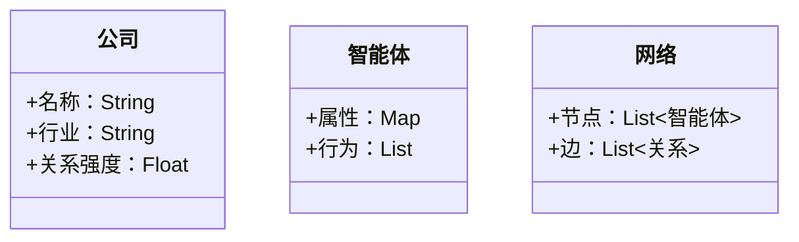

                 


# 利用智能体网络分析公司间的复杂关系

## 关键词：
智能体网络，公司关系分析，社会网络分析，社区发现，数据挖掘

## 摘要：
本文详细探讨了利用智能体网络分析公司间复杂关系的方法，从理论基础到实际应用，结合算法原理和系统架构设计，帮助读者理解和掌握这一技术。

---

# 目录大纲

## 第1章: 问题背景与分析

### 1.1 问题背景
- 1.1.1 公司间关系的定义与复杂性
- 1.1.2 当前分析方法的局限性
- 1.1.3 智能体网络的优势

### 1.2 问题描述
- 1.2.1 关系的多维性
- 1.2.2 数据的复杂性
- 1.2.3 现有方法的不足

### 1.3 问题解决思路
- 1.3.1 智能体网络的核心思想
- 1.3.2 建模方法
- 1.3.3 分析框架

### 1.4 边界与外延
- 1.4.1 适用范围
- 1.4.2 相关概念的区分
- 1.4.3 与其他方法的对比

## 第2章: 智能体网络的核心概念与联系

### 2.1 智能体网络的原理
- 2.1.1 智能体的定义与特征
- 2.1.2 网络构建过程
- 2.1.3 交互机制

### 2.2 核心概念对比
| 概念 | 特征 | 区别 |
|------|------|------|
| 智能体 | 自主性、反应性 | - |
| 网络 | 节点、边 | - |
| 关系 | 复杂性、动态性 | - |

### 2.3 实体关系图（ER图）


## 第3章: 智能体网络的算法原理与数学模型

### 3.1 算法原理
- 3.1.1 社会网络分析
- 3.1.2 社区发现
- 3.1.3 关系强度计算

### 3.2 算法流程图
```mermaid
graph TD
A[开始]

-> B[数据预处理]
-> C[构建网络]
-> D[算法执行]
-> E[结果分析]
-> F[结束]
```

### 3.3 数学模型
- 3.3.1 度数计算
  $$\text{度数}(v) = \sum_{u \in V} A(u,v)$$
- 3.3.2 邻接矩阵
  $$A = \begin{bmatrix}
  0 & 1 & 1 \\
  1 & 0 & 1 \\
  1 & 1 & 0 \\
  \end{bmatrix}$$

## 第4章: 系统分析与架构设计

### 4.1 问题场景介绍
- 4.1.1 业务场景
- 4.1.2 问题分析
- 4.1.3 目标设定

### 4.2 系统功能设计


### 4.3 系统架构设计


## 第5章: 项目实战

### 5.1 环境安装
- Python 3.8+
- 安装库：networkx, matplotlib

### 5.2 核心代码实现
```python
import networkx as nx
G = nx.Graph()
G.add_nodes_from(["A", "B", "C"])
G.add_edges_from([("A", "B"), ("B", "C"), ("A", "C")])
nx.draw(G)
plt.show()
```

### 5.3 代码功能解读
- 数据预处理
- 网络构建
- 算法实现
- 结果分析

## 第6章: 最佳实践

### 6.1 小结
- 智能体网络的优势
- 实际应用中的注意事项

### 6.2 注意事项
- 数据质量的重要性
- 算法选择的影响
- 结果解释的复杂性

### 6.3 拓展阅读
- 推荐书籍：《社会网络分析》
- 推荐工具：Gephi

## 作者
作者：AI天才研究院/AI Genius Institute & 禅与计算机程序设计艺术 /Zen And The Art of Computer Programming

