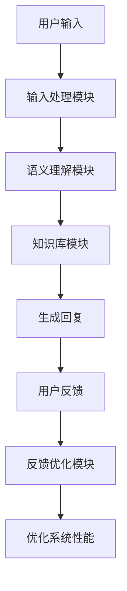
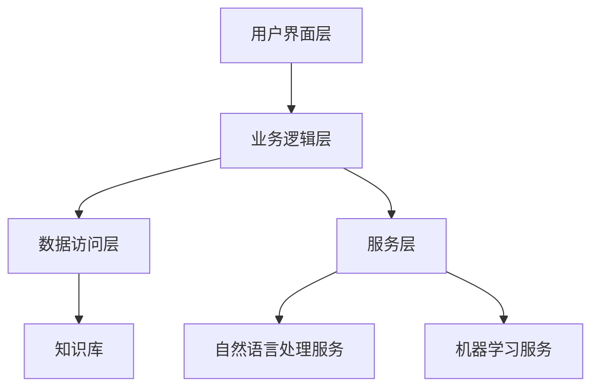
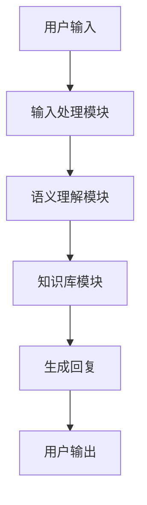

                 


# 利用智能助手提升客户忠诚度的策略

## 关键词：
智能助手、客户忠诚度、人工智能、客户体验、自然语言处理、机器学习

## 摘要：
本文探讨了如何利用智能助手技术来提升客户忠诚度。通过分析智能助手的核心原理、客户忠诚度的影响因素，以及智能助手在客户关系管理中的具体应用，本文提出了一个系统的解决方案。从自然语言处理和机器学习的角度，详细讲解了智能助手如何通过提供个性化服务、高效问题解决和24/7支持来增强客户体验，从而提升客户忠诚度。同时，本文还提供了实际的项目案例和最佳实践，帮助读者更好地理解和应用这些策略。

---

# 第1章: 智能助手与客户忠诚度的背景介绍

## 1.1 智能助手的基本概念

### 1.1.1 智能助手的定义
智能助手是一种基于人工智能技术的工具，能够通过自然语言处理（NLP）和机器学习（ML）算法，理解和响应用户的输入。智能助手可以以语音助手（如Siri、Alexa）或聊天机器人（如微信机器人）的形式出现，广泛应用于商业、教育、医疗等多个领域。

### 1.1.2 智能助手的核心功能
智能助手的核心功能包括：
- **语音识别与合成**：通过语音输入和输出与用户交互。
- **自然语言理解（NLU）**：理解用户意图，解析语义。
- **对话管理**：根据上下文维护对话流程，确保连贯性。
- **知识库管理**：存储和检索相关知识，提供准确的信息。
- **学习与优化**：通过反馈机制不断优化用户体验。

### 1.1.3 智能助手的应用场景
智能助手的应用场景广泛，包括：
- **客户服务**：提供24/7的客户支持，解答常见问题。
- **销售辅助**：帮助客户完成购买决策，推荐相关产品。
- **信息查询**：快速检索数据，提供实时信息。
- **任务执行**：自动化处理用户的请求，如日程安排、天气查询等。

## 1.2 客户忠诚度的定义与重要性

### 1.2.1 客户忠诚度的定义
客户忠诚度是指客户对某一品牌或产品长期的偏好和持续购买行为。忠诚的客户不仅会重复购买，还会推荐给他人，成为品牌的重要拥护者。

### 1.2.2 客户忠诚度对企业的影响
- **提高收入**：忠诚客户通常购买频率高，贡献更多收入。
- **降低营销成本**：忠诚客户不需要频繁的广告投放，营销成本降低。
- **增强品牌声誉**：忠诚客户通常是品牌的忠实拥护者，有助于提升品牌形象。

### 1.2.3 提升客户忠诚度的策略
- **提供个性化服务**：根据客户需求定制服务，增强客户满意度。
- **建立信任关系**：通过优质服务和透明沟通，赢得客户信任。
- **持续优化产品**：根据客户反馈不断改进产品，满足客户需求。

## 1.3 智能助手在客户忠诚度中的作用

### 1.3.1 智能助手如何提升客户体验
- **实时响应**：智能助手能够快速响应用户需求，提供即时帮助。
- **个性化服务**：通过分析用户行为和偏好，提供个性化的建议和推荐。
- **简化流程**：智能助手可以自动化处理复杂的流程，减少用户的时间成本。

### 1.3.2 智能助手如何增强客户关系
- **建立长期互动**：通过持续的对话和互动，增强客户与品牌之间的情感联系。
- **提供价值**：智能助手通过提供有价值的信息和服务，增加客户对品牌的依赖感。
- **收集反馈**：智能助手可以收集客户的反馈，帮助企业不断优化产品和服务。

### 1.3.3 智能助手在客户忠诚度管理中的应用
- **客户分层**：通过分析客户行为数据，将客户分为不同层次，提供针对性的服务。
- **定制化推荐**：基于客户的喜好和历史行为，推荐相关产品或服务，提高客户满意度。
- **忠诚度计划**：通过积分、优惠券等形式，激励客户持续使用和购买。

## 1.4 本章小结
本章介绍了智能助手的基本概念、客户忠诚度的定义及其重要性，以及智能助手在提升客户忠诚度中的作用。通过智能助手的技术优势，企业可以显著提升客户体验，增强客户关系，从而提高客户忠诚度。

---

# 第2章: 客户忠诚度的影响因素

## 2.1 客户满意度与忠诚度的关系

### 2.1.1 客户满意度的定义
客户满意度是指客户对产品或服务的实际体验与期望值之间的差距。高满意度通常意味着客户对产品或服务感到满意或非常满意。

### 2.1.2 客户满意度与忠诚度的关联
客户满意度是客户忠诚度的重要影响因素。高满意度的客户更有可能成为忠诚客户，而低满意度的客户则可能转向竞争对手。

### 2.1.3 提高客户满意度的方法
- **优化产品质量**：确保产品或服务符合客户需求和期望。
- **提升服务质量**：提供专业、高效的服务，解决客户问题。
- **建立有效的反馈机制**：及时收集和处理客户反馈，不断优化产品和服务。

## 2.2 客户体验与忠诚度的关联

### 2.2.1 客户体验的定义
客户体验是指客户在与企业互动过程中所经历的所有体验的总和，包括视觉、听觉、触觉等多方面的感受。

### 2.2.2 客户体验对忠诚度的影响
- **积极体验**：正面的客户体验会增强客户对品牌的信任和好感，提高忠诚度。
- **负面体验**：负面的客户体验会导致客户流失，降低忠诚度。

### 2.2.3 提升客户体验的策略
- **个性化服务**：根据客户需求提供定制化服务，增强客户体验。
- **简化流程**：优化客户互动流程，减少客户的等待时间和复杂度。
- **建立情感联系**：通过情感化的互动，增强客户与品牌之间的情感纽带。

## 2.3 客户价值与忠诚度的联系

### 2.3.1 客户价值的定义
客户价值是指客户从企业获得的产品或服务中所感知到的价值，包括功能性价值、情感价值和社交价值。

### 2.3.2 客户价值对忠诚度的影响
- **高价值客户**：提供高价值的客户通常对品牌有更高的忠诚度。
- **低价值客户**：低价值客户可能因为缺乏价值而转向竞争对手。

### 2.3.3 提升客户价值的方法
- **提供独特价值**：通过创新的产品或服务，为客户创造独特价值。
- **增强品牌认知**：通过有效的品牌推广和营销，提高品牌知名度和美誉度。
- **建立客户忠诚计划**：通过积分、优惠券等形式，增强客户的忠诚度。

## 2.4 本章小结
本章分析了客户忠诚度的影响因素，包括客户满意度、客户体验和客户价值。通过提升这些方面的表现，企业可以有效提高客户忠诚度，从而实现长期的客户关系管理。

---

# 第3章: 智能助手的核心原理

## 3.1 自然语言处理技术

### 3.1.1 自然语言处理的定义
自然语言处理（NLP）是人工智能的一个分支，旨在使计算机能够理解和生成人类语言。NLP技术包括词性标注、句法分析、语义理解等多个方面。

### 3.1.2 自然语言处理的核心技术
- **分词**：将连续的文本分割成单词或短语。
- **实体识别**：识别文本中的命名实体，如人名、地名、组织名等。
- **句法分析**：分析句子的语法结构，确定句子中的主语、谓语等成分。
- **语义理解**：理解文本的语义含义，提取关键信息。

### 3.1.3 自然语言处理在智能助手中的应用
智能助手通过NLP技术，能够理解用户的输入，准确识别用户意图，并生成相应的回复。例如，当用户说“今天天气怎么样”，智能助手会通过NLP技术解析用户的意图，检索天气数据，并生成相应的回复。

## 3.2 机器学习与深度学习

### 3.2.1 机器学习的定义
机器学习（ML）是一种人工智能技术，通过数据训练模型，使其能够从数据中学习规律，并用于预测或分类。

### 3.2.2 深度学习的定义
深度学习（DL）是一种基于人工神经网络的机器学习技术，通过多层神经网络结构，能够提取数据中的高层次特征。

### 3.2.3 机器学习与深度学习在智能助手中的应用
- **意图识别**：通过机器学习模型，识别用户的意图，准确理解用户需求。
- **情感分析**：通过深度学习模型，分析用户情感，提供相应的反馈。
- **对话生成**：通过机器学习模型，生成自然流畅的对话回复。

## 3.3 智能助手的核心算法

### 3.3.1 基于规则的算法
基于规则的算法通过预设的规则和关键词匹配，生成相应的回复。这种方法简单易懂，适用于简单的场景，但难以处理复杂的语义问题。

### 3.3.2 基于统计的算法
基于统计的算法通过分析大量的训练数据，提取数据中的统计规律，生成相应的回复。这种方法能够处理更复杂的语义问题，但需要大量的训练数据。

### 3.3.3 基于深度学习的算法
基于深度学习的算法通过多层神经网络结构，能够提取数据中的高层次特征，生成更准确和流畅的回复。这种方法在处理复杂语义问题时表现尤为突出。

## 3.4 智能助手的优缺点分析

### 3.4.1 智能助手的优点
- **高效性**：智能助手能够快速响应用户需求，节省时间和成本。
- **一致性**：智能助手能够保持一致的服务质量，避免人为错误。
- **可扩展性**：智能助手可以通过不断优化算法和增加训练数据，提升服务质量和范围。

### 3.4.2 智能助手的缺点
- **技术局限性**：智能助手在处理复杂语义和上下文理解方面仍有局限。
- **用户体验**：智能助手的回复可能缺乏人性化，难以完全替代真人服务。
- **数据隐私**：智能助手需要收集和处理大量用户数据，存在数据隐私风险。

### 3.4.3 智能助手的改进方向
- **优化算法**：通过改进算法，提升智能助手的语义理解和对话生成能力。
- **增强人性化**：通过引入情感计算和多模态交互，提升用户体验。
- **加强数据隐私保护**：通过加密和匿名化处理，保护用户数据安全。

## 3.5 本章小结
本章详细介绍了智能助手的核心原理，包括自然语言处理和机器学习技术。通过分析智能助手的核心算法及其优缺点，为后续章节的系统分析和项目实践奠定了基础。

---

# 第4章: 智能助手与客户忠诚度的关联

## 4.1 智能助手如何提升客户体验

### 4.1.1 提供24/7的客户支持
智能助手能够全天候为客户提供服务，无需人工干预，极大地提升了客户体验。

### 4.1.2 提供个性化的服务
智能助手通过分析用户的行为和偏好，提供个性化的服务，满足客户的多样化需求。

### 4.1.3 提供高效的解决方案
智能助手能够快速响应用户需求，提供高效的解决方案，减少客户的等待时间和精力成本。

## 4.2 智能助手如何增强客户关系

### 4.2.1 建立长期互动
智能助手通过持续的对话和互动，增强客户与品牌之间的情感联系。

### 4.2.2 提供价值
智能助手通过提供有价值的信息和服务，增加客户对品牌的依赖感和忠诚度。

### 4.2.3 收集反馈
智能助手可以收集客户的反馈，帮助企业不断优化产品和服务，提升客户满意度和忠诚度。

## 4.3 智能助手在客户忠诚度管理中的应用

### 4.3.1 客户分层
智能助手可以通过分析客户行为数据，将客户分为不同层次，提供针对性的服务。

### 4.3.2 定制化推荐
智能助手可以根据客户的喜好和历史行为，推荐相关产品或服务，提高客户满意度和忠诚度。

### 4.3.3 忠诚度计划
智能助手可以通过积分、优惠券等形式，激励客户持续使用和购买，增强客户的忠诚度。

## 4.4 本章小结
本章分析了智能助手如何通过提升客户体验和增强客户关系，来提高客户忠诚度。通过智能助手的技术优势，企业可以显著提升客户满意度，增强客户粘性，从而实现长期的客户关系管理。

---

# 第5章: 智能助手与客户忠诚度的系统分析与架构方案

## 5.1 系统功能设计

### 5.1.1 系统功能概述
智能助手系统需要具备以下核心功能：
- **用户交互**：支持语音和文本输入，与用户进行实时对话。
- **语义理解**：准确理解用户的意图，生成相应的回复。
- **知识库管理**：存储和检索相关知识，提供准确的信息。
- **学习与优化**：通过用户反馈不断优化系统性能。

### 5.1.2 功能模块设计
- **输入处理模块**：接收用户的输入，并进行预处理。
- **语义理解模块**：解析用户意图，生成相应的回复。
- **知识库模块**：存储和检索相关知识，提供准确的信息。
- **反馈优化模块**：收集用户反馈，优化系统性能。

### 5.1.3 功能流程图（Mermaid）


## 5.2 系统架构设计

### 5.2.1 系统架构概述
智能助手系统的架构包括以下几个层次：
- **用户界面层**：与用户进行交互，接收输入和显示输出。
- **业务逻辑层**：处理用户的请求，调用相应的服务。
- **数据访问层**：访问和管理知识库中的数据。
- **服务层**：提供各种服务，如自然语言处理、机器学习等。

### 5.2.2 系统架构图（Mermaid）


## 5.3 系统接口设计

### 5.3.1 接口概述
系统接口设计包括以下几个方面：
- **输入接口**：接收用户的输入，如语音或文本。
- **输出接口**：显示生成的回复，如文本或语音。
- **数据接口**：与知识库和其他服务进行数据交互。

### 5.3.2 接口协议
系统接口主要采用以下协议：
- **HTTP**：用于与外部服务进行数据交互。
- **WebSocket**：用于实时的双向通信。

## 5.4 系统交互设计

### 5.4.1 交互流程
系统交互流程包括以下几个步骤：
1. **用户输入**：用户通过输入设备发送请求。
2. **输入处理**：系统接收并解析用户的输入。
3. **语义理解**：系统通过自然语言处理技术理解用户的意图。
4. **知识检索**：系统从知识库中检索相关数据。
5. **生成回复**：系统根据检索结果生成回复。
6. **输出回复**：系统将回复返回给用户。

### 5.4.2 交互流程图（Mermaid）


## 5.5 本章小结
本章详细介绍了智能助手系统的功能设计、架构设计、接口设计和交互设计。通过系统化的分析和设计，为后续的项目实践奠定了坚实的基础。

---

# 第6章: 智能助手与客户忠诚度的项目实战

## 6.1 环境安装

### 6.1.1 环境要求
- **操作系统**：Windows、Linux或MacOS。
- **编程语言**：Python 3.6及以上版本。
- **框架与库**：需要安装自然语言处理库（如spaCy、NLTK）和机器学习库（如Scikit-learn、TensorFlow）。

### 6.1.2 安装步骤
1. **安装Python**：从官网下载并安装Python。
2. **安装依赖库**：使用pip命令安装所需的第三方库，如：
   ```bash
   pip install spacy
   pip install tensorflow
   ```

## 6.2 系统核心实现源代码

### 6.2.1 智能助手核心代码实现
以下是一个简单的智能助手核心代码示例：
```python
import spacy

# 加载自然语言处理模型
nlp = spacy.load("en_core_web_sm")

# 定义意图识别函数
def intent_recognition(text):
    doc = nlp(text)
    # 提取实体信息
    entities = [(ent.text, ent.label_) for ent in doc.ents]
    # 提取关键词
    keywords = [token.text for token in doc if token.pos_ in ['NOUN', 'VERB']]
    return entities, keywords

# 测试意图识别函数
text = "今天天气怎么样？"
entities, keywords = intent_recognition(text)
print("Entities:", entities)
print("Keywords:", keywords)
```

### 6.2.2 知识库管理代码实现
以下是一个简单的知识库管理代码示例：
```python
import sqlite3

# 连接到数据库
conn = sqlite3.connect("knowledge_base.db")

# 创建表
cursor = conn.cursor()
cursor.execute('''CREATE TABLE IF NOT EXISTS knowledge
                     (id INTEGER PRIMARY KEY AUTOINCREMENT,
                      question TEXT,
                      answer TEXT)''')

# 插入数据
cursor.execute("INSERT INTO knowledge(question, answer) VALUES('今天天气怎么样？', '晴')")

# 查询数据
cursor.execute("SELECT question, answer FROM knowledge")
rows = cursor.fetchall()
for row in rows:
    print("Question:", row[0])
    print("Answer:", row[1])

# 关闭数据库连接
conn.close()
```

## 6.3 代码应用解读与分析

### 6.3.1 意图识别代码解读
上述意图识别代码使用了spaCy库，加载了一个预训练的自然语言处理模型，能够提取文本中的实体和关键词。通过这些信息，系统可以准确理解用户的意图，并生成相应的回复。

### 6.3.2 知识库管理代码解读
上述知识库管理代码使用了SQLite数据库，创建了一个简单的知识库表，能够存储问题和答案。通过查询数据库，智能助手可以快速检索相关信息，并生成回复。

## 6.4 实际案例分析和详细讲解剖析

### 6.4.1 案例背景
假设我们正在开发一个智能客服系统，用于提升客户的忠诚度。客户通过智能助手提出问题，系统需要快速响应并提供准确的解决方案。

### 6.4.2 案例分析
1. **客户输入**：客户输入“我的订单什么时候能送达？”
2. **意图识别**：系统识别出客户的意图是查询订单状态。
3. **知识库检索**：系统从知识库中检索相关订单状态信息。
4. **生成回复**：系统根据检索结果生成回复：“您的订单预计将在3个工作日内送达。”
5. **用户反馈**：客户对回复表示满意，系统记录反馈并优化知识库。

### 6.4.3 案例总结
通过智能助手，客户能够快速获取订单状态信息，提升客户体验和满意度。同时，系统通过反馈机制不断优化知识库，提高服务质量和客户忠诚度。

## 6.5 本章小结
本章通过实际案例分析，详细讲解了智能助手在客户忠诚度管理中的具体应用。通过代码实现和案例分析，读者可以更好地理解和掌握智能助手的核心技术及其在提升客户忠诚度中的作用。

---

# 第7章: 总结与展望

## 7.1 本章总结
本文详细探讨了利用智能助手提升客户忠诚度的策略。通过分析智能助手的核心原理、客户忠诚度的影响因素，以及智能助手在客户关系管理中的具体应用，本文提出了一个系统的解决方案。智能助手通过提供个性化的服务、高效的问题解决和24/7的支持，显著提升了客户体验和满意度，从而增强了客户忠诚度。

## 7.2 未来展望
随着人工智能技术的不断发展，智能助手在提升客户忠诚度中的应用将更加广泛和深入。未来的研究方向包括：
- **多模态交互**：结合视觉、听觉等多种交互方式，提升用户体验。
- **情感计算**：通过情感分析和情感生成，增强客户与品牌之间的情感联系。
- **自适应学习**：通过自适应学习算法，不断提升智能助手的语义理解和对话生成能力。
- **隐私保护**：通过加密和匿名化处理，保护用户数据隐私，增强用户信任。

## 7.3 最佳实践 Tips
- **选择合适的智能助手技术**：根据企业需求和预算，选择适合的智能助手技术。
- **优化客户体验**：通过持续优化智能助手的算法和知识库，提升客户体验。
- **保护数据隐私**：在使用智能助手时，确保用户数据的安全和隐私。

## 7.4 本章小结
本章总结了全文的主要内容，并展望了智能助手技术未来的发展方向。通过不断优化智能助手的核心技术，企业可以更好地利用智能助手提升客户忠诚度，实现长期的客户关系管理。

---

# 作者：AI天才研究院/AI Genius Institute & 禅与计算机程序设计艺术 /Zen And The Art of Computer Programming
---

