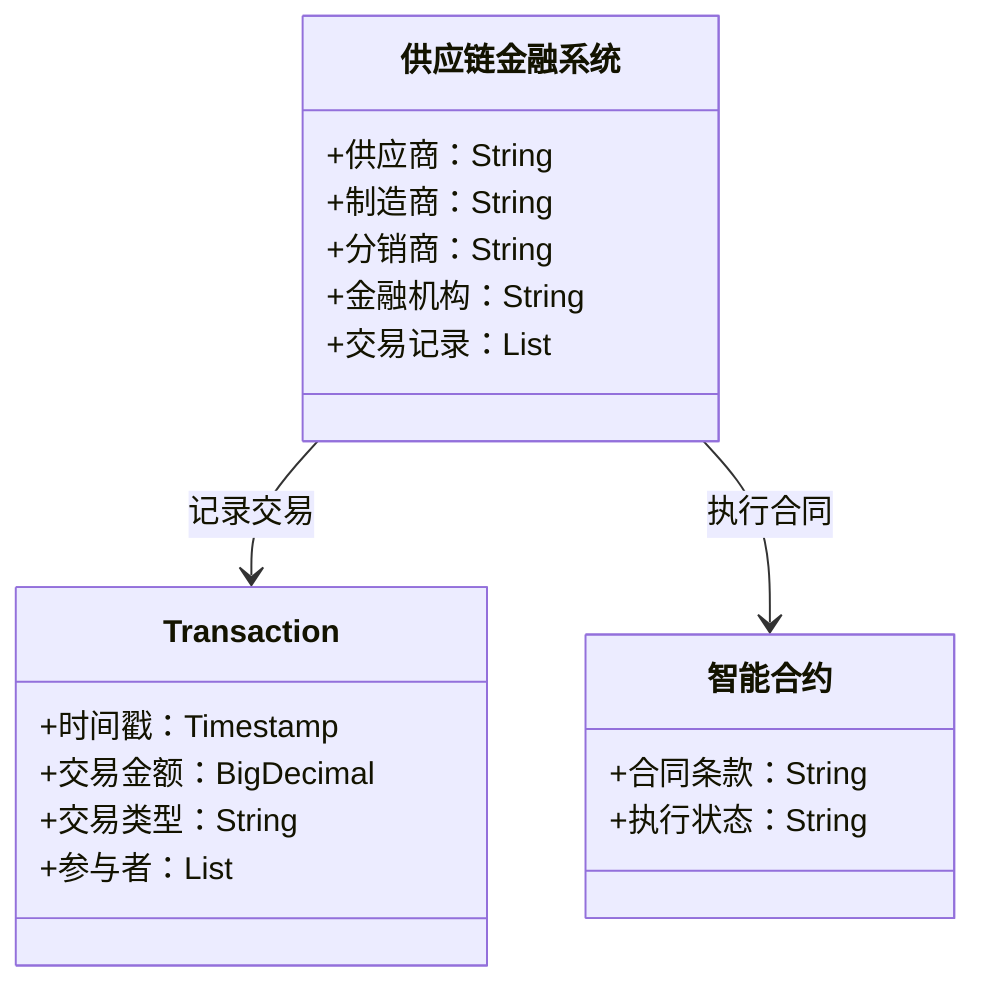
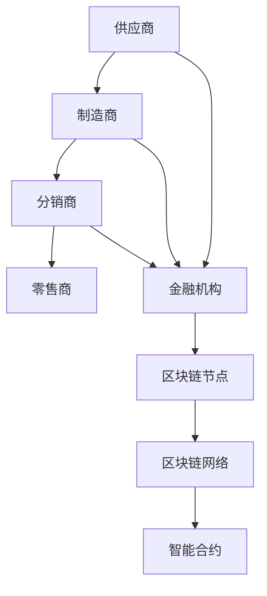
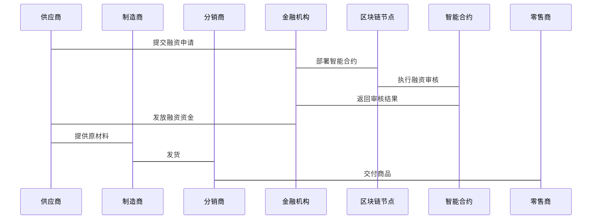

                 


```markdown
# 区块链在供应链金融中的应用与挑战

> 关键词：区块链，供应链金融，智能合约，数据共享，资金流动，可追溯性

> 摘要：本文深入探讨了区块链技术在供应链金融中的应用，分析了区块链如何解决供应链金融中的痛点，包括数据共享、资金流动和可追溯性。文章从核心概念、算法原理、系统架构设计到实际项目实现，全面解析了区块链在供应链金融中的技术细节和应用场景。最后，文章总结了当前的应用现状，并展望了未来的发展方向，提出了最佳实践的建议。

---

## 第1章: 供应链金融与区块链概述

### 1.1 供应链金融的定义与特点

供应链金融是指通过整合供应链上下游的企业，提供资金支持和风险管理服务，以优化供应链的整体运作效率。其特点包括：

- **跨企业协作**：涉及供应商、制造商、分销商和零售商等多个环节。
- **资金需求多样**：不同企业有不同的资金需求和信用状况。
- **风险分散**：通过供应链的整体管理，降低单点风险。

### 1.2 区块链技术的定义与特点

区块链是一种去中心化的分布式账本技术，具有以下特点：

- **去中心化**：通过分布式节点实现数据的分布式存储和管理。
- **不可篡改**：通过共识机制确保数据的一致性和不可篡改性。
- **透明性**：所有交易记录公开透明，但参与者身份可选择匿名。

### 1.3 区块链在供应链金融中的应用背景

供应链金融面临数据不透明、资金流动慢、信任缺失等问题。区块链通过提供透明、不可篡改的记录，解决了这些痛点，提高了供应链金融的效率和安全性。

---

## 第2章: 区块链与供应链金融的核心概念

### 2.1 区块链的核心概念

#### 2.1.1 区块链的基本组成

区块链由以下部分组成：
- **区块**：记录交易数据的容器。
- **链式结构**：区块按时间顺序连接成链。
- **分布式账本**：存储在多个节点上的账本副本。

#### 2.1.2 区块链的共识机制

共识机制确保所有节点对账本状态达成一致。常见的共识机制包括：
- **工作量证明（PoW）**：通过计算解决难题来验证交易。
- **权益证明（PoS）**：根据持币数量分配验证权。
- **实用拜占庭容错（PBFT）**：适用于高性能场景。

#### 2.1.3 区块链的智能合约

智能合约是区块链上的自动执行程序，用于自动执行合同条款。其特点包括：
- **自动执行**：无需人工干预。
- **透明可靠**：代码公开透明，执行结果可验证。

### 2.2 供应链金融的核心概念

#### 2.2.1 供应链金融的参与方

供应链金融涉及以下角色：
- **供应商**：提供原材料的企业。
- **制造商**：生产产品的核心企业。
- **分销商**：负责产品分销的企业。
- **零售商**：直接面对消费者的零售企业。
- **金融机构**：提供融资服务的银行或金融科技公司。

#### 2.2.2 供应链金融的流程

供应链金融的典型流程包括：
1. **订单生成**：零售商向制造商下单。
2. **融资申请**：供应商向金融机构申请融资。
3. **融资审核**：金融机构审核供应商的信用状况。
4. **资金发放**：金融机构发放融资资金。
5. **货物交付**：供应商向制造商交付货物。
6. **资金回收**：金融机构回收融资资金。

#### 2.2.3 供应链金融的风险点

供应链金融的主要风险包括：
- **信息不对称**：不同企业间信息不透明。
- **资金挪用**：融资资金可能被挪作他用。
- **信用风险**：企业信用状况不佳可能导致违约。

### 2.3 区块链与供应链金融的结合点

#### 2.3.1 数据共享与透明性

区块链通过分布式账本实现数据共享，确保供应链各参与方都能访问一致的交易记录。

#### 2.3.2 资金流动的透明性

区块链记录每笔资金的流动情况，确保资金流向可追踪，防止资金挪用。

#### 2.3.3 可追溯性与信任机制

区块链的不可篡改性确保供应链上的每笔交易可追溯，建立信任机制。

---

## 第3章: 区块链在供应链金融中的应用场景

### 3.1 供应链金融中的数据共享

#### 3.1.1 数据共享的挑战

传统供应链金融中，数据共享面临以下问题：
- **信息孤岛**：各企业间数据孤立，无法共享。
- **信任缺失**：企业间缺乏信任，不愿共享数据。
- **数据隐私**：共享数据可能涉及企业机密。

#### 3.1.2 区块链如何实现数据共享

区块链通过以下方式实现数据共享：
- **分布式账本**：数据存储在多个节点，确保数据一致性。
- **权限控制**：通过智能合约实现数据访问权限控制。
- **数据加密**：数据在传输和存储过程中加密，确保数据安全。

#### 3.1.3 数据共享的案例分析

以汽车制造行业为例，区块链可以实现零部件供应商、制造商、分销商之间的数据共享，确保每笔交易记录透明可追溯。

### 3.2 供应链金融中的资金流动

#### 3.2.1 资金流动的透明性

区块链记录每笔资金的流动情况，确保资金流向可追踪。

#### 3.2.2 区块链如何实现资金透明

通过智能合约自动执行融资流程，确保资金按照合同条款流动。

#### 3.2.3 资金流动的案例分析

例如，某供应商向银行申请融资，智能合约自动审核并发放资金，整个过程记录在区块链上，确保透明和可追溯。

### 3.3 供应链金融中的可追溯性

#### 3.3.1 可追溯性的挑战

传统供应链中，可追溯性低，难以追查问题来源。

#### 3.3.2 区块链如何实现可追溯性

区块链记录每笔交易的时间戳和交易哈希，确保每笔交易可追溯。

#### 3.3.3 可追溯性的案例分析

例如，食品供应链中，区块链记录每批次食品的来源、运输和销售信息，确保食品可追溯。

---

## 第4章: 区块链在供应链金融中的技术实现

### 4.1 区块链技术实现的核心组件

#### 4.1.1 区块链网络架构

区块链网络由多个节点组成，节点之间通过点对点网络通信。

#### 4.1.2 区块链节点通信

节点通过共识机制达成一致，确保数据一致性。

#### 4.1.3 区块链数据存储

数据以区块形式存储，每个区块包含交易数据和哈希指针。

### 4.2 区块链在供应链金融中的算法原理

#### 4.2.1 共识算法

共识算法确保所有节点对交易记录达成一致。常用算法包括PoW、PoS和PBFT。

#### 4.2.2 智能合约的实现

智能合约通过区块链平台（如Solidity）编写，自动执行合同条款。

#### 4.2.3 数据加密与签名

数据在传输和存储过程中加密，确保数据安全。签名机制用于验证数据来源。

### 4.3 区块链在供应链金融中的数学模型

#### 4.3.1 区块链网络的数学模型

区块链网络可以看作是一个图结构，节点之间通过边连接，记录交易数据。

#### 4.3.2 智能合约的数学表达

智能合约可以通过形式化方法进行验证，确保其逻辑正确性。

#### 4.3.3 数据加密算法的数学基础

常用加密算法如RSA和椭圆曲线加密，基于数论和代数结构。

---

## 第5章: 区块链在供应链金融中的系统架构设计

### 5.1 供应链金融系统的功能设计

供应链金融系统需要实现以下功能：
- **数据录入**：录入供应链各环节的数据。
- **智能合约执行**：自动执行融资合同。
- **数据查询**：查询交易记录和资金流向。

#### 5.1.1 领域模型类图



### 5.2 供应链金融系统的架构设计

#### 5.2.1 系统架构图



### 5.3 系统接口设计

系统需要实现以下接口：
- **交易接口**：处理供应链中的交易数据。
- **智能合约接口**：执行和管理智能合约。
- **查询接口**：查询交易记录和资金流向。

### 5.4 系统交互设计

#### 5.4.1 系统交互序列图



---

## 第6章: 项目实战

### 6.1 环境安装

#### 6.1.1 安装以太坊区块链

```bash
sudo apt-get update && sudo apt-get install ethereum
```

#### 6.1.2 安装Solidity

```bash
npm install -g solc
```

### 6.2 核心代码实现

#### 6.2.1 智能合约实现

```solidity
pragma solidity ^0.8.0;

contract SupplyChainFinance {
    struct Transaction {
        uint timestamp;
        uint amount;
        string type;
        address[] participants;
    }

    event NewTransaction(uint indexed timestamp, uint amount, string type);

    function recordTransaction(uint amount, string calldata type) external {
        emit NewTransaction(block.timestamp, amount, type);
    }
}
```

#### 6.2.2 交易记录查询

```solidity
function getTransaction(uint timestamp) external view returns (Transaction memory) {
    return transactions[timestamp];
}
```

### 6.3 项目小结

通过本项目，我们实现了基于以太坊区块链的供应链金融系统，展示了区块链在数据共享、资金流动和可追溯性中的应用。

---

## 第7章: 总结与展望

### 7.1 总结

本文深入探讨了区块链在供应链金融中的应用，分析了其在数据共享、资金流动和可追溯性中的优势。通过具体案例和技术实现，展示了区块链如何解决供应链金融的痛点。

### 7.2 展望

未来，区块链在供应链金融中的应用将更加广泛，随着技术的不断发展，将推动供应链金融进入新的发展阶段。

### 7.3 最佳实践 tips

- **数据隐私**：合理设置权限，确保数据隐私。
- **性能优化**：优化共识机制和智能合约，提高系统性能。
- **合规性**：确保系统符合相关法律法规。

---

作者：AI天才研究院/AI Genius Institute & 禅与计算机程序设计艺术 /Zen And The Art of Computer Programming
```

